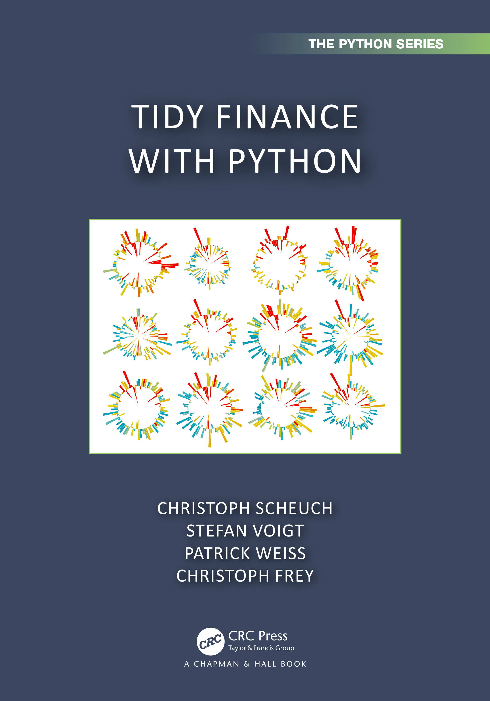

# Tidy Finance

This is the repository for the website tidy-finance.org combining
- The book **Tidy Finance with R** by [Christoph Scheuch](https://christophscheuch.github.io?utm_source=tidy-finance-repo), [Stefan Voigt](https://voigtstefan.me?utm_source=tidy-finance-repo), and [Patrick Weiss](https://sites.google.com/view/patrick-weiss?utm_source=tidy-finance-repo),
- The book **Tidy Finance with Python** by [Christoph Frey](https://sites.google.com/site/christophfrey/home?utm_source=tidy-finance-repo), [Christoph Scheuch](https://christophscheuch.github.io?utm_source=tidy-finance-repo), [Stefan Voigt](https://voigtstefan.me?utm_source=tidy-finance-repo), and [Patrick Weiss](https://sites.google.com/view/patrick-weiss?utm_source=tidy-finance-repo), and
- The **Tidy Finance Blog** which is open to contributions.

The code is licensed under [Creative Commons Attribution-NonCommercial-ShareAlike 4.0 International CC BY-NC-SA 4.0](https://creativecommons.org/licenses/by-nc-sa/4.0/). The website was rendered using [quarto](https://quarto.org/) and it is hosted via GitHub Pages.

[**Tidy Finance with R**](https://www.jdoqocy.com/click-100765519-14339043?url=https%3A%2F%2Fwww.routledge.com%2FTidy-Finance-with-R%2FVoigt-Weiss-Scheuch%2Fp%2Fbook%2F9781032389349) and [**Tidy Finance with Python**](https://www.kqzyfj.com/click-101217142-14339043?url=https%3A%2F%2Fwww.routledge.com%2FTidy-Finance-with-Python%2FScheuch-Voigt-Weiss-Frey%2Fp%2Fbook%2F9781032676418) were released as print versions via Chapman & Hall / CRC. Consider the [following distribution channels](https://www.tidy-finance.org/support.html#get-your-copy-of-the-book) to support the authors. 

  
  

To find the **R package** `tidyfinance`, please consider this [GitHub repository](https://github.com/tidy-finance/r-tidyfinance).