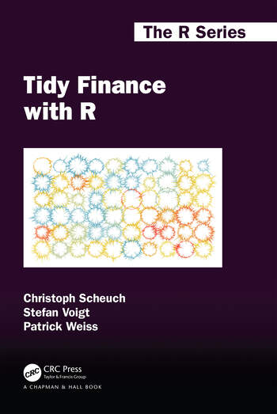

# Preface

```{=html}
<div class="preface-covers" style="float:right; width:230px; margin:0 0 1rem 1.5rem; text-align:center;">
  <a href="../support.qmd"></a>
  <a href="../support.qmd"></a>
</div>
```

This website is the online version of *Tidy Finance*, an opinionated approach to empirical research in financial economics. It comes in two flavors that share the same structure, text, and philosophy: *Tidy Finance with R*, published via [Chapman & Hall/CRC](https://www.jdoqocy.com/click-100765519-14339043?url=https%3A%2F%2Fwww.routledge.com%2FTidy-Finance-with-R%2FVoigt-Weiss-Scheuch%2Fp%2Fbook%2F9781032389349), and *Tidy Finance with Python*. The book is the result of a joint effort of [Christoph Scheuch](https://christophscheuch.github.io/?utm_source=tidy-finance.org), [Stefan Voigt](https://voigtstefan.me/?utm_source=tidy-finance.org), [Patrick Weiss](https://sites.google.com/view/patrick-weiss?utm_source=tidy-finance.org), and [Christoph Frey](https://sites.google.com/site/christophfrey/?utm_source=tidy-finance.org).

We are grateful for any kind of feedback on *every* aspect of the book. So please get in touch with us via [contact\@tidy-finance.org](mailto:contact@tidy-finance.org) if you spot typos, discover any issues that deserve more attention, or if you have suggestions for additional chapters and sections. Additionally, let us know if you found the text helpful. We look forward to hearing from you!

::: callout-note
## <font size="5">[Support Tidy Finance](../support.qmd)</font>

Buy our books via your preferred vendor or support us with coffee [here](../support.qmd).
:::

## Why Does This Book Exist?

Financial economics is a vibrant area of research, a central part of all business activities, and at least implicitly relevant to our everyday life. Despite its relevance for our society and a vast number of empirical studies of financial phenomena, one quickly learns that the actual implementation of models to solve problems in the area of financial economics is typically rather opaque. As graduate students, we were particularly surprised by the lack of public code for seminal papers or even textbooks on key concepts of financial economics. The lack of transparent code not only leads to numerous replication efforts (and their failures) but also constitutes a waste of resources on problems that countless others have already solved in secrecy.

This book aims to lift the curtain on reproducible finance by providing a fully transparent code base for many common financial applications. We started this journey with *Tidy Finance with R*. After receiving great feedback from students and teachers alike, the most common request was support for Python, because many aspiring coders are required to use it at their institutions. We love R for data analysis, and we acknowledge the flexibility and popularity of Python. So, rather than choosing sides, we follow the same tidy principles in both languages, allowing you to work in whichever you prefer. We hope to inspire others to share their code publicly and take part in our journey toward more reproducible research.

## Who Should Read This Book?

We write this book for three audiences:

- Students who want to acquire the basic tools required to conduct financial research ranging from the undergraduate to graduate level. The book's structure is simple enough that the material is sufficient for self-study purposes.
- Instructors who look for materials to teach courses in empirical finance or financial economics. We choose a wide range of topics, from data handling and factor replication to portfolio allocation and option pricing, to offer something for every course and study focus. We provide plenty of examples and focus on intuitive explanations that can easily be adjusted or expanded. At the end of each chapter, we provide exercises that we hope inspire students to dig deeper.
- Practitioners like portfolio managers who want to validate and implement trading ideas, or data analysts and statisticians who work with financial data and need practical tools to succeed.

## What Will You Learn?

The book is divided into five parts, preceded by a short set of prerequisites that help you set up your R or Python environment and introduce the `tidyfinance` package that accompanies the book.

- The first part introduces you to important concepts around which our approach to Tidy Finance revolves and gets you working with stock returns, modern portfolio theory, the capital asset pricing model, and financial statement analysis.
- The second part provides tools to organize your data and prepare the most common datasets used in financial research. Although many important data are behind paywalls, we start by describing different open-source data and how to download them. We then move on to prepare two of the most popular datasets in financial research: CRSP and Compustat. Then, we cover corporate bond data from TRACE. We reuse the data from these chapters in all subsequent chapters. The last chapter of this part contains an overview of common alternative data providers for which direct access via R or Python packages exists.
- The third part deals with key concepts of empirical asset pricing, such as beta estimation, portfolio sorts, performance analysis, and asset pricing regressions.
- In the fourth part, we apply linear models to panel data and machine learning methods to problems in factor selection and option pricing.
- The last part provides approaches for parametric portfolio optimization, constrained optimization, and backtesting procedures.

Each chapter is self-contained and can be read individually. Yet, the data chapters provide an important background necessary for data management in all other chapters.

## What Won't You Learn?

This book is about empirical work. We believe that our comparative advantage is to provide a thorough implementation of typical approaches such as portfolio sorts, backtesting procedures, regressions, machine learning methods, or other related topics in empirical finance. While we assume only basic knowledge of statistics and econometrics, we do not provide detailed treatments of the underlying theoretical models or methods applied in this book. Instead, you find references to the seminal academic work in journal articles or textbooks for more detailed treatments. Although we enrich our implementations by discussing the nitty-gritty choices you face while conducting empirical analyses, we refrain from deriving theoretical models or extensively discussing the statistical properties of well-established tools.

In addition, we do not explain all the functionalities and details of the functions we use. We focus on the empirical research questions and the data transformation logic, and we refer attentive readers to the package documentations for more information. In other words, this is not a book to learn R or Python from scratch. It is a book on how to use R and Python as tools to produce consistent and replicable empirical results.

That being said, our book is close in spirit to other books that provide fully reproducible code for financial applications. We view them as complementary to our work and want to highlight the differences:

- @Regenstein2018 provides an excellent introduction and discussion of different tools for standard applications in finance (e.g., how to compute returns and sample standard deviations of a time series of stock returns), while @Hilpisch2018 is a great introduction to the power of Python for financial applications and the basics of the language and its scientific stack. Related books such as @Weiming2019 and @Kelliher2022 are comprehensive introductions to quantitative finance with a greater focus on option pricing and algorithmic trading. These books primarily target practitioners and have a hands-on focus. Our book, in contrast, clearly focuses on applications of the state-of-the-art for academic research in finance. We thus fill a niche that allows aspiring researchers or instructors to rely on a well-designed code base.
- @Coqueret2020 and its Python companion @Coqueret2023 constitute great compendiums to our book with respect to applications related to return prediction and portfolio formation. They primarily target practitioners and have a hands-on focus. Our book, in contrast, relies on the typical databases used in financial research and focuses on the preparation of such datasets for academic applications. In addition, our chapter on machine learning focuses on factor selection instead of return prediction.

Although we emphasize the importance of reproducible workflow principles, we do not provide introductions to some of the core tools that we relied on to create and maintain this book:

- Version control systems such as [Git](https://git-scm.com/) are vital in managing any programming project. Originally designed to organize the collaboration of software developers, even solo data analysts will benefit from adopting version control. Git also makes it simple to publicly share code and allow others to reproduce your findings. We refer to @Bryan2022 for a gentle introduction to the (sometimes painful) life with Git.\index{Git}\index{GitHub}
- Good communication of results is a key ingredient to reproducible and transparent research. To compile this book, we heavily draw on a suite of fantastic open-source tools. For data visualization, we rely on the Grammar of Graphics [@Wilkinson2012], implemented through `ggplot2` [@ggplot2] in R and `plotnine` [@plotnine] in Python. To author the book itself, we use Quarto [@AllaireQuarto2022], an open-source scientific and technical publishing system whose documents are fully reproducible and support dozens of static and dynamic output formats.\index{Quarto}
- Good writing is also important for the presentation of findings. We neither claim to be experts in this domain nor do we try to sound particularly academic. On the contrary, we deliberately use a more colloquial language to describe all the methods and results presented in this book in order to allow our readers to relate more easily to the rather technical content. For those who desire more guidance with respect to formal academic writing for financial economics, we recommend @Kiesling2003, @Cochrane2005, and @Jacobsen2014, who all provide essential tips (condensed to a few pages).

## Why Tidy?

As you start working with data, you quickly realize that you spend a lot of time reading, cleaning, and transforming your data. In fact, it is often said that more than 80 percent of data analysis is spent on preparing data. By *tidying data*, we want to structure datasets to facilitate further analyses. As @Wickham2014 puts it:

> \[T\]idy datasets are all alike, but every messy dataset is messy in its own way.
> Tidy datasets provide a standardized way to link the structure of a dataset (its physical layout) with its semantics (its meaning).

In its essence, tidy data follows these three principles:

1. Every column is a variable.
2. Every row is an observation.
3. Every cell is a single value.

Throughout this book, we try to follow these principles as best we can. If you want to learn more about tidy data principles in an informal manner, we refer you to [this vignette](https://cran.r-project.org/web/packages/tidyr/vignettes/tidy-data.html) as part of @tidyr.

In addition to the data layer, there are also tidy coding principles outlined in [the tidy tools manifesto](https://tidyverse.tidyverse.org/articles/manifesto.html) that we try to follow:

1. Reuse existing data structures.
2. Compose simple functions.
3. Embrace functional programming.
4. Design for humans.

These principles are language-agnostic, and each ecosystem offers an idiomatic way to honor them. In R, we lean on the [`tidyverse`](https://tidyverse.tidyverse.org) [@Wickham2019], a consistent set of packages that share the same grammar for importing, wrangling, visualizing, and modeling data, and we compose operations with the native pipe `|>`. In Python, we follow the same spirit through method chaining—calling multiple methods in a sequence, each operating on the result of the previous step—built on a small set of powerful, proven packages. Code should not simply yield the correct output; it should also be easy to read.\index{Pipe}

## Why R or Python?

Both R [@R-base] and Python [@python] are excellent choices for empirical work in finance, and you can follow this entire book in either one. They share the features that matter most for reproducible research:

- **Open-source and free.** Both use permissive licenses, making them usable and distributable for academic and commercial use alike.
- **Vibrant communities.** Large, active communities maintain a massive ecosystem of packages for data manipulation, visualization, machine learning, and much more.
- **Flexibility and reach.** Both are cross-platform and integrate smoothly with databases and other languages, such as SQL, C, C++, and Fortran. They scale from quick interactive analysis to large applications.
- **Readable code.** Both communities value clear, human-readable code, which makes them excellent first languages as well as durable tools for experienced researchers.

R grew out of the statistics community and shines for interactive data analysis, with the `tidyverse` and RStudio offering a particularly smooth workflow. Python is a general-purpose language that is ubiquitous in data science and industry; its guiding philosophy, the *Zen of Python* by Tim Peters, captures the same taste for clean, readable code and is available in any Python session through `import this`.\index{Zen of Python}

Which one should you choose? Honestly, it depends on you—your background, your collaborators, and the conventions of your institution or industry. Both will serve you well, and the skills transfer readily from one to the other. That is exactly why we provide every chapter in both languages, side by side: you can pick the one that fits your context, switch with a single click as you read, and never feel locked in. For more on why each language is great, we refer to @Wickham2019 for R and @Hilpisch2018 for Python.

## About the Authors

Three of us met at the [Vienna Graduate School of Finance](https://www.vgsf.ac.at/), from which we each graduated with a different focus but a shared passion: coding. We continue to sharpen our skills as part of our current occupations:

- [**Christoph Scheuch**](https://christophscheuch.github.io/) is an independent data science and business intelligence expert, currently serving as an external lecturer at Humboldt University of Berlin and as a summer school instructor at the Barcelona School of Economics. Previously, he was the Head of AI, Director of Product, and Head of BI & Data Science at the social trading platform [wikifolio.com](https://www.wikifolio.com/). He also was an external lecturer at the [Vienna University of Economics and Business (WU)](https://www.wu.ac.at/en/), where he obtained his PhD in finance as part of the [Vienna Graduate School of Finance (VGSF)](https://www.vgsf.ac.at/).
- [**Stefan Voigt**](https://voigtstefan.me/) is an Assistant Professor of Finance at the [Department of Economics at the University of Copenhagen](https://www.economics.ku.dk/) and a research fellow at the [Danish Finance Institute](https://danishfinanceinstitute.dk/). His research focuses on blockchain technology, high-frequency trading, and financial econometrics. Stefan's research has been published in the leading finance and econometrics journals, and he received the Danish Finance Institute Teaching Award 2022 for his courses for students and practitioners on empirical finance based on this book.
- [**Patrick Weiss**](https://sites.google.com/view/patrick-weiss) is an Assistant Professor of Finance at [Reykjavik University](https://en.ru.is) and an external lecturer at the [Vienna University of Economics and Business](https://www.wu.ac.at/en/). His research activity centers around the intersection of empirical asset pricing and corporate finance. Patrick is especially passionate about empirical asset pricing and has published research in leading journals in financial economics.
- [**Christoph Frey**](https://sites.google.com/site/christophfrey/) is a Quantitative Researcher and Portfolio Manager at a family office in Hamburg and a Research Fellow at the [Centre for Financial Econometrics, Asset Markets and Macroeconomic Policy](https://www.lancaster.ac.uk/lums/research/areas-of-expertise/centre-for-financial-econometrics-asset-markets-and-macroeconomic-policy/) at Lancaster University. Prior to this, he was the leading quantitative researcher for systematic multi-asset strategies at [Berenberg Bank](https://www.berenberg.de/) and worked as an Assistant Professor at the [Erasmus Universiteit Rotterdam](https://www.eur.nl/). Christoph published research on Bayesian econometrics and specializes in financial econometrics and portfolio optimization problems.

## License

This book is licensed to you under [Creative Commons Attribution-NonCommercial-ShareAlike 4.0 International CC BY-NC-SA 4.0](https://creativecommons.org/licenses/by-nc-sa/4.0/). The code samples in this book are licensed under [Creative Commons CC0 1.0 Universal (CC0 1.0), i.e., public domain](https://creativecommons.org/publicdomain/zero/1.0/).

Depending on which version you work with, you can cite this project as follows:

> Scheuch, C., Voigt, S., & Weiss, P. (2023). Tidy Finance with R (1st ed.). Chapman and Hall/CRC. <https://doi.org/10.1201/b23237>.

> Scheuch, C., Voigt, S., Weiss, P., & Frey, C. (2024). Tidy Finance with Python (1st ed.). Chapman and Hall/CRC. <https://doi.org/10.1201/9781032684307>.

You can also use the following BibTeX entries:

``` bibtex
@book{Scheuch2023,
  title = {Tidy Finance with R},
  author = {Scheuch, Christoph and Voigt, Stefan and Weiss, Patrick},
  year = {2023},
  publisher = {Chapman and Hall/CRC},
  edition = {1st},
  url = {https://tidy-finance.org/r/},
  doi = {https://doi.org/10.1201/b23237}
}

@book{Scheuch2024,
  title = {Tidy Finance with Python},
  author = {Scheuch, Christoph and Voigt, Stefan and Weiss, Patrick and Frey, Christoph},
  year = {2024},
  publisher = {Chapman and Hall/CRC},
  edition = {1st},
  url = {https://tidy-finance.org/python/},
  doi = {https://doi.org/10.1201/9781032684307}
}
```

## Future Updates and Changes

This book represents a snapshot of research practices and available data at a particular time. However, time does not stop. As you read this text, there is new data, the packages used here have changed, and research practices might be updated. We, as authors of Tidy Finance, are committed to staying up to date and keeping up with the newest developments. Therefore, you can expect updates to Tidy Finance on a continuous basis. The best way to monitor the ongoing developments is to check our online [Changelog](changelog.qmd) frequently.
