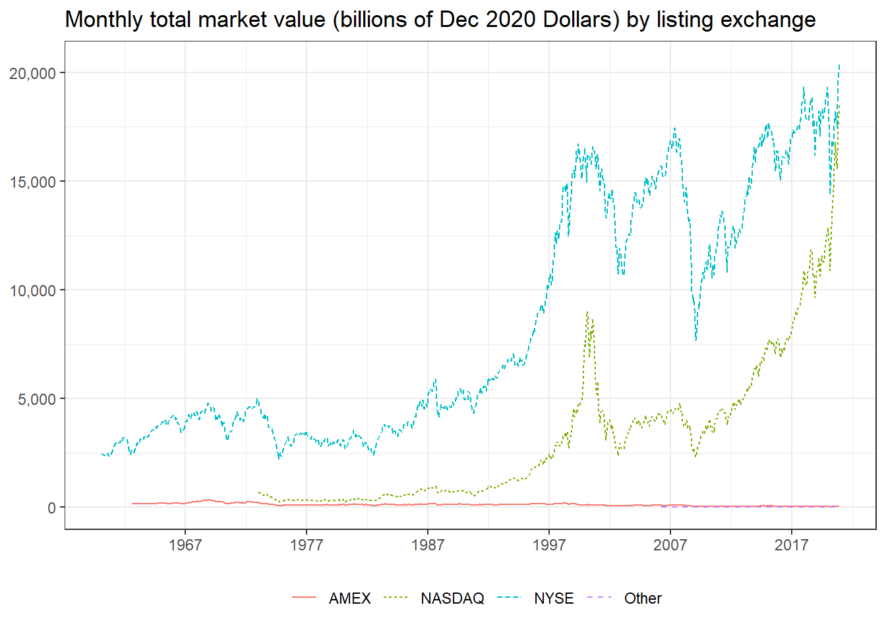
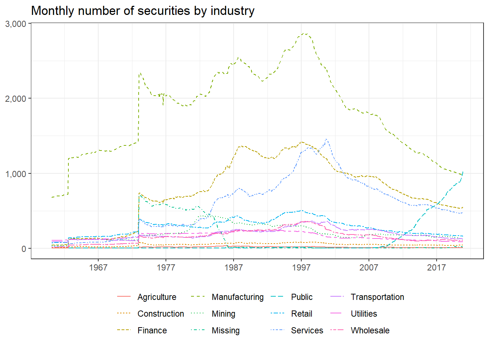
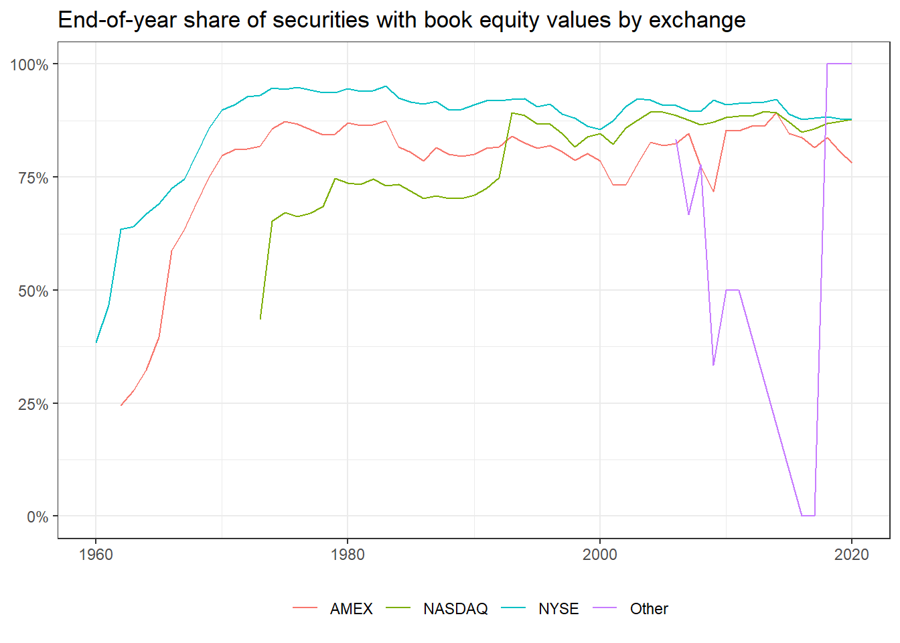

# Accessing & managing financial data

In this chapter, we propose a way to organize your financial data. Everybody, who has experience with data, is also familiar with storing data in various formats like CSV, XLS, XLSX, or other delimited value stores. Reading and saving data can become very cumbersome in the case of using different data formats, both across different projects, as well as across different programming languages. Moreover, storing data in delimited files often leads to problems with respect to column type consistency. For instance, date-type columns frequently lead to inconsistencies across different data formats and programming languages. 

This chapter shows how to import different data sets. Specifically, our data comes from the application programming interface (API) of Yahoo!Finance, a downloaded standard CSV files, an XLSX file stored in a public Google drive repositories, and an SQL database connection. We store all the data in a **single** database, which serves as the only source of data in subsequent chapters.

First, we load the global packages that we use throughout this chapter. Later on, we load more packages in the sections where we need them. 


```r
library(tidyverse)
library(lubridate)
library(scales)
```

Moreover, we initially define the date range for which we fetch and store the financial data, making future data updates tractable. In case you need another time frame, you need to adjust these dates. Our data starts with 1960 since most asset pricing studies use data from 1962 on. 


```r
start_date <- as.Date("1960-01-01")
end_date <- as.Date("2020-12-31")
```


## Fama-French data

We start by downloading some famous Fama-French factors (e.g., [@Fama1993]) and portfolio returns commonly used in empirical asset pricing. Fortunately, there is a neat package by [Nelson Areal](https://github.com/nareal/frenchdata/) that allows us to easily access the data: the `frenchdata` package provides functions to download and read data sets from [Prof. Kenneth French finance data library](https://mba.tuck.dartmouth.edu/pages/faculty/ken.french/data_library.html).


```r
library(frenchdata)
```

We can use the main function of the package to download monthly Fama-French factors. The set *3 Factors* includes the return time series of the market, size, and value factors alongside the risk-free rates. Note that we have to do some manual work to correctly parse all the columns and scale them appropriately as the raw Fama-French data comes in very unpractical data format. For precise descriptions of the variables, we suggest consulting [Prof. Kenneth French finance data library](https://mba.tuck.dartmouth.edu/pages/faculty/ken.french/data_library.html) directly. If you are on the site, check the raw data files to appreciate the time saved by `frenchdata`.


```r
factors_ff_monthly <- download_french_data("Fama/French 3 Factors")$subsets$data[[1]] %>%
  transmute(
    month = floor_date(ymd(paste0(date, "01")), "month"),
    rf = as.numeric(RF) / 100,
    mkt_excess = as.numeric(`Mkt-RF`) / 100,
    smb = as.numeric(SMB) / 100,
    hml = as.numeric(HML) / 100
  ) %>%
  filter(month >= start_date & month <= end_date)
```

It is straightforward to download the corresponding *daily* Fama-French factors with the same function. 


```r
factors_ff_daily <- download_french_data("Fama/French 3 Factors [Daily]")$subsets$data[[1]] %>%
  transmute(
    date = ymd(date),
    rf = as.numeric(RF) / 100,
    mkt_excess = as.numeric(`Mkt-RF`) / 100,
    smb = as.numeric(SMB) / 100,
    hml = as.numeric(HML) / 100
  ) %>%
  filter(date >= start_date & date <= end_date)
```

In a subsequent chapter, we also use the 10 monthly industry portfolios, so let us fetch that data, too. 


```r
industries_ff_monthly <- download_french_data("10 Industry Portfolios")$subsets$data[[1]] %>%
  mutate(month = floor_date(ymd(paste0(date, "01")), "month")) %>%
  mutate(across(where(is.numeric), ~ . / 100)) %>%
  select(month, everything(), -date) %>%
  filter(month >= start_date & month <= end_date)
```

It is worth taking a look at all available portfolio return time series from Kenneth French's homepage. You should check out the other sets by calling `frenchdata::get_french_data_list()`.


## q-factors

In recent years, the academic discourse experienced the rise of alternative factor models, e.g., in the form of the [@Hou2015] *q*-factor model. We refer to the [extended background](http://global-q.org/background.html) information provided by the original authors for further information. The *q* factors can be downloaded directly from the authors' homepage from within `read_csv()`.

We also need to adjust this data. First, we discard information we will not use here. Then, we rename the columns with the "R_"-prescript using regular expressions and write all column names in lower case. You can try sticking to a consistent style for naming objects, which we try to illustrate here - the emphasis is on *try*. You can check out style guides available online, e.g., [Hadley Wickham's tidyverse style guide](https://style.tidyverse.org/index.html).


```r
factors_q_monthly <- read_csv("http://global-q.org/uploads/1/2/2/6/122679606/q5_factors_monthly_2020.csv") %>%
  mutate(month = as.Date(paste(year, month, "01", sep = "-"))) %>%
  select(-R_F, -R_MKT, -year) %>%
  rename_with(~ gsub("R_", "", .)) %>%
  rename_with(~ str_to_lower(.)) %>%
  mutate(across(-month, ~ . / 100)) %>%
  filter(month >= start_date & month <= end_date)
```

## Macroeconomic predictors

Our next data source is a set of macroeconomic variables often used as predictors for the equity premium. [@Goyal2008] comprehensively reexamine the performance of variables suggested by the academic literature to be good predictors of the equity premium. The authors host the data updated to 2020 on [Amit Goyal's website](https://sites.google.com/view/agoyal145). Since the data is an .xslx-file stored on a public Google drive location, we need additional packages to access the data directly from our R session. Therefore, we load `readxl` to read the .xlsx-file and `googledrive` for the Google drive connection.


```r
library(readxl)
library(googledrive)
```

Usually, you need to authenticate if you interact with Google drive directly in R. Since the data is stored via a public link, we can proceed without any authentication. 


```r
drive_deauth()
```

The `drive_download()` function from the `googledrive` package allows us to download the data and store it locally.


```r
drive_download("https://drive.google.com/file/d/1ACbhdnIy0VbCWgsnXkjcddiV8HF4feWv/view",
  path = "data/macro_predictors.xlsx"
)
```

Next, we read in the new data and transform the columns to the variables that we later use. You can consult the material on [Amit Goyal's website](https://sites.google.com/view/agoyal145) for the definitions of the variables and the transformations.


```r
macro_predictors <- read_xlsx("data/macro_predictors.xlsx", 
                              sheet = "Monthly") %>%
  mutate(month = ym(yyyymm)) %>%
  filter(month >= start_date & month <= end_date) %>%
  mutate(across(where(is.character), as.numeric)) %>%
  mutate(
    IndexDiv = Index + D12,
    logret = log(IndexDiv) - log(lag(IndexDiv)),
    Rfree = log(Rfree + 1),
    rp_div = lead(logret - Rfree, 1), # Future excess market return
    dp = log(D12) - log(Index), # Dividend Price ratio
    dy = log(D12) - log(lag(Index)), # Dividend yield
    ep = log(E12) - log(Index), # Earnings price ratio
    de = log(D12) - log(E12), # Dividend payout ratio
    tms = lty - tbl, # Term spread
    dfy = BAA - AAA # Default yield spread
  ) %>%
  select(month, rp_div, dp, dy, ep, de, svar,
    bm = `b/m`, ntis, tbl, lty, ltr,
    tms, dfy, infl
  ) %>%
  drop_na()
```

Finally, after reading in the macro predictors to our memory, we remove the raw data file from our temporary storage. 


```r
file.remove("data/macro_predictors.xlsx")
```

```
## [1] TRUE
```


## Setting up a database

Now that we have downloaded some data from the web into the memory of our R session, let us set up a database to store that information for future use. There are many ways to set up and organize a database, depending on the use case. For our purpose, the most efficient way is to use an [SQLite](https://www.sqlite.org/index.html) database, which is the C-language library that implements a small, fast, self-contained, high-reliability, full-featured, SQL database engine. Note that [SQL](https://en.wikipedia.org/wiki/SQL) (Structured Query Language) is a standard language for accessing and manipulating databases, and it heavily inspired the `dplyr` functions. We refer to [this tutorial](https://www.w3schools.com/sql/sql_intro.asp) for more information on SQL. 

There are two packages that make working with SQLite in R very simple: `RSQLite` embeds the SQLite database engine in R and `dbplyr` is the database back-end for `dplyr`. These packages allow to set up a database to remotely store tables and use these remote database tables as if they are in-memory data frames by automatically converting `dplyr` into SQL. Check out the [RSQLite](https://cran.r-project.org/web/packages/RSQLite/vignettes/RSQLite.html) and [dbplyr vignettes](https://db.rstudio.com/databases/sqlite/) for more information.


```r
library(RSQLite)
library(dbplyr)
```

A SQLite database is easily created - the code below is really all there is. Note that we use the `extended_types` option to enable date types when storing and fetching data, otherwise date columns are stored as integer values. 


```r
tidy_finance <- dbConnect(SQLite(), "data/tidy_finance.sqlite", 
                          extended_types = TRUE)
```

Next, we create a remote table with the monthly Fama-French factor data. 


```r
factors_ff_monthly %>%
  dbWriteTable(tidy_finance, "factors_ff_monthly", ., overwrite = TRUE)
```

We can use the remote table as an in-memory data frame by building a connection via `tbl()`.


```r
factors_ff_monthly_db <- tbl(tidy_finance, "factors_ff_monthly")
```

All `dplyr` calls are evaluated lazily, i.e., the data is not in the memory of our R session, and actually, the database does most of the work. You can see that by noticing that the output below does not show the number of rows. In fact, the following code chunk only fetches the top 10 rows from the database for printing.  


```r
factors_ff_monthly_db %>%
  select(month, rf)
```

```
## # Source:   lazy query [?? x 2]
## # Database: sqlite 3.37.0
## #   [C:\Users\ncj140\Dropbox\Projects\tidy_finance\data\tidy_finance.sqlite]
##   month          rf
##   <date>      <dbl>
## 1 1960-01-01 0.0033
## 2 1960-02-01 0.0029
## 3 1960-03-01 0.0035
## 4 1960-04-01 0.0019
## 5 1960-05-01 0.0027
## # ... with more rows
```

If we want to have the whole table in memory, we need to `collect()` it. You will see that we regularly load the data into the memory in the next chapters.


```r
factors_ff_monthly_db %>%
  select(month, rf) %>%
  collect()
```

```
## # A tibble: 732 x 2
##   month          rf
##   <date>      <dbl>
## 1 1960-01-01 0.0033
## 2 1960-02-01 0.0029
## 3 1960-03-01 0.0035
## 4 1960-04-01 0.0019
## 5 1960-05-01 0.0027
## # ... with 727 more rows
```

The last couple of code chunks are really all there is to organize a simple database! You can also share the SQLite database across devices and programming languages. 

Before we move on to the next data source, let us also store the other four tables in our new SQLite database. 


```r
factors_ff_daily %>%
  dbWriteTable(tidy_finance, "factors_ff_daily", ., overwrite = TRUE)

industries_ff_monthly %>%
  dbWriteTable(tidy_finance, "industries_ff_monthly", ., overwrite = TRUE)

factors_q_monthly %>%
  dbWriteTable(tidy_finance, "factors_q_monthly", ., overwrite = TRUE)

macro_predictors %>%
  dbWriteTable(tidy_finance, "macro_predictors", ., overwrite = TRUE)
```

From now on, all you need to do to access data that is stored in the database is to follow three steps: (i) Establish the connection to the SQLite database, (ii) call the table you want to extract, and (iii) collect the data. For your convenience, the following steps show all you need in a compact fashion.


```r
library(tidyverse)
library(RSQLite)
tidy_finance <- dbConnect(SQLite(), "data/tidy_finance.sqlite", 
                          extended_types = TRUE)
factors_q_monthly <- tbl(tidy_finance, "factors_q_monthly")
factors_q_monthly <- factors_q_monthly %>% collect()
```

## Accessing WRDS

[Wharton Research Data Services (WRDS)](https://wrds-www.wharton.upenn.edu/) is the most widely used source for asset and firm-specific financial data used in academic settings. WRDS is a data platform that provides data validation, flexible delivery options, and access to many different data sources. The data at WRDS is also organized in an SQL database, although they use the [PostgreSQL](https://www.postgresql.org/) engine. This database engine is just as easy to handle with R as SQLite. We use the `RPostgres` package to establish a connection to the WRDS database. Note that you could also use the `odbc` package to connect to a PostgreSQL database, but then you need to install the appropriate drivers yourself. `RPostgres` already contains a suitable driver.


```r
library(RPostgres)
```

To establish a connection, you use the function `dbConnect()` with the following arguments. Note that you need to replace the `user` and `password` fields with your own credentials. We defined system variables for the purpose of this book because we obviously do not want to share our credentials with the rest of the world. 


```r
wrds <- dbConnect(
  Postgres(),
  host = "wrds-pgdata.wharton.upenn.edu",
  dbname = "wrds",
  port = 9737,
  sslmode = "require",
  user = Sys.getenv("user"),
  password = Sys.getenv("password")
)
```

The remote connection to WRDS is very useful. Yet, the database itself contains many different databases and tables. You can check the WRDS homepage to identify the table's name you are looking for (if you go beyond our exposition). Alternatively, you can also query the data structure with the function `dbSendQuery()`. If you are interested, there is an exercise below that is based on WRDS' tutorial on ["Querying WRDS Data using R"](https://wrds-www.wharton.upenn.edu/pages/support/programming-wrds/programming-r/querying-wrds-data-r/). Furthermore, the penultimate section of this chapter shows how to investigate the structure of databases. 


## Downloading and preparing CRSP

[The Center for Research in Security Prices (CRSP)](https://crsp.org/) provides the most widely used data for US stocks. We use the `wrds` connection object that we just created to first access monthly CRSP return data. Actually, we need three tables to get the desired data: (i) the CRSP monthly security file,


```r
msf_db <- tbl(wrds, in_schema("crsp", "msf"))
msf_db
```

```
## # Source:   table<"crsp"."msf"> [?? x 21]
## # Database: postgres [svoigt@wrds-pgdata.wharton.upenn.edu:9737/wrds]
##   cusip    permno permco issuno hexcd hsiccd date       bidlo askhi   prc   vol
##   <chr>     <dbl>  <dbl>  <dbl> <dbl>  <dbl> <date>     <dbl> <dbl> <dbl> <dbl>
## 1 68391610  10000   7952  10396     3   3990 1985-12-31 NA    NA    NA       NA
## 2 68391610  10000   7952  10396     3   3990 1986-01-31 -2.5  -4.44 -4.38  1771
## 3 68391610  10000   7952  10396     3   3990 1986-02-28 -3.25 -4.38 -3.25   828
## 4 68391610  10000   7952  10396     3   3990 1986-03-31 -3.25 -4.44 -4.44  1078
## 5 68391610  10000   7952  10396     3   3990 1986-04-30 -4    -4.31 -4      957
## # ... with more rows, and 10 more variables: ret <dbl>, bid <dbl>, ask <dbl>,
## #   shrout <dbl>, cfacpr <dbl>, cfacshr <dbl>, altprc <dbl>, spread <dbl>,
## #   altprcdt <date>, retx <dbl>
```

(ii) the identifying information,

```r
msenames_db <- tbl(wrds, in_schema("crsp", "msenames"))
msenames_db
```

```
## # Source:   table<"crsp"."msenames"> [?? x 21]
## # Database: postgres [svoigt@wrds-pgdata.wharton.upenn.edu:9737/wrds]
##   permno namedt     nameendt   shrcd exchcd siccd ncusip   ticker comnam   shrcls
##    <dbl> <date>     <date>     <dbl>  <dbl> <dbl> <chr>    <chr>  <chr>    <chr> 
## 1  10000 1986-01-07 1986-12-03    10      3  3990 68391610 OMFGA  OPTIMUM~ A     
## 2  10000 1986-12-04 1987-03-09    10      3  3990 68391610 OMFGA  OPTIMUM~ A     
## 3  10000 1987-03-10 1987-06-11    10      3  3990 68391610 OMFGA  OPTIMUM~ A     
## 4  10001 1986-01-09 1993-11-21    11      3  4920 39040610 GFGC   GREAT F~ <NA>  
## 5  10001 1993-11-22 2004-06-09    11      3  4920 29274A10 EWST   ENERGY ~ <NA>  
## # ... with more rows, and 11 more variables: tsymbol <chr>, naics <chr>,
## #   primexch <chr>, trdstat <chr>, secstat <chr>, permco <dbl>, compno <dbl>,
## #   issuno <dbl>, hexcd <dbl>, hsiccd <dbl>, cusip <chr>
```

and (iii) the delisting information.

```r
msedelist_db <- tbl(wrds, in_schema("crsp", "msedelist"))
msedelist_db
```

```
## # Source:   table<"crsp"."msedelist"> [?? x 19]
## # Database: postgres [svoigt@wrds-pgdata.wharton.upenn.edu:9737/wrds]
##   permno dlstdt     dlstcd nwperm nwcomp nextdt      dlamt dlretx  dlprc
##    <dbl> <date>      <dbl>  <dbl>  <dbl> <date>      <dbl>  <dbl>  <dbl>
## 1  10000 1987-06-11    560      0      0 1987-06-12  0.219 0      -0.219
## 2  10001 2017-08-03    233      0      0 NA         13.1   0.0116  0    
## 3  10002 2013-02-15    231  35263   1658 NA          3.01  0.0460  0    
## 4  10003 1995-12-15    231  10569   8477 NA          5.45  0.0137  0    
## 5  10005 1991-07-11    560      0      0 1991-07-12  0.141 0.125  -0.141
## # ... with more rows, and 10 more variables: dlpdt <date>, dlret <dbl>,
## #   permco <dbl>, compno <dbl>, issuno <dbl>, hexcd <dbl>, hsiccd <dbl>,
## #   cusip <chr>, acperm <dbl>, accomp <dbl>
```

We use the three remote tables to fetch the data we want to put into our local database. Just as above, the idea is that we let the WRDS database do all the work and just download the data that we actually need. We apply common filters and data selection criteria to narrow down our data of interest: (i) we keep only data in the time windows of interest, (ii) we keep only US-listed stocks as identified via share codes 10 and 11, and (iii) we keep only months with valid permno-specific information from `msenames`. In addition, we add delisting reason and returns. You can read up in the great textbook of [@BaliEngleMurray2016] (BEM) for an extensive discussion on the filters we apply in the code below.


```r
crsp_monthly <- msf_db %>%
  filter(date >= start_date & date <= end_date) %>%
  inner_join(msenames_db %>%
    filter(shrcd %in% c(10, 11)) %>%
    select(permno, exchcd, siccd, namedt, nameendt), by = c("permno")) %>%
  filter(date >= namedt & date <= nameendt) %>%
  mutate(month = floor_date(date, "month")) %>%
  left_join(msedelist_db %>%
    select(permno, dlstdt, dlret, dlstcd) %>%
    mutate(month = floor_date(dlstdt, "month")), by = c("permno", "month")) %>%
  select(
    permno, # Security identifier
    date, # Date of the observation
    month, # Month of the observation
    ret, # Return
    shrout, # Shares outstanding (in thousands)
    altprc, # Last traded price in a month
    exchcd, # Exchange code
    siccd, # Industry code
    dlret, # Delisting return
    dlstcd # Delisting code
  ) %>%
  mutate(
    month = as.Date(month),
    shrout = shrout * 1000
  ) %>%
  collect()
```

Now, we have all the relevant monthly return data in memory and proceed with preparing the data for future analyses. We perform the preparation step at the current stage since we want to avoid executing the same mutations every time we use the data in subsequent chapters. 

The first additional variable we create is market capitalization (`mktcap`). Note that we keep market cap in millions of US dollars just for convenience (we do not want to print huge numbers in our figures and tables). Moreover, we set zero market cap to missing as it makes conceptually little sense (i.e., the firm would be bankrupt).


```r
crsp_monthly <- crsp_monthly %>%
  mutate(
    mktcap = abs(shrout * altprc) / 1000000,
    mktcap = if_else(mktcap == 0, as.numeric(NA), mktcap)
  )
```

The next variable we frequently use is the one-month *lagged* market capitalization. Lagged market capitalization is typically used to compute value-weighted portfolio returns, as we demonstrate in a later chapter. The most simple and consistent way to add a column with lagged market cap values is to add one month to each observation and then join the information to our monthly CRSP data. 


```r
mktcap_lag <- crsp_monthly %>%
  mutate(month = month %m+% months(1)) %>%
  select(permno, month, mktcap_lag = mktcap)

crsp_monthly <- crsp_monthly %>%
  left_join(mktcap_lag, by = c("permno", "month"))
```

If you wonder why we do not use the `lag()` function, e.g., via `crsp_monthly %>% group_by(permno) %>% mutate(mktcap_lag = lag(mktcap))`, take a look at the exercises.

Next, we follow BEM in transforming listing exchange codes to explicit exchange names. 

```r
crsp_monthly <- crsp_monthly %>%
  mutate(exchange = case_when(
    exchcd %in% c(1, 31) ~ "NYSE",
    exchcd %in% c(2, 32) ~ "AMEX",
    exchcd %in% c(3, 33) ~ "NASDAQ",
    TRUE ~ "Other"
  ))
```

Similarly, we transform industry codes to industry descriptions following BEM. Notice that there are also other categorizations of industries (e.g., by Eugene Fama and Kenneth French) that are commonly used.


```r
crsp_monthly <- crsp_monthly %>%
  mutate(industry = case_when(
    siccd >= 1 & siccd <= 999 ~ "Agriculture",
    siccd >= 1000 & siccd <= 1499 ~ "Mining",
    siccd >= 1500 & siccd <= 1799 ~ "Construction",
    siccd >= 2000 & siccd <= 3999 ~ "Manufacturing",
    siccd >= 4000 & siccd <= 4899 ~ "Transportation",
    siccd >= 4900 & siccd <= 4999 ~ "Utilities",
    siccd >= 5000 & siccd <= 5199 ~ "Wholesale",
    siccd >= 5200 & siccd <= 5999 ~ "Retail",
    siccd >= 6000 & siccd <= 6799 ~ "Finance",
    siccd >= 7000 & siccd <= 8999 ~ "Services",
    siccd >= 9000 & siccd <= 9999 ~ "Public",
    TRUE ~ "Missing"
  ))
```

We also construct returns adjusted for delistings as described by BEM. After this transformation, we can drop the delisting returns and codes. 


```r
crsp_monthly <- crsp_monthly %>%
  mutate(ret_adj = case_when(
    is.na(dlstcd) ~ ret,
    !is.na(dlstcd) & !is.na(dlret) ~ dlret,
    dlstcd %in% c(500, 520, 580, 584) |
      (dlstcd >= 551 & dlstcd <= 574) ~ -0.30,
    dlstcd == 100 ~ ret,
    TRUE ~ -1
  )) %>%
  select(-c(dlret, dlstcd))
```

Next, we compute excess returns by subtracting the monthly risk-free rate provided by our Fama-French data. As we base all our analyses on the excess returns, we can drop adjusted returns and the risk-free rate from our tibble. Note that we ensure that excess returns are bounded by -1 from below as less than -100% return make conceptually no sense. 


```r
crsp_monthly <- crsp_monthly %>%
  left_join(factors_ff_monthly %>% select(month, rf), by = "month") %>%
  mutate(
    ret_excess = ret_adj - rf,
    ret_excess = pmax(ret_excess, -1)
  ) %>%
  select(-ret_adj, -rf)
```

Since excess returns and market capitalization are crucial for all our analyses, we can safely exclude all observations with missing returns or market capitalization. 


```r
crsp_monthly <- crsp_monthly %>%
  drop_na(ret_excess, mktcap, mktcap_lag)
```

Finally, we store the monthly CRSP file in our database. 


```r
crsp_monthly %>%
  dbWriteTable(tidy_finance, "crsp_monthly", ., overwrite = TRUE)
```

## First glimpse of the CRSP sample

Before we move on to other data sources, let us look at some descriptive statistics of the CRSP sample which is our main source for stock returns. 


```r
crsp_monthly
```

```
## # A tibble: 3,225,161 x 13
##   permno date       month           ret  shrout altprc exchcd siccd mktcap
##    <dbl> <date>     <date>        <dbl>   <dbl>  <dbl>  <dbl> <dbl>  <dbl>
## 1  10000 1986-02-28 1986-02-01 -0.257   3680000  -3.25      3  3990   12.0
## 2  10000 1986-03-31 1986-03-01  0.365   3680000  -4.44      3  3990   16.3
## 3  10000 1986-04-30 1986-04-01 -0.0986  3793000  -4         3  3990   15.2
## 4  10000 1986-05-30 1986-05-01 -0.223   3793000  -3.11      3  3990   11.8
## 5  10000 1986-06-30 1986-06-01 -0.00503 3793000  -3.09      3  3990   11.7
## # ... with 3,225,156 more rows, and 4 more variables: mktcap_lag <dbl>,
## #   exchange <chr>, industry <chr>, ret_excess <dbl>
```

The figure below shows the monthly number of securities by listing exchange over time. NYSE has the longest history in the data, but NASDAQ exhibits a considerable large number of stocks. The number of stocks on AMEX is decreasing steadily over the last couple of decades. By the end of 2020, there are 2300 stocks on NASDAQ, 1245 on NYSE, 147 on AMEX and only 1 belong to the other category.


```r
crsp_monthly %>%
  count(exchange, date) %>%
  ggplot(aes(x = date, y = n, color = exchange, linetype = exchange)) +
  geom_line() +
  labs(
    x = NULL, y = NULL, color = NULL, linetype = NULL,
    title = "Monthly number of securities by exchange"
  ) +
  scale_x_date(date_breaks = "10 years", date_labels = "%Y") +
  scale_y_continuous(labels = comma)
```


Next, we look at the aggregate market capitalization of the respective listing exchanges. To ensure that we look at meaningful data which is comparable over time, we adjust the nominal values for inflation. We use the familiar `tidyquant` package to fetch consumer price index (CPI) data from the [Federal Reserve Economic Data (FRED)](https://fred.stlouisfed.org/series/CPIAUCNS).


```r
library(tidyquant)

cpi_monthly <- tq_get("CPIAUCNS",
  get = "economic.data",
  from = start_date, to = end_date
) %>%
  transmute(
    month = floor_date(date, "month"),
    cpi = price / price[month == max(crsp_monthly$month)]
  )
```

As the CPI data might come in handy at some point, we also put it into our local database.


```r
cpi_monthly %>%
  dbWriteTable(tidy_finance, "cpi_monthly", ., overwrite = TRUE)
```

In fact, we can use the tables in our database to calculate aggregate market caps by listing exchange and plotting it just as if it were in memory. All values are in end of `year(end_date)` dollars to ensure inter-temporal comparability. NYSE-listed stocks have by far the largest market capitalization, followed by NASDAQ-listed stocks. 


```r
tbl(tidy_finance, "crsp_monthly") %>%
  left_join(tbl(tidy_finance, "cpi_monthly"), by = "month") %>%
  group_by(month, exchange) %>%
  summarize(
    securities = n_distinct(permno),
    mktcap = sum(mktcap, na.rm = TRUE) / cpi
  ) %>%
  collect() %>%
  mutate(month = as.Date(month)) %>%
  ggplot(aes(x = month, y = mktcap / 1000, color = exchange, linetype = exchange)) +
  geom_line() +
  labs(
    x = NULL, y = NULL, color = NULL, linetype = NULL,
    title = "Monthly total market value (billions of Dec 2020 Dollars) by listing exchange"
  ) +
  scale_x_date(date_breaks = "10 years", date_labels = "%Y") +
  scale_y_continuous(labels = comma)
```



Of course, performing the computation in the database is not really meaningful because we already have all the required data in memory. The code chunk above is slower than performing the same steps on tables that are already in memory. However, we just want to illustrate that you can perform many things in the database before loading the data into your memory.

Next, we look at the same descriptive statistics by industry. The figure below plots the number of stocks in the sample for each of the SIC industry classifiers. For most of the sample period, the largest share of stocks is apparently in Manufacturing, albeit the number peaked somewhere in the 90s. The number of firms associated with public administration seems to be the only category on the rise in recent years, even surpassing Manufacturing at the end of our sample period.


```r
crsp_monthly_industry <- crsp_monthly %>%
  left_join(cpi_monthly, by = "month") %>%
  group_by(month, industry) %>%
  summarize(
    securities = n_distinct(permno),
    mktcap = sum(mktcap) / mean(cpi),
    .groups = "drop"
  )

crsp_monthly_industry %>%
  ggplot(aes(x = month, y = securities, color = industry, linetype = industry)) +
  geom_line() +
  labs(
    x = NULL, y = NULL, color = NULL, linetype = NULL,
    title = "Monthly number of securities by industry"
  ) +
  scale_x_date(date_breaks = "10 years", date_labels = "%Y") +
  scale_y_continuous(labels = comma)
```



We also compute the market value of all stocks belonging to the respective industries. All values are again in terms of billions of end of 2020 dollars. At all points in time, manufacturing firms comprise of the largest portion of market capitalization. Towards the end of the sample, however, financial firms and services begin to make up a substantial portion of the market value.


```r
crsp_monthly_industry %>%
  ggplot(aes(x = month, y = mktcap / 1000, color = industry, linetype = industry)) +
  geom_line() +
  labs(
    x = NULL, y = NULL, color = NULL, linetype = NULL,
    title = "Monthly total market value (billions of Dec 2020 Dollars) by industry"
  ) +
  scale_x_date(date_breaks = "10 years", date_labels = "%Y") +
  scale_y_continuous(labels = comma)
```


## Daily CRSP data

Before we turn to accounting data, we also want to provide a proposal for downloading daily CRSP data. While the monthly data from above typically fits into your memory and can be downloaded in a meaningful amount of time, this is usually not true for daily return data. The daily CRSP data file is substantially larger than monthly data and can exceed 20GB. This has two important implications: You cannot hold all the daily return data in your memory (hence it is not possible to copy the entire data set to your local database), and in our experience, the download usually crashes (or never stops) because it is too much data for the WRDS cloud to prepare and send to your R session. 

There is a solution to this challenge. As with many 'big data' problems, you can split up the big task into several smaller tasks that are easy to handle. That is, instead of downloading data about many stocks all at once, download the data in small batches for each stock consecutively. Such operations can be implemented in `for` loops, where we download, prepare, and store the data for a single stock in each iteration. This operation might nonetheless take a couple of hours, so you have to be patient either way (we often run such code over night). To keep track of the progress, you can use `txtProgressBar()`. Eventually, we end up with more than 68 million rows of daily return data. Note that we only store the identifying information that we actually need, namely `permno`, `date`, and `month` alongside the excess returns. We thus ensure that our local database contains only the data we actually use and that we can load the full daily data into our memory later.


```r
dsf_db <- tbl(wrds, in_schema("crsp", "dsf"))
permnos <- tbl(tidy_finance, "crsp_monthly") %>%
  distinct(permno) %>%
  pull()

progress <- txtProgressBar(min = 0, max = length(permnos), initial = 0, style = 3)
for (j in 1:length(permnos)) {
  permno_sub <- permnos[j]
  crsp_daily_sub <- dsf_db %>%
    filter(permno == permno_sub &
      date >= start_date & date <= end_date) %>%
    select(permno, date, ret) %>%
    collect() %>%
    drop_na()

  if (nrow(crsp_daily_sub)) {
    crsp_daily_sub <- crsp_daily_sub %>%
      mutate(month = floor_date(date, "month")) %>%
      left_join(factors_ff_daily %>%
        select(date, rf), by = "date") %>%
      mutate(
        ret_excess = ret - rf,
        ret_excess = pmax(ret_excess, -1)
      ) %>%
      select(permno, date, month, ret_excess)

    if (j == 1) {
      overwrite <- TRUE
      append <- FALSE
    } else {
      overwrite <- FALSE
      append <- TRUE
    }

    crsp_daily_sub %>%
      dbWriteTable(tidy_finance, "crsp_daily", ., overwrite = overwrite, append = append)
  }
  setTxtProgressBar(progress, j)
}
close(progress)

crsp_daily_db <- tbl(tidy_finance, "crsp_daily")
```

## Preparing Compustat data

Firm accounting data are an important source of information that we use in portfolio analyses in subsequent chapters. The commonly used source for firm financial information is Compustat provided by [S&P Global Market Intelligence](https://www.spglobal.com/marketintelligence/en/), which is a global data vendor that provides financial, statistical, and market information on active and inactive companies throughout the world. For U.S. and Canadian companies, annual history is available back to 1950 and quarterly as well as monthly histories date back to 1962.

To access Compustat data, we can again tap WRDS which hosts the `funda` table that contains annual firm-level information on North American companies.


```r
funda_db <- tbl(wrds, in_schema("comp", "funda"))
```

We follow the typical filter conventions and pull only data that we actually need: (i) we get only industrial fundamental data (i.e., ignore financial services) in the standard format (i.e., consolidated information in standard presentation) and (iii) only data in the desired time window


```r
compustat <- funda_db %>%
  filter(
    indfmt == "INDL" &
      datafmt == "STD" &
      consol == "C" &
      datadate >= start_date & datadate <= end_date
  ) %>%
  select(
    gvkey, # Firm identifier
    datadate, # Date of the accounting data
    seq, # Stockholders' equity
    ceq, # Total common/ordinary equity
    at, # Total assets
    lt, # Total liabilities
    txditc, # Deferred taxes and investment tax credit
    txdb, # Deferred taxes
    itcb, # Investment tax credit
    pstkrv, # Preferred stock redemption value
    pstkl, # Preferred stock liquidating value
    pstk # Preferred stock par value
  ) %>%
  collect()
```

Next, we calculate the book value of preferred stock and equity inspired by the [variable definition in Ken French's data library](https://mba.tuck.dartmouth.edu/pages/faculty/ken.french/Data_Library/variable_definitions.html). Note that we set negative or zero equity to missing as it makes conceptually little sense (i.e., the firm would be bankrupt).


```r
compustat <- compustat %>%
  mutate(
    be = coalesce(seq, ceq + pstk, at - lt) +
      coalesce(txditc, txdb + itcb, 0) -
      coalesce(pstkrv, pstkl, pstk, 0),
    be = if_else(be <= 0, as.numeric(NA), be)
  )
```

We keep only the last available information for each firm-year group. Note that `datadate` defines the time the corresponding financial data refers to (e.g., annual report as of December 31, 2020). Therefore, `datadate` is not the date when data was made available to the public. Check out the exercises for more insights into the peculiarities of `datadate`.


```r
compustat <- compustat %>%
  mutate(year = year(datadate)) %>%
  group_by(gvkey, year) %>%
  filter(datadate == max(datadate)) %>%
  ungroup()
```

With the last step, we are already done preparing the firm fundamentals. Thus, we can store them in our local database. 


```r
compustat %>%
  dbWriteTable(tidy_finance, "compustat", ., overwrite = TRUE)
```

## Merging CRSP with Compustat

Unfortunately, CRSP and Compustat use different keys to identify stocks and firms. CRSP uses `permno` for stocks, while Compustat uses `gvkey` to identify firms. Fortunately, a curated matching table on WRDS allows us to merge CRSP and Compustat, so we create a connection to the *CRSP-Compustat Merged* table (provided by CRSP).


```r
ccmxpf_linktable_db <- tbl(wrds, in_schema("crsp", "ccmxpf_linktable"))
```

The linking table contains links between CRSP and Compustat identifiers from various approaches. However, we need to make sure that we keep only relevant and correct links, again following the description outlined in BEM. Note also that currently active links have no end date, so we just enter the current date via `Sys.Date()`.


```r
ccmxpf_linktable <- ccmxpf_linktable_db %>%
  filter(linktype %in% c("LU", "LC") &
    linkprim %in% c("P", "C") &
    usedflag == 1) %>%
  select(permno = lpermno, gvkey, linkdt, linkenddt) %>%
  collect() %>%
  mutate(linkenddt = replace_na(linkenddt, Sys.Date()))
ccmxpf_linktable
```

```
## # A tibble: 31,770 x 4
##   permno gvkey  linkdt     linkenddt 
##    <dbl> <chr>  <date>     <date>    
## 1  25881 001000 1970-11-13 1978-06-30
## 2  10015 001001 1983-09-20 1986-07-31
## 3  10023 001002 1972-12-14 1973-06-05
## 4  10031 001003 1983-12-07 1989-08-16
## 5  54594 001004 1972-04-24 2022-02-16
## # ... with 31,765 more rows
```

We use these links to create a new table with a mapping between stock identifier, firm identifier, and month. We then add these links to the Compustat `gvkey` to our monthly stock data. 


```r
ccm_links <- crsp_monthly %>%
  inner_join(ccmxpf_linktable, by = "permno") %>%
  filter(!is.na(gvkey) & (date >= linkdt & date <= linkenddt)) %>%
  select(permno, gvkey, date)

crsp_monthly <- crsp_monthly %>%
  left_join(ccm_links, by = c("permno", "date"))
```

As the last step, we update the previously prepared monthly CRSP file with the linking information in our local database.


```r
crsp_monthly %>%
  dbWriteTable(tidy_finance, "crsp_monthly", ., overwrite = TRUE)
```

Before we close this chapter, let us look at an interesting descriptive statistic of our data. As the book value of equity plays a crucial role in many asset pricing applications, it is interesting to know for how many of our stocks this information is available. Hence, the figure below plots the share of securities with book equity values for each exchange. It turns out that the coverage is pretty bad for AMEX- and NYSE-listed stocks in the 60s but hovers around 80% for all periods thereafter. We can ignore the erratic coverage of securities that belong to the other category since there is only a handful of them anyway in our sample. 


```r
crsp_monthly %>%
  group_by(permno, year = year(month)) %>%
  filter(date == max(date)) %>%
  ungroup() %>%
  left_join(compustat, by = c("gvkey", "year")) %>%
  group_by(exchange, year) %>%
  summarize(share = n_distinct(permno[!is.na(be)]) / n_distinct(permno)) %>%
  ggplot(aes(x = year, y = share, color = exchange)) +
  geom_line() +
  labs(
    x = NULL, y = NULL, color = NULL, linetype = NULL,
    title = "End-of-year share of securities with book equity values by exchange"
  ) +
  scale_y_continuous(labels = percent)
```



```r
  coord_cartesian(ylim = c(0, 1))
```

```
## <ggproto object: Class CoordCartesian, Coord, gg>
##     aspect: function
##     backtransform_range: function
##     clip: on
##     default: FALSE
##     distance: function
##     expand: TRUE
##     is_free: function
##     is_linear: function
##     labels: function
##     limits: list
##     modify_scales: function
##     range: function
##     render_axis_h: function
##     render_axis_v: function
##     render_bg: function
##     render_fg: function
##     setup_data: function
##     setup_layout: function
##     setup_panel_guides: function
##     setup_panel_params: function
##     setup_params: function
##     train_panel_guides: function
##     transform: function
##     super:  <ggproto object: Class CoordCartesian, Coord, gg>
```


## Managing SQLite databases

Finally, at the end of our data chapter, we revisit the SQLite database itself. When you drop database objects such as tables or delete data from tables, the database file size remains unchanged because SQLite just marks the deleted objects as free and reserves their space for the future uses. As a result, the database file always grows in size.

To optimize the database file, you can run the `VACUUM` command in the database, which rebuilds the database and frees up unused space. You can execute the command in the database using the `dbSendQuery()` function. 


```r
dbSendQuery(tidy_finance, "VACUUM")
```

```
## <SQLiteResult>
##   SQL  VACUUM
##   ROWS Fetched: 0 [complete]
##        Changed: 0
```

The `VACUUM` command actually performs a couple of additional cleaning steps, which you can read up in [this tutorial](https://www.sqlitetutorial.net/sqlite-vacuum/). 

Apart from cleaning up, you might be interested in listing all the tables that are currently in your database. You can do this via the `dbListTables()` function. 


```r
dbListTables(tidy_finance)
```

```
## Warning: Closing open result set, pending rows
```

```
##  [1] "beta"                  "compustat"             "cpi_monthly"          
##  [4] "crsp_daily"            "crsp_monthly"          "factors_ff_daily"     
##  [7] "factors_ff_monthly"    "factors_q_monthly"     "industries_ff_monthly"
## [10] "macro_predictors"
```

This function comes in handy if you are unsure about the correct naming of the tables in your database. 


## Some tricks for PostgreSQL databases

As we mentioned above, the WRDS database runs on PostgreSQL rather than SQLite. Finding the right tables for your data needs can be tricky in the WRDS PostgreSQL instance, as the tables are organized in schemas. If you wonder what the purpose of schemas is, check out [this documetation](https://www.postgresql.org/docs/9.1/ddl-schemas.html). For instance, if you want to find all tables that live in the `crsp` schema, you run

```r
dbListObjects(wrds, Id(schema = "crsp"))
```

This operation returns a list of all tables that belong to the `crsp` family on WRSD, e.g. `<Id> schema = crsp, table = msenames`. Similarly, you can fetch a list of all tables that belong to the `comp` family via

```r
dbListObjects(wrds, Id(schema = "comp"))
```

If you want to get all schemas, then run

```r
dbListObjects(wrds)
```

## Exercises

1. Download the monthly Fama-French factors manually from [Ken French's data library](https://mba.tuck.dartmouth.edu/pages/faculty/ken.french/data_library.html) and read them in via `read_csv()`. Validate that you get the same data as via the `frenchdata` package. 
1. Check out the structure of the WRDS database by sending queries in the spirit of ["Querying WRDS Data using R"](https://wrds-www.wharton.upenn.edu/pages/support/programming-wrds/programming-r/querying-wrds-data-r/) and verify the output with `dbListObjects()`. How many tables are associated with CRSP? Can you identify what is stored within *msp500*?
1. Compute `mkt_cap_lag` using `lag(mktcap)` rather than joins as above. Filter out all the rows where the lag-based market capitalization measure is different from the one we computed above. Why are they different?
1. In the main part, we look at the distribution of market capitalization across exchanges and industries. Now, plot the average market capitalization of firms for each exchange and industry. What do you find?
1. `datadate` refers to the date to which the fiscal year of a corresponding firm refers to. Count the number of observations in Compustat by *month* of this date variable. What do you find? What does the finding suggest about pooling observations with the same fiscal year?
1. Go back to the original Compustat data in `funda_db` and extract rows where the same firm has multiple rows for the same fiscal year. What is the reason for these observations?
1. Repeat the analysis of market capitalization for book equity, which we computed from the Compustat data. Then, used the matched sample to plot book equity against market capitalization. How are these two variables related?
