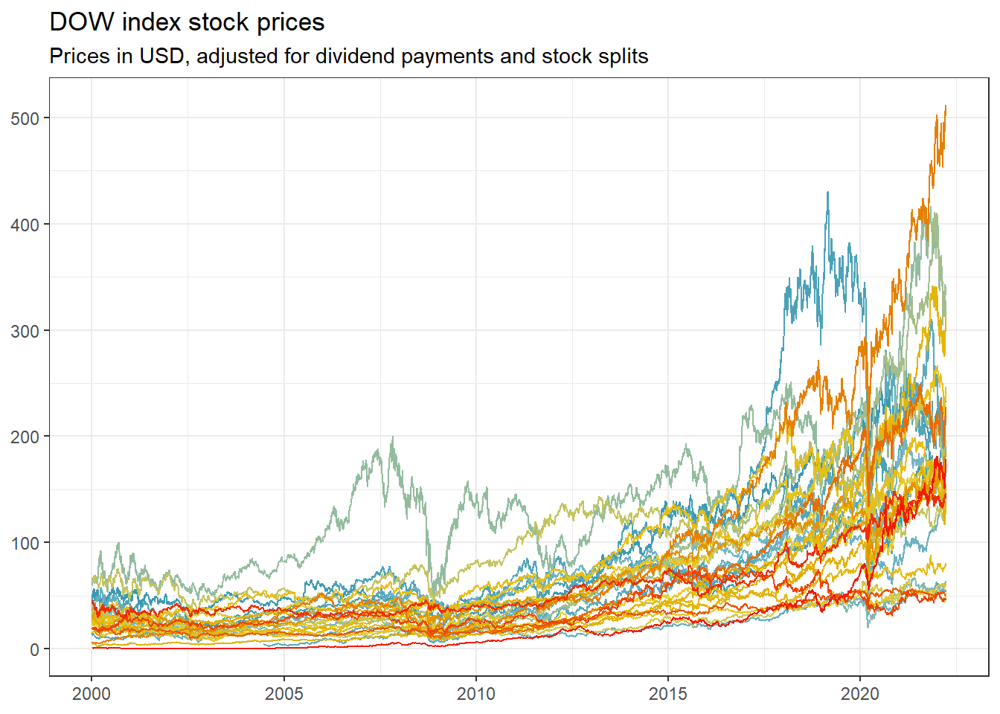
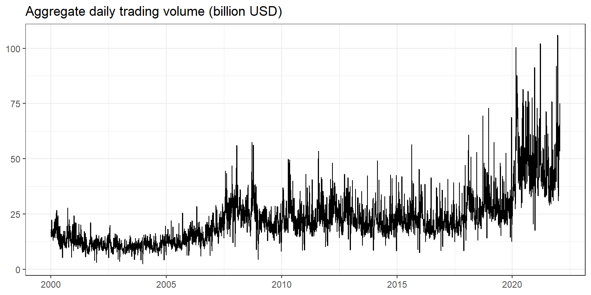
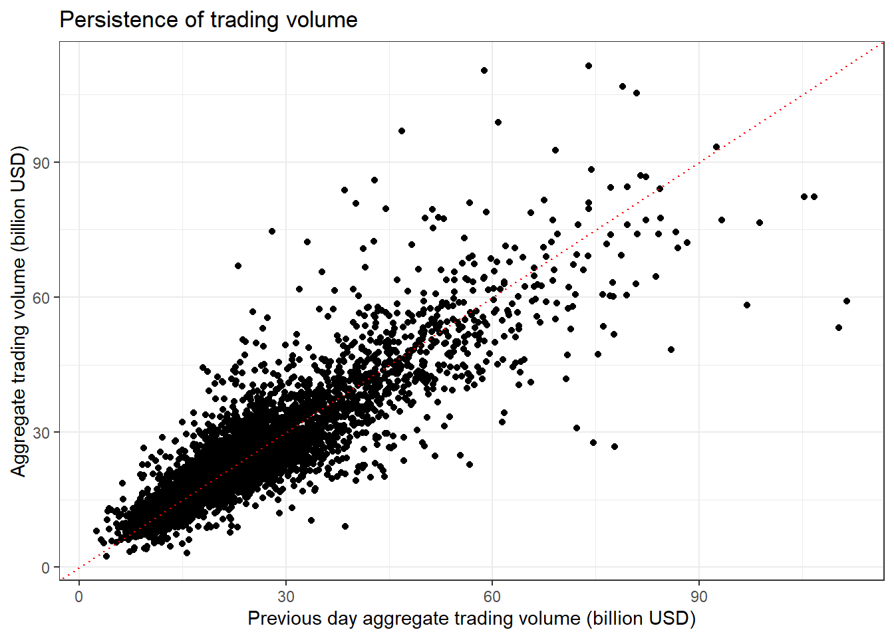
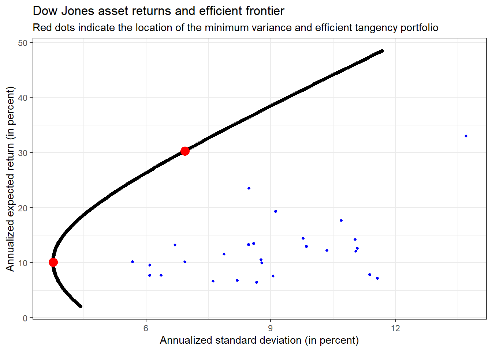

# Introduction to Tidy Finance

The main aim of this chapter is to familiarize yourself with the `tidyverse`. We start by downloading and visualizing stock data before we move to a simple portfolio choice problem. These examples introduce you to our approach of *tidy finance*.

## Working with stock market data {#stock_market_data}

At the start of the session, we load the required packages. You can use the convenient `tidyquant` package to download price data. 
If you have trouble using `tidyquant`, check out the [documentation](https://cran.r-project.org/web/packages/tidyquant/vignettes/TQ01-core-functions-in-tidyquant.html#yahoo-finance). We load the packages `tidyverse` and `tidyquant`, but also show the code to install the packages in case you do not have them yet.


```r
library(tidyverse)
library(tidyquant)
```

We first download daily prices for one stock market ticker, e.g., *AAPL*, directly from the data provider Yahoo!Finance. To download the data, you can use the command `tq_get`. If you do not know how to use it, make sure you read the help file by calling `?tq_get`. We especially recommend taking a look at the documentation's examples section. 


```r
prices <- tq_get("AAPL", get = "stock.prices")
prices
```

```
## # A tibble: 2,542 x 8
##   symbol date        open  high   low close    volume adjusted
##   <chr>  <date>     <dbl> <dbl> <dbl> <dbl>     <dbl>    <dbl>
## 1 AAPL   2012-01-03  14.6  14.7  14.6  14.7 302220800     12.6
## 2 AAPL   2012-01-04  14.6  14.8  14.6  14.8 260022000     12.6
## 3 AAPL   2012-01-05  14.8  14.9  14.7  14.9 271269600     12.8
## 4 AAPL   2012-01-06  15.0  15.1  15.0  15.1 318292800     12.9
## # ... with 2,538 more rows
```

`tq_get` downloads stock market data from Yahoo!Finance if you do not specify another data source. The function returns a tibble with eight quite self-explanatory columns: *symbol*, *date*, the market prices at the *open, high, low* and *close*, the daily *volume* (in number of shares), and the *adjusted* price in USD. Notice that the adjusted prices are corrected for anything that might affect the stock price after the market closes, e.g., stock splits and dividends. These actions do affect the quoted prices, but they have no direct impact on the investors who hold the stock.  

Next, we use `ggplot` to visualize the time series of adjusted prices. 


```r
prices %>%
  ggplot(aes(x = date, y = adjusted)) +
  geom_line() +
  labs(
    x = NULL,
    y = NULL,
    title = "AAPL stock prices",
    subtitle = "Prices in USD, adjusted for dividend payments and stock splits"
  ) +
  theme_bw()
```


Next, we compute daily returns defined as $(p_t - p_{t-1}) / p_{t-1}$ where $p_t$ is the adjusted day $t$ price. The function `lag` works well here, but can be trickier when applied to multiple assets at once. 


```r
returns <- prices %>%
  arrange(date) %>%
  mutate(ret = (adjusted / lag(adjusted) - 1)) %>%
  select(symbol, date, ret)
returns %>% head()
```

```
## # A tibble: 6 x 3
##   symbol date            ret
##   <chr>  <date>        <dbl>
## 1 AAPL   2012-01-03 NA      
## 2 AAPL   2012-01-04  0.00537
## 3 AAPL   2012-01-05  0.0111 
## 4 AAPL   2012-01-06  0.0105 
## # ... with 2 more rows
```

The resulting tibble contains three columns where the last contains the daily returns. Note that the first entry naturally contains `NA` because there is no previous price. Additionally, the computations require that the time series is ordered by date - otherwise, `lag` would be meaningless. You should also be more cautious when working with more than one ticker at once since `lag` does not account for multiple stocks automatically.

For the upcoming examples, we remove missing values as these would require separate treatment when computing, e.g., sample averages. In general, however, make sure you understand why `NA` values occur and carefully examine if you can simply get rid of these observations. 


```r
returns <- returns %>%
  drop_na(ret)
```

Next, we visualize the distribution of daily returns in a histogram. We also multiply our returns by 100 to get returns in percent, but just do so for the visualizations. While a percentage return is arguably nice for plots and tables, they are less appealing for computations. Additionally, we also add a dashed red line that indicates the 5\% quantile of the daily returns to the histogram, which is a (crude) proxy for the worst return of the stock with a probability of at least 5\%. 


```r
quantile_05 <- quantile(returns %>% pull(ret) * 100, 0.05)

returns %>%
  ggplot(aes(x = ret * 100)) +
  geom_histogram(bins = 100) +
  geom_vline(aes(xintercept = quantile_05),
    color = "red",
    linetype = "dashed"
  ) +
  labs(
    x = NULL, y = NULL,
    title = "Distribution of daily AAPL returns (in percent)",
    subtitle = "The dotted vertical line indicates the historical 5% quantile"
  ) +
  theme_bw()
```


Here, `bins = 100` determines the number of bins and hence implicitly the width of the bins. Before proceeding, make sure you understand how to use the geom `geom_vline()` to add a dotted red line that indicates the 5\% quantile of the daily returns. 

A typical task before proceeding with *any* data is to compute summary statistics for the main variables of interest. 


```r
returns %>%
  mutate(ret = ret * 100) %>%
  summarise(across(
    ret,
    list(
      daily_mean = mean,
      daily_sd = sd,
      daily_min = min,
      daily_max = max
    )
  )) %>%
  kableExtra::kable(digits = 3)
```

<table>
 <thead>
  <tr>
   <th style="text-align:right;"> ret_daily_mean </th>
   <th style="text-align:right;"> ret_daily_sd </th>
   <th style="text-align:right;"> ret_daily_min </th>
   <th style="text-align:right;"> ret_daily_max </th>
  </tr>
 </thead>
<tbody>
  <tr>
   <td style="text-align:right;"> 0.119 </td>
   <td style="text-align:right;"> 1.788 </td>
   <td style="text-align:right;"> -12.865 </td>
   <td style="text-align:right;"> 11.981 </td>
  </tr>
</tbody>
</table>

You can also compute these summary statistics for each year by imposing `group_by(year = year(date))`, which also computes the year by the call `year(date)`.


```r
returns %>%
  mutate(ret = ret * 100) %>%
  group_by(year = year(date)) %>%
  summarise(across(
    ret,
    list(
      daily_mean = mean,
      daily_sd = sd,
      daily_min = min,
      daily_max = max
    ),
    .names = "{.fn}"
  )) %>%
  kableExtra::kable(digits = 3)
```

<table>
 <thead>
  <tr>
   <th style="text-align:right;"> year </th>
   <th style="text-align:right;"> daily_mean </th>
   <th style="text-align:right;"> daily_sd </th>
   <th style="text-align:right;"> daily_min </th>
   <th style="text-align:right;"> daily_max </th>
  </tr>
 </thead>
<tbody>
  <tr>
   <td style="text-align:right;"> 2012 </td>
   <td style="text-align:right;"> 0.124 </td>
   <td style="text-align:right;"> 1.858 </td>
   <td style="text-align:right;"> -6.436 </td>
   <td style="text-align:right;"> 8.874 </td>
  </tr>
  <tr>
   <td style="text-align:right;"> 2013 </td>
   <td style="text-align:right;"> 0.047 </td>
   <td style="text-align:right;"> 1.799 </td>
   <td style="text-align:right;"> -12.356 </td>
   <td style="text-align:right;"> 5.136 </td>
  </tr>
  <tr>
   <td style="text-align:right;"> 2014 </td>
   <td style="text-align:right;"> 0.145 </td>
   <td style="text-align:right;"> 1.364 </td>
   <td style="text-align:right;"> -7.993 </td>
   <td style="text-align:right;"> 8.198 </td>
  </tr>
  <tr>
   <td style="text-align:right;"> 2015 </td>
   <td style="text-align:right;"> 0.002 </td>
   <td style="text-align:right;"> 1.684 </td>
   <td style="text-align:right;"> -6.116 </td>
   <td style="text-align:right;"> 5.735 </td>
  </tr>
  <tr>
   <td style="text-align:right;"> 2016 </td>
   <td style="text-align:right;"> 0.057 </td>
   <td style="text-align:right;"> 1.470 </td>
   <td style="text-align:right;"> -6.571 </td>
   <td style="text-align:right;"> 6.496 </td>
  </tr>
  <tr>
   <td style="text-align:right;"> 2017 </td>
   <td style="text-align:right;"> 0.164 </td>
   <td style="text-align:right;"> 1.109 </td>
   <td style="text-align:right;"> -3.878 </td>
   <td style="text-align:right;"> 6.098 </td>
  </tr>
  <tr>
   <td style="text-align:right;"> 2018 </td>
   <td style="text-align:right;"> -0.006 </td>
   <td style="text-align:right;"> 1.811 </td>
   <td style="text-align:right;"> -6.633 </td>
   <td style="text-align:right;"> 7.042 </td>
  </tr>
  <tr>
   <td style="text-align:right;"> 2019 </td>
   <td style="text-align:right;"> 0.266 </td>
   <td style="text-align:right;"> 1.647 </td>
   <td style="text-align:right;"> -9.961 </td>
   <td style="text-align:right;"> 6.833 </td>
  </tr>
  <tr>
   <td style="text-align:right;"> 2020 </td>
   <td style="text-align:right;"> 0.281 </td>
   <td style="text-align:right;"> 2.939 </td>
   <td style="text-align:right;"> -12.865 </td>
   <td style="text-align:right;"> 11.981 </td>
  </tr>
  <tr>
   <td style="text-align:right;"> 2021 </td>
   <td style="text-align:right;"> 0.131 </td>
   <td style="text-align:right;"> 1.581 </td>
   <td style="text-align:right;"> -4.167 </td>
   <td style="text-align:right;"> 5.385 </td>
  </tr>
  <tr>
   <td style="text-align:right;"> 2022 </td>
   <td style="text-align:right;"> -0.112 </td>
   <td style="text-align:right;"> 1.995 </td>
   <td style="text-align:right;"> -2.660 </td>
   <td style="text-align:right;"> 6.978 </td>
  </tr>
</tbody>
</table>

In case you wonder: the additional argument `.names = "{.fn}"` in `across()` determines how to name the output columns. The specification is rather flexible and allows to next to arbitrary column names which can be useful for reporting.


## Scaling up the analysis

As a next step, we generalize the code from before such that all the computations can handle an arbitrary vector of tickers (e.g., all index constituents). Following tidy principles, it is quite easy to download the data, plot the price time series, and tabulate the summary statistics for an arbitrary number of assets.

This is where the `tidyverse` magic starts: tidy data makes it extremely easy to generalize the computations from before to as many assets you like. The following code takes any vector of tickers, e.g., `ticker <- c("AAPL", "MMM", "BA")`, and automates the download as well as the plot of the price time series. In the end, we create the table of summary statistics for an arbitrary number of assets. 


```r
ticker <- tq_index("DOW") # constituents of the Dow Jones index
index_prices <- tq_get(ticker,
  get = "stock.prices",
  from = "2000-01-01"
) %>%
  filter(symbol != "DOW") # Exclude the index itself
```

Figure @ref(fig:prices) illustrates the time series of downloaded *adjusted* prices for each of the 30 constituents of the Dow Jones Index. Make sure you understand every single line of code! (What is the purpose of `%>%`? What are the arguments of `aes()`? Which alternative *geoms* could you use to visualize the time series? Hint: if you do not know the answers try to change the code to see what difference your intervention causes). 


```r
index_prices %>%
  ggplot(aes(
    x = date,
    y = adjusted,
    color = symbol
  )) +
  geom_line() +
  labs(
    x = NULL,
    y = NULL,
    color = NULL,
    title = "DOW index stock prices",
    subtitle = "Prices in USD, adjusted for dividend payments and stock splits"
  ) +
  theme_bw() +
  theme(legend.position = "none")
```



Do you notice the small differences relative to the code we used before? `tq_get(ticker)` returns a tibble for several symbols as well. All we need to do to illustrate all tickers simultaneously is to include `color = symbol` in the `ggplot2` aesthetics. In this way, we can generate a separate line for each ticker. Of course, there are simply too many lines on this graph to properly identify the individual stocks, but it illustrates the point well.

The same holds for returns as well. Before computing the returns, we use `group_by(symbol)` such that the `mutate` command is performed for each symbol individually. The same logic applies to the computation of summary statistics: `group_by(symbol)` is the key to aggregating the time series into ticker-specific variables of interest. 


```r
all_returns <- index_prices %>%
  group_by(symbol) %>%
  mutate(ret = adjusted / lag(adjusted) - 1) %>%
  select(symbol, date, ret) %>%
  drop_na(ret)

all_returns %>%
  mutate(ret = ret * 100) %>%
  group_by(symbol) %>%
  summarise(across(
    ret,
    list(
      daily_mean = mean,
      daily_sd = sd,
      daily_min = min,
      daily_max = max
    )
  )) %>%
  kableExtra::kable(digits = 3)
```

<table>
 <thead>
  <tr>
   <th style="text-align:left;"> symbol </th>
   <th style="text-align:right;"> ret_daily_mean </th>
   <th style="text-align:right;"> ret_daily_sd </th>
   <th style="text-align:right;"> ret_daily_min </th>
   <th style="text-align:right;"> ret_daily_max </th>
  </tr>
 </thead>
<tbody>
  <tr>
   <td style="text-align:left;"> AMGN </td>
   <td style="text-align:right;"> 0.047 </td>
   <td style="text-align:right;"> 1.985 </td>
   <td style="text-align:right;"> -13.412 </td>
   <td style="text-align:right;"> 15.102 </td>
  </tr>
  <tr>
   <td style="text-align:left;"> AXP </td>
   <td style="text-align:right;"> 0.057 </td>
   <td style="text-align:right;"> 2.296 </td>
   <td style="text-align:right;"> -17.595 </td>
   <td style="text-align:right;"> 21.882 </td>
  </tr>
  <tr>
   <td style="text-align:left;"> BA </td>
   <td style="text-align:right;"> 0.062 </td>
   <td style="text-align:right;"> 2.201 </td>
   <td style="text-align:right;"> -23.848 </td>
   <td style="text-align:right;"> 24.319 </td>
  </tr>
  <tr>
   <td style="text-align:left;"> CAT </td>
   <td style="text-align:right;"> 0.069 </td>
   <td style="text-align:right;"> 2.035 </td>
   <td style="text-align:right;"> -14.518 </td>
   <td style="text-align:right;"> 14.723 </td>
  </tr>
  <tr>
   <td style="text-align:left;"> CRM </td>
   <td style="text-align:right;"> 0.124 </td>
   <td style="text-align:right;"> 2.680 </td>
   <td style="text-align:right;"> -27.148 </td>
   <td style="text-align:right;"> 26.045 </td>
  </tr>
  <tr>
   <td style="text-align:left;"> CSCO </td>
   <td style="text-align:right;"> 0.034 </td>
   <td style="text-align:right;"> 2.388 </td>
   <td style="text-align:right;"> -16.211 </td>
   <td style="text-align:right;"> 24.388 </td>
  </tr>
  <tr>
   <td style="text-align:left;"> CVX </td>
   <td style="text-align:right;"> 0.051 </td>
   <td style="text-align:right;"> 1.749 </td>
   <td style="text-align:right;"> -22.125 </td>
   <td style="text-align:right;"> 22.741 </td>
  </tr>
  <tr>
   <td style="text-align:left;"> DIS </td>
   <td style="text-align:right;"> 0.051 </td>
   <td style="text-align:right;"> 1.929 </td>
   <td style="text-align:right;"> -18.363 </td>
   <td style="text-align:right;"> 15.972 </td>
  </tr>
  <tr>
   <td style="text-align:left;"> GS </td>
   <td style="text-align:right;"> 0.057 </td>
   <td style="text-align:right;"> 2.332 </td>
   <td style="text-align:right;"> -18.960 </td>
   <td style="text-align:right;"> 26.468 </td>
  </tr>
  <tr>
   <td style="text-align:left;"> HD </td>
   <td style="text-align:right;"> 0.057 </td>
   <td style="text-align:right;"> 1.935 </td>
   <td style="text-align:right;"> -28.736 </td>
   <td style="text-align:right;"> 14.067 </td>
  </tr>
  <tr>
   <td style="text-align:left;"> HON </td>
   <td style="text-align:right;"> 0.051 </td>
   <td style="text-align:right;"> 1.951 </td>
   <td style="text-align:right;"> -17.367 </td>
   <td style="text-align:right;"> 28.223 </td>
  </tr>
  <tr>
   <td style="text-align:left;"> IBM </td>
   <td style="text-align:right;"> 0.027 </td>
   <td style="text-align:right;"> 1.659 </td>
   <td style="text-align:right;"> -15.542 </td>
   <td style="text-align:right;"> 12.023 </td>
  </tr>
  <tr>
   <td style="text-align:left;"> INTC </td>
   <td style="text-align:right;"> 0.039 </td>
   <td style="text-align:right;"> 2.358 </td>
   <td style="text-align:right;"> -22.033 </td>
   <td style="text-align:right;"> 20.123 </td>
  </tr>
  <tr>
   <td style="text-align:left;"> JNJ </td>
   <td style="text-align:right;"> 0.041 </td>
   <td style="text-align:right;"> 1.225 </td>
   <td style="text-align:right;"> -15.846 </td>
   <td style="text-align:right;"> 12.229 </td>
  </tr>
  <tr>
   <td style="text-align:left;"> JPM </td>
   <td style="text-align:right;"> 0.062 </td>
   <td style="text-align:right;"> 2.440 </td>
   <td style="text-align:right;"> -20.727 </td>
   <td style="text-align:right;"> 25.097 </td>
  </tr>
  <tr>
   <td style="text-align:left;"> KO </td>
   <td style="text-align:right;"> 0.034 </td>
   <td style="text-align:right;"> 1.324 </td>
   <td style="text-align:right;"> -10.061 </td>
   <td style="text-align:right;"> 13.879 </td>
  </tr>
  <tr>
   <td style="text-align:left;"> MCD </td>
   <td style="text-align:right;"> 0.055 </td>
   <td style="text-align:right;"> 1.480 </td>
   <td style="text-align:right;"> -15.875 </td>
   <td style="text-align:right;"> 18.125 </td>
  </tr>
  <tr>
   <td style="text-align:left;"> MMM </td>
   <td style="text-align:right;"> 0.043 </td>
   <td style="text-align:right;"> 1.494 </td>
   <td style="text-align:right;"> -12.945 </td>
   <td style="text-align:right;"> 12.599 </td>
  </tr>
  <tr>
   <td style="text-align:left;"> MRK </td>
   <td style="text-align:right;"> 0.032 </td>
   <td style="text-align:right;"> 1.693 </td>
   <td style="text-align:right;"> -26.781 </td>
   <td style="text-align:right;"> 13.033 </td>
  </tr>
  <tr>
   <td style="text-align:left;"> MSFT </td>
   <td style="text-align:right;"> 0.056 </td>
   <td style="text-align:right;"> 1.925 </td>
   <td style="text-align:right;"> -15.598 </td>
   <td style="text-align:right;"> 19.565 </td>
  </tr>
  <tr>
   <td style="text-align:left;"> NKE </td>
   <td style="text-align:right;"> 0.079 </td>
   <td style="text-align:right;"> 1.899 </td>
   <td style="text-align:right;"> -19.813 </td>
   <td style="text-align:right;"> 15.531 </td>
  </tr>
  <tr>
   <td style="text-align:left;"> PG </td>
   <td style="text-align:right;"> 0.039 </td>
   <td style="text-align:right;"> 1.337 </td>
   <td style="text-align:right;"> -30.236 </td>
   <td style="text-align:right;"> 12.009 </td>
  </tr>
  <tr>
   <td style="text-align:left;"> TRV </td>
   <td style="text-align:right;"> 0.057 </td>
   <td style="text-align:right;"> 1.847 </td>
   <td style="text-align:right;"> -20.800 </td>
   <td style="text-align:right;"> 25.556 </td>
  </tr>
  <tr>
   <td style="text-align:left;"> UNH </td>
   <td style="text-align:right;"> 0.100 </td>
   <td style="text-align:right;"> 1.994 </td>
   <td style="text-align:right;"> -18.636 </td>
   <td style="text-align:right;"> 34.755 </td>
  </tr>
  <tr>
   <td style="text-align:left;"> V </td>
   <td style="text-align:right;"> 0.100 </td>
   <td style="text-align:right;"> 1.900 </td>
   <td style="text-align:right;"> -13.643 </td>
   <td style="text-align:right;"> 14.997 </td>
  </tr>
  <tr>
   <td style="text-align:left;"> VZ </td>
   <td style="text-align:right;"> 0.029 </td>
   <td style="text-align:right;"> 1.514 </td>
   <td style="text-align:right;"> -11.846 </td>
   <td style="text-align:right;"> 14.632 </td>
  </tr>
  <tr>
   <td style="text-align:left;"> WBA </td>
   <td style="text-align:right;"> 0.033 </td>
   <td style="text-align:right;"> 1.810 </td>
   <td style="text-align:right;"> -14.987 </td>
   <td style="text-align:right;"> 16.636 </td>
  </tr>
  <tr>
   <td style="text-align:left;"> WMT </td>
   <td style="text-align:right;"> 0.031 </td>
   <td style="text-align:right;"> 1.491 </td>
   <td style="text-align:right;"> -10.183 </td>
   <td style="text-align:right;"> 11.708 </td>
  </tr>
  <tr>
   <td style="text-align:left;"> AAPL </td>
   <td style="text-align:right;"> 0.129 </td>
   <td style="text-align:right;"> 2.521 </td>
   <td style="text-align:right;"> -51.869 </td>
   <td style="text-align:right;"> 13.905 </td>
  </tr>
</tbody>
</table>

Note that you are now also equipped with all tools to download price data for *each* ticker listed in the S&P 500 index with the same number of lines of code. Just use `ticker <- tq_index("SP500")`, which provides you with a tibble that contains each symbol that is (currently) part of the S&P 500. However, don't try this if you are not prepared to wait for a couple of minutes - there are too many tickers.


## Other forms of data aggregation 

Sometimes, aggregation across other variables than `symbol` makes sense as well. For instance, suppose you are interested in answering the question: are days with high aggregate trading volume followed by high aggregate trading volume days? To provide some initial analysis on this question, we take the downloaded tibble with prices and compute aggregate daily trading volume for all Dow Jones constituents in USD. Recall that the column *volume* is denoted in the number of traded shares. Thus, we multiply the trading volume with the daily closing price to get a proxy for the aggregate trading volume in USD. Scaling by `1e9` denotes daily trading volume in billion USD.  


```r
volume <- index_prices %>%
  mutate(volume_usd = volume * close / 1e9) %>%
  group_by(date) %>%
  summarise(volume = sum(volume_usd))

volume %>%
  ggplot(aes(x = date, y = volume)) +
  geom_line() +
  labs(
    x = NULL, y = NULL,
    title = "Aggregate daily trading volume (billion USD)"
  ) +
  theme_bw()
```



One way to illustrate the persistence of trading volume would be to plot volume on day $t$ against volume on day $t-1$ as in the example below. We add a 45°-line to indicate a hypothetical one-to-one relation by `geom_abline`, addressing potential differences in the axes' scales.


```r
volume %>%
  ggplot(aes(x = lag(volume), y = volume)) +
  geom_point() +
  geom_abline(aes(intercept = 0, slope = 1),
    color = "red",
    linetype = "dotted"
  ) +
  labs(
    x = "Previous day aggregate trading volume (billion USD)",
    y = "Aggregate trading volume (billion USD)",
    title = "Persistence of trading volume"
  ) +
  theme_bw() +
  theme(legend.position = "None")
```

```
## Warning: Removed 1 rows containing missing values (geom_point).
```



Do you understand where the warning `## Warning: Removed 1 rows containing missing values (geom_point).` comes from and what it means? Purely *eye-balling* (i.e., just looking at something), the figure reveals that days with high trading volume are often followed by similarly high trading volume days.

## Portfolio choice problems

In the previous part, we show how to download stock market data and inspect it with graphs and summary statistics. Now, we move to a typical question in Finance, namely, how to optimally allocate wealth across different assets. The standard framework for optimal portfolio selection considers investors that like higher returns but dislike return volatility (both should be forward-looking measures, i.e., expected return and volatility): the *mean-variance investor*. 

An essential tool to evaluate portfolios in the mean-variance context is the *efficient frontier*, the set of portfolios which satisfy the condition that no other portfolio exists with a higher expected return but with the same standard deviation of return (i.e., the risk). Let us compute and visualize the efficient frontier for several stocks. 
First, we use our dataset to compute each asset's *monthly* returns. In order to keep things simple we work with a balanced panel and exclude tickers for which we do not observe a price on every single trading day since 2000.


```r
index_prices <- index_prices %>%
  group_by(symbol) %>%
  mutate(n = n()) %>%
  ungroup() %>%
  filter(n == max(n)) %>%
  select(-n)

returns <- index_prices %>%
  mutate(month = floor_date(date, "month")) %>%
  group_by(symbol, month) %>%
  summarise(price = last(adjusted), .groups = "drop_last") %>%
  mutate(ret = price / lag(price) - 1) %>%
  drop_na(ret) %>%
  select(-price)
```

Next, we transform the returns from a tidy tibble into a $(T \times N)$ matrix with one column for each of the $N$ tickers to compute the covariance matrix $\Sigma$ and also the expected return vector $\mu$. We achieve this by using `pivot_wider()` with the new column names from the column `symbol` and set the values to `ret`.
We compute the vector of sample average returns and the sample variance-covariance matrix, which we consider as proxies for the expected return distribution. 


```r
returns_matrix <- returns %>%
  pivot_wider(
    names_from = symbol,
    values_from = ret
  ) %>%
  select(-month)

sigma <- cov(returns_matrix)
mu <- colMeans(returns_matrix)
```

Then, we compute the minimum variance portfolio weights $\omega_\text{mvp}$ as well as the expected return $\omega_\text{mvp}'\mu$ and volatility $\sqrt{\omega_\text{mvp}'\Sigma\omega_\text{mvp}}$ of this portfolio. Recall that the minimum variance portfolio is the vector of portfolio weights that are the solution to 
$$\arg\min w'\Sigma w \text{ s.t. } \sum\limits_{i=1}^Nw_i = 1.$$
It is easy to show analytically, that $\omega_\text{mvp} = \frac{\Sigma^{-1}\iota}{\iota'\Sigma^{-1}\iota}$ where $\iota$ is a vector of ones.


```r
N <- ncol(returns_matrix)
iota <- rep(1, N)
mvp_weights <- solve(sigma) %*% iota
mvp_weights <- mvp_weights / sum(mvp_weights)

c(t(mvp_weights) %*% mu, sqrt(t(mvp_weights) %*% sigma %*% mvp_weights)) # Expected return and volatility
```

```
## [1] 0.008398773 0.031368737
```

Note that the *monthly* volatility of the minimum variance portfolio is of the same order of magnitude as the *daily* standard deviation of the individual components. Thus, the diversification benefits in terms of risk reduction are tremendous!

Next, we set out to find the weights for a portfolio that achieves three times the expected return of the minimum variance portfolio. However, we are not interested in any portfolio that achieves the return, but the efficient portfolio in the mean-variance setting, i.e., the portfolio with the lowest standard deviation. If you wonder where the solution $\omega_\text{eff}$ comes from: The efficient portfolio is chosen by an investor who aims to achieve minimum variance *given a minimum acceptable expected return* $\bar{\mu}$. Hence, their objective function is to choose $\omega_\text{eff}$ as the solution to
$$\arg\min w'\Sigma w \text{ s.t. } w'\iota = 1 \text{ and } \omega'\mu \geq \bar{\mu}.$$
The code below implements the analytic solution to this optimization problem for a benchmark return $\bar\mu$ which we set to 3 times the expected return of the minimum variance portfolio. We encourage you to verify that it is correct. 


```r
mu_bar <- 3 * t(mvp_weights) %*% mu

C <- as.numeric(t(iota) %*% solve(sigma) %*% iota)
D <- as.numeric(t(iota) %*% solve(sigma) %*% mu)
E <- as.numeric(t(mu) %*% solve(sigma) %*% mu)

lambda_tilde <- as.numeric(2 * (mu_bar - D / C) / (E - D^2 / C))
efp_weights <- mvp_weights + lambda_tilde / 2 * (solve(sigma) %*% mu - D / C * solve(sigma) %*% iota)
```

## The efficient frontier 

The two mutual fund separation theorem states that as soon as we have two efficient portfolios (such as the minimum variance portfolio and the efficient portfolio for another required level of expected returns like above), we can characterize the entire efficient frontier by combining these two portfolios. The code below implements the construction of the *efficient frontier*, which characterizes the highest expected return achievable at each level of risk. To understand the code better, make sure to familiarize yourself with the inner workings of the `for` loop.


```r
c <- seq(from = -0.4, to = 1.9, by = 0.01)
res <- tibble(
  c = c,
  mu = NA,
  sd = NA
)

for (i in seq_along(c)) {
  w <- (1 - c[i]) * mvp_weights + (c[i]) * efp_weights
  res$mu[i] <- 12 * 100 * t(w) %*% mu
  res$sd[i] <- 12 * 10 * sqrt(t(w) %*% sigma %*% w)
}
```

Finally, it is simple to visualize the efficient frontier alongside the two efficient portfolios within one, powerful figure using `ggplot2`. To show how easy this setup is, we also add the individual stocks in the same call. 

```r
res %>%
  ggplot(aes(x = sd, y = mu)) +
  geom_point() +
  geom_point( # locate the minimum variance and efficient portfolio
    data = res %>% filter(c %in% c(0, 1)),
    color = "red",
    size = 4
  ) +
  geom_point( # locate the individual assets
    data = tibble(mu = 12 * 100 * mu, sd = 12 * 10 * sqrt(diag(sigma))),
    aes(y = mu, x = sd), color = "blue", size = 1
  ) +
  theme_bw() +
  labs(
    x = "Annualized standard deviation (in percent)",
    y = "Annualized expected return (in percent)",
    title = "Dow Jones asset returns and efficient frontier",
    subtitle = "Red dots indicate the location of the minimum variance and efficient tangency portfolio"
  )
```


The black line indicates the efficient frontier: the set of portfolios a mean-variance efficient investor would choose from. Compare the performance relative to the individual assets (the blue dots) - it should become clear that diversifying yields massive performance gains (at least as long as we take the parameters $\Sigma$ and $\mu$ as given).

## Exercises

1. Download daily prices for another stock market ticker of your choice from Yahoo!Finance with `tq_get` from the `tidyquant` package. Plot two time series of the ticker's un-adjusted and adjusted closing prices. Explain the differences.
1. Compute daily net returns for the asset and visualize the distribution of daily returns in a histogram. Also, use `geom_vline()` to add a dashed red line that indicates the 5% quantile of the daily returns within the histogram. Compute summary statistics (mean, standard deviation, minimum and maximum) for the daily returns
1. Take your code from before and generalize it such that you can perform all the computations for an arbitrary vector of tickers (e.g., `ticker <- c("AAPL", "MMM", "BA")`). Automate the download, the plot of the price time series, and create a table of return summary statistics for this arbitrary number of assets.
1. Consider the research question: Are days with high aggregate trading volume often also days with large absolute price changes? Find an appropriate visualization to analyze the question.
1. Compute monthly returns from the downloaded stock market prices. Compute the vector of historical average returns and the sample variance-covariance matrix. After you compute the minimum variance portfolio weights and the portfolio volatility and average returns, visualize the mean-variance efficient frontier. Choose one of your assets and identify the portfolio which yields the same historical volatility but achieves the highest possible average return.
1. The efficient frontier characterizes the portfolios with the highest expected return for different levels of risk, i.e., standard deviation. Identify the portfolio with the highest expected return per standard deviation. Hint: the ratio of expected return to standard deviation is an important concept in Finance. 
