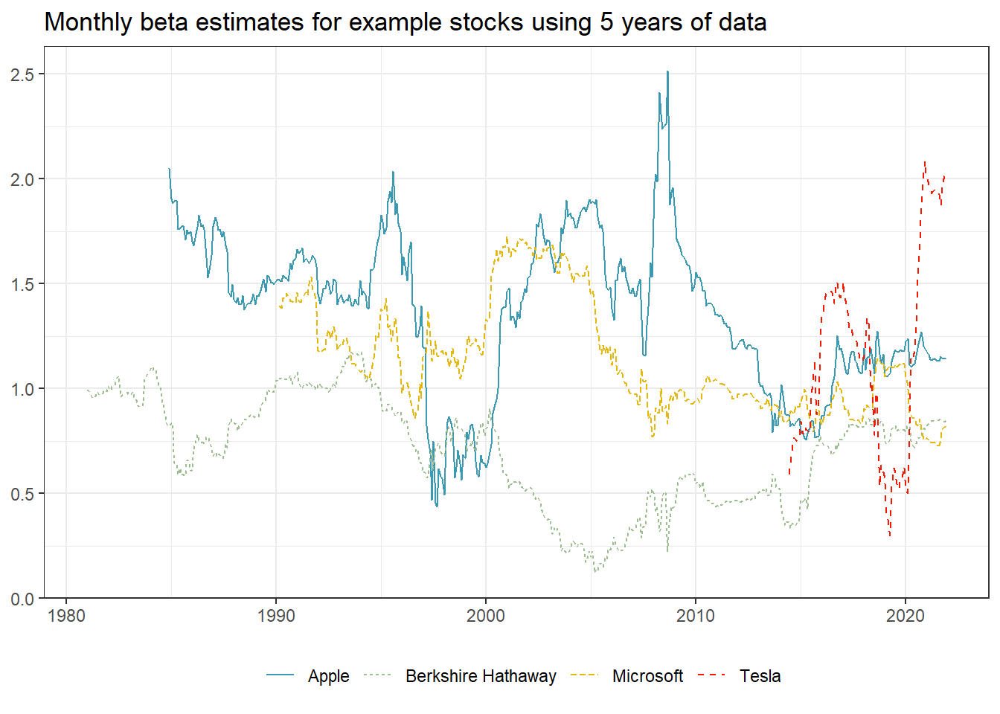
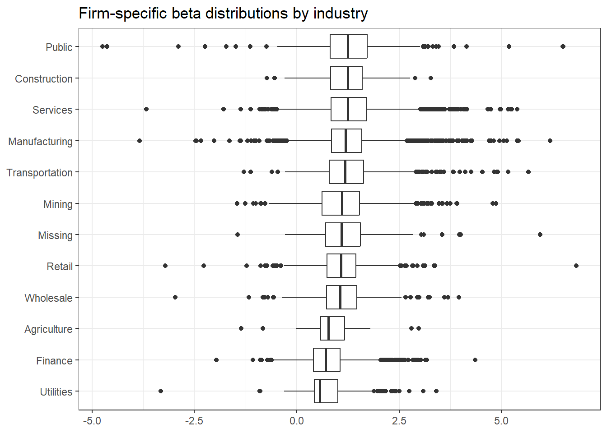
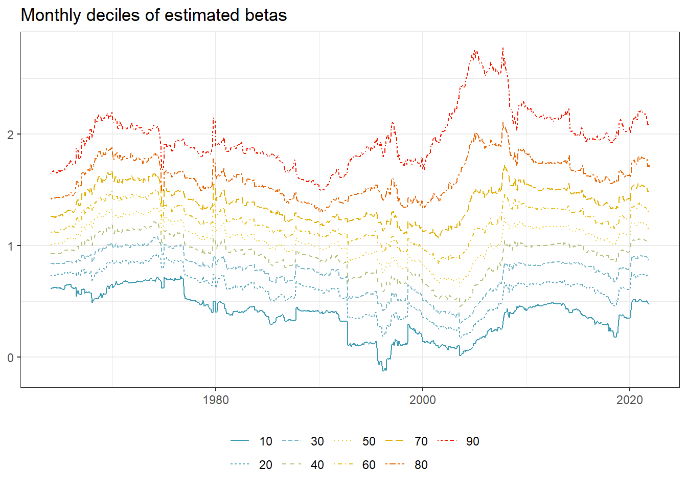
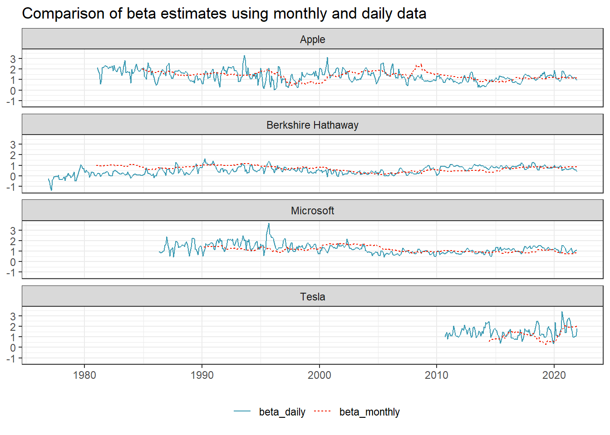
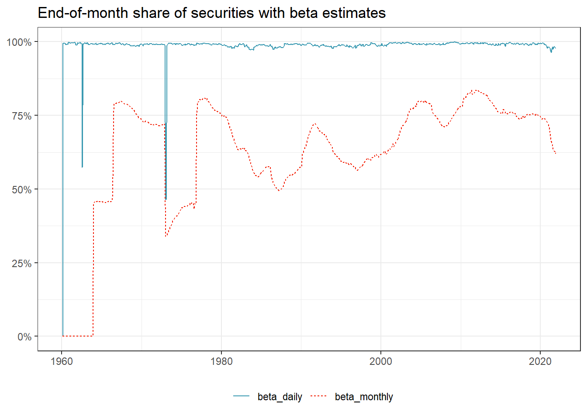

# (PART\*) Asset pricing {.unnumbered}

# Beta estimation

In this chapter, we introduce an important concept in financial economics: the exposure of an individual stock to changes in the market portfolio. According to the Capital Asset Pricing Model (CAPM) of @Sharpe1964, @Lintner1965, and @Mossin1966, cross-sectional variation in expected asset returns should be a function of the covariance between the excess return of the asset and the excess return on the market portfolio.\index{CAPM} The regression coefficient of excess market returns on excess stock returns is usually called the market beta. We show an estimation procedure for the market betas.\index{Beta} We do not go into details about the foundations of market beta but simply refer to any treatment of the [CAPM](https://en.wikipedia.org/wiki/Capital_asset_pricing_model) for further information. Instead, we provide details about all the functions that we use to compute the results. In particular, we leverage useful computational concepts: rolling-window estimation and parallelization.

We use the following packages throughout this chapter:

```r
library(tidyverse)
library(RSQLite)
library(scales)
library(slider)
library(furrr)
```
Compared to previous chapters, we introduce `slider` [@slider] for sliding window functions, and `furrr` [@furrr] to apply mapping functions in parallel.

## Estimating beta using monthly returns

The estimation procedure is based on a rolling-window estimation where we may use either monthly or daily returns and different window lengths. First, let us start with loading the monthly CRSP data from our `SQLite`-database introduced in the previous chapters 2-4.\index{Data!CRSP}\index{Data!Fama-French factors}


```r
tidy_finance <- dbConnect(
  SQLite(),
  "data/tidy_finance.sqlite",
  extended_types = TRUE
)

crsp_monthly <- tbl(tidy_finance, "crsp_monthly") |>
  collect()

factors_ff_monthly <- tbl(tidy_finance, "factors_ff_monthly") |>
  collect()

crsp_monthly <- crsp_monthly |>
  left_join(factors_ff_monthly, by = "month") |>
  select(permno, month, industry, ret_excess, mkt_excess)
```

To estimate the CAPM regression coeffients  
$$
r_{i, t} - r_{f, t} = \alpha_i + \beta_i(r_{m, t}-r_{f,t})+\varepsilon_{i, t}
$$
we regress stock excess returns `ret_excess` on excess returns of the market portfolio `mkt_excess`. 
R provides a simple solution to estimate (linear) models with the function `lm()`. `lm()` requires a formula as input that is specified in a compact symbolic form. An expression of the form `y ~ model` is interpreted as a specification that the response `y` is modeled by a linear predictor specified symbolically by `model`. Such a model consists of a series of terms separated by `+` operators. In addition to standard linear models, `lm()` provides a lot of flexibility. You should check out the documentation for more information. To start, we restrict the data only to the time series of observations in CRSP that correspond to Apple’s stock (i.e., to `permno` 14593 for Apple) and compute $\hat\alpha_i$ as well as $\hat\beta_i$.


```r
fit <- lm(ret_excess ~ mkt_excess,
  data = crsp_monthly |>
    filter(permno == "14593")
)

summary(fit)
```

```

Call:
lm(formula = ret_excess ~ mkt_excess, data = filter(crsp_monthly, 
    permno == "14593"))

Residuals:
    Min      1Q  Median      3Q     Max 
-0.5169 -0.0598  0.0001  0.0636  0.3944 

Coefficients:
            Estimate Std. Error t value Pr(>|t|)    
(Intercept)  0.01034    0.00521    1.99    0.048 *  
mkt_excess   1.39419    0.11576   12.04   <2e-16 ***
---
Signif. codes:  0 '***' 0.001 '**' 0.01 '*' 0.05 '.' 0.1 ' ' 1

Residual standard error: 0.114 on 490 degrees of freedom
Multiple R-squared:  0.228,	Adjusted R-squared:  0.227 
F-statistic:  145 on 1 and 490 DF,  p-value: <2e-16
```

`lm()` returns an object of class `lm` which contains all information we usually care about with linear models. `summary()` returns an overview of the estimated parameters. `coefficients(fit)` would return only the estimated coefficients. The output above indicates that Apple moves excessively with the market as the estimated $\hat\beta_i$ is above one ($\hat\beta_i \approx 1.4$). 

## Rolling-window estimation

After we estimated the regression coefficients on an example, we scale the estimation of  $\beta_i$ to a whole different level and perform rolling-window estimations for the entire CRSP sample.\index{Rollwing-window estimation} The following function implements the CAPM regression for a data frame (or a part thereof) containing at least `min_obs` observations to avoid huge fluctuations if the time series is too short. If the condition is violated, that is, the time series is too short, the function returns a missing value. 


```r
estimate_capm <- function(data, min_obs = 1) {
  if (nrow(data) < min_obs) {
    beta <- as.numeric(NA)
  } else {
    fit <- lm(ret_excess ~ mkt_excess, data = data)
    beta <- as.numeric(coefficients(fit)[2])
  }
  return(beta)
}
```

Next, we define a function that does the rolling estimation. The `slide_period` function is able to handle months in its window input in a straightforward manner. We thus avoid using any time-series package (e.g., `zoo`) and converting the data to fit the package functions, but rather stay in the world of the `tidyverse`.

The following function takes input data and slides across the `month` vector, considering only a total of `months` months. The function essentially performs three steps: (i) arrange all rows, (ii) compute betas by sliding across months, and (iii) return a tibble with months and corresponding beta estimates (again particularly useful in the case of daily data).
As we demonstrate further below, we can also apply the same function to daily returns data. 

```r
roll_capm_estimation <- function(data, months, min_obs) {
  data <- data |>
    arrange(month)

  betas <- slide_period_vec(
    .x = data,
    .i = data$month,
    .period = "month",
    .f = ~ estimate_capm(., min_obs),
    .before = months - 1,
    .complete = FALSE
  )

  return(tibble(
    month = unique(data$month),
    beta = betas
  ))
}
```

Before we attack the whole CRSP sample, let us focus on a couple of examples for well-known firms.

```r
examples <- tribble(
  ~permno, ~company,
  14593, "Apple",
  10107, "Microsoft",
  93436, "Tesla",
  17778, "Berkshire Hathaway"
)
```
If we want to estimate rolling betas for Apple, we can use `mutate()`. 
We take a total of 5 years of data and require at least 48 months with return data to compute our betas. 
Check out the exercises if you want ot compute beta for different time periods. 

```r
beta_example <- crsp_monthly |>
  filter(permno == examples$permno[1]) |>
  mutate(roll_capm_estimation(cur_data(), months = 60, min_obs = 48)) |>
  drop_na()
beta_example
```

```
# A tibble: 445 × 6
  permno month      industry      ret_excess mkt_excess  beta
   <dbl> <date>     <chr>              <dbl>      <dbl> <dbl>
1  14593 1984-12-01 Manufacturing     0.170      0.0184  2.05
2  14593 1985-01-01 Manufacturing    -0.0108     0.0799  1.90
3  14593 1985-02-01 Manufacturing    -0.152      0.0122  1.88
4  14593 1985-03-01 Manufacturing    -0.112     -0.0084  1.89
5  14593 1985-04-01 Manufacturing    -0.0467    -0.0096  1.90
# … with 440 more rows
```
It is actually quite simple to perform the rolling-window estimation for an arbitrary number of stocks, which we visualize in the following code chunk. 

```r
beta_examples <- crsp_monthly |>
  inner_join(examples, by = "permno") |>
  group_by(permno) |>
  mutate(roll_capm_estimation(cur_data(), months = 60, min_obs = 48)) |>
  ungroup() |>
  select(permno, company, month, beta) |>
  drop_na()

beta_examples |>
  ggplot(aes(x = month, y = beta, color = company)) +
  geom_line() +
  labs(
    x = NULL, y = NULL, color = NULL,
    title = "Monthly beta estimates for example stocks using 5 years of data"
  )
```

<div class="figure" style="text-align: center">

<p class="caption">(\#fig:fig311)The CAPM betas are estimated with monthly data and a rolling window of length 5 years based on adjusted excess returns from CRSP. We use market excess returns from Kenneth French data library.</p>
</div>

## Parallelized rolling-window estimation

Even though we could now just apply the function using `group_by()` on the whole CRSP sample, we advise against doing it as it is computationally quite expensive. 
Remember that we have to perform rolling-window estimations across all stocks and time periods. 
However, this estimation problem is an ideal scenario to employ the power of parallelization. 
Parallelization means that we split the tasks which perform rolling-window estimations across different workers (or cores on your local machine). 

First, we `nest()` the data by `permno`. Nested data means we now have a list of `permno` with corresponding time series data and an `industry` label. We get one row of output for each unique combination of non-nested variables which are `permno` and `industry`.\index{Data!Nested}


```r
crsp_monthly_nested <- crsp_monthly |>
  nest(data = c(month, ret_excess, mkt_excess))
crsp_monthly_nested
```

```
# A tibble: 30,071 × 3
  permno industry      data              
   <dbl> <chr>         <list>            
1  10000 Manufacturing <tibble [16 × 3]> 
2  10001 Utilities     <tibble [378 × 3]>
3  10002 Finance       <tibble [324 × 3]>
4  10003 Finance       <tibble [118 × 3]>
5  10005 Mining        <tibble [65 × 3]> 
# … with 30,066 more rows
```

Alternatively, we could have created the same nested data by *excluding* the variables that we *do not* want to nest, as in the following code chunk. However, for many applications it is desirable to explicitly state the variables that are nested into the `data` list-column, so that the reader can track what ends up in there.


```r
crsp_monthly_nested <- crsp_monthly |>
  nest(data = -c(permno, industry))
```

Next, we want to apply the `roll_capm_estimation()` function to each stock. This situation is an ideal use case for `map()`, which takes a list or vector as input and returns an object of the same length as the input. In our case, `map()` returns a single data frame with a time series of beta estimates for each stock. Therefore, we use `unnest()` to transform the list of outputs to a tidy data frame. 


```r
crsp_monthly_nested |>
  inner_join(examples, by = "permno") |>
  mutate(beta = map(
    data,
    ~ roll_capm_estimation(., months = 60, min_obs = 48)
  )) |>
  unnest(beta) |>
  select(permno, month, beta_monthly = beta) |>
  drop_na()
```

```
# A tibble: 1,410 × 3
  permno month      beta_monthly
   <dbl> <date>            <dbl>
1  10107 1990-03-01         1.39
2  10107 1990-04-01         1.38
3  10107 1990-05-01         1.43
4  10107 1990-06-01         1.43
5  10107 1990-07-01         1.45
# … with 1,405 more rows
```

However, instead, we want to perform the estimations of rolling betas for different stocks in parallel. If you have a Windows machine, it makes most sense to define `multisession`, which means that separate R processes are running in the background on the same machine to perform the individual jobs. If you check out the documentation of `plan()`, you can also see other ways to resolve the parallelization in different environments.\index{Parallelization}


```r
plan(multisession, workers = availableCores())
```

Using eight cores, the estimation for our sample of around 25k stocks takes around 20 minutes. Of course, you can speed up things considerably by having more cores available to share the workload or by having more powerful cores. Notice the difference in the code below? All you need to do is to replace `map()` with `future_map()`.


```r
beta_monthly <- crsp_monthly_nested |>
  mutate(beta = future_map(
    data, ~ roll_capm_estimation(., months = 60, min_obs = 48)
  )) |>
  unnest(c(beta)) |>
  select(permno, month, beta_monthly = beta) |>
  drop_na()
```

## Estimating beta using daily returns

Before we provide some descriptive statistics of our beta estimates, we implement the estimation for the daily CRSP sample as well. 
Depending on the application, you might either use longer horizon beta estimates based on monthly data or shorter horizon estimates based on daily returns. 

First, we load daily CRSP data. 
Note that the sample is large compared to the monthly data, so make sure to have enough memory available.


```r
crsp_daily <- tbl(tidy_finance, "crsp_daily") |>
  collect()
```

We also need the daily Fama-French market excess returns.


```r
factors_ff_daily <- tbl(tidy_finance, "factors_ff_daily") |>
  collect()
```

We make sure to keep only relevant data to save memory space. 
However, note that your machine might not have enough memory to read the whole daily CRSP sample. In this case, we refer you to the exercises and try working with loops as in chapter 3. 


```r
crsp_daily <- crsp_daily |>
  inner_join(factors_ff_daily, by = "date") |>
  select(permno, month, ret_excess, mkt_excess)
```

Just like above, we nest the data by `permno` for parallelization.


```r
crsp_daily_nested <- crsp_daily |>
  nest(data = c(month, ret_excess, mkt_excess))
```

This is what the estimation looks like for a couple of examples using `map()`. 
For the daily data, we use the same function as above but only take 3 months of data and require at least 50 daily return observations in these months. 
These restrictions help us to retrieve somewhat smooth coefficient estimates.


```r
crsp_daily_nested |>
  inner_join(examples, by = "permno") |>
  mutate(beta_daily = map(
    data,
    ~ roll_capm_estimation(., months = 3, min_obs = 50)
  )) |>
  unnest(c(beta_daily)) |>
  select(permno, month, beta_daily = beta) |>
  drop_na()
```

```
# A tibble: 1,591 × 3
  permno month      beta_daily
   <dbl> <date>          <dbl>
1  10107 1986-05-01      0.898
2  10107 1986-06-01      0.906
3  10107 1986-07-01      0.822
4  10107 1986-08-01      0.900
5  10107 1986-09-01      1.01 
# … with 1,586 more rows
```

For the sake of completeness, we tell our session again to use multiple workers for parallelization.


```r
plan(multisession, workers = availableCores())
```

The code chunk for beta estimation using daily returns now looks very similar to the one for monthly data. The whole estimation takes around 30 minutes using eight cores and 16gb memory. 


```r
beta_daily <- crsp_daily_nested |>
  mutate(beta_daily = future_map(
    data, ~ roll_capm_estimation(., months = 3, min_obs = 50)
  )) |>
  unnest(c(beta_daily)) |>
  select(permno, month, beta_daily = beta) |>
  drop_na()
```

## Comparing beta estimates

What is a typical value for stock betas? To get some feeling, we illustrate the dispersion of the estimated $\hat\beta_i$ across different industries and across time below. The first figure below shows that typical business models across industries imply different exposure to the general market economy. However, there are barely any firms that exhibit a negative exposure to the market factor.


```r
crsp_monthly |>
  left_join(beta_monthly, by = c("permno", "month")) |>
  drop_na(beta_monthly) |>
  group_by(industry, permno) |>
  summarize(beta = mean(beta_monthly)) |>
  ggplot(aes(x = reorder(industry, beta, FUN = median), y = beta)) +
  geom_boxplot() +
  coord_flip() +
  labs(
    x = NULL, y = NULL,
    title = "Firm-specific beta distributions by industry"
  )
```

<div class="figure" style="text-align: center">

<p class="caption">(\#fig:fig312)The box plots show the average firm-specific beta estimates by industry.</p>
</div>

Next, we illustrate the time-variation in the cross-section of estimated betas. The figure below shows the monthly deciles of estimated betas (based on monthly data) and indicates an interesting pattern: First, betas seem to vary over time in the sense that during some periods, there is a clear trend across all deciles. Second, the sample exhibits periods where the dispersion across stocks increases in the sense that the lower decile decreases and the upper decile increases, which indicates that for some stocks the correlation with the market increases while for others it decreases. Note also here: stocks with negative betas are a rare exception.


```r
beta_monthly |>
  drop_na(beta_monthly) |>
  group_by(month) |>
  summarize(
    x = quantile(beta_monthly, seq(0.1, 0.9, 0.1)),
    quantile = 100 * seq(0.1, 0.9, 0.1),
    .groups = "drop"
  ) |>
  ggplot(aes(x = month, y = x, color = as_factor(quantile))) +
  geom_line() +
  labs(
    x = NULL, y = NULL, color = NULL,
    title = "Monthly deciles of estimated betas",
  )
```

<div class="figure" style="text-align: center">

<p class="caption">(\#fig:fig313)Each line corresponds to the monthly cross-sectional quantile of the estimated CAPM beta.</p>
</div>

To compare the difference between daily and monthly data, we combine beta estimates to a single table. Then, we use the table to plot a comparison of beta estimates for our example stocks. 


```r
beta <- beta_monthly |>
  full_join(beta_daily, by = c("permno", "month")) |>
  arrange(permno, month)

beta |>
  inner_join(examples, by = "permno") |>
  pivot_longer(cols = c(beta_monthly, beta_daily)) |>
  drop_na() |>
  ggplot(aes(x = month, y = value, color = name)) +
  geom_line() +
  facet_wrap(~company, ncol = 1) +
  labs(
    x = NULL, y = NULL, color = NULL,
    title = "Comparison of beta estimates using monthly and daily data"
  )
```

<div class="figure" style="text-align: center">

<p class="caption">(\#fig:fig314)CAPM betas are computed using 5 years of monthly or 3 months of daily data. The two lines show the monthly estimates based on a rolling window for few exemplary stocks.</p>
</div>

The estimates look as expected. As you can see, it really depends on the estimation window and data frequency how your beta estimates turn out. 

Finally, we write the estimates to our database such that we can use them in later chapters. 


```r
  dbWriteTable(tidy_finance,
    "beta",
    value = beta,
    overwrite = TRUE
  )
```

Whenever you perform some kind of estimation, it also makes sense to do rough plausibility tests. A possible check is to plot the share of stocks with beta estimates over time. 
This descriptive helps us discover potential errors in our data preparation or estimation procedure. 
For instance, suppose there was a gap in our output where we do not have any betas. 
In this case, we would have to go back and check all previous steps to find out what went wrong. 


```r
beta_long <- crsp_monthly |>
  left_join(beta, by = c("permno", "month")) |>
  pivot_longer(cols = c(beta_monthly, beta_daily))

beta_long |>
  group_by(month, name) |>
  summarize(share = sum(!is.na(value)) / n()) |>
  ggplot(aes(x = month, y = share, color = name)) +
  geom_line() +
  scale_y_continuous(labels = percent) +
  labs(
    x = NULL, y = NULL, color = NULL,
    title = "End-of-month share of securities with beta estimates"
  ) +
  coord_cartesian(ylim = c(0, 1))
```

<div class="figure" style="text-align: center">

<p class="caption">(\#fig:fig315)The two lines show the share of securities with beta estimates using 5 years of monthly or 3 months of daily data.</p>
</div>

The figure above does not indicate any troubles, so let us move on to the next check. 

We also encourage everyone to always look at the distributional summary statistics of variables. You can easily spot outliers or weird distributions when looking at such tables.\index{Summary statistics}


```r
beta_long |>
  select(name, value) |>
  drop_na() |>
  group_by(name) |>
  summarize(
    mean = mean(value),
    sd = sd(value),
    min = min(value),
    q05 = quantile(value, 0.05),
    q50 = quantile(value, 0.50),
    q95 = quantile(value, 0.95),
    max = max(value),
    n = n()
  )
```

```
# A tibble: 2 × 9
  name          mean    sd   min    q05   q50   q95   max       n
  <chr>        <dbl> <dbl> <dbl>  <dbl> <dbl> <dbl> <dbl>   <int>
1 beta_daily   0.749 0.926 -43.7 -0.447 0.686  2.23  56.6 3233745
2 beta_monthly 1.10  0.713 -13.0  0.125 1.03   2.32  10.3 2102936
```

The summary statistics also look plausible for the two estimation procedures. 

Finally, since we have two different estimators for the same theoretical object, we expect the estimators should be at least positively correlated (although not perfectly as the estimators are based on different sample periods and frequencies).


```r
beta |>
  select(beta_daily, beta_monthly) |>
  cor(use = "complete.obs")
```

```
             beta_daily beta_monthly
beta_daily        1.000        0.323
beta_monthly      0.323        1.000
```

Indeed, we find a positive correlation between our beta estimates. In the subsequent chapters, we mainly use the estimates based on monthly data as most readers should be able to replicate them due to potential memory limitations that might arise with the daily data. 

## Exercises

1. Compute beta estimates based on monthly data using 1, 3, and 5 years of data and impose a minimum number of observations of 10, 28, and 48 months with return data, respectively. How strongly correlated are the estimated betas?
1. Compute beta estimates based on monthly data using 5 years of data and impose different numbers of minimum observations. How does the share of permno-month observations with successful beta estimates vary across the different requirements? Do you find a high correlation across the estimated betas? 
1. Instead of using `future_map()`, perform the beta estimation in a loop (using either monthly or daily data) for a subset of 100 permnos of your choice. Verify that you get the same results as with the parallelized code from above.
1. Filter out the stocks with negative betas. Do these stocks frequently exhibit negative betas, or do they resemble estimation errors? 
1. Compute beta estimates for multi-factor models such as the Fama-French 3 factor model. For that purpose, you extend your regression 
$$
r_{i, t} - r_{f, t} = \alpha_i + \sum\limits_{j=1}^k\beta_{i,k}(r_{j, t}-r_{f,t})+\varepsilon_{i, t}
$$
where $r_{j, t}$ are the $k$ factor returns. Thus, you estimate 4 parameters ($alpha_i$ and the slope coefficients). Provide some summary statistics of the cross-section of firms and their exposure to the different factors. 
