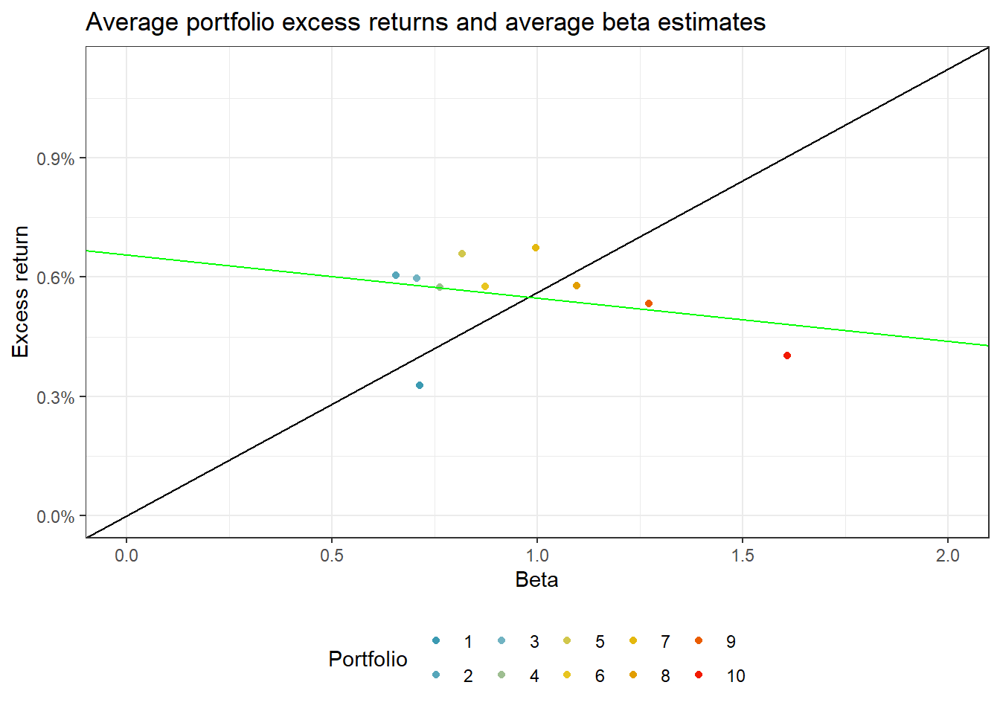
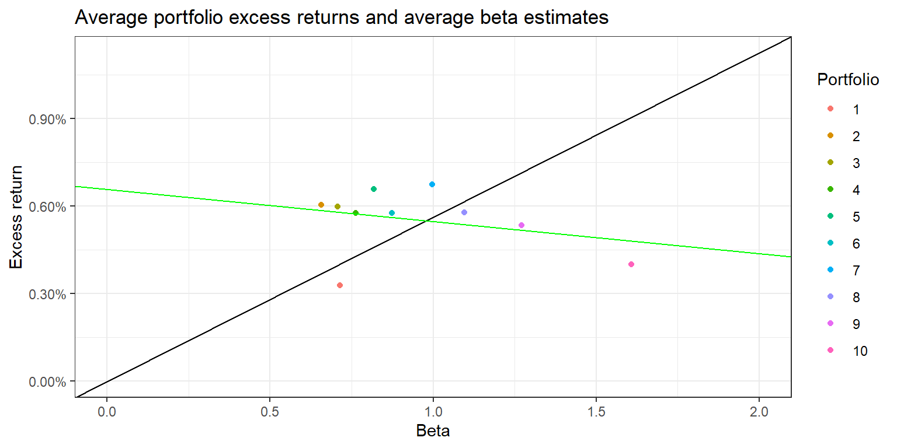

# Univariate Sorts


In this section, we start to dive into portfolio sorts - one of most widely used statistical methodologies in empirical asset pricing. The key application of portfolio analysis is to examine whether one or more variables are able to predict future excess returns. In general, the idea is to sort individual stocks into portfolios of stocks, where the stocks within each portfolio exhibit similar characteristics of a characteristic, such as firm size. The different portfolios then represent well-diversified investments that differ only in the level of the sorting variable. Differences in performance are then attributed to the sorting variable. 
We start by introducing univariate portfolio sorts (which means sorting based on only one characteristic), the most basic type of portfolio analysis. In the subsequent section we tackle bivariate sorting. 

A univariate portfolio sort considers only one sort variable $x_{t-1,i}$. Here, $i$ denotes the stock and $t-1$ indicates that the characteristic is known at point in time $t$.  
The objective is to asses the cross-sectional relation between $x_{t-1,i}$ and, typically, stock returns $r_{t,i}$ at time $t$ as the outcome variable. To illustrate how portfolio sorts work, we use estimates for market betas, which we computed in the previous section, as our sorting variable.

## Data preparation

The current section relies on the following set of packages. 

```r
library(tidyverse)
library(RSQLite)
library(lubridate)
library(sandwich)
library(lmtest)
library(scales)
```

We start with loading the required data from the database. In particular we use the monthly CRSP database as our asset universe. We use the Fama-French factor returns to compute the risk-adjusted performance (alpha) of the portfolios we create. `beta` is the tibble with asset betas, computed in the section before. 

```r
tidy_finance <- dbConnect(SQLite(), "data/tidy_finance.sqlite", extended_types = TRUE)

crsp_monthly <- tbl(tidy_finance, "crsp_monthly") %>% 
  collect() 

factors_ff_monthly <- tbl(tidy_finance, "factors_ff_monthly") %>% 
  collect()

beta <- tbl(tidy_finance, "beta") %>% 
  collect()
```
We keep only relevant data from the CRSP sample.

```r
crsp_monthly <- crsp_monthly %>% 
  left_join(factors_ff_monthly, by = "month") %>% 
  select(permno, month, ret_excess, mkt_excess, mktcap_lag)
crsp_monthly
```

```
## # A tibble: 3,225,253 x 5
##    permno month      ret_excess mkt_excess mktcap_lag
##     <dbl> <date>          <dbl>      <dbl>      <dbl>
##  1  10043 1989-06-01    -0.0071    -0.0135      31.0 
##  2  10000 1986-02-01    -0.262      0.0713      16.1 
##  3  10000 1986-03-01     0.359      0.0488      12.0 
##  4  10000 1986-04-01    -0.104     -0.0131      16.3 
##  5  10000 1986-05-01    -0.228      0.0462      15.2 
##  6  10000 1986-06-01    -0.0102     0.0103      11.8 
##  7  10000 1986-07-01    -0.0860    -0.0645      11.7 
##  8  10000 1986-08-01    -0.620      0.0607      10.8 
##  9  10000 1986-09-01    -0.0616    -0.086        4.15
## 10  10000 1986-10-01    -0.247      0.0466       3.91
## # ... with 3,225,243 more rows
```

## Simple sorts by market beta
Next, we want to add our sorting variable to the return data: estimated market betas. We actually want to use *lagged* betas as a sorting variable to ensure that we use information that is available when we form the portfolios and before the month where the return realizes. To lag stock beta by one month, we add one month to the current date and join the resulting information with our return data. This procedure ensures that month $t$ information is available in month $t+1$. (You may be tempted to simply use a call such as `crsp_monthly %>% group_by(permno) %>% mutate(beta_lag = lag(beta)))` instead. This procedure, however, does not work if there are non-explicit missing values in the time-series).

```r
beta_lag <- beta %>%
  mutate(month = month %m+% months(1)) %>% 
  select(permno, month, beta_lag = beta_daily) %>%
  drop_na()

data_beta <- crsp_monthly %>%
  inner_join(beta_lag, by = c("permno", "month"))
```
The first step of the portfolio analysis is to calculate periodic breakpoints that are used to group the stocks into portfolios. For simplicity, we start with using the median as the single breakpoint. We then compute the value-weighted returns in each of the two resulting portfolios using lagged market capitalizations as the weight.  

```r
beta_portfolios <- data_beta %>%
  group_by(month) %>%
  mutate(breakpoint = median(beta_lag),
         portfolio = case_when(beta_lag <= breakpoint ~ "low",
                               beta_lag > breakpoint ~ "high")) %>%
  group_by(month, portfolio) %>%
  summarize(ret = weighted.mean(ret_excess, mktcap_lag), .groups = "drop")
```
The following figure shows the monthly excess returns of the two portfolios. 

```r
beta_portfolios %>% 
  ggplot(aes(x = month, y = ret, fill = portfolio)) +
  geom_col() +
  facet_wrap(~portfolio, ncol = 1) +
  scale_y_continuous(labels = percent) + 
  labs(x = NULL, y = NULL, 
       title = "Monthly beta portfolio excess returns using median as breakpoint") +
  theme_bw() +
  theme(legend.position = "none")
```


Using the two portfolios, we can easily construct a long-short strategy: buy the high-beta portfolio and at the same time short the low-beta portfolio. 

```r
beta_longshort <- beta_portfolios %>%
  pivot_wider(month, names_from = portfolio, values_from = ret) %>%
  mutate(long_short = high - low) %>% 
  left_join(factors_ff_monthly, by = "month") 
```
To test whether the long-short portfolio yields on average positive or negative excess returns, we compute the average return and the corresponding standard error. In an academic context, one typically uses Newey-West (1987) $t$-statistics (using six lags) to test the null hypothesis of average portfolio excess returns being equal to zero. To implement this test, we compute the average return via `lm()` and then employ the `coeftest` function.

```r
fit <- lm(long_short ~ 1, data = beta_longshort)
coeftest(fit, vcov = NeweyWest, lag = 6)
```

```
## 
## t test of coefficients:
## 
##               Estimate Std. Error t value Pr(>|t|)
## (Intercept) -0.0001684  0.0010050 -0.1676    0.867
```
The results indicate that we cannot reject the null hypothesis of average returns being equal to zero. Our portfolio strategy using the median as a breakpoint hence does not yield any abnormal returns. Is this finding surprising if you reconsider the CAPM? It certainly is. The CAPM yields that the high beta stocks should yield higher expected returns. Our portfolio sort implicitly mimics an investment strategy that finances high beta stocks by shorting low beta stocks. One should therefore expect that the average excess returns yield a risk adjusted return that is above the risk-free rate.

## Functional programming for portfolio sorts

Let us take the portfolio construction to the next level. We now want to be able to sort stocks into an arbitrary number of portfolios. For this case, functional programming becomes very handy: we employ the [curly-curly](https://www.tidyverse.org/blog/2019/06/rlang-0-4-0/#a-simpler-interpolation-pattern-with-) operator to give us flexibility with respect to which variable to use for the sorting, denoted by `var`. We use `quantile()` to compute breakpoints for `n_portfolios`. We then assign portfolios to stocks using the `findInterval()` function. The output of the following function is hence a new column that contains the number of the portfolio in which a stock ends up.


```r
assign_portfolio <- function(data, var, n_portfolios) {
  # Calculate breakpoints
  breakpoints <- data %>%
    summarize(breakpoint = quantile({{ var }}, probs = seq(0, 1, length.out = n_portfolios + 1),
                                    na.rm = TRUE)) %>%
    pull(breakpoint) %>% 
    as.numeric()
  
  # Sort stocks into portfolios based on breakpoints
  data %>%
    mutate(portfolio = findInterval({{ var }}, breakpoints, all.inside = TRUE)) %>% 
    pull(portfolio)
}
```
We can use the above function to easily sort stocks into 10 portfolios each month using lagged betas and then again compute value-weighted returns for each portfolio. Note that we transform the portfolio column to a factor variable because it provides more convenience for the figure construction below.


```r
beta_portfolios <- data_beta %>%
  group_by(month) %>%
  mutate(portfolio = assign_portfolio(data = cur_data(), 
                                      var = beta_lag, 
                                      n_portfolios = 10),
         portfolio = as.factor(portfolio)) %>%
  group_by(portfolio, month) %>% 
  summarize(ret = weighted.mean(ret_excess, mktcap_lag), .groups = "drop")
```

## Performance evaluation

In the next step, we compute summary statistics for each beta portfolio. Namely, we compute CAPM-adjusted alphas, the beta of each beta portfolio, and average returns. 

```r
beta_portfolios_summary <- beta_portfolios %>%
  left_join(factors_ff_monthly, by = "month") %>%
  group_by(portfolio) %>%
  summarise(alpha = as.numeric(lm(ret ~ 1 + mkt_excess)$coefficients[1]),
            beta = as.numeric(lm(ret ~ 1 + mkt_excess)$coefficients[2]),
            ret = mean(ret))
```
The next figure illustrates the CAPM alphas of beta-sorted portfolios. It shows that low beta portfolios tend to exhibit positive alphas, while high beta portfolios exhibit negative alphas.

```r
beta_portfolios_summary %>% 
  ggplot(aes(x = portfolio, y = alpha, fill = portfolio)) +
  geom_bar(stat = "identity") +
  theme_bw() +
  labs(title = "Alphas of beta-sorted portfolios",
       x = "Portfolio",
       y = "CAPM Alpha",
       fill = "Portfolio") +
  theme_bw()
```


This results suggest a negative relation between beta and future stock returns, which contradicts the predictions of the CAPM. According to the CAPM, returns should increase with beta across the portfolios and risk-adjusted returns should be statistically indistinguishable from zero.

In fact, the CAPM predicts that our portfolios should lie on the security market line (SML). The slope of the SML is equal to the market risk premium and reflects the risk-return trade-off at any given time.

```r
sml_capm <- lm(ret ~ 1 + beta, data = beta_portfolios_summary)$coefficients 

beta_portfolios_summary %>% 
  ggplot(aes(x = beta, y = ret, color = portfolio)) +
  geom_point() +
  geom_abline(intercept = 0, slope = mean(factors_ff_monthly$mkt_excess)) +
  geom_abline(intercept = sml_capm[1], slope = sml_capm[2], color = "green") +
  scale_y_continuous(labels = percent, limit = c(0, mean(factors_ff_monthly$mkt_excess)*2)) +
  scale_x_continuous(limits = c(0,2)) +
  theme_bw() +
  labs(x = "Beta", y = "Excess return", color = "Portfolio",
       title = "Average portfolio excess returns and average beta estimates")
```


To provide more evidence against the CAPM predictions, we again form a long-short strategy that buys the high-beta portfolio and shorts the low-beta portfolio. 

```r
beta_longshort <- beta_portfolios %>%
  ungroup() %>%
  mutate(portfolio = case_when(portfolio == max(as.numeric(portfolio)) ~ "high",
                               portfolio == min(as.numeric(portfolio)) ~ "low")) %>% 
  filter(portfolio %in% c("low", "high")) %>%
  pivot_wider(month, names_from = portfolio, values_from = ret) %>%
  mutate(long_short = high - low) %>% 
  left_join(factors_ff_monthly, by = "month") 
```
Again, the resulting long-short strategy does not exhibit statistically significant returns. 

```r
coeftest(lm(long_short ~ 1, data = beta_longshort), vcov = NeweyWest)
```

```
## 
## t test of coefficients:
## 
##               Estimate Std. Error t value Pr(>|t|)
## (Intercept) 0.00072514 0.00248314   0.292   0.7704
```
However, the long-short portfolio yields a statistically significant negative CAPM-adjusted alpha although, controlling for the effect of beta, the average excess stock returns should be zero according to the CAPM. The results thus provide no evidence in support of the CAPM. The negative value has been documented as the so-called betting against beta factor. Betting-against-beta corresponds to a strategy that shorts high beta stocks and takes a (levered) long position in low beta stocks. If borrowing constraints prevent investors from taking positions on the security market line they are instead incentivized to buy high beta stocks which yields to a relative higher price (and therefore lower expected returns than implied by the CAPM) for such high beta stocks. As a result, the betting-against-beta strategy earns from providing liquidity to capital constraint investors with lower risk aversion. 

```r
coeftest(lm(long_short ~ 1 + mkt_excess, data = beta_longshort), vcov = NeweyWest)
```

```
## 
## t test of coefficients:
## 
##               Estimate Std. Error t value Pr(>|t|)    
## (Intercept) -0.0044182  0.0026187 -1.6872    0.092 .  
## mkt_excess   0.8937951  0.1021655  8.7485   <2e-16 ***
## ---
## Signif. codes:  0 '***' 0.001 '**' 0.01 '*' 0.05 '.' 0.1 ' ' 1
```
The last plot shows annual returns of the beta portfolios we are mainly interested in. The figure illustrates that there are no striking consistent patterns over the last years - each portfolio exhibits periods with positive as well as negative annual returns. 

```r
beta_longshort %>% 
  group_by(year = year(month)) %>% 
  summarize(low = prod(1 + low),
            high = prod(1 + high),
            long_short = prod(1 + long_short)) %>% 
  pivot_longer(cols = -year) %>% 
  ggplot(aes(x = year, y = 1 - value, fill = name)) +
  geom_col(position = "dodge") + 
  facet_wrap(~name, ncol = 1) +
  theme_bw() + theme(legend.position = "none") + 
  scale_y_continuous(labels = percent) + 
  labs(title = "Annual returns of beta portfolios",
       x = NULL, y = NULL)
```


Overall, this section shows how functional programming can be leveraged to form an arbitrary number of portfolios using any sorting variable and how to evaluate the performance of the resulting portfolios. In the next section, we dive deeper into the many degrees of freedom that arise in the context of portfolio analysis. 
