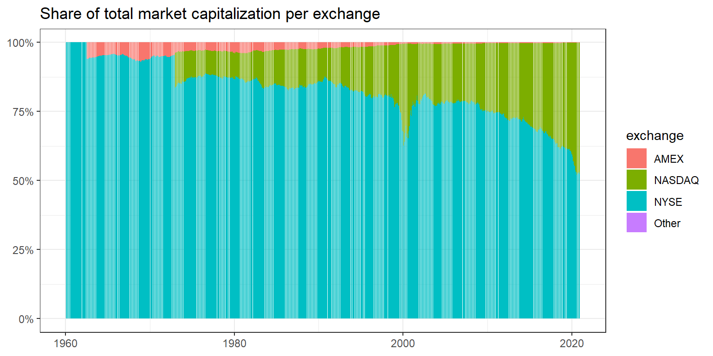

# Univariate Sorts: Firm Size


In this section, we continue with portfolio sorts in a univariate setting. Yet, we consider firm size as a sorting variable, which gives rise to a well-known return factor - the size premium. The size premium arises from buying small stocks and selling large stocks. Prominently, [@Fama1993] include it as a factor in their three-factor model - which we will describe later. Apart from that, asset managers commonly include size as a key firm characteristic when making investment decisions.

We also introduce new choices in the formation of portfolios. In particular, we discuss exchanges, industries, weighting regimes, and time periods. We will see that these choices matter for the portfolio returns and result in different size premiums. If anybody exploits these ideas, they will be p hacking. Hence, we want to emphasize that these alternative specifications are supposed to be robustness tests.

The current section relies on this set of packages. 

```r
library(tidyverse)
library(RSQLite)
library(lubridate)
library(sandwich)
library(lmtest)
library(scales)
library(furrr)
```

First, we need to load some data from our database. Firms size is equal to market equity in most asset pricing applications, which means we can compute it using the CRSP database known from previous chapters.

```r
tidy_finance <- dbConnect(SQLite(), "data/tidy_finance.sqlite", extended_types = TRUE)

crsp_monthly <- tbl(tidy_finance, "crsp_monthly") %>% 
  collect() 

factors_ff_monthly <- tbl(tidy_finance, "factors_ff_monthly") %>% 
  collect()
```

Before we start building our size portfolios, we investigate the distribution of the variable `firm size`. Visualizing the data is a valuable starting point for understanding the input to the analysis. The figure below shows the fraction of total market capitalization concentrated in the largest firm. To produce this graph, we create monthly indicators that track whether a stock belongs to the largest x% of the firms by setting the indicator's value to one. Then, we aggregate the firms within each bucket and compute the buckets share of total market capitalization. 

The figure shows that the largest 1% of firms cover up to 50% of the total market capitalization, and holding just the quarter consisting of the largest firms basically replicates the market portfolio. The size distribution means that the largest firms of the market dominate many small firms whenever we use value-weighted benchmarks.


```r
crsp_monthly %>%
  group_by(month) %>%
  mutate(top01 = if_else(mktcap >= quantile(mktcap, 0.99), 1L, 0L),
         top05 = if_else(mktcap >= quantile(mktcap, 0.95), 1L, 0L),
         top10 = if_else(mktcap >= quantile(mktcap, 0.90), 1L, 0L),
         top25 = if_else(mktcap >= quantile(mktcap, 0.75), 1L, 0L),
         total_market_cap = sum(mktcap)) %>%
  summarize(`Largest 1% of Stocks` = sum(mktcap[top01 == 1]) / total_market_cap,
            `Largest 5% of Stocks` = sum(mktcap[top05 == 1]) / total_market_cap,
            `Largest 10% of Stocks` = sum(mktcap[top10 == 1]) / total_market_cap,
            `Largest 25% of Stocks` = sum(mktcap[top25 == 1]) / total_market_cap) %>%
  pivot_longer(cols = -month) %>% 
  mutate(name = factor(name, levels = c("Largest 1% of Stocks", "Largest 5% of Stocks", 
                                        "Largest 10% of Stocks", "Largest 25% of Stocks"))) %>% 
  ggplot(aes(x = month, y = value, color = name)) +
  geom_line() +
  scale_y_continuous(labels = scales::percent, limits = c(0, 1)) + 
  labs(x = NULL, y = NULL, color = NULL,
       title = "Percentage of total market capitalization in largest stocks") +
  theme_bw()
```


Second, the issue of firm size is also relevant across exchanges. Stocks' primary listings were important in the past and are potentially still relevant today. The graph below shows that the New York Stock Exchange (`NYSE`) was and still is the largest exchange in terms of market capitalization. Nasdaq has gained size over time. Do you know what the small peak in Nasdaq's market cap around 2000 was about?


```r
crsp_monthly %>% 
  group_by(month, exchange) %>% 
  summarize(mktcap = sum(mktcap)) %>% 
  mutate(share = mktcap / sum(mktcap)) %>% 
  ggplot(aes(x = month, y = share, fill = exchange)) +
  geom_col() +
  theme_bw() +
  scale_y_continuous(labels = percent) + 
  labs(x = NULL, y = NULL,
       title = "Share of total market capitalization per exchange")
```



Finally, we consider the distribution of firm size across exchanges by creating summary statistics. Notice that the pre-build function `summary()` does not include all statistics we are interested in, which is why we create the function `create_summary()` that adds the standard deviation and the number of observations. Then, we apply it to the most current month of our CRSP data on each exchange. We also add a row with `add_row()` with the overall summary statistics.

The resulting table shows that firms listed on NYSE are significantly larger on average than firms listed on the other exchanges. Moreover, Nasdaq has the largest number of firms. This discrepancy between firm sizes across exchanges motivated researchers to form breakpoints exclusively on the NYSE sample and apply those breakpoints to all stocks. We will use this to update our portfolio building procedure.


```r
create_summary <- function(data, column_name) {
  data %>% 
    select(value = {{column_name}}) %>%
    summarize(mean = mean(value),
              sd = sd(value),
              min = min(value),
              q05 = quantile(value, 0.05),
              q25 = quantile(value, 0.25),
              q50 = quantile(value, 0.50),
              q75 = quantile(value, 0.75),
              q95 = quantile(value, 0.95),
              max = max(value),
              n = n())
  }

crsp_monthly %>%
  filter(month == max(month)) %>%
  group_by(exchange) %>% 
  create_summary(mktcap) %>%
  add_row(crsp_monthly %>%
            filter(month == max(month)) %>% 
            create_summary(mktcap) %>% 
            mutate(exchange = "Overall"))
```

```
## # A tibble: 5 x 11
##   exchange   mean     sd     min    q05    q25    q50    q75    q95    max     n
##   <chr>     <dbl>  <dbl>   <dbl>  <dbl>  <dbl>  <dbl>  <dbl>  <dbl>  <dbl> <int>
## 1 AMEX       281.  1294.  6.04e0 1.01e1 3.06e1 6.57e1   157.   530. 1.51e4   148
## 2 NASDAQ    8036. 74663.  4.65e0 2.46e1 1.30e2 4.73e2  2092. 19065. 2.26e6  2300
## 3 NYSE     16390. 43085.  5.35e0 1.54e2 9.10e2 3.33e3 11966. 74635. 4.14e5  1247
## 4 Other    10061.    NA   1.01e4 1.01e4 1.01e4 1.01e4 10061. 10061. 1.01e4     1
## 5 Overall  10545. 64142.  4.65e0 2.95e1 1.82e2 8.59e2  4168. 36811. 2.26e6  3696
```

## Univariate Size Portfolios

In the previous section, we constructed portfolios with a varying number of portfolios and different sorting variables. Here, we introduce the concept of computing breakpoints on a subset of exchanges. In published articles, many scholars compute their breakpoints only on NYSE-listed stocks. These NYSE-specific breakpoints are then applied to the entire universe of stocks. Therefore, we introduce `exchanges` as an argument in our `assign_portfolio()` function. The exchange-specific argument then enters in the filter `filter(grepl(exchanges, exchange))`. The function `grepl()` is part of a family of functions on *regular expressions*, which allow you to work with character strings in various ways. For our case, we replace the character string stored in the column `exchange` with a logical constant that indicates if the string matches the pattern specified in the argument `exchanges`. For example, if `exchanges = 'NYSE'` is specified, only stocks from NYSE are stored in breakpoints, which are used to compute the breakpoints. Alternatively, you could specify `exchanges = 'NYSE|NASDAQ|AMEX'`, which keeps all stocks listed on either of these exchanges. Overall, regular expressions are a very powerful tool, and we only touch on a specific case here.


```r
assign_portfolio <- function(n_portfolios, 
                                  exchanges, 
                                  data) {
  breakpoints <- data %>%
    filter(grepl(exchanges, exchange)) %>%
    summarize(breakpoint = quantile(
      mktcap_lag, 
      probs = seq(0, 1, length.out = n_portfolios + 1), 
      na.rm = TRUE)) %>%
    pull(breakpoint) %>% 
    as.numeric()
  
  data %>%
    mutate(portfolio = findInterval(mktcap_lag, breakpoints, all.inside = TRUE)) %>% 
    pull(portfolio)
}
```

Apart from computing breakpoints on different samples, researchers also often use different return weighting schemes. So far, we weighted each portfolio constituent by its relative market equity of the previous period. This protocol is called *value-weighting* and most projects rely on it. The alternative protocol is *equal-weighting*, which assigns each stock's return the same weight, i.e., a simple average of the constituents' returns. Notice that equal-weighting is difficult in practice as the portfolio manager needs to rebalance the portfolio monthly.

We implement the two weighting schemes in a new function `compute_portfolio_returns()` that takes a logical argument to weight the returns by firm value. It affects the `if_else(value_weighted, weighted.mean(ret_excess, mktcap_lag), mean(ret_excess))` line, which is value-weighted returns if the argument is `TRUE`. Additionally, the long-short portfolio is long in the smallest firms and short in the largest firms, in line with research showing that small firms outperform their larger counterparts. Apart from these two changes, the function is similar to the procedure in the previous section.


```r
compute_portfolio_returns <- function(n_portfolios = 10, 
                                      exchanges = "NYSE|NASDAQ|AMEX", 
                                      value_weighted = TRUE, 
                                      data = crsp_monthly) {
  
  data %>%
    group_by(month) %>%
    mutate(portfolio = assign_portfolio(n_portfolios = n_portfolios,
                                        exchanges = exchanges, 
                                        data = cur_data())) %>%
    group_by(month, portfolio) %>% 
    summarise(ret = if_else(value_weighted, weighted.mean(ret_excess, mktcap_lag), mean(ret_excess)),
              .groups = "drop_last") %>%
    summarise(size_premium = ret[portfolio == min(portfolio)] - ret[portfolio == max(portfolio)]) %>%
    summarise(size_premium = mean(size_premium))
}
```

To see how the function `compute_portfolio_returns()` works, we consider a simple median breakpoint example with value-weighted returns. We are then interested in seeing what difference the choice of exchanges makes for the portfolio returns. In the first function call, we compute returns based on breakpoints from all exchanges. Then, we check how breakpoints computed only from NYSE stocks change the returns.


```r
ret_all <- compute_portfolio_returns(n_portfolios = 2,
                          exchanges = "NYSE|NASDAQ|AMEX",
                          value_weighted = TRUE,
                          data = crsp_monthly)

ret_nyse <- compute_portfolio_returns(n_portfolios = 2,
                          exchanges = "NYSE",
                          value_weighted = TRUE,
                          data = crsp_monthly)

tibble(Exchanges = c("all", "NYSE"), Premium = as.numeric(c(ret_all, ret_nyse))*100)
```

```
## # A tibble: 2 x 2
##   Exchanges Premium
##   <chr>       <dbl>
## 1 all         0.110
## 2 NYSE        0.181
```

The table shows that the size premium is more than 60% larger if we consider only stocks from NYSE to form the breakpoint each month. The NYSE-specific breakpoints are larger, and there are more than 50% of the stocks in the entire universe in the resulting small portfolio because NYSE firms are larger on average. The impact of this choice is not negligible.  

## P hacking

Since the choice of the exchange had a significant impact, the next step is to investigate the effect of other choices. In particular, we consider the effects of the number of portfolios, the exchanges to form breakpoints, equal- and value-weighting, the inclusion of the finance industry, and dropping part of the time series. All of the variations of these choices that we discuss here are part of scholarly articles published in the top finance journals. 

The reason behind the exercise here is to show that the different ways to form portfolios result in different premiums. Despite the effects of this multitude of choices, there is no correct way. If a researcher was hunting for a significant result to publish, these different ways give them multiple chances at finding statistical significance. Yet this is considered *p-hacking* and it is important to highlight that p-hacking is considered scientific fraud. Moreover, the statistical inference from multiple testing is itself invalid.

Nevertheless, this creates a problem since there is no single correct way of sorting portfolios; how should a researcher convince a reader that their results do not come from a p-hacking exercise? To circumvent this dilemma, academics are encouraged to present evidence from different sorting schemes as *robustness tests* and report multiple approaches to show that a result does not depend on a single choice. The main point here is to show how different premiums can be and that robustness of premiums is a key feature. 

Below we conduct a series of robustness tests or a p-hacking exercise. We do so by examining the size premium in different specifications presented in the table `p_hacking_setup`. The function `expand_grid()` produces a table of all combinations of its arguments and makes it easier to create all of the combinations. Notice that we use the argument `data` to exclude financial firms and truncate the time series. Next, we again employ a parallelization approach introduced in a previous section. The resulting premiums are then tabulated in descending order.


```r
p_hacking_setup <- expand_grid(
  n_portfolios = c(2, 5, 10),
  exchanges = c("NYSE", "NYSE|NASDAQ|AMEX"),
  value_weighted = c(TRUE, FALSE),
  data = rlang::parse_exprs('crsp_monthly; crsp_monthly %>% filter(industry != "Finance");
                             crsp_monthly %>% filter(month < "1990-06-01");
                             crsp_monthly %>% filter(month >="1990-06-01")'))
p_hacking_setup
```

```
## # A tibble: 48 x 4
##    n_portfolios exchanges        value_weighted data      
##           <dbl> <chr>            <lgl>          <list>    
##  1            2 NYSE             TRUE           <sym>     
##  2            2 NYSE             TRUE           <language>
##  3            2 NYSE             TRUE           <language>
##  4            2 NYSE             TRUE           <language>
##  5            2 NYSE             FALSE          <sym>     
##  6            2 NYSE             FALSE          <language>
##  7            2 NYSE             FALSE          <language>
##  8            2 NYSE             FALSE          <language>
##  9            2 NYSE|NASDAQ|AMEX TRUE           <sym>     
## 10            2 NYSE|NASDAQ|AMEX TRUE           <language>
## # ... with 38 more rows
```

```r
plan(multisession, workers = availableCores())

p_hacking_setup <- p_hacking_setup %>% 
  mutate(size_premium = future_pmap(.l = list(n_portfolios,
                                       exchanges,
                                       value_weighted,
                                       data), 
                             .f = ~compute_portfolio_returns(n_portfolios = ..1,
                                                             exchanges = ..2,
                                                             value_weighted = ..3,
                                                             data = rlang::eval_tidy(..4))))
p_hacking_setup %>% 
  mutate(data = map_chr(data, deparse)) %>%
  unnest(size_premium) %>% 
  arrange(desc(size_premium))
```

```
## # A tibble: 48 x 5
##    n_portfolios exchanges        value_weighted data                size_premium
##           <dbl> <chr>            <lgl>          <chr>                      <dbl>
##  1           10 NYSE|NASDAQ|AMEX FALSE          "crsp_monthly %>% ~      0.0184 
##  2           10 NYSE|NASDAQ|AMEX FALSE          "crsp_monthly %>% ~      0.0180 
##  3           10 NYSE|NASDAQ|AMEX FALSE          "crsp_monthly"           0.0162 
##  4           10 NYSE|NASDAQ|AMEX FALSE          "crsp_monthly %>% ~      0.0139 
##  5           10 NYSE|NASDAQ|AMEX TRUE           "crsp_monthly %>% ~      0.0114 
##  6           10 NYSE|NASDAQ|AMEX TRUE           "crsp_monthly %>% ~      0.0109 
##  7           10 NYSE|NASDAQ|AMEX TRUE           "crsp_monthly"           0.0103 
##  8           10 NYSE|NASDAQ|AMEX TRUE           "crsp_monthly %>% ~      0.00964
##  9            5 NYSE|NASDAQ|AMEX FALSE          "crsp_monthly %>% ~      0.00914
## 10            5 NYSE|NASDAQ|AMEX FALSE          "crsp_monthly %>% ~      0.00883
## # ... with 38 more rows
```

Additionally, we provide a graph that shows the different premiums. This plot also shows the relation to the Fama-French SMB (small minus big) premium used in the literature. 


```r
p_hacking_setup %>% 
  mutate(data = map_chr(data, deparse)) %>%
  unnest(size_premium) %>% 
  ggplot(aes(x = size_premium*100)) + 
  geom_histogram(bins = 20) +
  labs(x = NULL, y = NULL, 
       title = "Size premium over different sorting choices",
       subtitle = "The dotted vertical line indicates the average size premium (in %)") + 
  geom_vline(aes(xintercept = mean(factors_ff_monthly$smb)*100),
             color = "red", 
             linetype = "dashed") +
  theme_bw()
```


