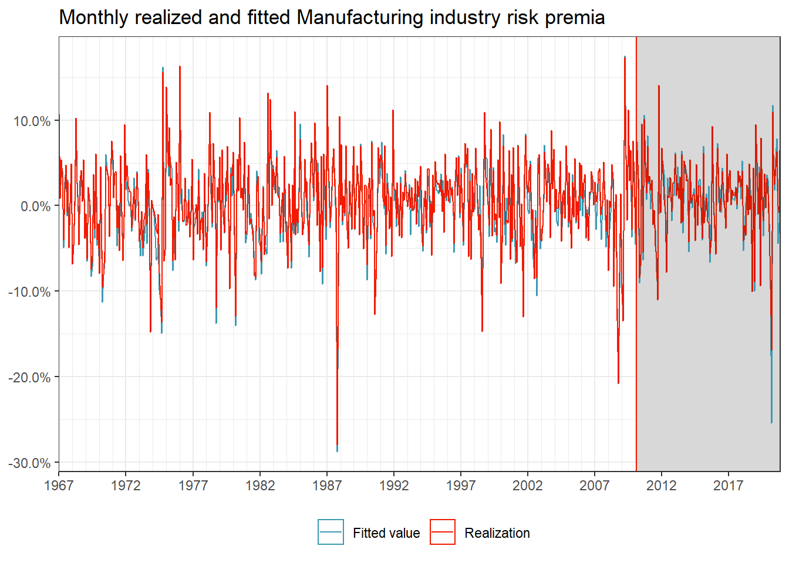
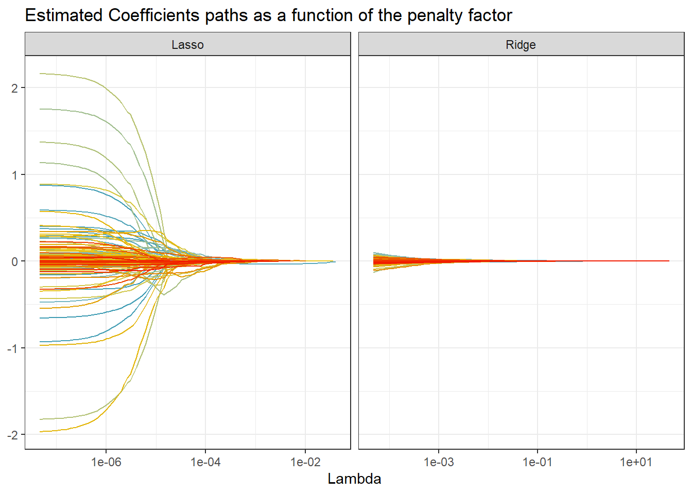
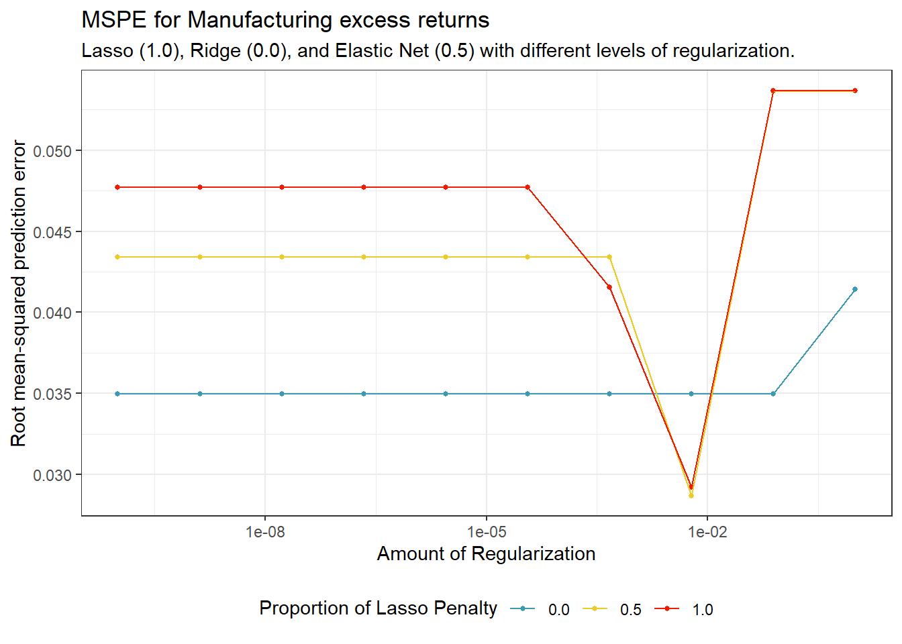
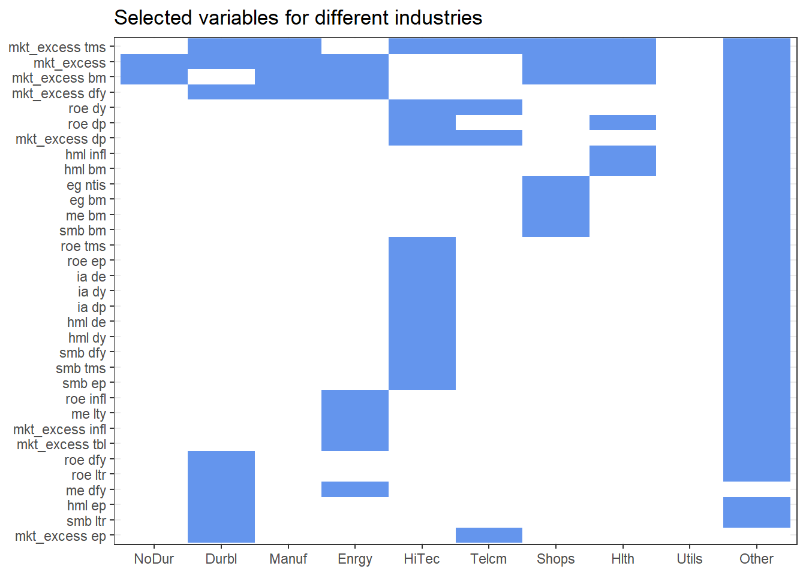

# (PART\*) Modeling & machine learning {.unnumbered}

# Factor selection via machine learning

The aim of this chapter is twofold. From a data science perspective, we introduce `tidymodels`, a collection of packages for modeling and machine learning (ML) using `tidyverse` principles. `tidymodels` comes with a handy workflow for all sorts of typical prediction tasks. From a finance perspective, we address the *factor zoo* @Cochrane2011. In previous chapters, we illustrate that stock characteristics such as size provide valuable pricing information in addition to the market beta. 
Such findings question the usefulness of the Capital Asset Pricing Model. 
In fact, during the last decades, financial economists "discovered" a plethora of additional factors which may be correlated with the marginal utility of consumption (and would thus deserve a prominent role for pricing applications). 
Therefore, given the multitude of proposed risk factors, the challenge these days rather is: *Do we believe in the relevance of 300+ risk factors?*. 

We introduce Lasso and Ridge regression as a special case of penalized regression models. Then, we explain the concept of cross-validation for model *tuning* with Elastic Net regularization as a popular example. We implement and showcase the entire cycle from model specification, training, and forecast evaluation within the `tidymodels` universe. While the tools can generally be applied to an abundance of interesting asset pricing problems, we apply penalized regressions to identify macro-economic variables and asset pricing factors that help explain a cross-section of industry portfolios.

## Brief theoretical background

This is a book about *doing* empirical work in a tidy manner and we refer to any of the many excellent textbook treatments of ML methods and especially penalized regressions for some deeper discussion [e.g., @Hastie2009]. Instead, we briefly summarize the idea of Lasso and Ridge regressions as well as the more general Elastic Net. Then, we turn to the fascinating question on *how* to implement, tune, and use such models with the `tidymodels` workflow. 

To set the stage, we start with the definition of a linear model: suppose we have data $(y_t, x_t), t = 1,\ldots, T$ where $x_t$ is a $(K \times 1)$ vector of regressors and $y_t$ is the response for observation $t$. 
The linear model takes the form $y_t = \beta' x_t + \varepsilon_t$ with some error term $\varepsilon_t$ and has been studied in abundance. The well-known ordinary-least square (OLS) estimator for the $(K \times 1)$ vector $\beta$ minimizes the sum of squared residuals and is then $$\hat{\beta}^\text{ols} = \left(\sum\limits_{t=1}^T x_t'x_t\right)^{-1} \sum\limits_{t=1}^T x_t'y_t.$$ 
While we are often interested in the estimated coefficient vector $\hat\beta^\text{ols}$, ML is about the predictive performance most of the time. For a new observation $\tilde{x}_t$, the linear model generates predictions such that $$\hat y_t = E\left(y|x_t = \tilde x_t\right) = {\hat\beta^\text{ols}}' \tilde x_t.$$ 
Is this the best we can do? 
Not really: Instead of minimizing the sum of squared residuals, penalized linear models can improve predictive performance by choosing other estimators $\hat{\beta}$ with lower variance than the estimator $\hat\beta^\text{ols}$. 
At the same time, it seems appealing to restrict the set of regressors to a few meaningful ones if possible. In other words, if $K$ is large (such as for the number of proposed factors in the asset pricing literature) it may be a desirable feature to *select* reasonable factors and set $\hat\beta_k = 0$ for some redundant factors. 

It should be clear that the promised benefits of penalized regressions come at a cost. In most cases, reducing the variance of the estimator introduces a bias such that $E\left(\hat\beta\right) \neq \beta$. What is the effect of such a bias-variance trade-off? To understand the implications, assume the following data-generating process for $y$: $$y = f(x) + \varepsilon, \quad \varepsilon \sim (0, \sigma_\varepsilon^2)$$ While the properties of $\hat\beta^\text{ols}$ as an unbiased estimator may be desirable under some circumstances, they are certainly not if we consider predictive accuracy. For instance, the mean-squared error (MSE) depends on our model choice as follow: $$\begin{aligned}
MSE &=E((y-\hat{f}(\textbf{x}))^2)=E((f(\textbf{x})+\epsilon-\hat{f}(\textbf{x}))^2)\\
&= \underbrace{E((f(\textbf{x})-\hat{f}(\textbf{x}))^2)}_{\text{total quadratic error}}+\underbrace{E(\epsilon^2)}_{\text{irreducible error}} \\
&= E\left(\hat{f}(\textbf{x})^2\right)+E\left(f(\textbf{x})^2\right)-2E\left(f(\textbf{x})\hat{f}(\textbf{x})\right)+\sigma_\varepsilon^2\\
&=E\left(\hat{f}(\textbf{x})^2\right)+f(\textbf{x})^2-2f(\textbf{x})E\left(\hat{f}(\textbf{x})\right)+\sigma_\varepsilon^2\\
&=\underbrace{\text{Var}\left(\hat{f}(\textbf{x})\right)}_{\text{variance of model}}+ \underbrace{E\left((f(\textbf{x})-\hat{f}(\textbf{x}))\right)^2}_{\text{squared bias}} +\sigma_\varepsilon^2. 
\end{aligned}$$ While no model can reduce $\sigma_\varepsilon^2$, a biased estimator with small variance may have a lower mean squared error than an unbiased estimator.

### Ridge regression

One biased estimator is known as Ridge regression. @Hoerl1970 propose to minimize the sum of squared errors *while simultaneously imposing a penalty on the $L_2$ norm of the parameters* $\hat\beta$. Formally, this means that for a penalty factor $\lambda\geq 0$ the minimization problem takes the form $\min_\beta \left(y - X\beta\right)'\left(y - X\beta\right)\text{ s.t. } \beta'\beta \leq \lambda$. Here, $X = \left(x_1  \ldots  x_T\right)'$ and $y = \left(y_1, \ldots, y_T\right)'$. A closed-form solution for the resulting regression coefficient vector $\beta^\text{ridge}$ exists: $$\hat{\beta}^\text{ridge} = \left(X'X + \lambda I\right)^{-1}X'y.$$ A couple of observations are worth noting: $\hat\beta^\text{ridge} = \hat\beta^\text{ols}$ for $\lambda = 0$ and $\hat\beta^\text{ridge} \rightarrow 0$ for $\lambda\rightarrow \infty$. Also for $\lambda > 0$, $\left(X'X + \lambda I\right)$ is non-singular even if $X'X$ is which means that $\hat\beta^\text{ridge}$ exists even if $\hat\beta$ is not defined. But note also that the Ridge estimator requires careful choice of the hyperparameter $\lambda$ which controls the *amount of regularization*.
Usually, $X$ contains an intercept column with ones. As a general rule, the associated intercept coefficient is not penalized. In practice, this often implies that $y$ is simply demeaned before computing $\hat\beta^\text{ridge}$.

What about the statistical properties of the Ridge estimator?  First, the bad news is that $\hat\beta^\text{ridge}$ is a biased estimator of $\beta$. However, the good news is that (under homoscedastic error terms) the variance of the Ridge estimator is *smaller* than the variance of the ordinary least square estimator. We encourage you to verify these two statements in the exercises. As a result, we face a trade-off: The Ridge regression sacrifices some bias to achieve a smaller variance than the OLS estimator.

### Lasso

An alternative to Ridge regression is the Lasso (*l*east *a*bsolute *s*hrinkage and *s*election *o*perator). Similar to Ridge regression, the Lasso [@Tibshirani1996] is a penalized and biased estimator. 
The main difference to Ridge regression is that Lasso does not only *shrink* coefficients but effectively selects variables by setting coefficients for *irrelevant* variables to zero. Lasso implements a $L_1$ penalization on the parameters such that: $$\hat\beta^\text{Lasso} = \arg\min_\beta \left(Y - X\beta\right)'\left(Y - X\beta\right) + \lambda\sum\limits_{k=1}^K|\beta_k|.$$ There is no closed form solution for $\hat\beta^\text{Lasso}$ in the above maximization problem but efficient algorithms exist (e.g., the R package `glmnet`). Like for Ridge regression, the hyperparameter $\lambda$ has to be specified beforehand.

### Elastic Net

The Elastic Net [@Zou2005] combines $L_1$ with $L_2$ penalization and encourages a grouping effect where strongly correlated predictors tend to be in or out of the model together. This more general framework considers the following optimization problem: $$\hat\beta^\text{EN} = \arg\min_\beta \left(Y - X\beta\right)'\left(Y - X\beta\right) + \lambda(1-\rho)\sum\limits_{k=1}^K|\beta_k| +\frac{1}{2}\lambda\rho\sum\limits_{k=1}^K\beta_k^2$$ Now, we have to chose two hyperparameters: the *shrinkage* factor $\lambda$ and the *weighting parameter* $\rho$. The Elastic Net resembles Lasso for $\rho = 1$ and Ridge regression for $\rho = 0$.
While the R package `glmnet` provides efficient algorithms to compute the coefficients of penalized regressions, it is a good exercise to implement Ridge and Lasso estimation on your own before you use the `glmnet` package or the `tidymodels` back-end.

## Data preparation

To get started, we load the required packages and data. The main focus is on the workflow behind the amazing `tidymodels` package collection. 

```r
library(RSQLite)
library(tidyverse)
library(tidymodels) 
library(furrr) 
library(glmnet)
library(broom)
library(timetk)
library(scales)
```

In this analysis, we use four different data sources. We start with two different sets of factor portfolio returns which have been suggested as representing practical risk factor exposure and thus should be relevant when it comes to asset pricing applications. 

-   The standard workhorse: monthly Fama-French 3 factor returns (market, small-minus-big, and high-minus-low book-to-market valuation sorts) defined in @Fama1992 and @Fama1993
-   Monthly q-factor returns from @Hou2015. The factors contain the size factor, the investment factor, the return-on-equity factor, and the expected growth factor

Next, we include macroeconomic predictors which may predict the general stock market economy. Macroeconomic variables effectively serve as conditioning information such that their inclusion hints at the relevance of conditional models instead of unconditional asset pricing. We refer the interested reader to @Cochrane2005 on the role of conditioning information.

- Our set of macroeconomic predictors comes from the paper "A Comprehensive Look at The Empirical Performance of Equity Premium Prediction" [@Goyal2008]. The data has been updated by the authors until 2020 and contains monthly variables that have been suggested as good predictors for the equity premium. Some of the variables are the Dividend Price Ratio, Earnings Price Ratio, Stock Variance, Net Equity Expansion, Treasury Bill rate and inflation

Finally, we need a set of *test assets*. The aim is to understand which of the plenty factors and macroeconomic variable combinations prove helpful in explaining our test assets' cross-section of returns. 

- In line with many existing papers, we use monthly portfolio returns from 10 different industries according to the definition from [Kenneth French's homepage](https://mba.tuck.dartmouth.edu/pages/faculty/ken.french/Data_Library/det_10_ind_port.html) as test assets.


```r
tidy_finance <- dbConnect(SQLite(), "data/tidy_finance.sqlite", extended_types = TRUE)

factors_ff_monthly <- tbl(tidy_finance, "factors_ff_monthly") %>%
  collect() %>%
  rename_with(~ paste0("factor_ff_", .), -month)

factors_q_monthly <- tbl(tidy_finance, "factors_q_monthly") %>%
  collect() %>%
  rename_with(~ paste0("factor_q_", .), -month)

macro_predictors <- tbl(tidy_finance, "macro_predictors") %>%
  collect() %>%
  rename_with(~ paste0("macro_", .), -month) %>%
  select(-macro_rp_div)

industries_ff_monthly <- tbl(tidy_finance, "industries_ff_monthly") %>%
  collect() %>%
  pivot_longer(-month, 
               names_to = "industry", values_to = "ret") %>%
  mutate(industry = as_factor(industry))
```

We combine all observations into one data frame.


```r
data <- industries_ff_monthly %>%
  left_join(factors_ff_monthly, by = "month") %>%
  left_join(factors_q_monthly, by = "month") %>%
  left_join(macro_predictors, by = "month") %>%
  mutate(
    ret = ret - factor_ff_rf
  ) %>% 
  select(month, industry, ret, everything()) %>%
  drop_na()
```

Our data contains 22 columns of regressors with the 13 macro variables and 8 factor returns for each month. 
The table below provides annualized summary statistics for the 10 industries such as the sample standard deviation and the minimum and maximum monthly excess returns in percent.


```r
data %>%
  group_by(industry) %>%
  mutate(ret = 100 * ret) %>%
  summarise(
    mean = mean(12 * ret),
    sd = sqrt(12) * sd(ret),
    min_monthly = min(ret),
    median = median(12 * ret),
    max_monthly = max(ret)
  )
```

```
## # A tibble: 10 x 6
##   industry  mean    sd min_monthly median max_monthly
##   <fct>    <dbl> <dbl>       <dbl>  <dbl>       <dbl>
## 1 NoDur     8.40  15.0       -21.6   9.24        18.3
## 2 Durbl     7.62  23.8       -33.0   6.48        45.3
## 3 Manuf     7.35  17.5       -28.0  10.9         17.3
## 4 Enrgy     6.60  20.8       -34.6   7.2         32.4
## 5 HiTec     8.19  22.6       -26.5   9.84        20.3
## # ... with 5 more rows
```

## The tidymodels workflow

To illustrate penalized linear regressions, we employ the `tidymodels` collection of packages for modeling and ML using `tidyverse` principles. You can simply use `install.packages("tidymodels")` to get access to all the related packages. We recommend checking out the work of Max Kuhn and Julia Silge: They  continuously write on the great book '[Tidy Modeling with R](https://www.tmwr.org/)' using tidy principles.

The `tidymodels` workflow encompasses the main stages of the modeling process: pre-processing of data, model fitting, and post-processing of results. As we demonstrate below, `tidymodels` provides efficient workflows that you can update with low effort.

Using the ideas of Ridge and Lasso regressions, the following example guides you through (i) pre-processing the data (data split and variable mutation), (ii) building models, (iii) fitting models, and (iv) tuning models to create the "best" possible predictions.

To start, we restrict our analysis to just one industry: Manufacturing. We first split the sample into a *training* and a *test* set. For that purpose, `tidymodels` provides the function `initial_time_split` from the `rsample` package. The split takes the last 20% of the data as a test set, which is not used for any model tuning. We use this test set to evaluate the predictive accuracy in an out-of-sample scenario.


```r
split <- initial_time_split(
  data %>%
    filter(industry == "Manuf") %>%
    select(-industry),
  prop = 4 / 5
)
split
```

```
## <Analysis/Assess/Total>
## <517/130/647>
```

The object `split` simply keeps track of the observations of the training and the test set. We can call the training set with `training(split)`, while we can extract the test set with `testing(split)`.

### Pre-process data

Recipes help you pre-process your data before training your model. Recipes are a series of pre-processing steps such as variable selection, transformation, or conversion of qualitative predictors to indicator variables. Each recipe starts with a `formula` that defines the general structure of the dataset and the role of each variable (regressor or dependent variable). For our dataset, our recipe contains the following steps before we fit any model:

-   Our formula defines that we want to explain excess returns with all available predictors.
-   We exclude the column *month* from the analysis.
-   We include all interaction terms between factors and macroeconomic predictors.
-   We demean and scale each regressor such that the standard deviation is one.


```r
rec <- recipe(ret ~ ., data = training(split)) %>%
  step_rm(month) %>% 
  step_interact(terms = ~ contains("factor"):contains("macro")) %>% 
  step_normalize(all_predictors()) %>%
  step_center(ret, skip = TRUE)
```

A table of all available recipe steps can be found [here](https://www.tidymodels.org/find/recipes/). As of 2022, more than 100 different processing steps are available! One important point: The definition of a recipe does not trigger any calculations yet but rather provides a *description* of the tasks to be applied. As a result, it is very easy to *reuse* recipes for different models and thus make sure that the outcomes are comparable as they are based on the same input. 
In the example above, it does not make a difference whether you use the input `data = training(split)` or `data = testing(split)`. 
All that matters at this early stage are the column names and types.

We can apply the recipe to any data with a suitable structure. The code below combines two different functions: `prep` estimates the required parameters from a training set that can be applied to other data sets later. `bake` applies the processed computations to new data.


```r
tmp_data <- bake(prep(rec, training(split)), new_data = testing(split))
tmp_data
```

```
## # A tibble: 130 x 126
##   factor_ff_rf factor_ff_mkt_excess factor_ff_smb factor_ff_hml factor_q_me
##          <dbl>                <dbl>         <dbl>         <dbl>       <dbl>
## 1        -1.92                0.644        0.298          0.947      0.371 
## 2        -1.88                1.27         0.387          0.607      0.527 
## 3        -1.88                0.341        1.43           0.836      1.12  
## 4        -1.88               -1.80        -0.0411        -0.963     -0.0921
## 5        -1.88               -1.29        -0.627         -1.73      -0.850 
## # ... with 125 more rows, and 121 more variables: factor_q_ia <dbl>,
## #   factor_q_roe <dbl>, factor_q_eg <dbl>, macro_dp <dbl>, macro_dy <dbl>,
## #   macro_ep <dbl>, macro_de <dbl>, macro_svar <dbl>, macro_bm <dbl>,
## #   macro_ntis <dbl>, macro_tbl <dbl>, macro_lty <dbl>, macro_ltr <dbl>,
## #   macro_tms <dbl>, macro_dfy <dbl>, macro_infl <dbl>, ret <dbl>,
## #   factor_ff_rf_x_macro_dp <dbl>, factor_ff_rf_x_macro_dy <dbl>,
## #   factor_ff_rf_x_macro_ep <dbl>, factor_ff_rf_x_macro_de <dbl>, ...
```

Note that the resulting data contains the 130 observations from the test set and 126 columns. Why so many? Recall that the recipe states to compute every possible interaction term between the factors and predictors, which increases the dimension of the data matrix substantially. 

You may ask at this stage: Why should I use a recipe instead of simply using the data wrangling commands such as `mutate` or `select`? `tidymodels` beauty is that a lot is happening under the hood. Recall, that for the simple scaling step you actually have to compute the standard deviation of each column, then *store* this value, and apply the identical transformation to a different dataset, e.g., `testing(split)`. A prepped `recipe` stores these values and hands them on once you `bake` a novel dataset. Easy as pie with `tidymodels`, isn't it?

### Build a model

Next, we can build an actual model based on our pre-processed data. In line with the definition above, we estimate regression coefficients of a Lasso regression such that we get 
$$\hat\beta_\lambda^\text{Lasso} = \arg\min_\beta \left(Y - X\beta\right)'\left(Y - X\beta\right) + \lambda\sum\limits_{k=1}^K|\beta_k|.$$ We want to emphasize that the `tidymodels` workflow for *any* model is very similar, irrespective of the specific model. As you will see further below, it is straightforward to fit Ridge regression coefficients and - later - Neural networks or Random forests with basically the same code. The structure is always as follows: create a so-called `workflow` and use the `fit` function. A table with all available model APIs is available [here](https://www.tidymodels.org/find/parsnip/).
For now, we start with the linear regression model with a given value for the penalty factor $\lambda$. In the setup below, `mixture` denotes the value of $\rho$, hence setting `mixture = 1` implies the Lasso.


```r
lm_model <- linear_reg(
  penalty = 0.0001,
  mixture = 1
) %>%
  set_engine("glmnet", intercept = FALSE)
```

That's it - we are done! The object `lm_model` contains the definition of our model with all required information. Note that `set_engine("glmnet")` indicates the API character of the `tidymodels` workflow: Under the hood, the package `glmnet` is doing the heavy lifting, while `linear_reg` provides a unified framework to collect the inputs. The `workflow`  ends with combining everything necessary for the (serious) data science workflow, namely, a recipe and a model.


```r
lm_fit <- workflow() %>%
  add_recipe(rec) %>%
  add_model(lm_model)
lm_fit
```

```
## == Workflow =====================================================================
## Preprocessor: Recipe
## Model: linear_reg()
## 
## -- Preprocessor -----------------------------------------------------------------
## 4 Recipe Steps
## 
## * step_rm()
## * step_interact()
## * step_normalize()
## * step_center()
## 
## -- Model ------------------------------------------------------------------------
## Linear Regression Model Specification (regression)
## 
## Main Arguments:
##   penalty = 1e-04
##   mixture = 1
## 
## Engine-Specific Arguments:
##   intercept = FALSE
## 
## Computational engine: glmnet
```

### Fit a model

With the `workflow` from above, we are ready to use `fit`. Typically, we use training data to fit the model. 
The training data is pre-processed according to our recipe steps, and the Lasso regression coefficients are computed. 
First, we focus on the predicted values $\hat{y}_t = x_t\hat\beta^\text{Lasso}.$ The figure below illustrates the projections for the *entire* time series of the Manufacturing industry portfolio returns. The grey area indicates the out-of-sample period, which we did not use to fit the model.


```r
predicted_values <- lm_fit %>%
  fit(data = training(split)) %>%
  predict(data %>% filter(industry == "Manuf")) %>%
  bind_cols(data %>% filter(industry == "Manuf")) %>%
  select(month, .pred, ret) %>%
  pivot_longer(-month, names_to = "Variable") %>%
  mutate(Variable = case_when(
    Variable == ".pred" ~ "Fitted value",
    Variable == "ret" ~ "Realization"
  )) 

predicted_values %>%
  ggplot(aes(x = month, y = value, color = Variable)) +
  geom_line() +
  labs(
    x = NULL,
    y = NULL,
    color = NULL,
    title = "Monthly realized and fitted Manufacturing industry risk premia"
  ) +
  scale_x_date(
    breaks = function(x) seq.Date(from = min(x), to = max(x), by = "5 years"),
    minor_breaks = function(x) seq.Date(from = min(x), to = max(x), by = "1 years"),
    expand = c(0, 0),
    labels = date_format("%Y")
  ) +
  scale_y_continuous(
    labels = percent
  ) +
  geom_rect(aes(
    xmin = testing(split) %>% pull(month) %>% min(),
    xmax = testing(split) %>% pull(month) %>% max(),
    ymin = -Inf, ymax = Inf
  ),
  alpha = 0.005
  )
```



What do the estimated coefficients look like? To analyze these values and to illustrate the difference between the `tidymodels` workflow and the underlying `glmnet` package, it is worth computing the coefficients $\hat\beta^\text{Lasso}$ directly. The code below estimates the coefficients for the Lasso and Ridge regression for the processed training data sample. Note that `glmnet` actually takes a vector `y` and the matrix of regressors $X$ as input. Moreover, `glmnet` requires choosing the penalty parameter $\alpha$, which corresponds to $\rho$ in the notation above. When using the `tidymodels` model API, such details do not need consideration.


```r
x <- tmp_data %>%
  select(-ret) %>%
  as.matrix()
y <- tmp_data %>% pull(ret)

fit_lasso <- glmnet(
  x = x,
  y = y,
  alpha = 1, intercept = FALSE, standardize = FALSE,
  lambda.min.ratio = 0
)

fit_ridge <- glmnet(
  x = x,
  y = y,
  alpha = 0, intercept = FALSE, standardize = FALSE,
  lambda.min.ratio = 0
)
```

The objects `fit_lasso` and `fit_ridge` contain an entire sequence of estimated coefficients for multiple values of the penalty factor $\lambda$. The figure below illustrates the trajectories of the regression coefficients as a function of the penalty factor. Both Lasso and Ridge coefficients converge to zero as the penalty factor increases.


```r
bind_rows(
  tidy(fit_lasso) %>% mutate(Model = "Lasso"),
  tidy(fit_ridge) %>% mutate(Model = "Ridge")
) %>%
  rename("Variable" = term) %>%
  ggplot(aes(x = lambda, y = estimate, color = Variable)) +
  geom_line() +
  scale_x_log10() +
  facet_wrap(~Model, scales = "free_x") +
  labs(
    x = "Lambda", y = NULL,
    title = "Estimated Coefficients paths as a function of the penalty factor"
  ) +
  theme(legend.position = "none")
```



::: {.rmdnote}
One word of caution: The package `glmnet` computes estimates of the coefficients $\hat\beta$ based on numerical optimization procedures. 
As a result, the estimated coefficients for the [special case](https://parsnip.tidymodels.org/reference/glmnet-details.html) with no regularization ($\lambda = 0$) can deviate from the standard OLS estimates.
:::

### Tune a model

To compute $\hat\beta_\lambda^\text{Lasso}$ , we simply imposed a value for the penalty hyperparameter $\lambda$. Model tuning is the process of optimally selecting such hyperparameters. `tidymodels` provides extensive tuning options based on so-called *cross-validation*. Again, we refer to any treatment of cross-validation to get a more detailed  discussion of the statistical underpinnings. Here we focus on the general idea and the implementation with `tidymodels`. 

The goal for choosing $\lambda$ (or any other hyperparameter, e.g., $\rho$) is to find a way to produce predictors $\hat{Y}$ for an outcome $Y$ that minimizes the mean squared prediction error $\text{MSPE} = E\left( \frac{1}{T}\sum_{t=1}^T (\hat{y}_t - y_t)^2 \right)$. Unfortunately, the MSPE is not directly observable. We can only compute an estimate because our data is random and because we do not observe the entire population.

Obviously, if we train an algorithm on the same data that we use to compute the error, our estimate $\hat{\text{MSPE}}$ would indicate way better predictive accuracy than what we can expect in a real out-of-sample data. The result is called overfitting.

Cross-validation is a technique that allows us to alleviate this problem. We approximate the true MSPE as the average of many mean squared prediction errors obtained by creating predictions for $K$ new random samples of the data, none of them used to train the algorithm $\frac{1}{K} \sum_{k=1}^K \frac{1}{T}\sum_{t=1}^T \left(\hat{y}_t^k - y_t^k\right)^2$. In practice, this is done by carving out a piece of our data and pretending it is an independent sample. We again divide the data into a training set and a test set. The MSPE on the test set is our measure for actual predictive ability, while we use the training set to fit models with the aim to find the *optimal* hyperparameter values. To do so, we further divide our training sample into (several) subsets, fit our model for a grid of potential hyperparameter values (e.g., $\lambda$), and evaluate the predictive accuracy on an *independent* sample. This works as follows:

1.  Specify a grid of hyperparameters.
2.  Obtain predictors $\hat{y}_i(\lambda)$ to denote the predictors for the used parameters $\lambda$.
3.  Compute $$
    \text{MSPE}(\lambda) = \frac{1}{K} \sum_{k=1}^K \frac{1}{T}\sum_{t=1}^T \left(\hat{y}_t^k(\lambda) - y_t^k\right)^2 
    $$ With K-fold cross validation, we do this computation $K$ times. Simply pick a validation set with $M=T/K$ observations at random and think of these as random samples $y_1^k, \dots, y_\tilde{T}^k$, with $k=1$.

How should you pick $K$? Large values of $K$ are preferable because the training data better imitates the original data. However, larger values of $K$ will have much higher computation time.
`tidymodels` provides all required tools to conduct $K$-fold cross-validation. We just have to update our model specification and let `tidymodels` know which parameters to tune. In our case, we specify the penalty factor $\lambda$ as well as the mixing factor $\rho$ as *free* parameters. Note that it is simple to change an existing `workflow` with `update_model`. 


```r
lm_model <- linear_reg(
  penalty = tune(),
  mixture = tune()
) %>%
  set_engine("glmnet")

lm_fit <- lm_fit %>%
  update_model(lm_model)
```

For our sample, we consider a time-series cross-validation sample. This means that we tune our models with 20 random samples of length five years with a validation period of four years. For a grid of possible hyperparameters, we then fit the model for each fold and evaluate $\hat{\text{MSPE}}$ in the corresponding validation set. Finally, we select the model specification with the lowest MSPE in the validation set. First, we define the cross-validation folds based on our training data only.


```r
data_folds <- time_series_cv(
  data        = training(split),
  date_var    = month,
  initial     = "5 years",
  assess      = "48 months",
  cumulative  = FALSE,
  slice_limit = 20
)
```

Then, we evaluate the performance for a grid of different penalty values. `tidymodels` provides functionalities to construct a suitable grid of hyperparameters with `grid_regular`. The code chunk below creates a $10 \times 3$ hyperparameters grid. Then, the function `tune_grid` evaluates all the models for each fold.


```r
lm_tune <- lm_fit %>%
  tune_grid(
    resample = data_folds,
    grid = grid_regular(penalty(), mixture(), levels = c(10, 3)),
    metrics = metric_set(rmse)
  )
```

After the tuning process, we collect the evaluation metrics (the root mean-squared error in our example) to identify the *optimal* model. The figure illustrates the average validation set's root mean-squared error for each value of $\lambda$ and $\rho$.


```r
autoplot(lm_tune) +
  labs(y = "Root mean-squared prediction error",
       title = "MSPE for Manufacturing excess returns",
       subtitle = "Lasso (1.0), Ridge (0.0), and Elastic Net (0.5) with different levels of regularization.")
```



  The figure shows that the cross-validated mean squared prediction error drops for Lasso and Elastic Net and spikes afterwards. For Ridge regression, the MSPE increases above a certain threshold. Recall that the larger the regularization, the more restricted the model becomes. Thus, we would choose the model with the lowest MSPE, which exhibits some intermediate level of regularization.

### Parallelized workflow

Our starting point was the question: Which factors determine industry returns? To illustrate the entire workflow, we now run the penalized regressions for all ten industries. We want to identify relevant variables by fitting Lasso models for each industry returns time series. More specifically, we perform cross-validation for each industry to identify the optimal penalty factor $\lambda$. Then, we use the set of `finalize_*`-functions that take a list or tibble of tuning parameter values and update objects with those values. After determining the best model, we compute the final fit on the entire training set and analyze the estimated coefficients.

First, we define the Lasso model with one tuning parameter.


```r
lasso_model <- linear_reg(
  penalty = tune(),
  mixture = 1
) %>%
  set_engine("glmnet")

lm_fit <- lm_fit %>%
  update_model(lasso_model)
```

The following task can be easily parallelized to reduce computing time substantially. We use the parallelization capabilities of `furrr`. Note that we can also just recycle all the steps from above and collect them in a function.


```r
select_variables <- function(input) {
  # Split into training and testing data
  split <- initial_time_split(input, prop = 4 / 5)

  # Data folds for cross-validation
  data_folds <- time_series_cv(
    data = training(split),
    date_var = month,
    initial = "5 years",
    assess = "48 months",
    cumulative = FALSE,
    slice_limit = 20
  )

  # Model tuning with the Lasso model
  lm_tune <- lm_fit %>%
    tune_grid(
      resample = data_folds,
      grid = grid_regular(penalty(), levels = c(10)),
      metrics = metric_set(rmse)
    )

  # Finalizing: Identify the best model and fit with the training data
  lasso_lowest_rmse <- lm_tune %>% select_by_one_std_err("rmse")
  lasso_final <- finalize_workflow(lm_fit, lasso_lowest_rmse)
  lasso_final_fit <- last_fit(lasso_final, split, metrics = metric_set(rmse))

  # Extract the estimated coefficients
  lasso_final_fit %>%
    extract_fit_parsnip() %>%
    tidy() %>%
    mutate(
      term = gsub("factor_|macro_|industry_", "", term)
    )
}

# Parallelization
plan(multisession, workers = availableCores()) 

# Computation by industry
selected_factors <- data %>%
  nest(data = -industry) %>% 
  mutate(selected_variables = future_map(data, select_variables,
    .options = furrr_options(seed = TRUE)
  ))
```

What has just happened? In principle, exactly the same as before but instead of computing the Lasso coefficients for one industry, we did it for ten in parallel. The final option `seed = TRUE`  is required to make the cross-validation process reproducible. 
Now, we just have to do some housekeeping and keep only variables that Lasso does *not* set to zero. We illustrate the results in a heat map.


```r
selected_factors %>%
  unnest(selected_variables) %>%
  filter(
    term != "(Intercept)",
    estimate != 0
  ) %>%
  add_count(term) %>%
  mutate(
    term = gsub("NA|ff_|q_", "", term),
    term = gsub("_x_", " ", term),
    term = fct_reorder(as_factor(term), n),
    term = fct_lump_min(term, min = 2),
    selected = 1
  ) %>%
  filter(term != "Other") %>%
  mutate(term = fct_drop(term)) %>%
  complete(industry, term, fill = list(selected = 0)) %>%
  ggplot(aes(industry,
    term,
    fill = as_factor(selected)
  )) +
  geom_tile() +
  scale_fill_manual(values = c("white", "cornflowerblue")) +
  theme(legend.position = "None") +
  labs(
    x = NULL, y = NULL,
    title = "Selected variables for different industries"
  )
```



The heat map conveys two main insights. First, we see a lot of white, which means that many factors, macroeconomic variables, and interaction terms are not relevant for explaining the cross-section of returns across the industry portfolios. In fact, only the market factor and the return-on-equity factor play a role for several industries. Second, there seems to be quite some heterogeneity across different industries. While not even the market factor is selected by Lasso for Utilities (which means the proposed model essentially just contains an intercept), many factors are selected for, e.g., High-Tech and Energy, but they do not coincide at all. In other words, there seems to be a clear picture that we do not need many factors, but Lasso does not provide conses across industries when it comes to pricing abilities.

## Exercises 

1. Write a function that requires three inputs, namely, `y` (a $T$ vector), `X` (a $(T \times K)$ matrix), and `lambda` and then returns the **Ridge** estimator (a $K$ vector) for a given penalization parameter $\lambda$. Recall that the intercept should not be penalized. Therefore, your function should indicate whether $X$ contains a vector of ones as the first column, which should be exempt from the $L_2$ penalty.
1. Compute the $L_2$ norm ($\beta'\beta$) for the regression coefficients based on the predictive regression from the previous exercise for a range of $\lambda$'s and illustrate the effect of penalization in a suitable figure.
1. Now, write a function that requires three inputs, namely,`y` (a $T$ vector), `X` (a $(T \times K)$ matrix), and 'lambda` and then returns the **Lasso** estimator (a $K$ vector) for a given penalization parameter $\lambda$. Recall that the intercept should not be penalized. Therefore, your function should indicate whether $X$ contains a vector of ones as the first column, which should be exempt from the $L_1$ penalty.
1. After you understand what Ridge and Lasso regressions are doing, familiarize yourself with the `glmnet()` package's documentation. It is a thoroughly tested and well-established package that provides efficient code to compute the penalized regression coefficients for Ridge and Lasso and for combinations, commonly called *Elastic Nets*.  
