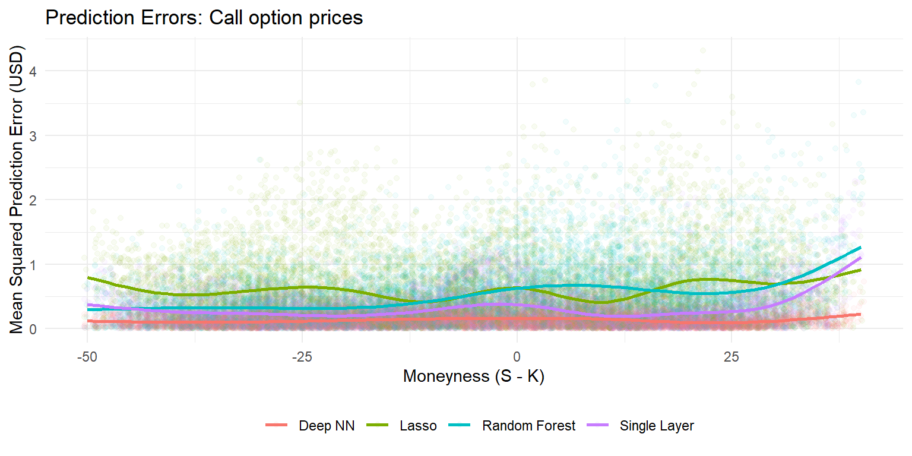

# Option Pricing via Machine learning methods


Machine learning is seen as a part of artificial intelligence. 
Machine learning algorithms build a model based on training data in order to make predictions or decisions without being explicitly programmed to do so.
While Machine learning can be specified along a vast array of different branches, this chapter focuses on so-called supervised learning for regressions. The basic idea of supervised learning algorithms is to build a mathematical model for data that contains both the inputs and the desired outputs. In this chapter, we apply well-known methods such as random forests and neural networks to a simple application in Option pricing. More specifically, we are going to create an artificial dataset of option prices for different values based on the Black-Scholes pricing equation for Call options. Then, we train different models to *learn* how to price Call options without prior knowledge of the theoretical underpinnings of the famous Option pricing equation. 

The roadmap is as follows: We first provide a very brief introduction into regression trees, random forests and neural networks. As the focus is on implementation, we leave a thorough treatment of the statistical underpinnings to other textbooks from authors with a real comparative advantage on these issues.
We show how to implement random forests and deep neural networks with tidy principles using `tidymodels` or `tensorflow` for more complicated network structures. 

::: {.rmdnote}
In order to replicate the analysis regarding neural networks in this chapter, you have to install `TensorFlow` on your system which requires administrator rights on your machine. Parts of this can be done from within R, just follow [these quick start instructions](https://tensorflow.rstudio.com/installation/).
:::

Throughout this chapter we need the following packages.

```r
library(tidyverse)
library(tidymodels)
library(keras)
library(hardhat)
```

## Regression trees and random forests

Regression trees have become a popular machine learning approach for incorporating multiway predictor interactions. Trees are fully nonparametric and possess a logic that departs markedly from traditional regressions. Trees are designed to find groups of observations that behave similarly to each. A tree “grows” in a sequence of steps. At each step, a new “branch” sorts the data which is left over from the preceding step into bins based on one of the predictor variables. This sequential branching slices the space of predictors into rectangular partitions, and approximates the unknown function $f(x)$ with the average value of the outcome variable within each partition

We partition the  predictor space into $J$ non-overlapping regions, $R_1, R_2, \ldots, R_J$. For any predictor $x$ that falls within region $R_j$ we estimate $f(x)$ with the average of the training observations, $\hat y_i$, for which the associated predictor $x_i$ is also in $R_j$. Once we select a partition $\mathbf{x}$ to split in order to create the new partitions, we find a predictor $j$ and value $s$ that define two new partitions, which we will call $R_1(j,s)$ and $R_2(j,s)$, that split our observations in the current partition by asking if $x_j$ is bigger than $s$:
$$
R_1(j,s) = \{\mathbf{x} \mid x_j < s\} \mbox{  and  } R_2(j,s) = \{\mathbf{x} \mid x_j \geq s\}
$$
To pick $j$ and $s$ we find the pair that minimizes the residual sum of square (RSS):
$$
\sum_{i:\, x_i \in R_1(j,s)} (y_i - \hat{y}_{R_1})^2 +
\sum_{i:\, x_i \in R_2(j,s)} (y_i - \hat{y}_{R_2})^2
$$
Note: Unlike for the sample variance, we don't scale by the number of elements $R_k(j, s)$! As in the chapter on penalized regressions, the first relevant question to ask is: What are the hyperparameters decisions? Instead of a regularization parameter, trees are fully determined by the number branches used to generate the partition (sometimes one specifies the minimum number of observations in each final branch instead of the maximum number of branches).

Single tree models suffer from high variance. Random forests address the shortcomings of decision trees. The goal is to improve prediction performance and reduce instability by averaging multiple decision trees (a forest of trees constructed with randomness). A forest basically implies to create many regression trees and average their predictions. To assure that the individual trees are not the same, we use the bootstrap to induce randomness. More specifically, we build $B$ decision trees $T_1, \ldots, T_B$ using the training sample. For that purpose we randomly select features to be included in the building of each tree. For each observation in the test set we then form a prediction $\hat{y} = \frac{1}{B}\sum\limits_{i=1}^B\hat{y}_{T_i}$.

## Neural Networks

Roughly speaking, neural networks propagate information from an input layer, through one or multiple hidden layers, to an output layer. While the number of units (neurons) in the input layer is equal to the dimension of the predictors, the output layer usually consists of one neuron (for regression) or multiple neurons for classification. The output layer predicts the future data, similar to the fitted value in a regression analysis. Neural networks have theoretical underpinnings as “universal approximators” for any smooth predictive association [@Hornik1991]. Their complexity, however, ranks neural networks among the least transparent, least interpretable, and most highly parameterized machine learning tools

Each neuron applies a nonlinear “activation function” $f$ to its aggregated signal before
sending its output to the next layer
$$x_k^l = f\left(\theta^k_{0} + \sum\limits_{j = 1}^{N ^l}z_j\theta_{l,j}^k\right)$$
While the easiest case where $f(x) = \alpha + \beta x$ resembles linear regression, typical activation functions are sigmoid ($f(x) = (1+e^{-x})^{-1}$) or ReLu ($f(x) = max(x, 0)$) 

Neural networks gain there flexibility form chaining multiple layers together. Naturally, this imposes a large number of degrees of freedom on the network architecture for which no clear theoretical guidance exist. The specification of a neural network requires, at a minimum, a stancen on depth (number of hidden layers), the activation function, the number of neurons, the
connection structure of the units (dense or sparse), and the application of regularization techniques to avoid overfitting. Finally, *learning* means to choose optimal parameters relys on numerical optimization which often requires to specify an appropriate learning
rate. 

Despite the computational challenges, implementation in R is not tedious at all because we
can use the API to `tensorflow`. 

## Option Pricing

To apply Machine Learning methods in a relevant field of finance we focus on option pricing. In its most basic form, Call options give the owner the right but not the obligation to buy a specific stock (the underlying) at a specific price (the strike price $K$) at a specific date (the exercise date $T$). The Black–Scholes price ([Black1971]) of a call option for a non-dividend-paying underlying stock is given by
$$
\begin{aligned}
  C(S, T) &= \Phi(d_1)S - \Phi(d_1 - \sigma\sqrt{T})Ke^{-r T} \\
     d_1 &= \frac{1}{\sigma\sqrt{T}}\left[\ln\left(\frac{S}{K}\right) + \left(r_f + \frac{\sigma^2}{2}\right)T\right]
\end{aligned}
$$
where $C(S, T)$ is the price of the option as a function of today's stock price of the underlying, $S$, with time to maturity$T$, $r_f$ is the risk-free interest rate, and $\sigma$ is the volatility of the underlying stock return. $\Phi$ is the cumulative distribution function of a standard normal random variable.

The Black-Scholes equation provides an easy way to compute the arbitrage-free price of a Call option once the parameters $S, K, r_f, T$ and $\sigma$ are specified (arguably, all parameters are easily to specify except for $\sigma$ which has to be estimated). A simple `R` function allows to compute the price as we do below. 

```r
black_scholes_price <- function(S = 50, K = 70, r = 0, T = 1, sigma = 0.2) {
  # Arbitrage-free price of a Call option
  d1 <- (log(S / K) + (r + sigma^2 / 2) * T) / (sigma * sqrt(T))
  value <- S * pnorm(d1) - K * exp(-r * T) * pnorm(d1 - sigma * sqrt(T))
  return(value)
}
```

## Learning Black-Scholes

We illustrate the concept of machine learning by showing how machine learning methods *learn* the Black-Scholes equation after observing some different specifications and corresponding prices without us revealing the exact pricing equation. 

### Data simulation
To that end we start with simulated data. We compute option prices for Call options for a grid of different combinations of times to maturity (`T`), risk-free rate (`r`), volatility (`sigma`), strike prices (`K`) and current stock prices (`S`). In the code below we add an idiosyncratic error term to each observation such that the prices which are considered observed do not exactly reflect the values implied by the Black-Scholes equation.


```r
option_prices <- expand_grid(
  S = 40:60, # stock price
  K = 20:90, # strike price
  r = seq(from = 0, to = 0.05, by = 0.01), # risk-free rate
  T = seq(from = 3 / 12, to = 2, by = 1 / 12), # Time to maturity
  sigma = seq(from = 0.1, to = 0.8, by = 0.1)
) %>%   mutate(
    black_scholes = black_scholes_price(S, K, r, T, sigma), # Option price in theory
    observed_price = map(black_scholes, function(x) x + rnorm(2, sd = 0.15))
  ) %>% # Add some random deviations to each option price
  unnest(observed_price)
```

The code above generates 1.574496\times 10^{6} random parameter constellations and for each of these values two *observed* prices which reflect the Black-Scholes prices and a random innovation term which *pollutes* the observed prices. 

Next, we split the data into a training set (which contains 1\% of all the observed option prices) and a test set which is only going to be used for the final evaluation. Note that the entire grid of possible combinations contains 3148992 different specifications, thus the sample to learn the Black-Scholes price contains only 3.1489\times 10^{4} and therefore is relatively small.
In order to keep the analysis reproducible, we use `set.seed()`. A random seed specifies the start point when a computer generates a random number sequence and ensures that our simulated data is the same across different machines. 


```r
set.seed(42809) # Ensure the analysis can be reproduced
split <- initial_split(option_prices, prop = 1 / 100)
```

We process the training dataset further before we fit the different Machine learning models. For that purpose we define a `recipe` which defines all processing steps. For our specific case we want to explain the observed price by the 5 variables that enter the Black-Scholes equation. The *true* price should obviously not be used to fit the model. The recipe also reflect that we standardize all predictors to ensure that each variable exhibits a sample average of zero and a sample standard deviation of one.  

```r
rec <- recipe(observed_price ~ .,
  data = option_prices
) %>%
  step_rm(black_scholes) %>% # Exclude the true price
  step_normalize(all_predictors())
```

Next, we propose two ways to fit a neural network to the data. Note that both require that `keras` is installed on your local machine. The function `mlp` from the package `parsnip` provides the functionality to initialize a single layer, feed-forward neural network. The specification below defines a single layer feed-forward neural network with 20 hidden units. We set the number of training iterations to `epochs = 75`. The option `set_mode("regression")` specifies a linear activation function for the output layer. 

### Random forests and single layer networks

```r
# Single layer neural network
nnet_model <- mlp(
  epochs = 75,
  hidden_units = 20
) %>%
  set_mode("regression") %>%
  set_engine("keras", verbose = 0) # `verbose=0` argument prevents logging the results
```

We can follow the straightforward `tidymodel` workflow as in the chapter before: Define a workflow, equip it with the recipe and the associated model. Finally, fit the model with the training data. 

```r
nn_fit <- workflow() %>%
  add_recipe(rec) %>%
  add_model(nnet_model) %>%
  fit(data = training(split))
```

Once you are familiar the `tidymodel` workflow, it is a piece of cake to fit other models from the `parsnip` family. For instance, the model below initializes a random forest with 50 trees contained in the ensemble where we require at least 20 observations in a node. 


```r
rf_model <- rand_forest(
  trees = 50,
  min_n = 20
) %>%
  set_engine("ranger") %>%
  set_mode("regression")
```

Fitting the model follows exactly the same convention as for the neural network before.

```r
rf_fit <- workflow() %>%
  add_recipe(rec) %>%
  add_model(rf_model) %>%
  fit(data = training(split))
```

### Deep neural networks
Note that while the `tidymodels` workflow is extremely convenient, more sophisticated *deep* neural networks are not supported yet (as of January 2022). For that reason, the code snippet below illustrates how to initialize a sequential model with 3 hidden layers with 20 units per layer. The `keras` package provides a convenient interface and is flexible enough to handle different activation functions. The `compile` command defines the loss function with which the model predictions are evaluated. 


```r
model <- keras_model_sequential() %>%
  layer_dense(units = 20, activation = "sigmoid", input_shape = 5) %>%
  layer_dense(units = 20, activation = "sigmoid") %>%
  layer_dense(units = 20, activation = "sigmoid") %>%
  layer_dense(units = 1, activation = "linear") %>%
  compile(
    loss = "mean_absolute_error"
  )
model
```

```
## Model
## Model: "sequential_1"
## ________________________________________________________________________________
## Layer (type)                        Output Shape                    Param #     
## ================================================================================
## dense_5 (Dense)                     (None, 20)                      120         
## ________________________________________________________________________________
## dense_4 (Dense)                     (None, 20)                      420         
## ________________________________________________________________________________
## dense_3 (Dense)                     (None, 20)                      420         
## ________________________________________________________________________________
## dense_2 (Dense)                     (None, 1)                       21          
## ================================================================================
## Total params: 981
## Trainable params: 981
## Non-trainable params: 0
## ________________________________________________________________________________
```

To train the neural network, we simply provide the inputs (`x`) and the variable to predict (`y`) and then fit the parameters. Note the slightly tedious use of the method `extract_mold(nn_fit)`: instead of simply using the **raw** data, we fit the neural network with the same processed data that is used for the single-layer feed-forward network. What is the difference to simply calling `x = training(data) %>% select(-observed_price, -black_scholes)`? Recall, that the recipe standardizes the variables such that all columns have unit standard deviation and zero mean. Further, it adds consistency if we ensure that all models are trained using the same recipe such that a change in the recipe is reflected in the performance of any model. A final note on a potentially irritating observation: Note that `fit()` alters the `keras` model: this is one of the few instances where a function in `R` alters the *input* such that after calling the function the object `model` is not going to be same anymore!


```r
model %>%
  fit(
    x = extract_mold(nn_fit)$predictors %>% as.matrix(),
    y = extract_mold(nn_fit)$outcomes %>% pull(observed_price),
    epochs = 75, verbose = 0
  )
```

### Universal approximation

Before it comes to evaluation we implement one more final model: In principle, any non-linear function can also be approximated by a linear model that contains polynomial expansions of the input variables. To illustrate this we first define a new recipe, `rec_linear`, which processes the training data even further: We include polynomials up to the tenth degree of each predictor and then add all possible pairwise interaction terms. The final recipe step `step_lincomb` removes potentially redundant variables (for instance, the interaction between $r^4$ and $r^5$ is the same as the term $r^9$). We fit a Lasso regression model with a pre-specified penalty term (consult the chapter on factor selection on how to tune the model hyperparameters).


```r
rec_linear <- rec %>%
  step_poly(all_predictors(), degree = 10, options = list(raw = T)) %>%
  step_interact(terms = ~ all_predictors():all_predictors()) %>%
  step_lincomb(all_predictors())

lm_model <- linear_reg(penalty = 0.01) %>%
  set_engine("glmnet")

lm_fit <- workflow() %>%
  add_recipe(rec_linear) %>%
  add_model(lm_model) %>%
  fit(data = training(split))
```

## Evaluating predictions

Finally, we collect all predictions to compare the *out-of-sample* prediction error. 
Note, that for the evaluation we use, again, the call to `extract_mold` to ensure that we use the same pre-processing steps for the testing data across each model. We make also use of the somewhat advanced functionality in `hardhat::forge` which provides an easy, consistent, and robust pre-processor at prediction time. 


```r
out_of_sample_data <- testing(split) %>% slice_sample(n = 10000) # We evaluate the predictions based on 100k new data points

predictive_performance <- model %>%
  predict(forge(out_of_sample_data, extract_mold(nn_fit)$blueprint)$predictors %>% as.matrix()) %>%
  as.vector() %>%
  tibble("Deep NN" = .) %>%
  bind_cols(nn_fit %>%
    predict(out_of_sample_data)) %>%
  rename("Single Layer" = .pred) %>%
  bind_cols(lm_fit %>% predict(out_of_sample_data)) %>%
  rename("Lasso" = .pred) %>%
  bind_cols(rf_fit %>% predict(out_of_sample_data)) %>%
  rename("Random Forest" = .pred) %>%
  bind_cols(out_of_sample_data) %>%
  pivot_longer("Deep NN":"Random Forest", names_to = "Model") %>%
  mutate(
    moneyness = (S - K),
    pricing_error = sqrt((value - black_scholes)^2) # mean squared prediction error
  ) 
```
In the lines above we use each of the fitted models to generate predictions for the entire test data set of option prices. As one possible measure of pricing accuracy we evaluate the absolute pricing error, defined as the absolute value of the difference between predicted option price and the theoretical correct option price from the Black-Scholes model. 


```r
predictive_performance %>%
  ggplot(aes(x = moneyness, y = pricing_error, color = Model)) +
  geom_jitter(alpha = 0.05) +
  geom_smooth(se = FALSE) +
  theme_minimal() +
  theme(legend.position = "bottom") +
  labs(x = "Moneyness (S - K)", color = NULL, 
       y = "Mean Squared Prediction Error (USD)", 
       title = "Prediction Errors: Call option prices") 
```



The results can be summarized as follow: i) All machine learning methods seem to be able to *price* Call options after observing the training test set. ii) The average prediction errors increase for far out-of-the money options, especially for the Single Layer neural network. ii) Random forest seems to perform consistently better in prediction option prices than the Single Layer network. iii) The deep neural network yields the best out-of-sample predictions.

## Exercises

1. Write a function that takes `y`, a matrix of predictors `X` as inputs and returns a characterization of the relevant parameters of a regression tree with **1** branch. 
1. Create a function that allows to create predictions for a new matrix of predictors `newX´ based on the estimated regression tree. 
1. Use the package `rpart` to *grow* a tree based on the training data and use the illustration tools in `rpart` to understand which characteristics the tree deems relevant for option pricing.
1. Make use of a training and a test set to choose the optimal depth (number of sample splits) of the tree
1. Use 'keras' to initialize a sequential neural network which can take the predictors from the training dataset as input, contains at least one hidden layer and generates continuous predictions. *This sounds harder than it is: *see a simply [regression example here](https://tensorflow.rstudio.com/tutorials/beginners/basic-ml/tutorial_basic_regression/). How many parameters does the neural network you aim to fit have? 
- Next, compile the object. It is important that you specify a loss function. Illustrate the difference in predictive accuracy for different architecture choices.
