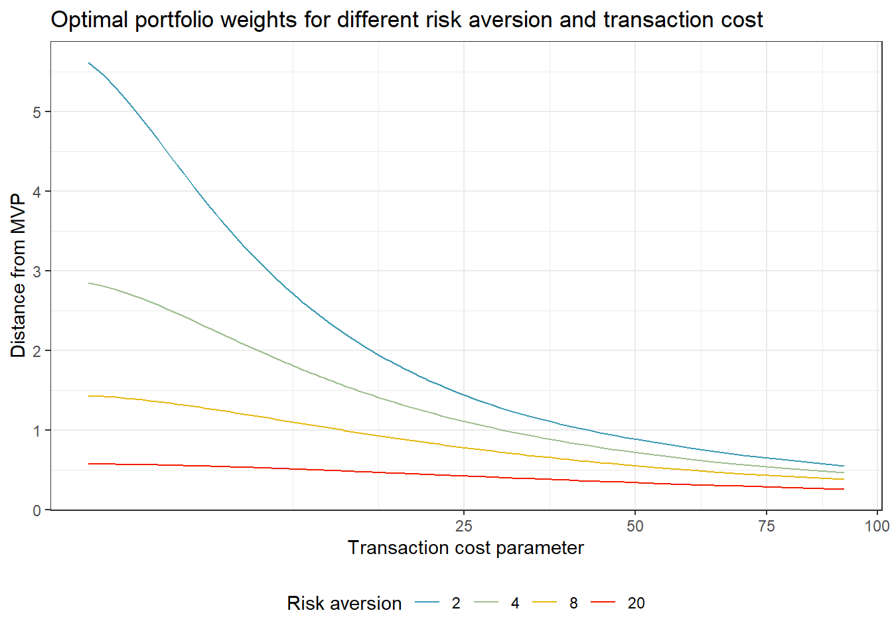

# Constrained optimization and backtesting

In this chapter, we conduct portfolio backtesting in a more realistic setting by including transaction costs and investment constraints such as no-short-selling rules. We start with *standard* mean-variance efficient portfolios. Then, we introduce further constraints step-by-step. Numerical constrained optimization is performed by the packages `quadprog` (for quadratic objective functions such as in typical mean-variance framework) and `alabama` (for more general, non-linear objectives and constraints).


```r
library(tidyverse)
library(RSQLite)
library(quadprog) 
library(alabama)
```


## Data preparation

We start by loading the required data from our `SQLite`-database introduced in our chapter on *"Accessing & managing financial data"*. For simplicity, we restrict our investment universe to the monthly Fama-French industry portfolio returns in the following application.


```r
tidy_finance <- dbConnect(SQLite(), "data/tidy_finance.sqlite", 
                          extended_types = TRUE)

industry_returns <- tbl(tidy_finance, "industries_ff_monthly") %>% 
  collect() 

industry_returns <- industry_returns %>% 
  select(-month)
```

## Recap of portfolio choice 

A common objective for portfolio optimization is to find mean-variance efficient portfolio weights, i.e., the allocation which delivers the lowest possible return variance for a given minimum level of expected returns. In the most extreme case, where the investor is only concerned about portfolio variance, she may choose to implement the minimum variance portfolio (MVP) weights which are given by the solution to 
$$w_\text{mvp} = \arg\min w'\Sigma w \text{ s.t. } w'\iota = 1$$
where $\Sigma$ is the $(N \times N)$ covariance matrix of the returns. The optimal weights $\omega_\text{mvp}$ can be found analytically and are $\omega_\text{mvp} = \frac{\Sigma^{-1}\iota}{\iota'\Sigma^{-1}\iota}$. In terms of code, the math is equivalent to the following.


```r
Sigma <- cov(industry_returns)
w_mvp <- solve(Sigma) %*% rep(1, ncol(Sigma))
w_mvp <- as.vector(w_mvp / sum(w_mvp))
```

Next, consider an investor who aims to achieve minimum variance *given a required expected portfolio return* $\bar{\mu}$ such that she chooses
$$w_\text{eff}({\bar{\mu}}) =\arg\min w'\Sigma w \text{ s.t. } w'\iota = 1 \text{ and } \omega'\mu \geq \bar{\mu}.$$
It can be shown (see Exercises) that the portfolio choice problem can equivalently be formulated for an investor with mean-variance preferences and risk aversion factor $\gamma$. The investor aims to choose portfolio weights such that
$$ w^*_\gamma = \arg\max w' \mu - \frac{\gamma}{2}w'\Sigma w\quad s.t. w'\iota = 1.$$
The solution to the optimal portfolio choice problem is:
$$\omega^*_{\gamma}  = \frac{1}{\gamma}\left(\Sigma^{-1} - \frac{1}{\iota' \Sigma^{-1}\iota }\Sigma^{-1}\iota\iota' \Sigma^{-1} \right) \mu  + \frac{1}{\iota' \Sigma^{-1} \iota }\Sigma^{-1} \iota.$$
Empirically, this classical solution imposes many problems. In particular, the estimates of $\mu_t$ are noisy over short horizons, the ($N \times N$) matrix $\Sigma_t$ contains $N(N-1)/2$ distinct elements and thus, estimation error is huge. Even worse, if the asset universe contains more assets than available time periods $(N > T)$, the sample covariance matrix is no longer positive definite such that the inverse $\Sigma^{-1}$ does not exist anymore. On top of the estimation uncertainty, *transaction costs* are a major concern. Rebalancing portfolios is costly, and, therefore, the optimal choice should depend on the investor's current holdings.


## Estimation uncertainty and transaction costs

The empirical evidence regarding the performance of a mean-variance optimization procedure in which you simply plug in some sample estimates $\hat \mu_t$ and $\hat \Sigma_t$ can be summarized rather briefly: mean-variance optimization performs poorly! The literature discusses many proposals to overcome these empirical issues. For instance, one may impose some form of regularization of $\Sigma$, rely on Bayesian priors inspired by theoretical asset pricing models, or use high-frequency data to improve forecasting. One unifying framework that works easily, effectively (even for large dimensions), and is purely inspired by economic arguments is an ex-ante adjustment for transaction costs [@Hautsch2019]. 

Assume that returns are from a multivariate normal distribution such that $p_t({r}_{t+1}|\mathcal{M})=N(\mu,\Sigma)$. Additionally, we assume quadratic transaction costs which penalize rebalancing such that  $$
\begin{aligned}
\nu\left(\omega_{t+1},\omega_{t^+}, \beta\right) :=\nu_t\left(\omega_{t+1}, \beta\right) = \frac{\beta}{2} \left(\omega_{t+1} - \omega_{t^+}\right)'\left(\omega_{t+1}- \omega_{t^+}\right),\end{aligned}$$
with cost parameter $\beta>0$ and $\omega_{t^+} := {\omega_t \circ  (1 +r_{t})}/{\iota' (\omega_t \circ (1 + r_{t}))}$. Note that $\omega_{t^+}$ differs mechanically from $\omega_t$ due to the returns in the past period.  
Then, the optimal portfolio choice is
$$\begin{aligned}\omega_{t+1} ^* &:=  \arg\max_{\omega \in \mathbb{R}^N,  \iota'\omega = 1} \omega'\mu - \nu_t (\omega,\omega_{t^+}, \beta) - \frac{\gamma}{2}\omega'\Sigma\omega \\
&=\arg\max_{\omega\in\mathbb{R}^N,\text{ }  \iota'\omega=1}
\omega'\mu^* - \frac{\gamma}{2}\omega'\Sigma^* \omega ,\end{aligned}$$
where
$$\mu^*:=\mu+\beta \omega_{t^+} \quad  \text{and} \quad \Sigma^*:=\Sigma + \frac{\beta}{\gamma} I_N.
$$
As a result, adjusting for transaction costs implies a standard mean-variance optimal portfolio choice with adjusted return parameters $\Sigma^*$ and $\mu^*$: $$\omega^*_{t+1} = \frac{1}{\gamma}\left(\Sigma^{*-1} - \frac{1}{\iota' \Sigma^{*-1}\iota }\Sigma^{*-1}\iota\iota' \Sigma^{*-1} \right) \mu^*  + \frac{1}{\iota' \Sigma^{*-1} \iota }\Sigma^{*-1} \iota.$$

An alternative formulation of the optimal portfolio can be derived as follows: 
$$\omega_{t+1} ^*=\arg\max_{\omega\in\mathbb{R}^N,\text{ }  \iota'\omega=1}
\omega'\left(\mu+\beta\left(\omega_{t^+} - \frac{1}{N}\iota\right)\right) - \frac{\gamma}{2}\omega'\Sigma^* \omega.$$
The optimal weights correspond to a mean-variance portfolio where the vector of expected returns is such that assets that currently exhibit a higher weight are considered as delivering a higher expected return. 


## Optimal portfolio choice

The function below implements the efficient portfolio weight in its general form, allowing for transaction costs (conditional on the holdings *before* reallocation). For $\beta=0$, the computation resembles the standard mean-variance efficient framework. `gamma` denotes the coefficient of risk aversion,`beta` is the transaction cost parameter and `w_prev` are the weights before rebalancing. 


```r
compute_efficient_weight <- function(Sigma,
                                     mu,
                                     gamma = 2, 
                                     beta = 0, # transaction costs
                                     w_prev = 1/ncol(Sigma) * rep(1, ncol(Sigma))){ 

  iota <- rep(1, ncol(Sigma))
  Sigma_processed <- Sigma + beta / gamma * diag(ncol(Sigma))
  mu_processed <- mu + beta * w_prev
  
  Sigma_inverse <- solve(Sigma_processed)
  
  w_mvp <- Sigma_inverse %*% iota
  w_mvp <- as.vector(w_mvp / sum(w_mvp))
  w_opt <- w_mvp  + 1/gamma * 
    (Sigma_inverse - 1 / sum(Sigma_inverse) * Sigma_inverse %*% iota %*% t(iota) %*% Sigma_inverse) %*% 
    mu_processed
  return(as.vector(w_opt))
}

mu <- colMeans(industry_returns)
compute_efficient_weight(Sigma, mu)
```

```
##  [1] -0.1914  0.2291 -0.3242  0.8333  1.0955 -0.6081
##  [7]  0.8525 -0.1642 -1.7668  0.6720 -0.6077  0.8922
## [13]  0.1179 -0.0314  1.0545  0.0556  0.3095 -0.2607
## [19] -1.5556 -0.3682  0.1000  0.6472  0.3684  0.5106
## [25]  0.0425  0.6461  0.0226  0.7373 -0.1546  0.1093
## [31] -0.0435 -0.4141 -1.2728  1.1405 -0.7336 -0.0200
## [37]  0.6600  0.6606 -0.1942 -0.4036  0.3793 -0.5185
## [43] -0.2023  0.1821 -0.3338  0.6036 -1.2973  1.1322
## [49] -1.5879
```

What is the effect of transaction costs or different levels of risk aversion on the optimal portfolio choice? The following few lines of code analyze the distance between the MVP and the portfolio implemented by the investor for different values of the transaction cost parameter $\beta$ and risk aversion $\gamma$.


```r
transaction_costs <- expand_grid(gamma = c(2, 4, 8, 20),
                                 beta = 20 * qexp((1:99)/100)) %>% 
  mutate(weights = map2(.x = gamma, 
                        .y = beta,
                        ~compute_efficient_weight(Sigma,
                                                  mu,
                                                  gamma = .x,
                                                  beta = .y / 10000,
                                                  w_prev = w_mvp)),
         concentration = map_dbl(weights, ~sum(abs(. - w_mvp))))

transaction_costs %>% 
  mutate(`Risk aversion` = as_factor(gamma)) %>% 
  ggplot(aes(x = beta, y = concentration, color = `Risk aversion`)) + 
  geom_line() +
  scale_x_sqrt() +
  labs(x = "Transaction cost parameter", 
       y = "Distance from MVP",
       title = "Optimal portfolio weights for different risk aversion and transaction cost")
```



The figure shows that the initial portfolio is always the (sample) MVP and that the higher the transaction costs parameter $\beta$, the smaller is the rebalancing from the initial portfolio (which we always set to the MVP weights in this example). In addition, if risk aversion $\gamma$ increases, the efficient portfolio is closer to the MVP weights such that the investor desires less rebalancing from the initial holdings. 


## Constrained optimization

Next, we introduce constraints to the above optimization procedure. Very often, typical constraints such as short-selling restrictions prevent analytical solutions for optimal portfolio weights. However, numerical optimization allows computing the solutions to such constrained problems. For the purpose of mean-variance optimization, we rely on the `solve.QP()` function from the package `quadprog`. 

The function `solve.QP()` delivers numerical solutions to quadratic programming problems of the form 
$$\min(-\mu \omega + 1/2 \omega' \Sigma \omega) \text{ s.t. } A' \omega >= b_0.$$
The function takes one argument (`meq`) for the number of equality constraints. Therefore, the above matrix $A$ is simply a vector of ones to ensure that the weights sum up to one. In the case of short-selling constraints, the matrix $A$ is of the form 
$$A = \begin{pmatrix}1 & 1& \ldots&1 \\1 & 0 &\ldots&0\\0 & 1 &\ldots&0\\\vdots&&\ddots&\vdots\\0&0&\ldots&1\end{pmatrix}'\qquad b_0 = \begin{pmatrix}1\\0\\\vdots\\0\end{pmatrix}.$$
Before we dive into unconstrained optimization, we revisit the *unconstrained* problem and replicate the analytical solutions for the minimum variance and efficient portfolio weights from above. We verify that the output is equal to the above solution. Note that we round to the first six digits to avoid differences at higher digits that might arise due to inherent imprecision of numerical estimation procedures. As just discussed, we set `Amat` to a matrix with a column of ones and `bvec` to 1 to enforce the constraint that weights must sum up to one. `meq=1` means that one (out of one) constraints must be satisfied with equality.   


```r
n_industries <- ncol(industry_returns) 

w_mvp_numerical <- solve.QP(Dmat = Sigma,
                            dvec = rep(0, n_industries), 
                            Amat = cbind(rep(1, n_industries)), 
                            bvec = 1, 
                            meq = 1) 

all(round(w_mvp, 6) == round(w_mvp_numerical$solution, 6))
```

```
## [1] TRUE
```

```r
w_efficient_numerical <- solve.QP(Dmat = 2 * Sigma,
                                  dvec = mu, 
                                  Amat = cbind(rep(1, n_industries)),
                                  bvec = 1, 
                                  meq = 1)

all(round(compute_efficient_weight(Sigma, mu), 6) == round(w_efficient_numerical$solution, 6))
```

```
## [1] TRUE
```

For more complex optimization routines, [this optimization task view](https://cran.r-project.org/web/views/Optimization.html) provides an overview of the wast optimization landscape in R. 

Next, we approach problems where no analytical solutions exist. First, we additionally impose short-sale constraints, which implies $N$ inequality constraints if the form $w_i >=0$. 


```r
w_no_short_sale <- solve.QP(Dmat = 2 * Sigma,
                            dvec = mu, 
                            Amat = cbind(1, diag(n_industries)), 
                            bvec = c(1, rep(0, n_industries)), 
                            meq = 1)
w_no_short_sale$solution
```

```
##  [1] -1.22e-17  6.56e-17 -4.30e-16  5.10e-03  4.89e-01
##  [6]  2.43e-16  2.41e-01  3.48e-16  3.20e-16  8.36e-17
## [11]  1.77e-16  2.65e-01 -7.15e-17  1.72e-15 -1.55e-16
## [16] -6.11e-17  1.11e-16  1.39e-16  1.13e-16 -9.96e-16
## [21]  7.58e-16 -6.00e-17 -2.62e-17  3.34e-18 -1.25e-16
## [26] -2.74e-16  5.42e-18  0.00e+00 -3.38e-17 -2.68e-17
## [31] -3.03e-17  5.79e-17 -2.80e-16 -3.44e-15  3.11e-17
## [36]  2.35e-17 -5.81e-17  8.81e-17  1.40e-16 -8.30e-17
## [41] -4.08e-16  7.88e-16 -2.48e-17 -1.44e-16  1.63e-15
## [46]  2.69e-16 -1.39e-16 -2.12e-17  0.00e+00
```

`solve.QP` is fast because it benefits from a very clear structure with a quadratic objective and linear constraints. However, optimization typically requires more flexibility. As an example, we show how to compute optimal weights, subject to the so-called [regulation T-constraint](https://en.wikipedia.org/wiki/Regulation_T), which requires that the sum of all absolute portfolio weights is smaller than 1.5. The constraint implies an initial margin requirement of 50% and, therefore, also a non-linear objective function. Thus, we can no longer rely on `solve.QP()`. Instead, we rely on the package `alabama`, which requires a separate definition of objective and constraint functions. 


```r
initial_weights <- 1 / n_industries * rep(1, n_industries)
objective <- function(w, gamma = 2) -t(w) %*% (1+mu) + gamma / 2 * t(w)%*%Sigma%*%w
inequality_constraints <- function(w, reg_t = 1.5) return(reg_t - sum(abs(w)))
equality_constraints <- function(w) return(sum(w) - 1)

w_reg_t <- constrOptim.nl(
  par = initial_weights,
  hin = inequality_constraints,
  fn = objective, 
  heq = equality_constraints,
  control.outer = list(trace = FALSE))
w_reg_t$par
```

```
##  [1] 0.0204 0.0204 0.0204 0.0204 0.0204 0.0204 0.0204
##  [8] 0.0204 0.0204 0.0204 0.0204 0.0204 0.0204 0.0204
## [15] 0.0204 0.0204 0.0204 0.0204 0.0204 0.0204 0.0204
## [22] 0.0204 0.0204 0.0204 0.0204 0.0204 0.0204 0.0204
## [29] 0.0204 0.0204 0.0204 0.0204 0.0204 0.0204 0.0204
## [36] 0.0204 0.0204 0.0204 0.0204 0.0204 0.0204 0.0204
## [43] 0.0204 0.0204 0.0204 0.0204 0.0204 0.0204 0.0204
```

The figure below shows the optimal allocation weights across all 49 industries for the four different strategies considered so far: minimum variance, efficient portfolio with $\gamma$ = 2, efficient portfolio with short-sale constraints, and the Regulation-T constrained portfolio.


```r
tibble(`No short-sale` = w_no_short_sale$solution, 
       `Minimum Variance` = w_mvp, 
       `Efficient portfolio` = compute_efficient_weight(Sigma, mu),
       `Regulation-T` = w_reg_t$par,
       Industry = colnames(industry_returns)) %>%
  pivot_longer(-Industry, 
               names_to = "Strategy") %>% 
  ggplot(aes(fill = Strategy, 
             y = value, 
             x = Industry)) + 
  geom_bar(position = "dodge", stat = "identity") +
  coord_flip() + 
  labs(y = "Allocation weight",
       title =" Optimal allocations for different investment rules") +
  scale_y_continuous(labels = scales::percent)
```


Before we move on, we want to propose a final allocation strategy, which reflects a somewhat more realistic structure of transaction costs instead of the quadratic specification used above. The function below computes efficient portfolio weights while adjusting for $L_1$ transaction costs $\beta\sum\limits_{i=1}^N |(w_{i, t+1} - w_{i, t^+})|$. No closed-form solution exists, and we rely on non-linear optimization procedures.


```r
compute_efficient_weight_L1_TC <- function(mu,
                                          Sigma, 
                                          gamma = 2, 
                                          beta = 0, 
                                          initial_weights = 1 / ncol(sigma) * rep(1, ncol(sigma))) {
  
  objective <- function(w) -t(w) %*% mu + gamma / 2* t(w) %*% Sigma %*% w + (beta / 10000) / 2 * sum(abs(w - initial_weights))

  w_optimal <- constrOptim.nl(
    par = initial_weights,
    fn = objective, 
    heq = function(w){sum(w) - 1},
    control.outer = list(trace = FALSE))
  
  w_optimal$par
}
```


## Out-of-sample backtesting

For the sake of simplicity, we committed one fundamental error in computing portfolio weights above. We used the full sample of the data to determine the optimal allocation. To implement this strategy at the beginning of the 2000s, you will need to know how the returns will evolve until 2020. While interesting from a methodological point of view, we cannot evaluate the performance of the portfolios in a reasonable out-of-sample fashion. We do so next in a backtesting application for three strategies. For the backtest, we recompute optimal weights just based on past available data. 


```r
window_length <- 120 
periods <- nrow(industry_returns) - window_length 

beta <- 50
gamma <- 2

performance_values <- matrix(NA, 
                             nrow = periods, 
                             ncol = 3) # A matrix to collect all returns
colnames(performance_values) <- c("raw_return", "turnover", "net_return") 

performance_values <- list("MV (TC)" = performance_values, 
                           "Naive" = performance_values, 
                           "MV" = performance_values)

w_prev_1 <- w_prev_2 <- w_prev_3 <- rep(1 / n_industries, 
                                        n_industries)
```

We also define two helper functions: one to adjust the weights due to returns and one for performance evaluation, where we compute realized returns net of transaction costs. 


```r
adjust_weights <- function(w, next_return){
  w_prev <- 1 + w * next_return
  as.numeric(w_prev / sum(as.vector(w_prev)))
}

evaluate_performance <- function(w, w_previous, next_return, beta = 50){
  raw_return <- as.matrix(next_return) %*% w
  turnover <- sum(abs(w - w_previous))
  net_return <- raw_return - beta / 10000 * turnover
  c(raw_return, turnover, net_return)
}
```

The lines above define the general setup. We consider 120 periods from the past to update the parameter estimates before recomputing portfolio weights. Then, we update portfolio weights which is costly and affects the performance. The portfolio weights determine the portfolio return. A period later, the current portfolio weights have changed and form the foundation for transaction costs incurred in the next period. We consider three different competing strategies: the mean-variance efficient portfolio, the mean-variance efficient portfolio with ex-ante adjustment for transaction costs, and the naive portfolio, which allocates wealth equally across the different assets.

The following code chunk performs rolling-window estimation. In each period, the estimation window contains the returns available up to the current period. Note that we use the sample moments, but you might use more advanced estimators in practice. 


```r
for(p in 1:periods){
  
  returns_window <- industry_returns[p : (p + window_length - 1), ]
  next_return <- industry_returns[p + window_length, ] %>% as.matrix()
  
  Sigma <- cov(returns_window) 
  mu <- 0 * colMeans(returns_window) 
  
  # Transaction-cost adjusted portfolio
  w_1 <- compute_efficient_weight_L1_TC(mu = mu, 
                                        Sigma = Sigma, 
                                        beta = beta, 
                                        gamma = gamma,
                                        initial_weights = w_prev_1)
  
  performance_values[[1]][p, ] <- evaluate_performance(w_1, 
                                                       w_prev_1, 
                                                       next_return, 
                                                       beta = beta)
  
  w_prev_1 <- adjust_weights(w_1, next_return)
  
  # Naive portfolio
  w_2 <- rep(1 / n_industries, n_industries)
  
  performance_values[[2]][p, ] <- evaluate_performance(w_2, 
                                                       w_prev_2, 
                                                       next_return)
  
  w_prev_2 <- adjust_weights(w_2, next_return)
  
  # Mean-variance efficient portfolio (w/o transaction costs)
  w_3 <- compute_efficient_weight(Sigma = Sigma,
                                  mu = mu, 
                                  gamma = gamma)
  
  performance_values[[3]][p, ] <- evaluate_performance(w_3, 
                                                       w_prev_3, 
                                                       next_return)
  
  w_prev_3 <- adjust_weights(w_3, next_return)
}
```

Finally, we get to the evaluation of the portfolio strategies *net-of-transaction costs*. Note that we compute annualized returns and standard deviations. 


```r
performance <- lapply(performance_values, as_tibble) %>% 
  bind_rows(.id = "strategy")

performance %>%
  group_by(strategy) %>%
  summarize(Mean = 12 * mean(100 * net_return),
            SD = sqrt(12) * sd(100 * net_return), 
            `Sharpe ratio` = if_else(Mean > 0, Mean / SD, NA_real_),
            Turnover = 100 * mean(turnover))
```

```
## # A tibble: 3 × 5
##   strategy  Mean    SD `Sharpe ratio` Turnover
##   <chr>    <dbl> <dbl>          <dbl>    <dbl>
## 1 MV       -24.4  14.3         NA     569.    
## 2 MV (TC)   11.6  16.4          0.708  11.1   
## 3 Naive     12.2  17.3          0.704   0.0658
```

The results clearly speak against mean-variance optimization. Turnover is huge when the investor only considers her portfolio's expected return and variance. Effectively, the mean-variance portfolio generates a *negative* annualized return after adjusting for transaction costs. At the same time, the naive portfolio turns out to perform very well. In fact, the performance gains of the transaction-cost adjusted mean-variance portfolio are small. The out-of-sample Sharpe ratio is slightly higher than for the naive portfolio. Note the extreme effect of turnover penalization on turnover: *MV (TC)* effectively resembles a buy-and-hold strategy which only updates the portfolio once the estimated parameters $\hat\mu_t$ and $\hat\Sigma_t$indicate that the current allocation is too far away from the optimal theoretical portfolio. 

## Exercises

1. We argue that an investor with a quadratic utility function with certainty equivalent $$\max_w CE(w) = \omega'\mu - \frac{\gamma}{2} \omega'\Sigma \omega \text{ s.t. } \iota'\omega = 1$$
faces an equivalent optimization problem to a framework where portfolio weights are chosen with the aim to minimize volatility given a pre-specified level or expected returns
$$\min_w \omega'\Sigma \omega \text{ s.t. } \omega'\mu = \bar\mu \text{ and } \iota'\omega = 1. $$ Proof that there is an equivalence between the optimal portfolio weights in both cases. 
1. Consider the portfolio choice problem for transaction-cost adjusted certainty equivalent maximization with risk aversion parameter $\gamma$ 
$$\omega_{t+1} ^* :=  \arg\max_{\omega \in \mathbb{R}^N,  \iota'\omega = 1} \omega'\mu - \nu_t (\omega, \beta) - \frac{\gamma}{2}\omega'\Sigma\omega$$
where $\Sigma$ and $\mu$ are (estimators of) the variance-covariance matrix of the returns and the vector of expected returns. Assume for now that transaction costs are quadratic in rebalancing **and** proportional to stock illiquidity such that 
$$\nu_t\left(\omega, \mathbf{\beta}\right) := \frac{\beta}{2} \left(\omega - \omega_{t^+}\right)'B\left(\omega - \omega_{t^+}\right)$$ where $B = \text{diag}(ill_1, \ldots, ill_N)$ is a diagonal matrix where $ill_1, \ldots, ill_N$. Derive a closed-form solution for the mean-variance efficient portfolio $\omega_{t+1} ^*$ based on the transaction cost specification above. Discuss the effect of illiquidity $ill_i$ on the individual portfolio weights relative to an investor that myopically ignores transaction costs in her decision. 
1. Use the solution from the previous exercise to update the function `compute_efficient_weight` such that you can compute optimal weights conditional on a matrix $B$ with illiquidity measures. 
1. Illustrate the evolution of the *optimal* weights from the naive portfolio to the efficient portfolio in the mean-standard deviation diagram.
1. Is it always optimal to choose the same $\beta$ in the optimization problem than the value used in evaluating the portfolio performance? In other words: Can it be optimal to choose theoretically sub-optimal portfolios based on transaction cost considerations that do not reflect the actual incurred costs? Evaluate the out-of-sample Sharpe ratio after transaction costs for a range of different values of imposed $\beta$ values.
