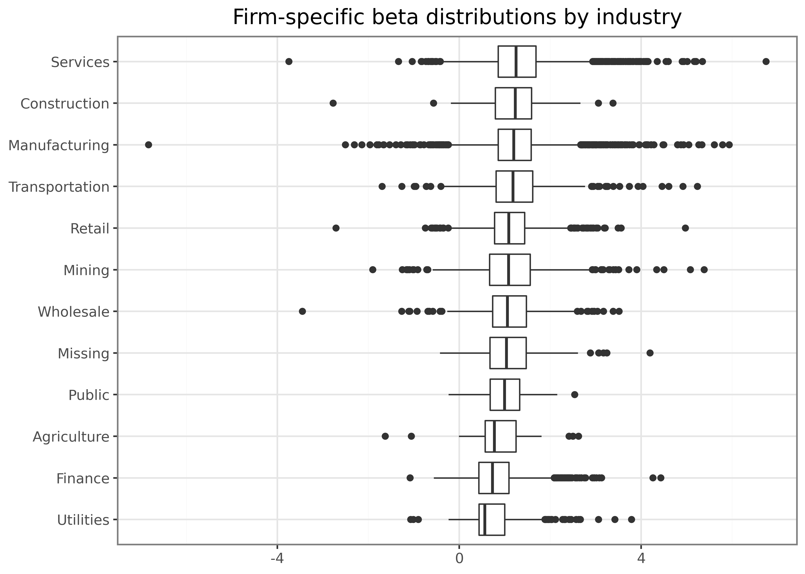
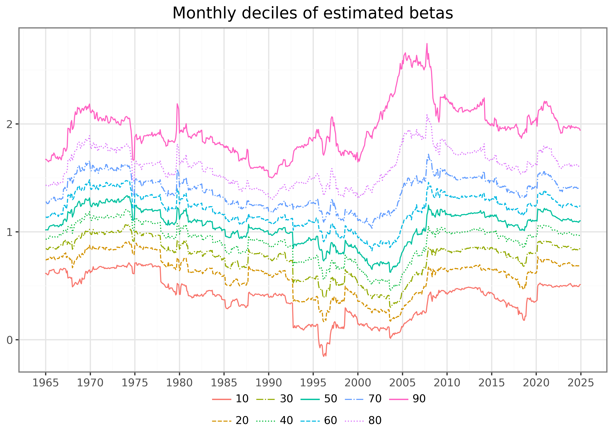

In [Beta Estimation](../../python/beta-estimation.llms.md), we estimate rolling CAPM betas for the entire CRSP universe by calling a regression routine for every stock and every monthly estimation window. That design is easy to read and easy to generalize, but it requires over two million individual regression fits — even parallelized across all cores, the estimation takes hours.

This post shows that `polars` can produce the *identical* estimates in a few seconds. The trick is that, for a single-regressor model, the OLS coefficients and their \\t\\-statistics are simple functions of precomputed cumulants: the observation count \\n\\ and the sums \\\sum x_t\\, \\\sum y_t\\, \\\sum x_t^2\\, \\\sum y_t^2\\, and \\\sum x_t y_t\\. Because sums are additive, we can compute them once per stock-month and let `polars` aggregate them over rolling calendar windows in a single vectorized pass — no loops, no parallelization machinery. We then reproduce every output of the book chapter with this approach.

To be specific, with \\x\\ denoting the market excess return, \\y\\ the stock excess return, and all sums running over a rolling estimation window with \\n\\ observations, the slope and intercept follow as

\\ \hat\beta = \frac{S\_{xy}}{S\_{xx}}, \qquad \hat\alpha = \bar y - \hat\beta \bar x, \\

where \\S\_{xy} = \sum x_t y_t - \frac{1}{n}\sum x_t \sum y_t\\ and \\S\_{xx} = \sum x_t^2 - \frac{1}{n}\left(\sum x_t\right)^2\\. With \\S\_{yy}\\ defined analogously, the residual variance is \\\hat\sigma^2 = (S\_{yy} - \hat\beta S\_{xy}) / (n - 2)\\, and the \\t\\-statistics follow from the standard errors \\\text{se}(\hat\beta) = \sqrt{\hat\sigma^2 / S\_{xx}}\\ and \\\text{se}(\hat\alpha) = \sqrt{\hat\sigma^2 \left(\frac{1}{n} + \frac{\bar x^2}{S\_{xx}}\right)}\\.

We use the following packages:

``` python
import time

import polars as pl
import numpy as np

from plotnine import *
from mizani.formatters import percent_format
```

## Data

As in the chapter, we combine monthly CRSP returns with the market excess returns from the Fama-French data library, both stored in the Parquet files introduced in [WRDS, CRSP, and Compustat](../../python/wrds-crsp-and-compustat.llms.md).

``` python
crsp_monthly = (pl.read_parquet("data-python/crsp_monthly.parquet")
    .select(["permno", "date", "industry", "ret_excess"])
    .drop_nulls()
    .join(
        pl.read_parquet("data-python/factors_ff3_monthly.parquet")
            .select(["date", "mkt_excess"]),
        how="left", on="date"
    )
)
```

## Vectorized Rolling Estimation

The function below performs the rolling estimation in three steps: (i) collapse the data to one row of cumulants per stock and month, (ii) aggregate the cumulants over rolling windows of `look_back` calendar months via `rolling()`, keeping only windows with at least `min_obs` observations and `look_back` months of available history, and (iii) map the aggregated sums into \\\hat\alpha\\, \\\hat\beta\\, and their \\t\\-statistics. The output format mirrors the chapter exactly: one row per stock, month, and coefficient.

``` python
def roll_capm_estimation(data, look_back=60, min_obs=48):
    """Perform rolling CAPM estimations via closed-form OLS."""

    cumulants = (data
        .group_by("permno", "date")
        .agg(
            n=pl.len().cast(pl.Float64),
            sum_x=pl.col("mkt_excess").sum(),
            sum_y=pl.col("ret_excess").sum(),
            sum_xx=(pl.col("mkt_excess") ** 2).sum(),
            sum_yy=(pl.col("ret_excess") ** 2).sum(),
            sum_xy=(pl.col("mkt_excess") * pl.col("ret_excess")).sum(),
        )
        .sort("permno", "date")
        .with_columns(month_index=pl.int_range(pl.len()).over("permno"))
    )

    rolling_sums = (cumulants
        .rolling(
            index_column="date",
            period=f"{look_back}mo",
            group_by="permno",
            closed="right",
        )
        .agg(
            pl.col("n", "sum_x", "sum_y", "sum_xx", "sum_yy", "sum_xy").sum(),
            month_index=pl.col("month_index").last(),
        )
        .filter(
            (pl.col("month_index") >= look_back - 1)
            & (pl.col("n") >= min_obs)
        )
    )

    estimates = (rolling_sums
        .with_columns(
            s_xx=pl.col("sum_xx") - pl.col("sum_x") ** 2 / pl.col("n"),
            s_xy=pl.col("sum_xy") - pl.col("sum_x") * pl.col("sum_y") / pl.col("n"),
            s_yy=pl.col("sum_yy") - pl.col("sum_y") ** 2 / pl.col("n"),
        )
        .with_columns(beta=pl.col("s_xy") / pl.col("s_xx"))
        .with_columns(
            alpha=(pl.col("sum_y") - pl.col("beta") * pl.col("sum_x")) / pl.col("n"),
            sigma2=(pl.col("s_yy") - pl.col("beta") * pl.col("s_xy"))
                / (pl.col("n") - 2),
        )
        .with_columns(
            t_alpha=pl.col("alpha") / (
                pl.col("sigma2")
                * (1 / pl.col("n")
                    + (pl.col("sum_x") / pl.col("n")) ** 2 / pl.col("s_xx"))
            ).sqrt(),
            t_beta=pl.col("beta") / (pl.col("sigma2") / pl.col("s_xx")).sqrt(),
        )
    )

    return (pl.concat([
            estimates.select(
                "permno", "date",
                coefficient=pl.lit("alpha"),
                estimate=pl.col("alpha"),
                t_statistic=pl.col("t_alpha"),
            ),
            estimates.select(
                "permno", "date",
                coefficient=pl.lit("mkt_excess"),
                estimate=pl.col("beta"),
                t_statistic=pl.col("t_beta"),
            ),
        ])
        .sort("permno", "date", "coefficient")
    )
```

Estimating betas for the entire monthly CRSP sample — around 26,000 stocks and over two million rolling windows — is now a matter of seconds:

``` python
tic = time.perf_counter()
capm_monthly = roll_capm_estimation(crsp_monthly)
toc = time.perf_counter()

print(f"Monthly estimation: {capm_monthly.shape[0]:,} rows in {toc - tic:.1f} seconds")
```

    Monthly estimation: 4,268,604 rows in 2.1 seconds

The estimates are numerically identical to the regression-based approach of the chapter — closed-form OLS is still OLS. We verify this claim for one stock and window: the latest five-year window of Apple’s returns, estimated via `statsmodels`.

``` python
import statsmodels.formula.api as smf

apple_window = (crsp_monthly
    .filter(pl.col("permno") == 14593)
    .sort("date")
    .tail(60)
)

fit = smf.ols("ret_excess ~ mkt_excess", data=apple_window.to_pandas()).fit()

apple_vectorized = (capm_monthly
    .filter(
        (pl.col("permno") == 14593)
        & (pl.col("date") == apple_window["date"].max())
        & (pl.col("coefficient") == "mkt_excess")
    )
)

print(f"statsmodels beta: {fit.params['mkt_excess']:.12f}")
print(f"vectorized beta:  {apple_vectorized['estimate'][0]:.12f}")
print(f"statsmodels t:    {fit.tvalues['mkt_excess']:.12f}")
print(f"vectorized t:     {apple_vectorized['t_statistic'][0]:.12f}")
```

    statsmodels beta: 1.159627113952
    vectorized beta:  1.159627113952
    statsmodels t:    8.737072884233
    vectorized t:     8.737072884233

## Daily Betas Without Batching

The chapter splits the daily CRSP data into batches of stocks to keep memory in check during the parallelized estimation. The cumulant approach makes this unnecessary: since the data immediately collapses to one row per stock and month, we can lazily scan the full partitioned dataset and process all 180 million daily observations in one go. Following the chapter, we truncate daily dates to the start of the month — so the windows still span 60 months, with one estimate per month — and require at least 1,000 daily observations.

``` python
factors_ff3_daily = (pl.read_parquet("data-python/factors_ff3_daily.parquet")
    .select(["date", "mkt_excess"])
)

tic = time.perf_counter()
crsp_daily = (pl.scan_parquet(
        "data-python/crsp_daily/**/*.parquet",
        hive_partitioning=True, extra_columns="ignore"
    )
    .select(["permno", "date", "ret_excess"])
    .with_columns(permno=pl.col("permno").cast(pl.Float64))
    .collect()
)

capm_daily = roll_capm_estimation(
    crsp_daily
        .join(factors_ff3_daily, how="inner", on="date")
        .with_columns(date=pl.col("date").dt.truncate("1mo")),
    min_obs=1_000,
)
toc = time.perf_counter()

print(f"Daily estimation: {capm_daily.shape[0]:,} rows in {toc - tic:.1f} seconds")
```

    Daily estimation: 4,326,458 rows in 149.1 seconds

## Reproducing the Chapter’s Results

The remainder of this post reproduces every output of [Beta Estimation](../../python/beta-estimation.llms.md) from the two estimate tables. First, the rolling betas of four well-known stocks:

``` python
examples = pl.DataFrame({
    "permno": [14593, 10107, 93436, 17778],
    "company": ["Apple", "Microsoft", "Tesla", "Berkshire Hathaway"]
}).with_columns(permno=pl.col("permno").cast(pl.Float64))

beta_examples = (capm_monthly
    .filter(pl.col("coefficient") == "mkt_excess")
    .join(examples, how="inner", on="permno")
)

(ggplot(beta_examples, aes(x="date", y="estimate", color="company", linetype="company"))
    + geom_line()
    + labs(x="", y="", color="", linetype="",
           title="Monthly beta estimates for example stocks using 5 years of data")
    + scale_x_date(date_breaks="5 year", date_labels="%Y")
).show()
```

[](index_files/figure-html/cell-9-output-1.png "The figure shows monthly beta estimates for example stocks using five years of data, estimated with the vectorized cumulant approach.")

The figure shows monthly beta estimates for example stocks using five years of data, estimated with the vectorized cumulant approach.

Next, the distribution of average firm-specific betas by industry:

``` python
beta_monthly = (capm_monthly
    .filter(pl.col("coefficient") == "mkt_excess")
    .select(["permno", "date", "estimate"])
    .rename({"estimate": "beta"})
    .with_columns(return_type=pl.lit("monthly"))
)

beta_industries = (beta_monthly
    .join(crsp_monthly, how="inner", on=["permno", "date"])
    .drop_nulls("beta")
    .group_by(["industry", "permno"])
    .agg(beta=pl.col("beta").mean())
)

industry_order = (beta_industries
    .group_by("industry")
    .agg(beta=pl.col("beta").median())
    .sort("beta")
    ["industry"].to_list()
)

(ggplot(beta_industries, aes(x="industry", y="beta"))
    + geom_boxplot()
    + coord_flip()
    + labs(x="", y="", title="Firm-specific beta distributions by industry")
    + scale_x_discrete(limits=industry_order)
).show()
```

[](index_files/figure-html/cell-10-output-1.png "The box plots show the average firm-specific beta estimates by industry.")

The box plots show the average firm-specific beta estimates by industry.

The monthly deciles of estimated betas over time:

``` python
beta_quantiles = (beta_monthly
    .group_by("date")
    .agg([
        pl.col("beta").quantile(q).alias(str(int(round(q * 100))))
        for q in np.arange(0.1, 1.0, 0.1)
    ])
    .unpivot(index="date", variable_name="quantile", value_name="beta")
    .with_columns(pl.col("quantile").cast(pl.Int64))
    .drop_nulls()
)

linetypes = ["-", "--", "-.", ":"]
n_quantiles = beta_quantiles["quantile"].n_unique()

(ggplot(beta_quantiles,
        aes(x="date", y="beta", color="factor(quantile)", linetype="factor(quantile)"))
    + geom_line()
    + labs(x="", y="", color="", linetype="", title="Monthly deciles of estimated betas")
    + scale_x_date(date_breaks="5 year", date_labels="%Y")
    + scale_linetype_manual(
        values=[linetypes[l % len(linetypes)] for l in range(n_quantiles)]
    )
).show()
```

[](index_files/figure-html/cell-11-output-1.png "The figure shows monthly deciles of estimated betas. Each line corresponds to the monthly cross-sectional quantile of the estimated CAPM beta.")

The figure shows monthly deciles of estimated betas. Each line corresponds to the monthly cross-sectional quantile of the estimated CAPM beta.

The comparison of monthly and daily estimates for the example stocks:

``` python
beta_daily = (capm_daily
    .filter(pl.col("coefficient") == "mkt_excess")
    .select(["permno", "date", "estimate"])
    .rename({"estimate": "beta"})
    .with_columns(return_type=pl.lit("daily"))
)

beta = pl.concat([beta_monthly, beta_daily])

(ggplot(beta.join(examples, how="inner", on="permno"),
        aes(x="date", y="beta", color="return_type", linetype="return_type"))
    + geom_line()
    + facet_wrap("~company", ncol=1)
    + labs(x="", y="", color="", linetype="",
           title="Comparison of beta estimates using monthly and daily data")
    + scale_x_date(date_breaks="10 years", date_labels="%Y")
    + theme(figure_size=(6.4, 6.4))
).show()
```

[](index_files/figure-html/cell-12-output-1.png "The figure shows the comparison of beta estimates using monthly and daily data for example stocks.")

The figure shows the comparison of beta estimates using monthly and daily data for example stocks.

The share of stocks with available beta estimates over time:

``` python
return_types = pl.DataFrame({"return_type": ["monthly", "daily"]})

beta_coverage = (crsp_monthly
    .join(return_types, how="cross")
    .join(beta, on=["permno", "date", "return_type"], how="left")
    .group_by(["date", "return_type"])
    .agg(share=pl.col("beta").is_not_null().mean())
)

(ggplot(beta_coverage,
        aes(x="date", y="share", color="return_type", linetype="return_type"))
    + geom_line()
    + labs(x="", y="", color="", linetype="",
           title="End-of-month share of securities with beta estimates")
    + scale_y_continuous(labels=percent_format())
    + scale_x_date(date_breaks="10 year", date_labels="%Y")
).show()
```

[](index_files/figure-html/cell-13-output-1.png "The figure shows the end-of-month share of securities with beta estimates, separately for the monthly and daily estimation.")

The figure shows the end-of-month share of securities with beta estimates, separately for the monthly and daily estimation.

The summary statistics of both estimate sets:

``` python
(beta
    .group_by("return_type")
    .agg(
        count=pl.len(),
        mean=pl.col("beta").mean(),
        std=pl.col("beta").std(),
        min=pl.col("beta").min(),
        q25=pl.col("beta").quantile(0.25),
        median=pl.col("beta").median(),
        q75=pl.col("beta").quantile(0.75),
        max=pl.col("beta").max(),
    )
    .sort("return_type")
    .with_columns(pl.col(pl.Float64).round(2))
)
```

shape: (2, 9)

| return_type | count   | mean | std  | min   | q25  | median | q75  | max   |
|-------------|---------|------|------|-------|------|--------|------|-------|
| str         | u32     | f64  | f64  | f64   | f64  | f64    | f64  | f64   |
| "daily"     | 2163229 | 0.8  | 0.49 | -3.67 | 0.42 | 0.76   | 1.12 | 4.74  |
| "monthly"   | 2134302 | 1.1  | 0.7  | -9.01 | 0.64 | 1.04   | 1.47 | 10.35 |

And, finally, the correlation between the monthly and daily estimators:

``` python
(beta
    .pivot(index=["permno", "date"], on="return_type", values="beta")
    .select(["monthly", "daily"])
    .to_pandas()
    .corr()
    .round(2)
)
```

|         | monthly | daily |
|---------|---------|-------|
| monthly | 1.00    | 0.62  |
| daily   | 0.62    | 1.00  |

## Takeaways

All outputs match the chapter — the same betas, the same figures, the same summary statistics — but the entire estimation finishes in a few minutes - dominated by reading the 180 million daily returns - instead of many hours. Whenever a rolling estimator can be written in terms of additive cumulants, precomputing them and letting `polars` aggregate over rolling windows turns a parallelization problem into a one-pass computation. The pattern extends naturally to multi-factor models: with \\k\\ regressors, the required cumulants are the entries of the stacked moment matrices \\X'X\\, \\X'y\\, and \\y'y\\ — the same logic, just more sums.
