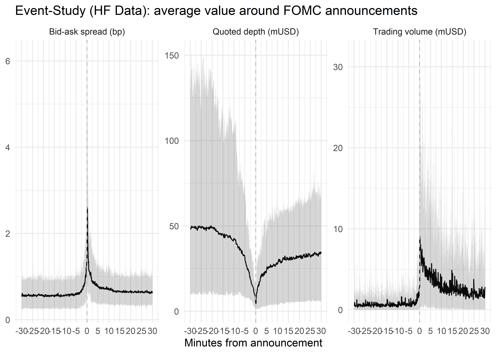

In a [companion blog post](../../blog/hf-and-lobster/index.llms.md), we introduced [lobsteR](https://voigtstefan.github.io/lobsteR/), a new R package for downloading and cleaning high-frequency order book data from [LOBSTER](https://lobsterdata.com/). This second post focuses on the public dataset we released alongside our working paper [Market responses to a VIX shock](https://papers.ssrn.com/sol3/papers.cfm?abstract_id=6298780) with [Nikolaus Hautsch](https://homepage.univie.ac.at/nikolaus.hautsch/) and [Albert J. Menkveld](https://albertjmenkveld.com/).

This is part two of two blog posts in which we announce and explain two major updates to the [tidy-finance.org](https://tidy-finance.org) ecosystem:

1.  `lobsteR` is a novel R package to request and download high-frequency orderbook snapshot data from [LOBSTER](https://lobsterdata.com/). We provide a short vignette on how to use the package in the [first post](../../blog/hf-and-lobster/index.llms.md).
2.  Seamless access to a massive, 5-second level dataset on S&P 500 index tracking ETF SPY via `tidyfinance::download_data("tidyfinance", "high_frequency_sp500", "2025-01-01", "2025-01-10")`

## 20 years of HF data

In our paper “Market responses to a VIX shock”, [Nikolaus Hautsch](https://homepage.univie.ac.at/nikolaus.hautsch/), [Albert J. Menkveld](https://albertjmenkveld.com/) and I investigated under the microscope how markets respond to a sudden increase in the VIX based on an exhaustive 2007-2025 sample of *all* NASDAQ trading messages for two exchange-traded funds (ETFs): SPY for the S&P 500 equity index and TLT for government bonds.

We collect message-level snapshots of the NASDAQ limit order book for the very actively traded S&P 500 ETF SPY. For our analysis we retrieve and evaluate the entire available order book message history from July 1st, 2007 to October 31st, 2025 from data provider LOBSTER.

Our sample contains a record for *each* message (submissions, adjustments, and cancellations of market and limit orders) and reconstructed snapshots of the complete order book for the first 50 levels.

We restrict our analysis to order book activity during regular trading hours. The entire dataset comprises more than 30 billion order book messages and was evaluated using the procedures described in [a previous post](../../blog/hf-and-lobster/index.llms.md).

For a meaningful analysis, we aggregate the order book messages for each ticker into the following six variables, measured at 5-second intervals.

- Initiator net volume (in million USD) which is the net of buyer and seller initiated shares transacted during the last 5-second interval. We sign transactions as +1 if executed against a sell-side limit order and -1 if executed against a buy-side limit order. For execution against a hidden limit order, we impose the sign +1 if the transaction executes at a price that exceeds the last observed midquote and -1 if the transaction price is below the last observed midquote. To make the values comparable across assets, we multiply the aggregate net number of traded shares with the rolling 12-month average midquote computed for each ticker.
- Return (in basis points) computed as \\\log(p\_{t, \tau}) - \log(p\_{t, \tau - 1})\\, where \\t\\ corresponds to the trading day and 5-second time stamps are \\\tau \in\left\\0, \ldots, 78\right\\\\ which range from 09:30 a.m. (\\\tau = 0\\) until 4:00 p.m. \\p\_{t, \tau}\\ is the last observed midquote on day \\t\\ before time stamp \\\tau\\.
- Trading volume (in million USD), which is the cumulative trading volume during each 5-second interval. We compute trading volume as the number of traded shares times the transaction price.
- Bid-ask spread (in basis points), computed as the time-weighted average difference between the best prices quoted at the sell and buy side of the order book during each 5-second interval. We compute the bid-ask spread relative to the current midquote for every order book snapshot.
- Depth (in million USD), measured as the number of posted shares in visible limit orders 5 basis points from the current best price on both sides of the order book. We take the time-weighted average depth during each interval to aggregate depth from message level into 5-second intervals. To make the values comparable across assets, we multiply the number of available shares with the rolling 12-month average midquote computed for each ticker.
- Amihud illiquidity measure, computed every five seconds as \\ILLIQ\_{t, \tau} := {\left\|\log(p\_{t, \tau}) - \log(p\_{t, \tau - 1})\right\|}/{V\_{t,\tau}}\\. \\ILLIQ\_{t, \tau}\\ corresponds to the absolute midquote log return divided by trading volume \\V\_{t, \tau}\\ executed on NASDAQ (in million USD). High values indicate large price impacts per unit traded and are thus associated with illiquidity. In our empirical analysis, we set \\ILLIQ\_{t, \tau}\\ to missing values for time stamps for which the trading volume is zero.

In order to process these massive amounts of data, we relied on one of Denmark’s largest supercomputing facilities. In order to render follow-up research feasible, we decided to make the aggregated data accessible on [Hugging Face](https://huggingface.co/datasets/voigtstefan/sp500), including a fast, easy and transparent connector via the `tidyfinance` library.

All you need is the following call to `download_data`:

``` r
library(tidyfinance)
library(tidyverse)
```

    ── Attaching core tidyverse packages ───────────── tidyverse 2.0.0 ──
    ✔ dplyr     1.2.1     ✔ readr     2.1.6
    ✔ forcats   1.0.0     ✔ stringr   1.5.2
    ✔ lubridate 1.9.4     ✔ tibble    3.3.0
    ✔ purrr     1.1.0     ✔ tidyr     1.3.1
    ── Conflicts ─────────────────────────────── tidyverse_conflicts() ──
    ✖ dplyr::filter() masks stats::filter()
    ✖ dplyr::lag()    masks stats::lag()
    ℹ Use the conflicted package (<http://conflicted.r-lib.org/>) to force all conflicts to become errors

``` r
download_data(
  domain = "tidyfinance",
  dataset = "high_frequency_sp500",
  start_date = "2020-01-01",
  end_date = "2020-01-15"
)
```

    # A tibble: 46,800 × 9
      ts                  midquote signed_volume trading_volume
      <dttm>                 <dbl>         <dbl>          <dbl>
    1 2020-01-02 09:30:05     324.             0       5160652.
    2 2020-01-02 09:30:10     324.             0       1748767.
    3 2020-01-02 09:30:15     324.             0       2429054.
    4 2020-01-02 09:30:20     324.             0       3548350.
    5 2020-01-02 09:30:25     324.             0      16407684.
    # ℹ 46,795 more rows
    # ℹ 5 more variables: depth0_ask <dbl>, depth0_bid <dbl>,
    #   depth5_ask <dbl>, depth5_bid <dbl>, spread <dbl>

## A simple case study

Suppose you are interested in high-frequency responses of the S&P 500 index to FOMC announcements within a short window around the announcements. [Marek Jarocinski](https://marekjarocinski.github.io/) at the ECB collected a long history of FOMC announcement dates (Source: Updating Monetary Policy and Central Bank Information shocks originally constructed in Jarocinski, M. and Karadi, P. (2020) Deconstructing Monetary Policy Surprises - The Role of Information Shocks, AEJ:Macro, DOI: http://doi.org/10.1257/mac.20180090), which we use for our case study.

Note that we focus on a lot of data. In total, we record 324 central bank event dates. For each date, we could download 5-second level observations for the S&P 500 tracking ETF SPY. Thus, the next code chunk downloads all dates for which FOMC announcements took place. We then download S&P 500 data for a random subset of 50 such days.

``` r
window_size <- 30

central_bank_events <- read_csv(
  "https://raw.githubusercontent.com/marekjarocinski/jkshocks_update_fed/main/shocks_fed_jk_t.csv",
  show_col_types = FALSE
) |>
  transmute(
    time = start,
    start_ts = start - minutes(window_size),
    end_ts = start + minutes(window_size)
  )

# Looping over many dates issues many requests to the Hugging Face API in
# quick succession, which can trigger rate limiting (HTTP 429). We retry with
# exponential backoff so that the download completes reliably within the limits.
download_hf_day <- function(date, max_tries = 8) {
  for (attempt in seq_len(max_tries)) {
    result <- tryCatch(
      download_data(
        "tidyfinance",
        "high_frequency_sp500",
        start_date = date,
        end_date = date
      ),
      error = function(e) e
    )
    if (!inherits(result, "error")) {
      return(result)
    }
    Sys.sleep(min(2^attempt, 45))
  }
  stop("Failed to download ", date, " after ", max_tries, " attempts: ",
       conditionMessage(result))
}

set.seed(2026)
data <- central_bank_events |>
  mutate(date = as.Date(time)) |>
  filter(date > "2006-07-27") |>
  slice_sample(n = 50) |>
  mutate(
    data = map(date, \(x) {
      Sys.sleep(2)
      download_hf_day(x)
    })
  )
```

Once we downloaded all the data for every FOMC announcement within our sample period, we can aggregate trading information around the event times. In the example below, we focus on quoted depth, trading volume and the bid-ask spreads.

``` r
hf_data <- data |>
  unnest(data) |>
  group_by(date) |>
  mutate(
    open_midquote = first(midquote),
    time_rel = as.numeric(difftime(ts, time, units = "mins")),
    depth = (depth5_bid + depth5_ask) * open_midquote / 1e6,
    trading_volume = trading_volume / 1e6
  ) |>
  ungroup() |>
  filter(ts >= start_ts, ts <= end_ts) |>
  select(time_rel, trading_volume, depth, spread) |>
  pivot_longer(cols = -time_rel) |>
  group_by(time_rel, name) |>
  summarise(
    across(
      value,
      list(
        mean = \(x) mean(x, na.rm = TRUE),
        p5 = \(x) quantile(x, 0.05, na.rm = TRUE),
        p95 = \(x) quantile(x, 0.95, na.rm = TRUE)
      ),
      .names = "{.fn}"
    ),
    .groups = "drop"
  ) |>
  mutate(
    name = case_when(
      name == "trading_volume" ~ "Trading volume (mUSD)",
      name == "spread" ~ "Bid-ask spread (bp)",
      name == "depth" ~ "Quoted depth (mUSD)"
    )
  )
```

Finally, we illustrate how markets respond at high-frequencies to FOMC announcements around the exact time of announcement.

``` r
hf_data |>
  ggplot(aes(x = time_rel, y = mean)) +
  facet_wrap(~name, scales = "free_y") +
  geom_line() +
  labs(
    x = "Minutes from announcement",
    y = NULL,
    title = "Event-Study (HF Data): average value around FOMC announcements",
    color = NULL
  ) +
  geom_ribbon(aes(ymin = p5, ymax = p95), alpha = 0.2) +
  geom_vline(xintercept = 0, linetype = "dashed", color = "grey") +
  theme_minimal() +
  theme(legend.position = "None") +
  scale_x_continuous(breaks = seq(-window_size, window_size, by = 5))
```

[](index_files/figure-html/plot-event-study-1.png)

The chart illustrates a pronounced spike in bid-ask spreads and trading volume right at the FOMC announcement, alongside a temporary dip in quoted depth. These patterns are consistent with market makers widening quotes and pulling liquidity ahead of the news release. The full dataset, covering July 2007 through October 2025, is available on [Hugging Face](https://huggingface.co/datasets/voigtstefan/sp500) and can be accessed directly via `tidyfinance::download_data("tidyfinance", "high_frequency_sp500")`.
