# Financial Statement Analysis

Financial statements and ratios are fundamental tools for understanding and evaluating companies. While we discuss how assets are priced in equilibrium in the previous chapter on the [Capital Asset Pricing Model](../chapters/capital-asset-pricing-model.llms.md), this chapter examines how investors and analysts assess companies using accounting information. Financial statements serve as the primary source of standardized information about a company’s operations, financial position, and performance. Their standardization and legal requirements make them particularly valuable as all companies must file financial statements.

Building on this standardized information, financial ratios transform raw accounting data into meaningful metrics that facilitate analysis across companies and over time. These ratios serve multiple purposes in both academic research and practical applications. They enable investors to benchmark companies against their peers, identify industry trends, and screen for investment opportunities. In academic finance, ratios play a crucial role in asset pricing models (e.g., the book-to-market ratio in the Fama-French three-factor model) and corporate finance (e.g., capital structure research). In many practical applications, ratios help assess a company’s financial health and performance.

This chapter demonstrates how to access, process, and analyze financial statements. We start by reviewing the financial statements balance sheet, income statement, and cash flow statement. Then, we download publicly available statements to calculate key financial ratios, implement common screening strategies, and evaluate companies. Our analysis combines theoretical frameworks with practical implementation, providing tools for both academic research and investment practice.

For the purpose of this chapter, we use financial statements provided by the US Securities and Exchange Commission (i.e., SEC). While the SEC provides a web interface to search filings, programmatic access to financial statements greatly facilitates systematic analyses such as ours. The Financial Modeling Prep (FMP) API offers such programmatic access, which we can leverage through the `fmpapi` package.

The FMP API’s free tier provides access to:

- 250 API calls per day,
- Five years of historical fundamental data,
- Real-time and historical stock prices, and
- Key financial ratios and metrics.

> **TIP:**
>
> The `fmpapi` package is developed by Christoph Scheuch and not sponsored by or affiliated with FMP. However, you can get 15% off your FMP subscription by using this [affiliate link](https://site.financialmodelingprep.com/pricing-plans?couponCode=tidyfinance). By signing up through this link, you also support the development of this package at no extra cost to you.

Next to `fmpapi`, we use the following packages throughout this chapter:

## R

``` r
library(tidyverse)
library(tidyfinance)
library(scales)
library(ggrepel)
library(fmpapi)
```

## Python

``` python
import polars as pl

from dotenv import load_dotenv
from fmpapi import fmp_get
from plotnine import *
from mizani.formatters import percent_format
from adjustText import adjust_text

load_dotenv()
```

    True

Because `fmp_get()` returns a `pandas` data frame when called with `to_pandas=True`, which we then convert to `polars` via `pl.from_pandas()`, we recommend installing `fmpapi` with the corresponding dependencies: `pip install fmpapi[pandas]`.

## Balance Sheet Statements

The balance sheet is one of the three primary financial statements capturing a company’s financial position at a specific moment in time. The statement lists all uses (assets) and sources (liabilities and equity) of funds, which result in the fundamental accounting equation:

\\\text{Assets} = \text{Liabilities} + \text{Equity}\\

This equation reflects a core principle of accounting: a company’s resources (assets) must equal its sources of funding, whether from creditors (liabilities) or investors (shareholders’ equity). Assets represent resources that the company controls and expects to generate future economic benefits, such as cash, inventory, or equipment. Liabilities encompass all obligations to external parties, from short-term payables to long-term debt. Shareholders’ equity represents the residual claim on assets after accounting for all liabilities.

[Figure 1](#fig-400) provides a stylized representation of a balance sheet’s structure. The visualization highlights how assets on the left side must equal the combined claims of creditors and shareholders on the right side.

[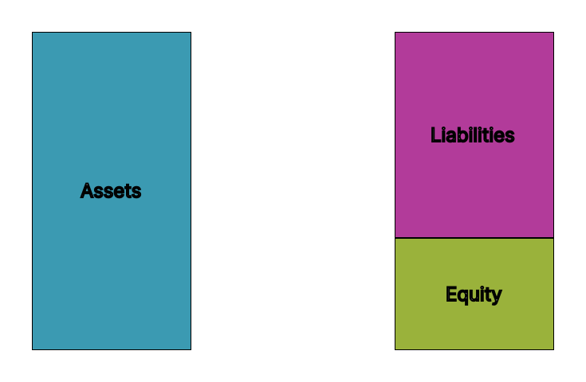](../assets/img/balance-sheet.svg "Figure 1: A stylized representation of a balance sheet statement.")

Figure 1: A stylized representation of a balance sheet statement.

The asset side of the balance sheet typically comprises three main categories, each serving different roles in the company’s operations:

1.  Current assets: These are assets expected to be converted into cash or used within one operating cycle (typically one year). They include, e.g., cash and cash equivalents, short-term investments, accounts receivable (money owed by customers), and inventory (raw materials, work in progress, and finished goods).
2.  Non-current assets: These long-term assets support the company’s operations beyond one year like, e.g., property, plant, and equipment (PP&E), long-term investments, and other long-term assets.
3.  Intangible assets: These non-physical assets often represent significant value in modern companies, e.g., patents and intellectual property, trademarks and brands, and goodwill from acquisitions (a premium paid on the book value of the acquired assets). Intangible assets are usually also considered long-term assets, which means that they are included in the group of non-current assets.

[Figure 2](#fig-401) illustrates this breakdown of assets, showing how companies classify their resources.

[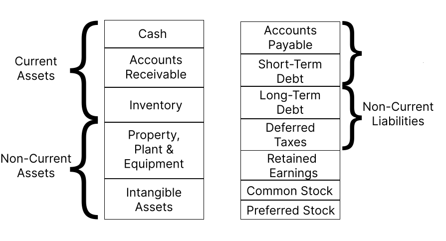](../assets/img/balance-sheet-breakdown.svg "Figure 2: A stylized representation of a balance sheet breakdown.")

Figure 2: A stylized representation of a balance sheet breakdown.

[Figure 2](#fig-401) also shows the breakdown of liabilities. The liability side similarly follows a temporal classification, dividing obligations based on when they come due:

1.  Current liabilities: Obligations due within one year such as accounts payable, short-term debt, current portion of long-term debt, and accrued expenses.
2.  Non-current liabilities: Long-term obligations such as long-term debt, bonds payable, deferred tax liabilities, and pension obligations.

Lastly, the equity section represents ownership claims and typically consists of:

- Retained earnings: Accumulated profits reinvested in the business.
- Common stock: Par value and additional paid-in capital from share issuance.
- Preferred stock: Hybrid securities with characteristics of both debt and equity.

[Figure 2](#fig-401) also depicts this equity structure, showing how companies track different forms of ownership claims.

To illustrate these concepts in practice, [Figure 3](#fig-404) presents Microsoft’s balance sheet from 2023. This real-world example demonstrates how one of the world’s largest technology companies structures its financial position, reflecting both traditional elements like PP&E and modern aspects like significant intangible assets.

[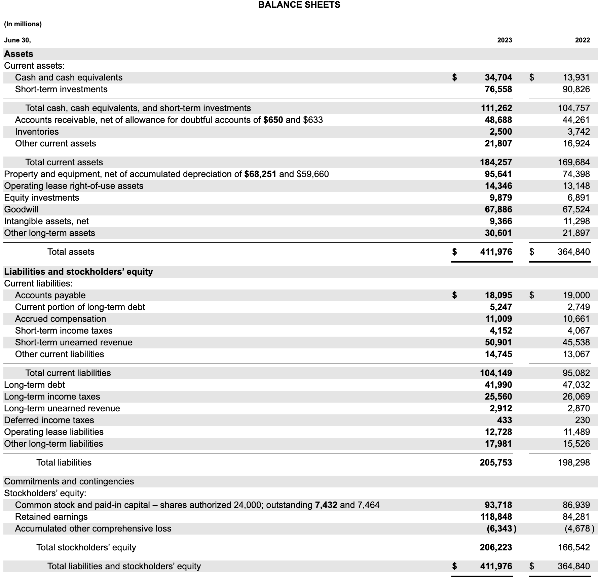](../assets/img/balance-sheet-msft.png "Figure 3: A screenshot of the balance sheet statement of Microsoft in 2023.")

Figure 3: A screenshot of the balance sheet statement of Microsoft in 2023.

While there are more details, the basic structure is exactly the same as in the introduction above. Importantly, the balance sheet obeys the fundamental accounting equation as assets are equal to the sum of liabilities and equity. In subsequent sections, we will explore how to analyze such statements using financial ratios, particularly focusing on measures of liquidity, solvency, and efficiency.

Let us examine Microsoft’s balance sheet statements using the `fmp_get()` function. This function requires three main arguments: The type of financial data to retrieve (`resource`), the stock ticker symbol (`symbol`), and additional parameters like periodicity and number of periods (`params`).

## R

``` r
fmp_get(
  resource = "balance-sheet-statement",
  symbol = "MSFT",
  params = list(period = "annual", limit = 5)
)
```

    # A tibble: 5 × 61
      date       symbol reported_currency cik        filing_date
      <date>     <chr>  <chr>             <chr>      <date>     
    1 2025-06-30 MSFT   USD               0000789019 2025-07-30 
    2 2024-06-30 MSFT   USD               0000789019 2024-07-30 
    3 2023-06-30 MSFT   USD               0000789019 2023-07-27 
    4 2022-06-30 MSFT   USD               0000789019 2022-07-28 
    5 2021-06-30 MSFT   USD               0000789019 2021-07-29 
    # ℹ 56 more variables: accepted_date <dttm>, fiscal_year <chr>,
    #   period <chr>, cash_and_cash_equivalents <dbl>,
    #   short_term_investments <dbl>,
    #   cash_and_short_term_investments <dbl>, net_receivables <dbl>,
    #   accounts_receivables <dbl>, other_receivables <int>,
    #   inventory <dbl>, prepaids <int>, other_current_assets <dbl>,
    #   total_current_assets <dbl>, …

## Python

``` python
pl.from_pandas(
  fmp_get(
    resource="balance-sheet-statement",
    symbol="MSFT",
    params={"period": "annual", "limit": 5},
    to_pandas=True
  )
)
```

shape: (5, 61)

| date | symbol | reported_currency | cik | filing_date | accepted_date | fiscal_year | period | cash_and_cash_equivalents | short_term_investments | cash_and_short_term_investments | net_receivables | accounts_receivables | other_receivables | inventory | prepaids | other_current_assets | total_current_assets | property_plant_equipment_net | goodwill | intangible_assets | goodwill_and_intangible_assets | long_term_investments | tax_assets | other_non_current_assets | total_non_current_assets | other_assets | total_assets | total_payables | account_payables | other_payables | accrued_expenses | short_term_debt | capital_lease_obligations_current | tax_payables | deferred_revenue | other_current_liabilities | total_current_liabilities | long_term_debt | capital_lease_obligations_non_current | deferred_revenue_non_current | deferred_tax_liabilities_non_current | other_non_current_liabilities | total_non_current_liabilities | other_liabilities | capital_lease_obligations | total_liabilities | treasury_stock | preferred_stock | common_stock | retained_earnings | additional_paid_in_capital | accumulated_other_comprehensive_income_loss | other_total_stockholders_equity | total_stockholders_equity | total_equity | minority_interest | total_liabilities_and_total_equity | total_investments | total_debt | net_debt |
|----|----|----|----|----|----|----|----|----|----|----|----|----|----|----|----|----|----|----|----|----|----|----|----|----|----|----|----|----|----|----|----|----|----|----|----|----|----|----|----|----|----|----|----|----|----|----|----|----|----|----|----|----|----|----|----|----|----|----|----|----|
| datetime\[ms\] | str | str | str | datetime\[ms\] | datetime\[μs\] | i32 | str | i64 | i64 | i64 | i64 | i64 | i64 | i64 | i64 | i64 | i64 | i64 | i64 | i64 | i64 | i64 | i64 | i64 | i64 | i64 | i64 | i64 | i64 | i64 | i64 | i64 | i64 | i64 | i64 | i64 | i64 | i64 | i64 | i64 | i64 | i64 | i64 | i64 | i64 | i64 | i64 | i64 | i64 | i64 | i64 | i64 | i64 | i64 | i64 | i64 | i64 | i64 | i64 | i64 |
| 2025-06-30 00:00:00 | "MSFT" | "USD" | "0000789019" | 2025-07-30 00:00:00 | 2025-07-30 16:11:40 | 2025 | "FY" | 30242000000 | 64313000000 | 94555000000 | 69905000000 | 69905000000 | 0 | 938000000 | 0 | 25733000000 | 191131000000 | 229789000000 | 119509000000 | 22604000000 | 142113000000 | 15133000000 | 0 | 40837000000 | 427872000000 | 0 | 619003000000 | 34935000000 | 27724000000 | 7211000000 | 0 | 2999000000 | 8596000000 | 0 | 64555000000 | 30133000000 | 141218000000 | 40152000000 | 60437000000 | 2710000000 | 2835000000 | 28172000000 | 134306000000 | 0 | 69033000000 | 275524000000 | 0 | 0 | 109095000000 | 237731000000 | 0 | -3347000000 | 0 | 343479000000 | 343479000000 | 0 | 619003000000 | 79446000000 | 112184000000 | 81942000000 |
| 2024-06-30 00:00:00 | "MSFT" | "USD" | "0000789019" | 2024-07-30 00:00:00 | 2024-07-30 16:06:22 | 2024 | "FY" | 18315000000 | 57216000000 | 75531000000 | 56924000000 | 56924000000 | 0 | 1246000000 | 0 | 26033000000 | 159734000000 | 154552000000 | 119220000000 | 27597000000 | 146817000000 | 14600000000 | 0 | 36460000000 | 352429000000 | 0 | 512163000000 | 27013000000 | 21996000000 | 5017000000 | 0 | 8942000000 | 5929000000 | 5017000000 | 57582000000 | 25820000000 | 125286000000 | 42688000000 | 40293000000 | 2602000000 | 2618000000 | 30199000000 | 118400000000 | 0 | 46222000000 | 243686000000 | 0 | 0 | 100923000000 | 173144000000 | 0 | -5590000000 | 0 | 268477000000 | 268477000000 | 0 | 512163000000 | 71816000000 | 97852000000 | 79537000000 |
| 2023-06-30 00:00:00 | "MSFT" | "USD" | "0000789019" | 2023-07-27 00:00:00 | 2023-07-27 16:01:56 | 2023 | "FY" | 34704000000 | 76552000000 | 111256000000 | 48688000000 | 48688000000 | 0 | 2500000000 | 0 | 21813000000 | 184257000000 | 109987000000 | 67886000000 | 9366000000 | 77252000000 | 9879000000 | 0 | 30601000000 | 227719000000 | 0 | 411976000000 | 22247000000 | 18095000000 | 4152000000 | 0 | 5247000000 | 3606000000 | 4152000000 | 50901000000 | 22148000000 | 104149000000 | 41990000000 | 28598000000 | 2912000000 | 433000000 | 27671000000 | 101604000000 | 0 | 32204000000 | 205753000000 | 0 | 0 | 93718000000 | 118848000000 | 0 | -6343000000 | 0 | 206223000000 | 206223000000 | 0 | 411976000000 | 86431000000 | 79441000000 | 44737000000 |
| 2022-06-30 00:00:00 | "MSFT" | "USD" | "0000789019" | 2022-07-28 00:00:00 | 2022-07-28 16:06:19 | 2022 | "FY" | 13931000000 | 90818000000 | 104749000000 | 44261000000 | 44261000000 | 0 | 3742000000 | 0 | 16932000000 | 169684000000 | 87546000000 | 67524000000 | 11298000000 | 78822000000 | 6891000000 | 0 | 21897000000 | 195156000000 | 0 | 364840000000 | 23067000000 | 19000000000 | 4067000000 | 0 | 2749000000 | 3288000000 | 4067000000 | 45538000000 | 20440000000 | 95082000000 | 47032000000 | 25331000000 | 2870000000 | 230000000 | 27753000000 | 103216000000 | 0 | 28619000000 | 198298000000 | 0 | 0 | 86939000000 | 84281000000 | 0 | -4678000000 | 0 | 166542000000 | 166542000000 | 0 | 364840000000 | 97709000000 | 78400000000 | 64469000000 |
| 2021-06-30 00:00:00 | "MSFT" | "USD" | "0000789019" | 2021-07-29 00:00:00 | 2021-07-29 16:21:55 | 2021 | "FY" | 14224000000 | 116032000000 | 130256000000 | 38043000000 | 38043000000 | 0 | 2636000000 | 0 | 13471000000 | 184406000000 | 70803000000 | 49711000000 | 7800000000 | 57511000000 | 5984000000 | 0 | 15075000000 | 149373000000 | 0 | 333779000000 | 17337000000 | 15163000000 | 2174000000 | 0 | 8072000000 | 2753000000 | 2174000000 | 41525000000 | 18970000000 | 88657000000 | 50074000000 | 21379000000 | 2616000000 | 198000000 | 28867000000 | 103134000000 | 0 | 24132000000 | 191791000000 | 0 | 0 | 83111000000 | 57055000000 | 0 | 1822000000 | 0 | 141988000000 | 141988000000 | 0 | 333779000000 | 122016000000 | 82278000000 | 68054000000 |

The function returns a data frame containing detailed balance sheet information, with each row representing a different reporting period. This structured format makes it easy to analyze trends over time and calculate financial ratios. We can see how the data aligns with the balance sheet components we discussed earlier, from current assets like cash and receivables to long-term assets and various forms of liabilities and equity.

## Income Statements

While the balance sheet provides a snapshot of a company’s financial position at a point in time, the income statement (also called profit and loss statement or PnL) measures financial performance over a period, typically a quarter or year. It follows a hierarchical structure that progressively captures different levels of profitability:

- Revenue (Sales): The total income generated from goods or services sold.
- Cost of goods sold (COGS): Direct costs associated with producing the goods or services (raw materials, labor, etc.).
- Gross profit: Revenue minus COGS, showing the basic profitability from core operations.
- Operating expenses: Costs related to regular business operations (e.g., salaries, rent, and marketing).
- Operating income (EBIT): Earnings before interest and taxes (measures profitability from core operations before financing and tax costs), often also referred to as operating profit.
- Interest and taxes: The interest paid on debt is deducted for determining the taxable income.
- Net income: The “bottom line”, total profit after all expenses, interest, and taxes are subtracted from revenue.

[Figure 4](#fig-405) illustrates this progression from total revenue to net income, showing how various costs and expenses are subtracted to arrive at different measure of profit.

[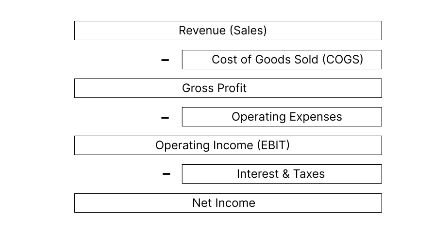](../assets/img/income-statements.svg "Figure 4: A stylized representation of an income statement.")

Figure 4: A stylized representation of an income statement.

Consider Microsoft’s 2023 income statement in [Figure 5](#fig-406), which exemplifies how a leading technology company reports its financial performance:

[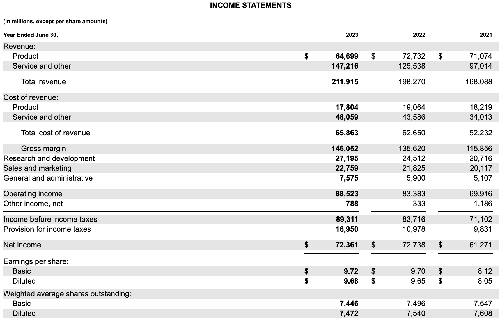](../assets/img/income-statements-msft.png "Figure 5: A screenshot of the income statement of Microsoft in 2023.")

Figure 5: A screenshot of the income statement of Microsoft in 2023.

We can also access this data programmatically using the FMP API:

## R

``` r
fmp_get(
  resource = "income-statement",
  symbol = "MSFT",
  params = list(period = "annual", limit = 5)
)
```

    # A tibble: 5 × 39
      date       symbol reported_currency cik        filing_date
      <date>     <chr>  <chr>             <chr>      <date>     
    1 2025-06-30 MSFT   USD               0000789019 2025-07-30 
    2 2024-06-30 MSFT   USD               0000789019 2024-07-30 
    3 2023-06-30 MSFT   USD               0000789019 2023-07-27 
    4 2022-06-30 MSFT   USD               0000789019 2022-07-28 
    5 2021-06-30 MSFT   USD               0000789019 2021-07-29 
    # ℹ 34 more variables: accepted_date <dttm>, fiscal_year <chr>,
    #   period <chr>, revenue <dbl>, cost_of_revenue <dbl>,
    #   gross_profit <dbl>, research_and_development_expenses <dbl>,
    #   general_and_administrative_expenses <dbl>,
    #   selling_and_marketing_expenses <dbl>,
    #   selling_general_and_administrative_expenses <dbl>,
    #   other_expenses <int>, operating_expenses <dbl>, …

## Python

``` python
pl.from_pandas(
  fmp_get(
    resource="income-statement",
    symbol="MSFT",
    params={"period": "annual", "limit": 5},
    to_pandas=True
  )
)
```

shape: (5, 39)

| date | symbol | reported_currency | cik | filing_date | accepted_date | fiscal_year | period | revenue | cost_of_revenue | gross_profit | research_and_development_expenses | general_and_administrative_expenses | selling_and_marketing_expenses | selling_general_and_administrative_expenses | other_expenses | operating_expenses | cost_and_expenses | net_interest_income | interest_income | interest_expense | depreciation_and_amortization | ebitda | ebit | non_operating_income_excluding_interest | operating_income | total_other_income_expenses_net | income_before_tax | income_tax_expense | net_income_from_continuing_operations | net_income_from_discontinued_operations | other_adjustments_to_net_income | net_income | net_income_deductions | bottom_line_net_income | eps | eps_diluted | weighted_average_shs_out | weighted_average_shs_out_dil |
|----|----|----|----|----|----|----|----|----|----|----|----|----|----|----|----|----|----|----|----|----|----|----|----|----|----|----|----|----|----|----|----|----|----|----|----|----|----|----|
| datetime\[ms\] | str | str | str | datetime\[ms\] | datetime\[μs\] | i32 | str | i64 | i64 | i64 | i64 | i64 | i64 | i64 | i64 | i64 | i64 | i64 | i64 | i64 | i64 | i64 | i64 | i64 | i64 | i64 | i64 | i64 | i64 | i64 | i64 | i64 | i64 | i64 | f64 | f64 | i64 | i64 |
| 2025-06-30 00:00:00 | "MSFT" | "USD" | "0000789019" | 2025-07-30 00:00:00 | 2025-07-30 16:11:40 | 2025 | "FY" | 281724000000 | 87831000000 | 193893000000 | 32488000000 | 7223000000 | 25654000000 | 32877000000 | 0 | 65365000000 | 153196000000 | 262000000 | 2647000000 | 2385000000 | 34153000000 | 160165000000 | 126012000000 | 2516000000 | 128528000000 | -4901000000 | 123627000000 | 21795000000 | 101832000000 | 0 | 0 | 101832000000 | 0 | 101832000000 | 13.7 | 13.64 | 7433000000 | 7465000000 |
| 2024-06-30 00:00:00 | "MSFT" | "USD" | "0000789019" | 2024-07-30 00:00:00 | 2024-07-30 16:06:22 | 2024 | "FY" | 245122000000 | 74114000000 | 171008000000 | 29510000000 | 7609000000 | 24456000000 | 32065000000 | 0 | 61575000000 | 135689000000 | 222000000 | 3157000000 | 2935000000 | 22287000000 | 133009000000 | 110722000000 | -1289000000 | 109433000000 | -1646000000 | 107787000000 | 19651000000 | 88136000000 | 0 | 0 | 88136000000 | 0 | 88136000000 | 11.86 | 11.8 | 7431000000 | 7469000000 |
| 2023-06-30 00:00:00 | "MSFT" | "USD" | "0000789019" | 2023-07-27 00:00:00 | 2023-07-27 16:01:56 | 2023 | "FY" | 211915000000 | 65863000000 | 146052000000 | 27195000000 | 7575000000 | 22759000000 | 30334000000 | 0 | 57529000000 | 123392000000 | 1026000000 | 2994000000 | 1968000000 | 13861000000 | 105140000000 | 91279000000 | -2756000000 | 88523000000 | 788000000 | 89311000000 | 16950000000 | 72361000000 | 0 | 0 | 72361000000 | 0 | 72361000000 | 9.72 | 9.68 | 7446000000 | 7472000000 |
| 2022-06-30 00:00:00 | "MSFT" | "USD" | "0000789019" | 2022-07-28 00:00:00 | 2022-07-28 16:06:19 | 2022 | "FY" | 198270000000 | 62650000000 | 135620000000 | 24512000000 | 5900000000 | 21825000000 | 27725000000 | 0 | 52237000000 | 114887000000 | 31000000 | 2094000000 | 2063000000 | 14460000000 | 100239000000 | 85779000000 | -2396000000 | 83383000000 | 333000000 | 83716000000 | 10978000000 | 72738000000 | 0 | 0 | 72738000000 | 0 | 72738000000 | 9.7 | 9.65 | 7496000000 | 7540000000 |
| 2021-06-30 00:00:00 | "MSFT" | "USD" | "0000789019" | 2021-07-29 00:00:00 | 2021-07-29 16:21:55 | 2021 | "FY" | 168088000000 | 52232000000 | 115856000000 | 20716000000 | 5107000000 | 20117000000 | 25224000000 | 0 | 45940000000 | 98172000000 | -215000000 | 2131000000 | 2346000000 | 11686000000 | 85134000000 | 73448000000 | -3532000000 | 69916000000 | 1186000000 | 71102000000 | 9831000000 | 61271000000 | 0 | 0 | 61271000000 | 0 | 61271000000 | 8.12 | 8.05 | 7547000000 | 7608000000 |

In later sections, we will use income statement items to calculate important profitability ratios and examine how they compare across companies and industries. The income statement’s focus on performance complements the balance sheet’s position snapshot, providing a more complete picture of a company’s core business operations.

## Cash Flow Statements

The cash flow statement complements the balance sheet and income statement by tracking the actual movement of cash through the business. While the income statement shows profitability and the balance sheet shows financial position, the cash flow statement reveals a company’s ability to generate and manage cash - a crucial aspect of every business. The statement is divided into three main categories:

- Operating activities: Cash generated from a company’s core business activities (i.e., net income adjusted for non-cash items like depreciation and changes in working capital).
- Financing activities: Cash flows related to borrowing, repaying debt, issuing equity, or paying dividends.
- Investing activities: Cash spent on or received from long-term investments, such as purchasing or selling property and equipment.

[Figure 6](#fig-407) illustrates these three categories of cash flows, which map into changes in the company’s cash balance.

[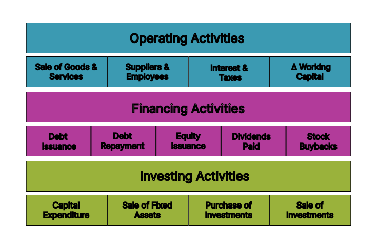](../assets/img/cash-flow-statements.svg "Figure 6: A stylized representation of a cash flow statement.")

Figure 6: A stylized representation of a cash flow statement.

The statement reconciles accrual-based accounting (used in the income statement) with actual cash movements. This reconciliation is crucial because profitable companies can still face cash shortages, and unprofitable companies might maintain positive cash flow. We complement the brief introduction, by Microsoft’s 2023 cash flow statement in [Figure 7](#fig-408).

[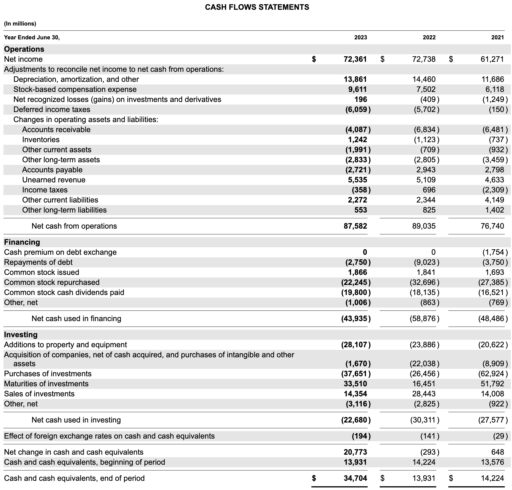](../assets/img/cash-flow-statements-msft.png "Figure 7: A screenshot of the cash flow statement of Microsoft in 2023.")

Figure 7: A screenshot of the cash flow statement of Microsoft in 2023.

Of course, we can access this data through the FMP API:

## R

``` r
fmp_get(
  resource = "cash-flow-statement",
  symbol = "MSFT",
  params = list(period = "annual", limit = 5)
)
```

    # A tibble: 5 × 47
      date       symbol reported_currency cik        filing_date
      <date>     <chr>  <chr>             <chr>      <date>     
    1 2025-06-30 MSFT   USD               0000789019 2025-07-30 
    2 2024-06-30 MSFT   USD               0000789019 2024-07-30 
    3 2023-06-30 MSFT   USD               0000789019 2023-07-27 
    4 2022-06-30 MSFT   USD               0000789019 2022-07-28 
    5 2021-06-30 MSFT   USD               0000789019 2021-07-29 
    # ℹ 42 more variables: accepted_date <dttm>, fiscal_year <chr>,
    #   period <chr>, net_income <dbl>,
    #   depreciation_and_amortization <dbl>, deferred_income_tax <dbl>,
    #   stock_based_compensation <dbl>, change_in_working_capital <dbl>,
    #   accounts_receivables <dbl>, inventory <int>,
    #   accounts_payables <dbl>, other_working_capital <dbl>,
    #   other_non_cash_items <int>, …

## Python

``` python
pl.from_pandas(
  fmp_get(
    resource="cash-flow-statement",
    symbol="MSFT",
    params={"period": "annual", "limit": 5},
    to_pandas=True
  )
)
```

shape: (5, 47)

| date | symbol | reported_currency | cik | filing_date | accepted_date | fiscal_year | period | net_income | depreciation_and_amortization | deferred_income_tax | stock_based_compensation | change_in_working_capital | accounts_receivables | inventory | accounts_payables | other_working_capital | other_non_cash_items | net_cash_provided_by_operating_activities | investments_in_property_plant_and_equipment | acquisitions_net | purchases_of_investments | sales_maturities_of_investments | other_investing_activities | net_cash_provided_by_investing_activities | net_debt_issuance | long_term_net_debt_issuance | short_term_net_debt_issuance | net_stock_issuance | net_common_stock_issuance | common_stock_issuance | common_stock_repurchased | net_preferred_stock_issuance | net_dividends_paid | common_dividends_paid | preferred_dividends_paid | other_financing_activities | net_cash_provided_by_financing_activities | effect_of_forex_changes_on_cash | net_change_in_cash | cash_at_end_of_period | cash_at_beginning_of_period | operating_cash_flow | capital_expenditure | free_cash_flow | income_taxes_paid | interest_paid |
|----|----|----|----|----|----|----|----|----|----|----|----|----|----|----|----|----|----|----|----|----|----|----|----|----|----|----|----|----|----|----|----|----|----|----|----|----|----|----|----|----|----|----|----|----|----|----|
| datetime\[ms\] | str | str | str | datetime\[ms\] | datetime\[μs\] | i32 | str | i64 | i64 | i64 | i64 | i64 | i64 | i64 | i64 | i64 | i64 | i64 | i64 | i64 | i64 | i64 | i64 | i64 | i64 | i64 | i64 | i64 | i64 | i64 | i64 | i64 | i64 | i64 | i64 | i64 | i64 | i64 | i64 | i64 | i64 | i64 | i64 | i64 | i64 | i64 |
| 2025-06-30 00:00:00 | "MSFT" | "USD" | "0000789019" | 2025-07-30 00:00:00 | 2025-07-30 16:11:40 | 2025 | "FY" | 101832000000 | 34153000000 | -7056000000 | 11974000000 | -5350000000 | -10581000000 | 309000000 | 569000000 | 4353000000 | 609000000 | 136162000000 | -64551000000 | -5978000000 | -29775000000 | 25388000000 | 2317000000 | -72599000000 | -8962000000 | -3216000000 | -5746000000 | -16364000000 | -16364000000 | 2056000000 | -18420000000 | 0 | -24082000000 | -24082000000 | 0 | -2291000000 | -51699000000 | 63000000 | 11927000000 | 30242000000 | 18315000000 | 136162000000 | -64551000000 | 71611000000 | 0 | 0 |
| 2024-06-30 00:00:00 | "MSFT" | "USD" | "0000789019" | 2024-07-30 00:00:00 | 2024-07-30 16:06:22 | 2024 | "FY" | 88136000000 | 22287000000 | -4738000000 | 10734000000 | 1824000000 | -7191000000 | 1284000000 | 3545000000 | 4186000000 | 305000000 | 118548000000 | -44477000000 | -69132000000 | -17732000000 | 35669000000 | -1298000000 | -96970000000 | 575000000 | -4675000000 | 5250000000 | -15252000000 | -15252000000 | 2002000000 | -17254000000 | 0 | -21771000000 | -21771000000 | 0 | -1309000000 | -37757000000 | -210000000 | -16389000000 | 18315000000 | 34704000000 | 118548000000 | -44477000000 | 74071000000 | 0 | 0 |
| 2023-06-30 00:00:00 | "MSFT" | "USD" | "0000789019" | 2023-07-27 00:00:00 | 2023-07-27 16:01:56 | 2023 | "FY" | 72361000000 | 13861000000 | -6059000000 | 9611000000 | -2388000000 | -4087000000 | 1242000000 | -2721000000 | 3178000000 | 196000000 | 87582000000 | -28107000000 | -1670000000 | -37651000000 | 47864000000 | -3116000000 | -22680000000 | -2750000000 | -2750000000 | 0 | -20379000000 | -20379000000 | 1866000000 | -22245000000 | 0 | -19800000000 | -19800000000 | 0 | -1006000000 | -43935000000 | -194000000 | 20773000000 | 34704000000 | 13931000000 | 87582000000 | -28107000000 | 59475000000 | 0 | 0 |
| 2022-06-30 00:00:00 | "MSFT" | "USD" | "0000789019" | 2022-07-28 00:00:00 | 2022-07-28 16:06:19 | 2022 | "FY" | 72738000000 | 14460000000 | -5702000000 | 7502000000 | 446000000 | -6834000000 | -1123000000 | 2943000000 | 5460000000 | -409000000 | 89035000000 | -23886000000 | -22038000000 | -26456000000 | 44894000000 | -2825000000 | -30311000000 | -9023000000 | -9023000000 | 0 | -30855000000 | -30855000000 | 1841000000 | -32696000000 | 0 | -18135000000 | -18135000000 | 0 | -863000000 | -58876000000 | -141000000 | -293000000 | 13931000000 | 14224000000 | 89035000000 | -23886000000 | 65149000000 | 0 | 0 |
| 2021-06-30 00:00:00 | "MSFT" | "USD" | "0000789019" | 2021-07-29 00:00:00 | 2021-07-29 16:21:55 | 2021 | "FY" | 61271000000 | 11686000000 | -150000000 | 6118000000 | -936000000 | -6481000000 | -737000000 | 2798000000 | 3484000000 | -1249000000 | 76740000000 | -20622000000 | -8909000000 | -62924000000 | 65800000000 | -922000000 | -27577000000 | -3750000000 | -3750000000 | 0 | -25692000000 | -25692000000 | 1693000000 | -27385000000 | 0 | -16521000000 | -16521000000 | 0 | -2523000000 | -48486000000 | -29000000 | 648000000 | 14224000000 | 13576000000 | 76740000000 | -20622000000 | 56118000000 | 0 | 0 |

In subsequent sections, we will use cash flow data to calculate important cash flow ratios that help assess a company’s liquidity, capital allocation efficiency, and overall financial sustainability. The combination of all three financial statements - balance sheet, income statement, and cash flow statement - provides a comprehensive view of a company’s financial health and performance.

## Download Financial Statements

We now turn to downloading and processing statements for multiple companies. The next code chunk demonstrates how to retrieve financial data for selected stocks that are supported in the free tier of FMP.

## R

``` r
sample <- c(
  "AAPL",
  "MSFT",
  "GOOGL",
  "AMZN",
  "TSLA",
  "NVDA",
  "META",
  "NFLX",
  "DIS",
  "NKE",
  "WMT",
  "KO",
  "JPM",
  "BAC",
  "V",
  "XOM",
  "CVX",
  "JNJ",
  "PFE",
  "INTC",
  "AMD",
  "SBUX",
  "BABA",
  "UBER",
  "CSCO"
)

params <- list(period = "annual", limit = 5)

balance_sheet_statements <- sample |>
  map_df(
    \(x) {
      fmp_get(resource = "balance-sheet-statement", symbol = x, params = params)
    }
  )

income_statements <- sample |>
  map_df(
    \(x) fmp_get(resource = "income-statement", symbol = x, params = params)
  )

cash_flow_statements <- sample |>
  map_df(
    \(x) fmp_get(resource = "cash-flow-statement", symbol = x, params = params)
  )
```

## Python

``` python
sample = [
  "AAPL", "MSFT", "GOOGL", "AMZN", "TSLA", "NVDA", "META", "NFLX", "DIS", "NKE",
  "WMT", "KO", "JPM", "BAC", "V", "XOM", "CVX", "JNJ", "PFE", "INTC",
  "AMD", "SBUX", "BABA", "UBER", "CSCO"
]

params = {"period": "annual", "limit": 5}

balance_sheet_statements = pl.concat(
  [pl.from_pandas(fmp_get(
      resource="balance-sheet-statement", symbol=x, params=params, to_pandas=True
    )) for x in sample]
)

income_statements = pl.concat(
  [pl.from_pandas(fmp_get(
      resource="income-statement", symbol=x, params=params, to_pandas=True
    )) for x in sample]
)

cash_flow_statements = pl.concat(
  [pl.from_pandas(fmp_get(
      resource="cash-flow-statement", symbol=x, params=params, to_pandas=True
    )) for x in sample]
)
```

The resulting data sets provide a foundation for cross-sectional analyses of financial ratios and trends across major U.S. companies. In the following sections, we use these data sets to calculate various financial ratios and analyze patterns in corporate financial performance.

## Liquidity Ratios

Liquidity ratios assess a company’s ability to meet its short-term obligations and are typically calculated using balance sheet items. These ratios are particularly important for creditors and investors concerned about a company’s short-term financial health and ability to cover immediate obligations.

The Current Ratio is the most basic measure of liquidity, comparing all current assets to current liabilities:

\\\text{Current Ratio} = \frac{\text{Current Assets}}{\text{Current Liabilities}}\\

A ratio above one indicates that the company has enough current assets to cover its current liabilities, which are due within one year as discussed above.

However, not all current assets are equally liquid, i.e., can be easily sold to meet a company’s obligations. This aspect is reflected in the Quick Ratio:

\\\text{Quick Ratio} = \frac{\text{Current Assets - Inventory}}{\text{Current Liabilities}}\\

The Quick Ratio provides a more stringent measure of liquidity by excluding inventory, which is typically the least liquid current asset. Furthermore, a company without inventory for production or sale will have a difficult operating position. A ratio above one suggests strong short-term solvency without relying on selling off inventory.

The most conservative liquidity measure is the Cash Ratio:

\\\text{Cash Ratio} = \frac{\text{Cash and Cash Equivalents}}{\text{Current Liabilities}}\\

This ratio focuses solely on the most liquid assets - cash and cash equivalents. While a ratio of one indicates robust liquidity, most companies maintain lower cash ratios to avoid holding excessive non-productive assets. After all, all that cash could also be distributed to equity or pay down costly debt.

Next, we calculate these ratios for all stocks, focusing on four major technology companies:

## R

``` r
selected_symbols <- c("MSFT", "AAPL", "AMZN", "NVDA")

balance_sheet_statements <- balance_sheet_statements |>
  mutate(
    fiscal_year = as.integer(fiscal_year),
    current_ratio = total_current_assets / total_current_liabilities,
    quick_ratio = (total_current_assets - inventory) /
      total_current_liabilities,
    cash_ratio = cash_and_cash_equivalents / total_current_liabilities,
    label = if_else(symbol %in% selected_symbols, symbol, NA),
  )
```

## Python

``` python
selected_symbols = ["MSFT", "AAPL", "AMZN", "NVDA"]

balance_sheet_statements = (balance_sheet_statements
  .with_columns(
    fiscal_year=pl.col("fiscal_year").cast(pl.Int64),
    current_ratio=pl.col("total_current_assets") / pl.col("total_current_liabilities"),
    quick_ratio=(pl.col("total_current_assets") - pl.col("inventory")) / pl.col("total_current_liabilities"),
    cash_ratio=pl.col("cash_and_cash_equivalents") / pl.col("total_current_liabilities"),
    label=pl.when(pl.col("symbol").is_in(selected_symbols)).then(pl.col("symbol")).otherwise(None)
  )
)
```

[Figure 8](#fig-409) compares the three liquidity ratios across Microsoft, Apple, and Amazon for 2023. We call such an analysis a cross-sectional comparison.

## R

``` r
balance_sheet_statements |>
  filter(fiscal_year == 2023 & !is.na(label)) |>
  select(symbol, contains("ratio")) |>
  pivot_longer(-symbol) |>
  mutate(name = str_to_title(str_replace_all(name, "_", " "))) |>
  ggplot(aes(x = value, y = name, fill = symbol)) +
  geom_col(position = "dodge") +
  scale_x_continuous(labels = percent) +
  labs(
    x = NULL,
    y = NULL,
    fill = NULL,
    title = "Liquidity ratios for selected stocks for 2023"
  )
```

[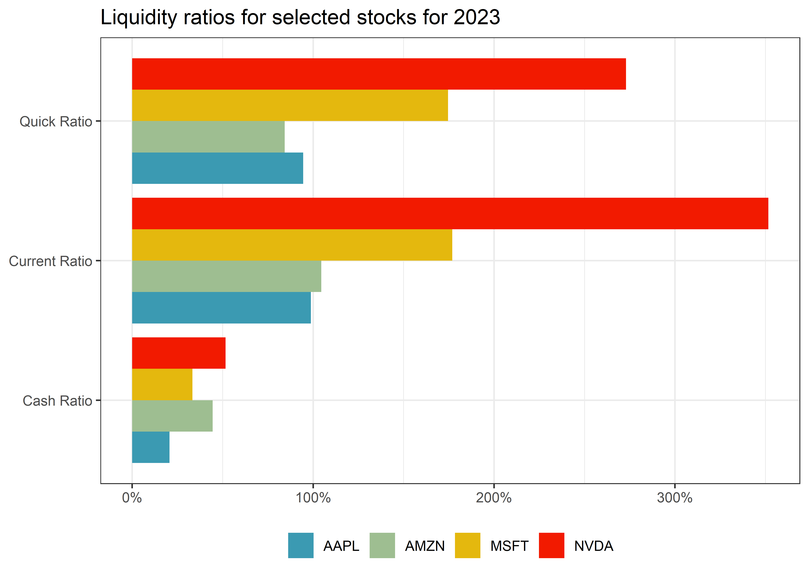](financial-statement-analysis_files/figure-html/fig-409-1.png "Figure 8: Liquidity ratios are based on financial statements provided through the FMP API.")

Figure 8: Liquidity ratios are based on financial statements provided through the FMP API.

## Python

``` python
liquidity_ratios = (balance_sheet_statements
  .filter((pl.col("fiscal_year") == 2023) & pl.col("label").is_not_null())
  .select(["symbol", "current_ratio", "quick_ratio", "cash_ratio"])
  .unpivot(index=["symbol"], variable_name="name", value_name="value")
  .with_columns(
    name=pl.col("name").str.replace_all("_", " ").str.to_titlecase()
  )
)

liquidity_ratios_figure = (
  ggplot(
    liquidity_ratios,
    aes(y="value", x="name", fill="symbol")
  )
  + geom_col(position="dodge")
  + coord_flip()
  + scale_y_continuous(labels=percent_format())
  + labs(
      x="", y="", fill="",
      title="Liquidity ratios for selected stocks for 2023"
    )
)
liquidity_ratios_figure.show()
```

[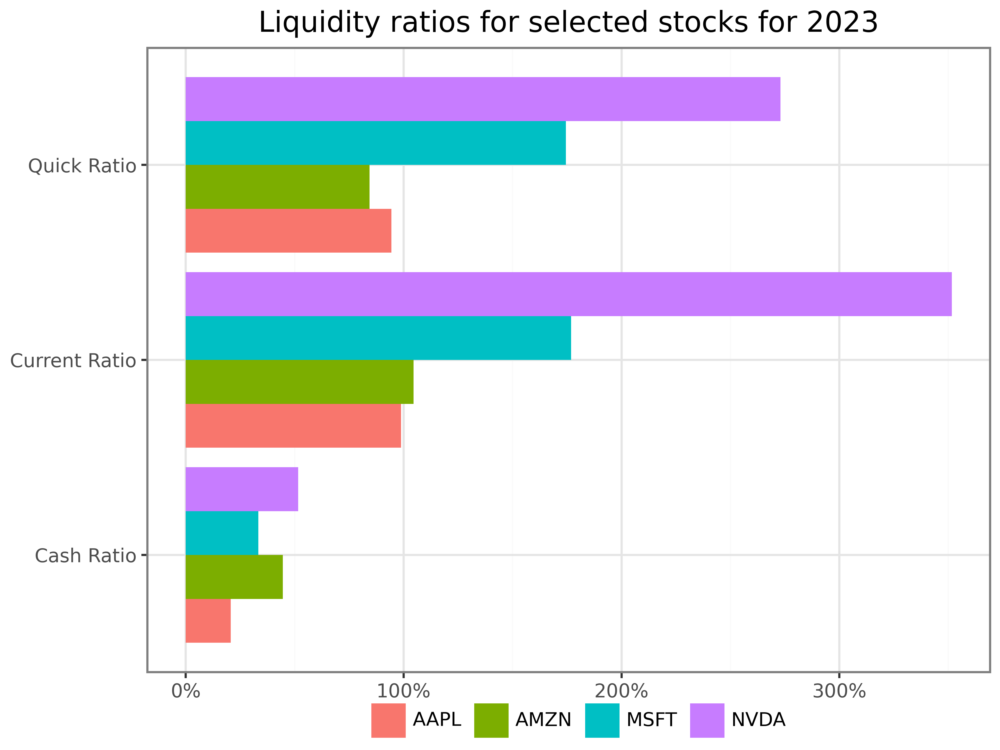](financial-statement-analysis_files/figure-html/fsa-fig-409-py-1.png "Liquidity ratios are based on financial statements provided through the FMP API.")

Liquidity ratios are based on financial statements provided through the FMP API.

While we are not commenting on the ratios in detail here, the liquidity ratios for Microsoft, Apple, and Amazon in 2023 reveal distinct patterns. Generally, higher liquidity ratios signal a more conservative approach by holding larger liquidity buffers in the company.

## Leverage Ratios

Leverage ratios assess a company’s capital structure, in particular, its mix between debt and equity. These metrics are crucial for understanding the company’s financial risk and long-term solvency. We examine three key leverage measures.

The debt-to-equity ratio indicates how much a company is financing its operations through debt versus shareholders’ equity:

\\\text{Debt-to-Equity} = \frac{\text{Total Debt}}{\text{Total Equity}}\\

The debt-to-asset ratio shows the percentage of assets financed through debt:

\\\text{Debt-to-Asset} = \frac{\text{Total Debt}}{\text{Total Assets}}\\

Interest coverage measures a company’s ability to meet interest payments:

\\\text{Interest Coverage} = \frac{\text{EBIT}}{\text{Interest Expense}}\\

Let’s calculate these ratios for our sample of companies:

## R

``` r
balance_sheet_statements <- balance_sheet_statements |>
  mutate(
    debt_to_equity = total_debt / total_equity,
    debt_to_asset = total_debt / total_assets
  )

income_statements <- income_statements |>
  mutate(
    fiscal_year = as.integer(fiscal_year),
    interest_coverage = operating_income / interest_expense,
    label = if_else(symbol %in% selected_symbols, symbol, NA),
  )
```

## Python

``` python
balance_sheet_statements = balance_sheet_statements.with_columns(
  debt_to_equity=pl.col("total_debt") / pl.col("total_equity"),
  debt_to_asset=pl.col("total_debt") / pl.col("total_assets")
)

income_statements = income_statements.with_columns(
  fiscal_year=pl.col("fiscal_year").cast(pl.Int64),
  interest_coverage=pl.col("operating_income") / pl.col("interest_expense"),
  label=pl.when(pl.col("symbol").is_in(selected_symbols)).then(pl.col("symbol")).otherwise(None)
)
```

[Figure 9](#fig-410) tracks the evolution of debt-to-asset ratios for Microsoft, Apple, and Amazon over time:

## R

``` r
balance_sheet_statements |>
  filter(symbol %in% selected_symbols) |>
  ggplot(aes(x = fiscal_year, y = debt_to_asset, color = symbol)) +
  geom_line(linewidth = 1) +
  scale_y_continuous(labels = percent) +
  labs(
    x = NULL,
    y = NULL,
    color = NULL,
    title = "Debt-to-asset ratios of selected stocks between 2020 and 2024"
  )
```

[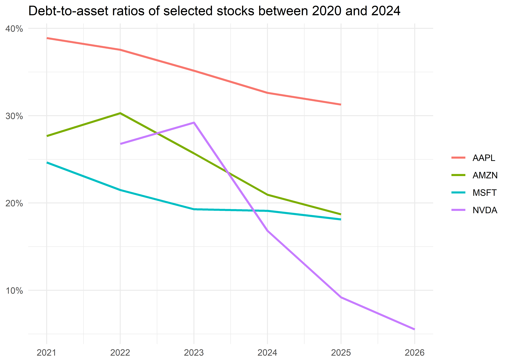](financial-statement-analysis_files/figure-html/fig-410-1.png "Figure 9: Debt-to-asset ratios are based on financial statements provided through the FMP API.")

Figure 9: Debt-to-asset ratios are based on financial statements provided through the FMP API.

## Python

``` python
debt_to_asset = (balance_sheet_statements
  .filter(pl.col("symbol").is_in(selected_symbols))
)

debt_to_asset_figure = (
  ggplot(
    debt_to_asset,
    aes(x="fiscal_year", y="debt_to_asset", color="symbol")
  )
  + geom_line(size=1)
  + scale_y_continuous(labels=percent_format())
  + labs(
      x="", y="", color="",
      title="Debt-to-asset ratios of selected stocks between 2020 and 2024"
    )
)
debt_to_asset_figure.show()
```

[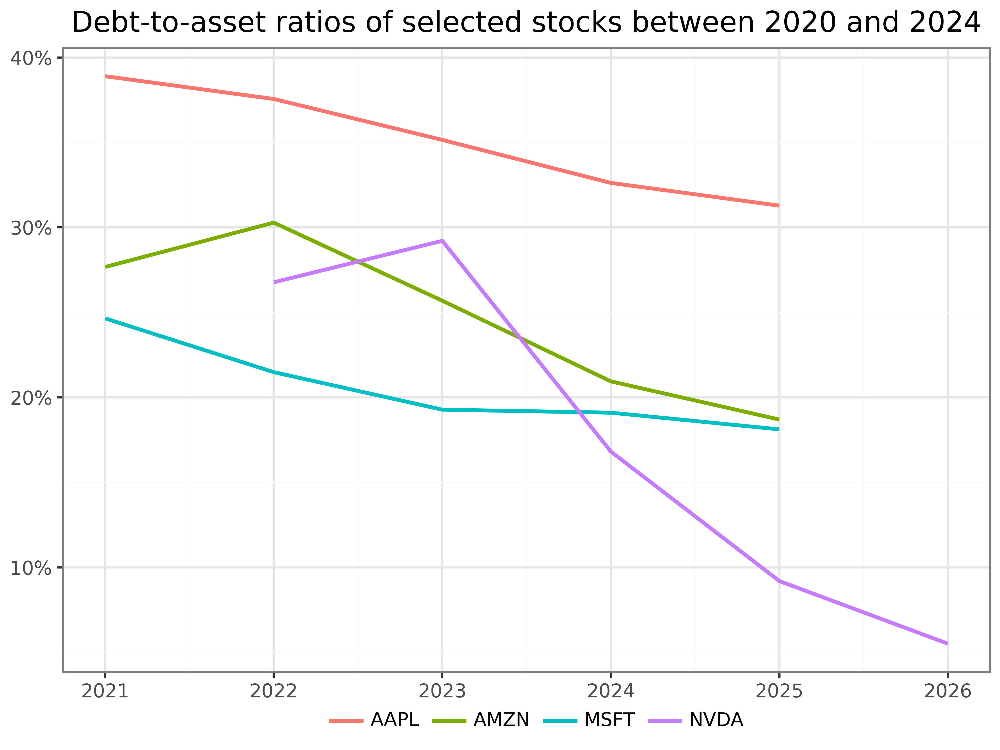](financial-statement-analysis_files/figure-html/fsa-fig-410-py-1.png "Debt-to-asset ratios are based on financial statements provided through the FMP API.")

Debt-to-asset ratios are based on financial statements provided through the FMP API.

The evolution of debt-to-asset ratios among these major technology companies reveals distinct capital structure strategies and their changes over time. While Apple and Microsoft reduced leverage over time, Amazon has maintained its leverage level.

[Figure 10](#fig-411) provides a cross-sectional view of debt-to-asset ratios across our sample in 2023.

## R

``` r
selected_colors <- c("#F21A00", "#EBCC2A", "#78B7C5", "#3B9AB2", "lightgrey")

balance_sheet_statements |>
  filter(fiscal_year == 2023) |>
  ggplot(
    aes(x = debt_to_asset, y = fct_reorder(symbol, debt_to_asset), fill = label)
  ) +
  geom_col() +
  scale_x_continuous(labels = percent) +
  scale_fill_manual(values = selected_colors) +
  labs(
    x = NULL,
    y = NULL,
    color = NULL,
    title = "Debt-to-asset ratios of selected stocks in 2023"
  ) +
  theme(legend.position = "none")
```

[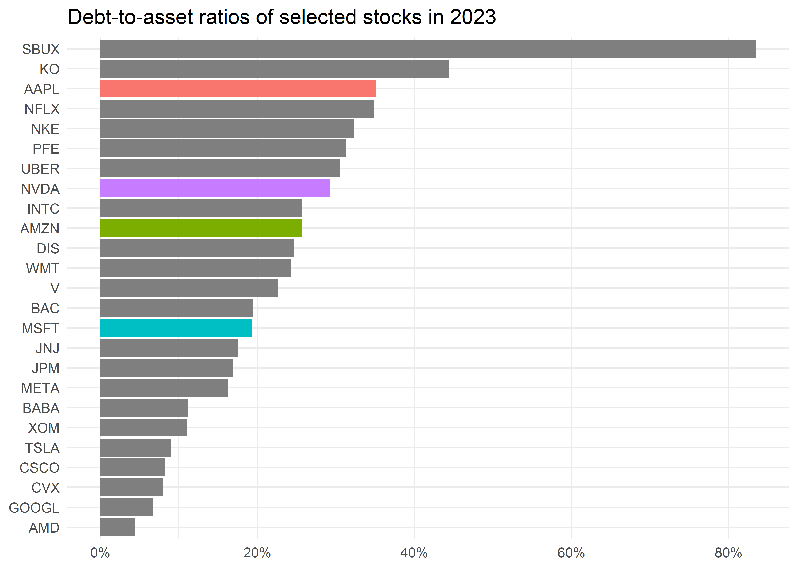](financial-statement-analysis_files/figure-html/fig-411-3.png "Figure 10: Debt-to-asset ratios are based on financial statements provided through the FMP API.")

Figure 10: Debt-to-asset ratios are based on financial statements provided through the FMP API.

## Python

``` python
selected_colors = ["#F21A00", "#EBCC2A", "#78B7C5", "#3B9AB2", "lightgrey"]

debt_to_asset_comparison = (balance_sheet_statements
  .filter(pl.col("fiscal_year") == 2023)
)

symbol_order = (debt_to_asset_comparison
  .sort("debt_to_asset")["symbol"]
  .to_list()
)
debt_to_asset_comparison = debt_to_asset_comparison.with_columns(
  symbol=pl.col("symbol").cast(pl.Enum(symbol_order))
)

debt_to_asset_comparison_figure = (
  ggplot(
    debt_to_asset_comparison,
    aes(y="debt_to_asset", x="symbol", fill="label")
  )
  + geom_col()
  + coord_flip()
  + scale_y_continuous(labels=percent_format())
  + scale_fill_manual(values=selected_colors)
  + labs(
      x="", y="", fill="",
      title="Debt-to-asset ratios of selected stocks in 2023"
    )
  + theme(legend_position="none")
)
debt_to_asset_comparison_figure.show()
```

[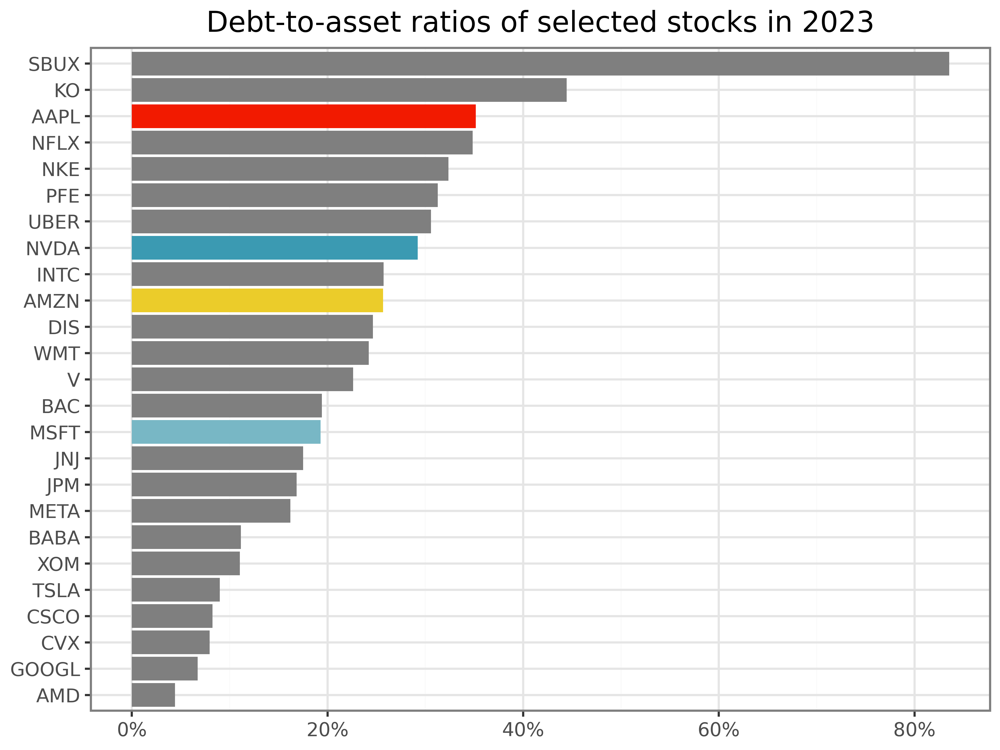](financial-statement-analysis_files/figure-html/fsa-fig-411-py-1.png "Debt-to-asset ratios are based on financial statements provided through the FMP API.")

Debt-to-asset ratios are based on financial statements provided through the FMP API.

[Figure 11](#fig-412) reveals the relationship between companies’ debt levels and their ability to service that debt.

## R

``` r
income_statements |>
  filter(fiscal_year == 2023) |>
  select(symbol, interest_coverage, fiscal_year) |>
  left_join(
    balance_sheet_statements,
    join_by(symbol, fiscal_year)
  ) |>
  ggplot(aes(x = debt_to_asset, y = interest_coverage, color = label)) +
  geom_point(size = 2) +
  geom_label_repel(aes(label = label), seed = 42, box.padding = 0.75) +
  scale_x_continuous(labels = percent) +
  scale_y_continuous(labels = percent) +
  scale_color_manual(values = selected_colors) +
  labs(
    x = "Debt-to-Asset",
    y = "Interest Coverage",
    title = "Debt-to-asset ratios and interest coverages for selected stocks"
  ) +
  theme(legend.position = "none")
```

[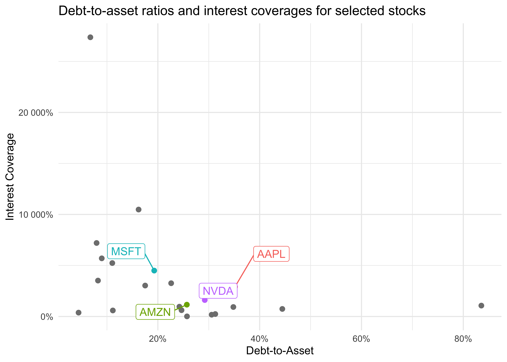](financial-statement-analysis_files/figure-html/fig-412-3.png "Figure 11: Debt-to-asset ratios and interest coverages are based on financial statements provided through the FMP API.")

Figure 11: Debt-to-asset ratios and interest coverages are based on financial statements provided through the FMP API.

## Python

``` python
interest_coverage = (income_statements
  .filter(pl.col("fiscal_year") == 2023)
  .select(["symbol", "fiscal_year", "interest_coverage"])
  .join(balance_sheet_statements, on=["symbol", "fiscal_year"], how="left")
)

interest_coverage_figure = (
  ggplot(
    interest_coverage,
    aes(x="debt_to_asset", y="interest_coverage", color="label")
  )
  + geom_point(size=2)
  + geom_label(aes(label="label"), adjust_text={"arrowprops": {"arrowstyle": "-"}})
  + scale_x_continuous(labels=percent_format())
  + scale_y_continuous(labels=percent_format())
  + scale_color_manual(values=selected_colors)
  + labs(
      x="Debt-to-Asset", y="Interest Coverage",
      title="Debt-to-asset ratios and interest coverages for selected stocks"
    )
  + theme(legend_position="none")
)
interest_coverage_figure.show()
```

[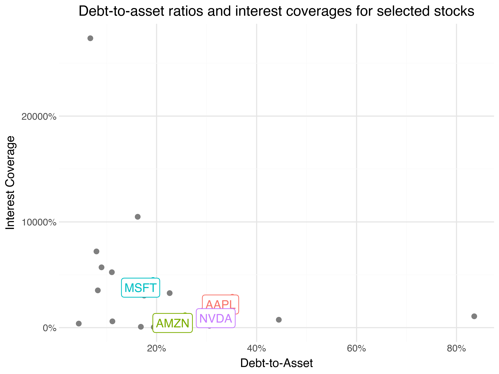](financial-statement-analysis_files/figure-html/fsa-fig-412-py-1.png "Debt-to-asset ratios and interest coverages are based on financial statements provided through the FMP API.")

Debt-to-asset ratios and interest coverages are based on financial statements provided through the FMP API.

The scatter plot suggests that companies with higher debt-to-asset ratios tend to have lower interest coverage ratios, though there’s considerable variation in this relation. Quantification of this relation is left as an exercise.

## Efficiency Ratios

Efficiency ratios measure how a company utilizes its assets and manages its operations. These metrics help us to understand operational performance and management effectiveness, particularly in how well a company converts its various assets into revenue and profit.

Asset Turnover measures how efficiently a company uses its total assets to generate revenue:

\\\text{Asset Turnover} = \frac{\text{Revenue}}{\text{Total Assets}}\\

A higher ratio indicates more efficient use of assets in generating sales. However, this ratio typically varies significantly across industries - retail companies often have higher turnover ratios due to lower asset requirements, while manufacturing companies might show lower ratios due to substantial fixed asset investments. Such industry-specifics show the importance of cross-sectional comparisons, when making decisions based on data.

Inventory turnover indicates how many times a company’s inventory is sold and replaced over a period:

\\\text{Inventory Turnover} = \frac{\text{COGS}}{\text{Inventory}}\\

Higher inventory turnover suggests more efficient inventory management and working capital utilization. However, extremely high ratios might indicate potential stockouts, while very low ratios could suggest obsolete inventory or overinvestment in working capital.

Receivables turnover measures how effectively a company collects payments from customers:

\\\text{Receivables Turnover} = \frac{\text{Revenue}}{\text{Accounts Receivable}}\\ A higher ratio indicates more efficient credit and collection processes, though this must be balanced against the potential impact on sales from overly restrictive credit policies.

Here is how we can calculate these efficiency metrics across our sample of companies:

## R

``` r
combined_statements <- balance_sheet_statements |>
  select(
    symbol,
    fiscal_year,
    label,
    current_ratio,
    quick_ratio,
    cash_ratio,
    debt_to_equity,
    debt_to_asset,
    total_assets,
    total_equity
  ) |>
  left_join(
    income_statements |>
      select(
        symbol,
        fiscal_year,
        interest_coverage,
        revenue,
        cost_of_revenue,
        selling_general_and_administrative_expenses,
        interest_expense,
        gross_profit,
        net_income
      ),
    join_by(symbol, fiscal_year)
  ) |>
  left_join(
    cash_flow_statements |>
      mutate(fiscal_year = as.integer(fiscal_year)) |>
      select(symbol, fiscal_year, inventory, accounts_receivables),
    join_by(symbol, fiscal_year)
  )

combined_statements <- combined_statements |>
  mutate(
    asset_turnover = revenue / total_assets,
    inventory_turnover = cost_of_revenue / inventory,
    receivables_turnover = revenue / accounts_receivables
  )
```

## Python

``` python
combined_statements = (balance_sheet_statements
  .select(
    ["symbol", "fiscal_year", "label", "current_ratio", "quick_ratio",
     "cash_ratio", "debt_to_equity", "debt_to_asset", "total_assets",
     "total_equity"]
  )
  .join(
    (income_statements
      .select(["symbol", "fiscal_year", "interest_coverage", "revenue",
            "cost_of_revenue", "selling_general_and_administrative_expenses",
            "interest_expense","gross_profit", "net_income"])
    ),
    on=["symbol", "fiscal_year"],
    how="left"
  )
  .join(
    (cash_flow_statements
      .with_columns(fiscal_year=pl.col("fiscal_year").cast(pl.Int64))
      .select(["symbol", "fiscal_year", "inventory", "accounts_receivables"])
    ),
    on=["symbol", "fiscal_year"],
    how="left"
  )
)

combined_statements = (combined_statements
  .with_columns(
    asset_turnover=pl.col("revenue") / pl.col("total_assets"),
    inventory_turnover=pl.col("cost_of_revenue") / pl.col("inventory"),
    receivables_turnover=pl.col("revenue") / pl.col("accounts_receivables")
  )
)
```

We leave the visualization and interpretation of these figures as an exercise and move on to the last category of financial ratios.

## Profitability Ratios

Profitability ratios evaluate a company’s ability to generate earnings relative to its revenue, assets, and equity. These metrics are fundamental to investment analysis as they directly measure a company’s operational efficiency and financial success.

The gross margin measures what percentage of revenue remains after accounting for the direct costs of producing goods or services:

\\\text{Gross Margin} = \frac{\text{Gross Profit}}{\text{Revenue}}\\

A higher gross margin indicates stronger pricing power or more efficient production processes. This metric is particularly useful for comparing companies within the same industry, as it reveals their relative efficiency in core operations before accounting for operating expenses and other costs.

The profit margin reveals what percentage of revenue ultimately becomes net income:

\\\text{Profit Margin} = \frac{\text{Net Income}}{\text{Revenue}}\\ This comprehensive profitability measure accounts for all costs, expenses, interest, and taxes. A higher profit margin suggests more effective overall cost management and stronger competitive position, though optimal margins vary significantly across industries.

Return on Equity (ROE) measures how efficiently a company uses shareholders’ investments to generate profits:

\\\text{After-Tax ROE} = \frac{\text{Net Income}}{\text{Total Equity}}\\ This metric is particularly important for investors as it directly measures the return on their invested capital (at least in terms of book value of equity). A higher ROE indicates more effective use of shareholders’ equity, though it must be considered alongside leverage ratios since high debt levels can artificially inflate ROE.

The next code chunk calculates these profitability metrics for our sample of companies, allowing us to analyze how different firms convert their revenue into various levels of profit and return on investment.

## R

``` r
combined_statements <- combined_statements |>
  mutate(
    gross_margin = gross_profit / revenue,
    profit_margin = net_income / revenue,
    after_tax_roe = net_income / total_equity
  )
```

## Python

``` python
combined_statements = combined_statements.with_columns(
  gross_margin=pl.col("gross_profit") / pl.col("revenue"),
  profit_margin=pl.col("net_income") / pl.col("revenue"),
  after_tax_roe=pl.col("net_income") / pl.col("total_equity")
)
```

[Figure 12](#fig-413) shows the patterns in gross margin trends among Microsoft, Apple, and Amazon between 2019 and 2023.

## R

``` r
combined_statements |>
  filter(symbol %in% selected_symbols) |>
  ggplot(aes(x = fiscal_year, y = gross_margin, color = symbol)) +
  geom_line() +
  scale_y_continuous(labels = percent) +
  labs(
    x = NULL,
    y = NULL,
    color = NULL,
    title = "Gross margins for selected stocks between 2019 and 2023"
  )
```

[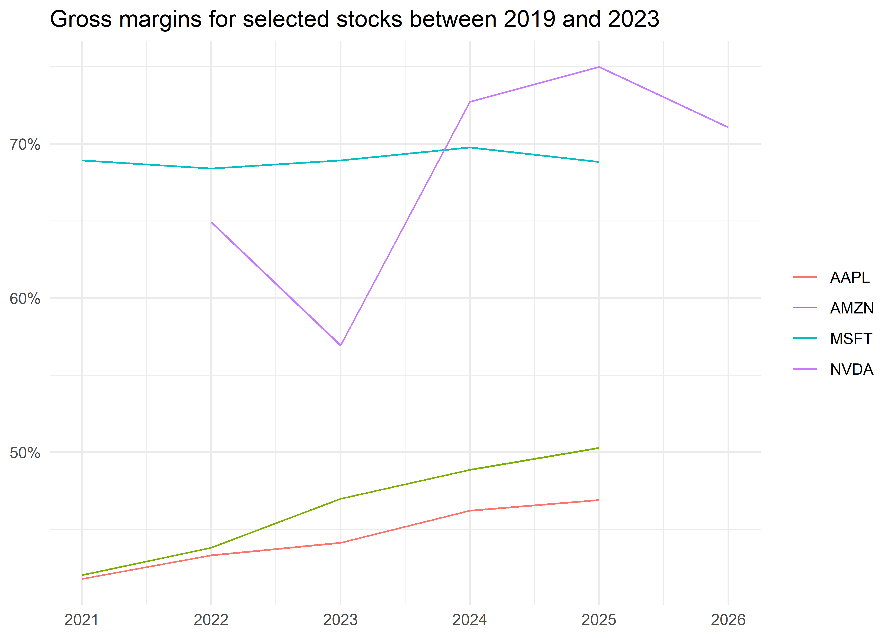](financial-statement-analysis_files/figure-html/fig-413-1.png "Figure 12: Gross margins are based on financial statements provided through the FMP API.")

Figure 12: Gross margins are based on financial statements provided through the FMP API.

## Python

``` python
gross_margins = (combined_statements
  .filter(pl.col("symbol").is_in(selected_symbols))
)

gross_margins_figure = (
  ggplot(
    gross_margins,
    aes(x="fiscal_year", y="gross_margin", color="symbol")
  )
  + geom_line()
  + scale_y_continuous(labels=percent_format())
  + labs(
      x="", y="", color="",
      title="Gross margins for selected stocks between 2019 and 2023"
  )
)
gross_margins_figure.show()
```

[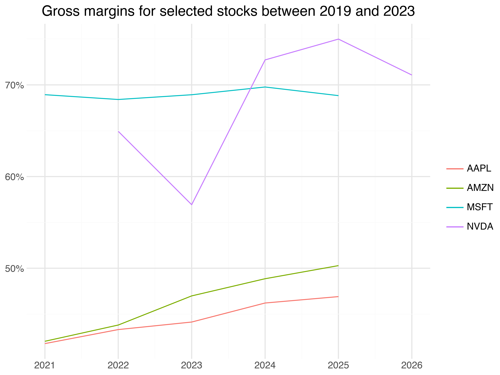](financial-statement-analysis_files/figure-html/fsa-fig-413-py-1.png "Gross margins are based on financial statements provided through the FMP API.")

Gross margins are based on financial statements provided through the FMP API.

Microsoft maintains the highest margins at 65-70%, reflecting its low-cost software business model, while Apple and Amazon show lower but improving margins from around 40% to 45-47%. This divergence highlights fundamental business model differences.

[Figure 13](#fig-414) illustrates the relationship between gross margins and profit margins across our sample of stocks in 2023.

## R

``` r
combined_statements |>
  filter(fiscal_year == 2023) |>
  ggplot(aes(x = gross_margin, y = profit_margin, color = label)) +
  geom_point(size = 2) +
  geom_label_repel(aes(label = label), seed = 42, box.padding = 0.75) +
  scale_x_continuous(labels = percent) +
  scale_y_continuous(labels = percent) +
  scale_color_manual(values = selected_colors) +
  labs(
    x = "Gross margin",
    y = "Profit margin",
    title = "Gross and profit margins for selected stocks in 2023"
  ) +
  theme(legend.position = "none")
```

[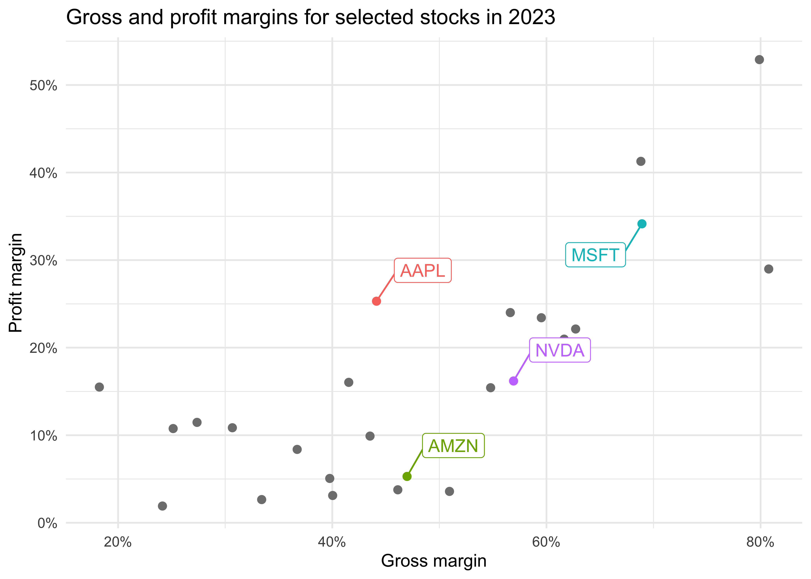](financial-statement-analysis_files/figure-html/fig-414-3.png "Figure 13: Gross and profit margins are based on financial statements provided through the FMP API.")

Figure 13: Gross and profit margins are based on financial statements provided through the FMP API.

## Python

``` python
profit_margins = (combined_statements
  .filter(pl.col("fiscal_year") == 2023)
)

profit_margins_figure = (
  ggplot(
    profit_margins,
    aes(x="gross_margin", y="profit_margin", color="label")
  )
  + geom_point(size=2)
  + geom_label(
      aes(label="label"),
      adjust_text={"arrowprops": {"arrowstyle": "-"}}
    )
  + scale_x_continuous(labels=percent_format())
  + scale_y_continuous(labels=percent_format())
  + scale_color_manual(values=selected_colors)
  + labs(
      x="Gross margin", y="Profit margin",
      title="Gross and profit margins for selected stocks in 2023"
    )
  + theme(legend_position = "none")
)
profit_margins_figure.show()
```

[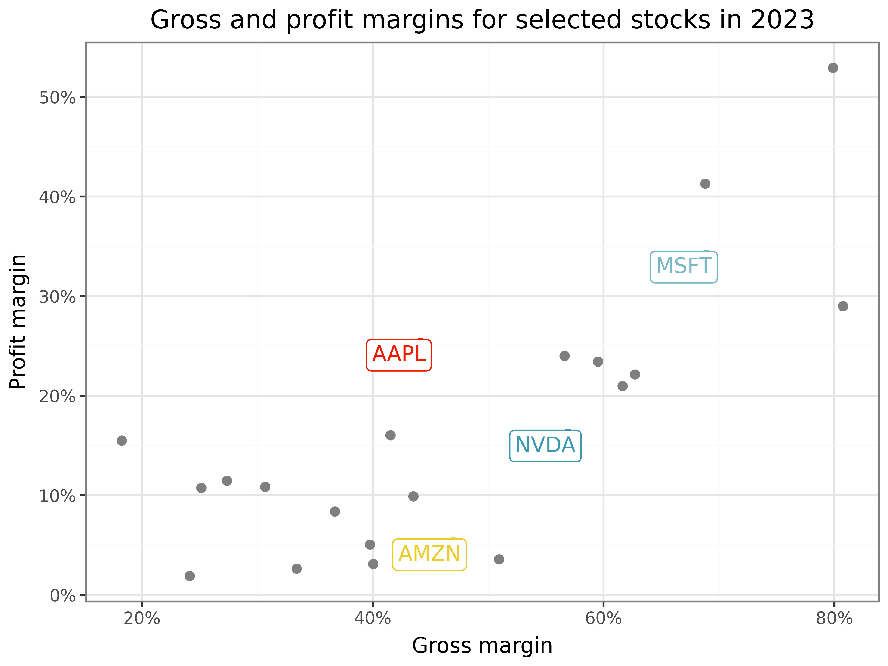](financial-statement-analysis_files/figure-html/fsa-fig-414-py-1.png "Gross and profit margins are based on financial statements provided through the FMP API.")

Gross and profit margins are based on financial statements provided through the FMP API.

## Combining Financial Ratios

While individual financial ratios provide specific insights, combining them offers a more comprehensive view of company performance. By examining how companies rank across different ratio categories, we can better understand their overall financial position and identify potential strengths and weaknesses in their operations.

[Figure 14](#fig-415) compares Microsoft, Apple, and Amazon’s rankings across four key financial ratio categories among our sample. Rankings closer to 1 indicate better performance within each category.

## R

``` r
financial_ratios <- combined_statements |>
  filter(fiscal_year == 2023) |>
  select(
    symbol,
    contains(c(
      "ratio",
      "margin",
      "roe",
      "_to_",
      "turnover",
      "interest_coverage"
    ))
  ) |>
  pivot_longer(cols = -symbol) |>
  mutate(
    type = case_when(
      name %in% c("current_ratio", "quick_ratio", "cash_ratio") ~
        "Liquidity Ratios",
      name %in% c("debt_to_equity", "debt_to_asset", "interest_coverage") ~
        "Leverage Ratios",
      name %in%
        c("asset_turnover", "inventory_turnover", "receivables_turnover") ~
        "Efficiency Ratios",
      name %in% c("gross_margin", "profit_margin", "after_tax_roe") ~
        "Profitability Ratios"
    )
  )

financial_ratios |>
  group_by(type, name) |>
  arrange(desc(value)) |>
  mutate(rank = row_number()) |>
  group_by(symbol, type) |>
  summarize(rank = mean(rank), .groups = "drop") |>
  filter(symbol %in% selected_symbols) |>
  ggplot(aes(x = rank, y = type, color = symbol)) +
  geom_point(shape = 17, size = 4) +
  scale_color_manual(values = selected_colors) +
  labs(
    x = "Average rank",
    y = NULL,
    color = NULL,
    title = "Average rank among selected stocks"
  ) +
  coord_cartesian(xlim = c(1, 30))
```

[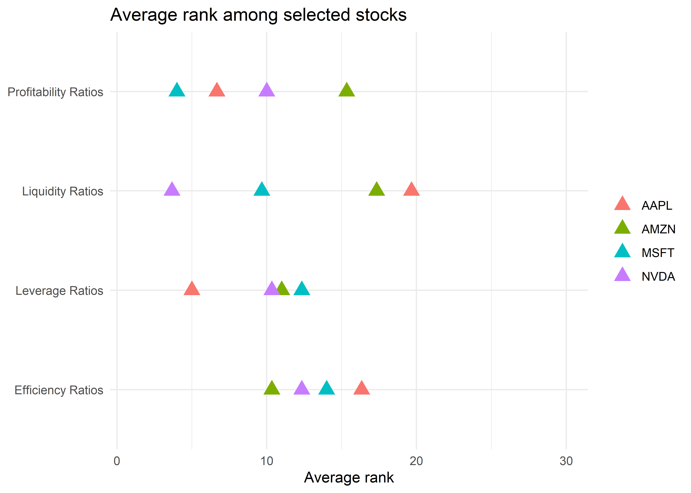](financial-statement-analysis_files/figure-html/fig-415-3.png "Figure 14: Ranks are based on financial statements provided through the FMP API.")

Figure 14: Ranks are based on financial statements provided through the FMP API.

## Python

``` python
financial_ratios = (combined_statements
  .filter(pl.col("fiscal_year") == 2023)
  .select(
    ["symbol"] + [
      col for col in combined_statements.columns
      if any(x in col for x in ["ratio", "margin", "roe", "_to_", "turnover", "interest_coverage"])
    ]
  )
  .unpivot(index=["symbol"], variable_name="name", value_name="value")
  .with_columns(
    type=pl.when(pl.col("name").is_in(["current_ratio", "quick_ratio", "cash_ratio"]))
      .then(pl.lit("Liquidity Ratios"))
      .when(pl.col("name").is_in(["debt_to_equity", "debt_to_asset", "interest_coverage"]))
      .then(pl.lit("Leverage Ratios"))
      .when(pl.col("name").is_in(["asset_turnover", "inventory_turnover", "receivables_turnover"]))
      .then(pl.lit("Efficiency Ratios"))
      .when(pl.col("name").is_in(["gross_margin", "profit_margin", "after_tax_roe"]))
      .then(pl.lit("Profitability Ratios"))
      .otherwise(pl.lit("Other"))
  )
)

financial_ratios = financial_ratios.with_columns(
  rank=pl.col("value").rank(method="ordinal", descending=True).over(["type", "name"])
)

final_ranks = (financial_ratios
  .group_by(["symbol", "type"])
  .agg(rank=pl.col("rank").mean())
  .filter(pl.col("symbol").is_in(selected_symbols))
)

final_ranks_figure = (
  ggplot(
    final_ranks,
    aes(x="rank", y="type", color="symbol")
  )
  + geom_point(shape="^", size=4)
  + scale_color_manual(values=selected_colors)
  + labs(
      x="Average rank", y="", color="",
      title="Average rank among selected stocks"
  )
  + coord_cartesian(xlim=[1, 30])
)
final_ranks_figure.show()
```

[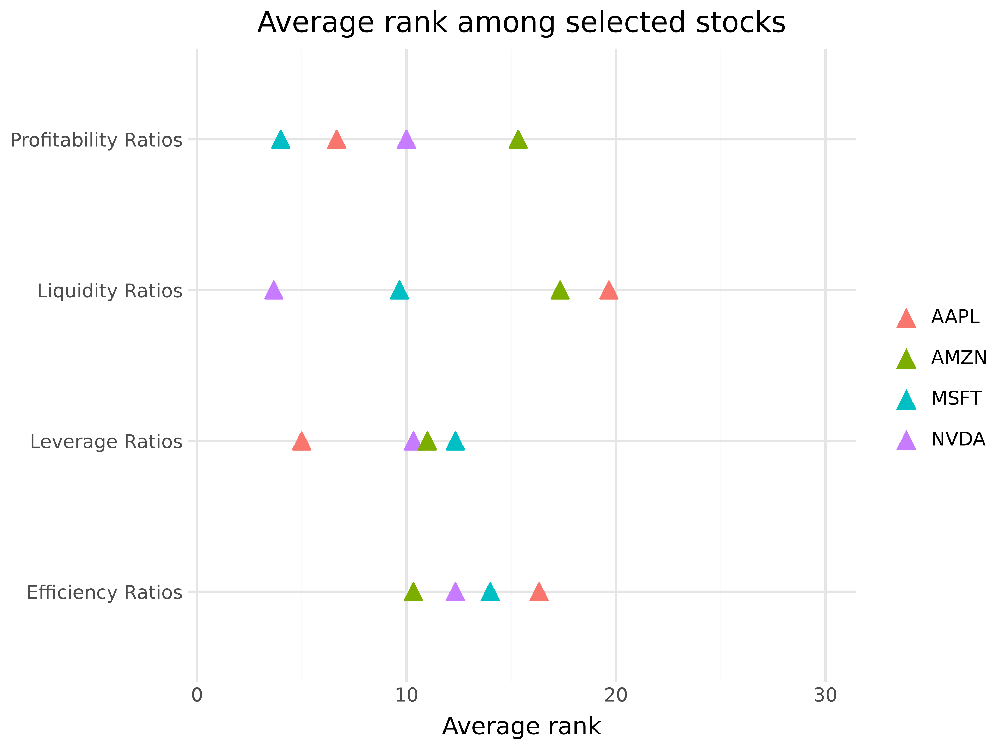](financial-statement-analysis_files/figure-html/fsa-fig-415-py-1.png "Ranks are based on financial statements provided through the FMP API.")

Ranks are based on financial statements provided through the FMP API.

These combined rankings highlight how different business models and strategies lead to varying financial profiles. This analysis underscores the importance of considering multiple financial metrics together rather than in isolation when evaluating company performance.

## Financial Ratios in Asset Pricing

The Fama-French five-factor model aims to explain stock returns by incorporating specific financial metrics ratios. We provide more details in [Replicating Fama-French Factors](../chapters/replicating-fama-and-french-factors.llms.md), but here is an intuitive overview:

- Size: Calculated as the logarithm of a company’s market capitalization, which is the total market value of its outstanding shares. This factor captures the tendency for smaller firms to outperform larger ones over time.
- Book-to-market ratio: Determined by dividing the company’s book equity by its market capitalization. A higher ratio indicates a ‘value’ stock, while a lower ratio suggests a ‘growth’ stock. This metric helps differentiate between undervalued and overvalued companies.
- Profitability: Measured as the ratio of operating profit to book equity, where operating profit is calculated as revenue minus cost of goods sold (COGS), selling, general, and administrative expenses (SG&A), and interest expense. This factor assesses a company’s efficiency in generating profits from its equity base.
- Investment: Calculated as the percentage change in total assets from the previous period. This factor reflects the company’s growth strategy, indicating whether it is investing aggressively or conservatively.

We can calculate these factors using the FMP API as follows. Since the free tier only supports historical data for the last couple of months, we use the earliest available data that is returned by default:

## R

``` r
market_cap <- sample |>
  map_df(
    \(x) {
      fmp_get(
        resource = "historical-market-capitalization",
        x
      )
    }
  ) |>
  filter(date == min(date))

combined_statements_ff <- combined_statements |>
  filter(fiscal_year == 2023) |>
  left_join(market_cap, join_by(symbol)) |>
  left_join(
    balance_sheet_statements |>
      filter(fiscal_year == 2022) |>
      select(symbol, total_assets_lag = total_assets),
    join_by(symbol)
  ) |>
  mutate(
    size = log(market_cap),
    book_to_market = total_equity / market_cap,
    operating_profitability = (revenue -
      cost_of_revenue -
      selling_general_and_administrative_expenses -
      interest_expense) /
      total_equity,
    investment = total_assets / total_assets_lag
  )
```

## Python

``` python
market_cap = pl.concat(
  [pl.from_pandas(fmp_get(
      resource="historical-market-capitalization", symbol=x, to_pandas=True
    )) for x in sample]
)

min_date = market_cap["date"].min()
market_cap = market_cap.filter(pl.col("date") == min_date)

combined_statements_ff = (combined_statements
  .filter(pl.col("fiscal_year") == 2023)
  .join(market_cap, on="symbol", how="left")
  .join(
    (balance_sheet_statements
      .filter(pl.col("fiscal_year") == 2022)
      .select(["symbol", "total_assets"])
      .rename({"total_assets": "total_assets_lag"})
    ),
    on="symbol", how="left"
  )
  .with_columns(
    size=pl.col("market_cap").log(),
    book_to_market=pl.col("total_equity") / pl.col("market_cap"),
    operating_profitability=(
        (pl.col("revenue") - pl.col("cost_of_revenue") - pl.col("selling_general_and_administrative_expenses") - pl.col("interest_expense"))
        / pl.col("total_equity")
    ),
    investment=pl.col("total_assets") / pl.col("total_assets_lag")
  )
)
```

[Figure 15](#fig-416) shows the ranks of our selected stocks for ratios used in the Fama-French model. The ranks of Microsoft, Apple, and Amazon across Fama-French factors reveal interesting patterns in how these major technology companies align with established asset pricing factors.

## R

``` r
combined_statements_ff |>
  select(
    symbol,
    Size = size,
    `Book-to-Market` = book_to_market,
    `Profitability` = operating_profitability,
    Investment = investment
  ) |>
  pivot_longer(-symbol) |>
  group_by(name) |>
  arrange(desc(value)) |>
  mutate(rank = row_number()) |>
  ungroup() |>
  filter(symbol %in% selected_symbols) |>
  ggplot(aes(x = rank, y = name, color = symbol)) +
  geom_point(shape = 17, size = 4) +
  scale_color_manual(values = selected_colors) +
  labs(
    x = "Rank",
    y = NULL,
    color = NULL,
    title = "Rank in Fama-French variables for selected stocks"
  ) +
  coord_cartesian(xlim = c(1, 30))
```

[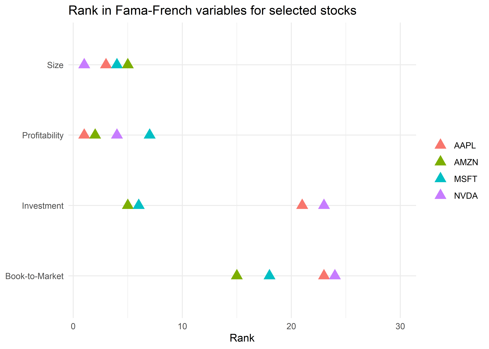](financial-statement-analysis_files/figure-html/fig-416-1.png "Figure 15: Ranks are based on financial statements and historical market capitalization provided through the FMP API.")

Figure 15: Ranks are based on financial statements and historical market capitalization provided through the FMP API.

## Python

``` python
factors_ranks = (combined_statements_ff
  .select(["symbol", "size", "book_to_market", "operating_profitability", "investment"])
  .rename({
    "size": "Size",
    "book_to_market": "Book-to-Market",
    "operating_profitability": "Profitability",
    "investment": "Investment"
  })
  .unpivot(index=["symbol"], variable_name="name", value_name="value")
  .with_columns(
    rank=pl.col("value").rank(method="ordinal", descending=True).over("name")
  )
  .filter(pl.col("symbol").is_in(selected_symbols))
)

factors_ranks_figure = (
  ggplot(
    factors_ranks,
    aes(x="rank", y="name", color="symbol")
  )
  + geom_point(shape="^", size=4)
  + scale_color_manual(values=selected_colors)
  + labs(
      x="Rank", y="", color="",
      title="Rank in Fama-French variables for selected stocks"
  )
  + coord_cartesian(xlim=[1, 30])
)
factors_ranks_figure.show()
```

[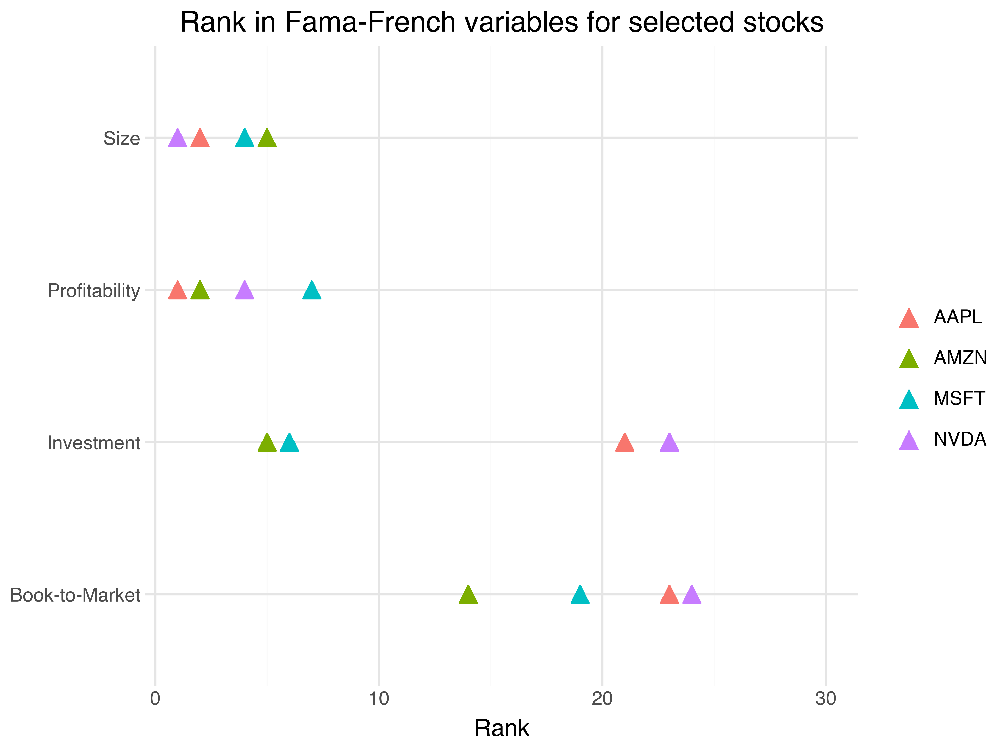](financial-statement-analysis_files/figure-html/fsa-fig-416-py-1.png "Ranks are based on financial statements and historical market capitalization provided through the FMP API.")

Ranks are based on financial statements and historical market capitalization provided through the FMP API.

As expected, all three tech giants rank among the largest firms by size. Apple shows the highest profitability among the three tech giants according to the new measure, while Microsoft ranks only in the middle. In terms of investment, however, Apple ranks in the lower third of the distribution. All three stocks exhibit relatively low book-to-market ratios—typical of growth stocks—but only when compared to other stocks in our sample.

## Key Takeaways

- Financial statements offer structured insights into a company’s financial health by summarizing its assets, liabilities, equity, revenues, expenses, and cash flows.
- Liquidity ratios, such as the current, quick, and cash ratios, help assess a company’s ability to meet short-term obligations using different levels of liquid assets.
- Leverage ratios, including debt-to-equity and debt-to-asset, measure how a company finances its operations and indicate long-term financial risk and capital structure.
- Profitability ratios, such as gross margin, profit margin, and return on equity, show how effectively a company turns revenues and investments into earnings.
- Efficiency ratios, including asset turnover and inventory turnover, highlight how well a company manages its assets and operations to generate sales.
- Financial ratios also serve as key inputs in asset pricing models, such as the Fama-French five-factor model, linking corporate fundamentals to expected stock returns.

## Exercises

1.  Download the financial statements for Netflix (NFLX) using the FMP API. Calculate its current ratio, quick ratio, and cash ratio for the past three years. Create a line plot showing how these liquidity ratios have evolved over time. How do Netflix’s liquidity ratios compare to those of the technology companies discussed in this chapter?
2.  Select three companies from different industries. Calculate their debt-to-equity ratios, debt-to-asset ratios, and interest coverage ratios. Create a visualization comparing these leverage metrics across the companies. Write a brief analysis explaining how and why leverage patterns differ across industries.
3.  For all stocks in the sample above, calculate asset turnover, inventory turnover, and receivables turnover. Create a scatter plot showing the relationship between asset turnover and profitability. Identify any outliers and explain potential reasons for their unusual performance. Which industries tend to show higher efficiency ratios? Why might this be the case?
4.  Revisit the scatter plot of debt-to-asset ratios and interest coverages by adding a regression line and quantifying the relationship between the two variables. How can you describe their relationship?
