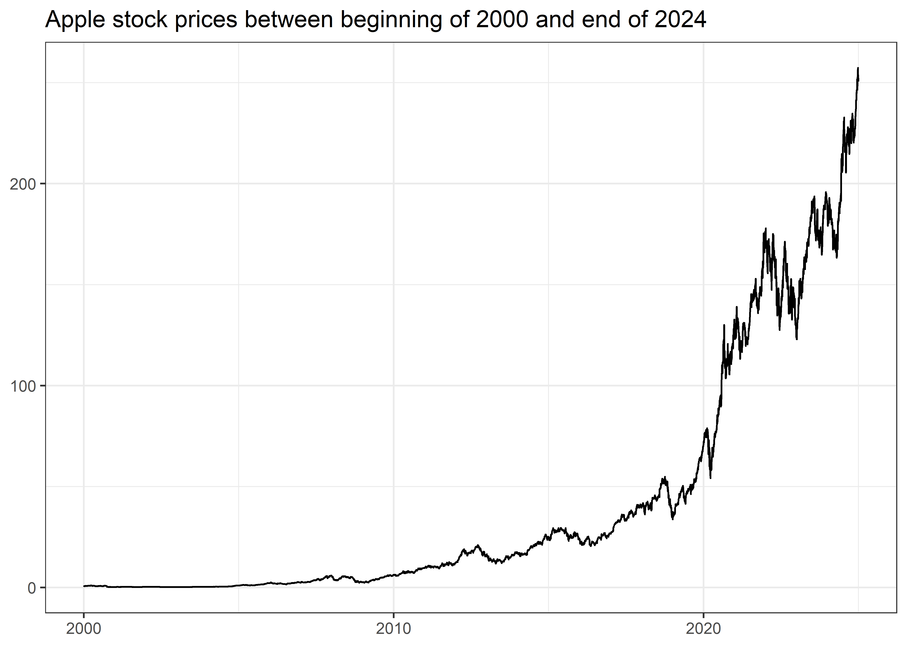
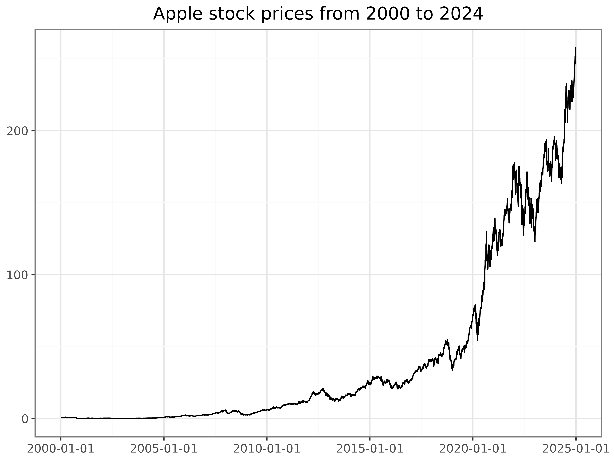
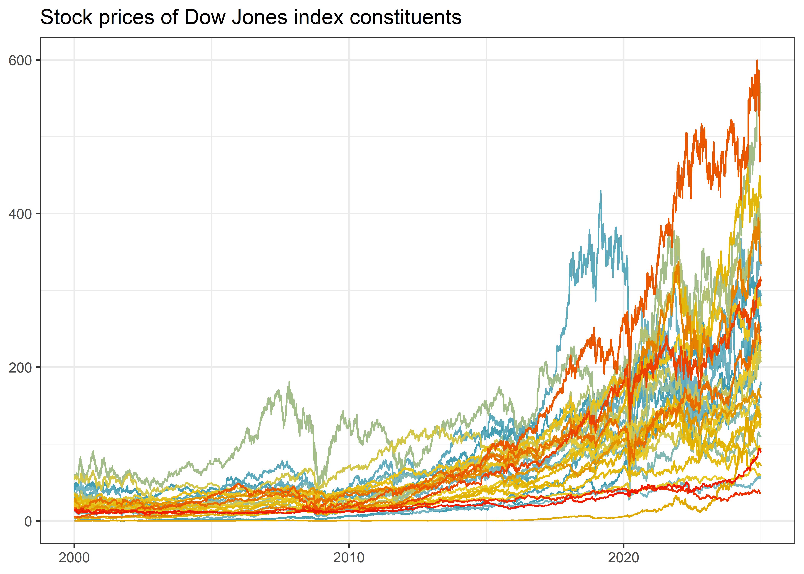
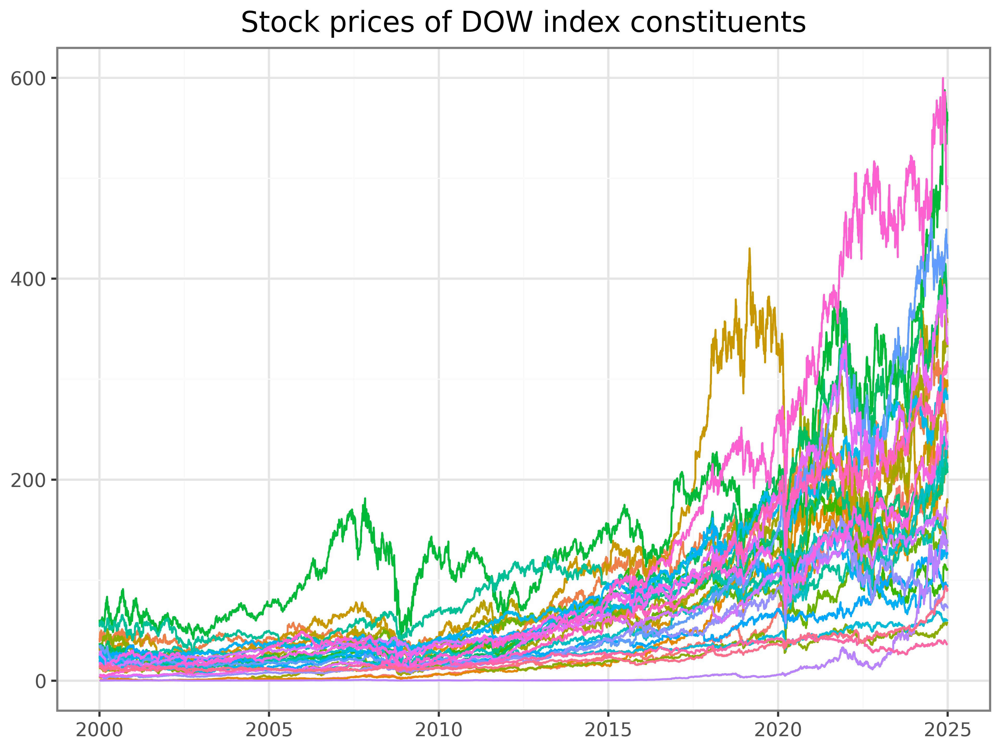
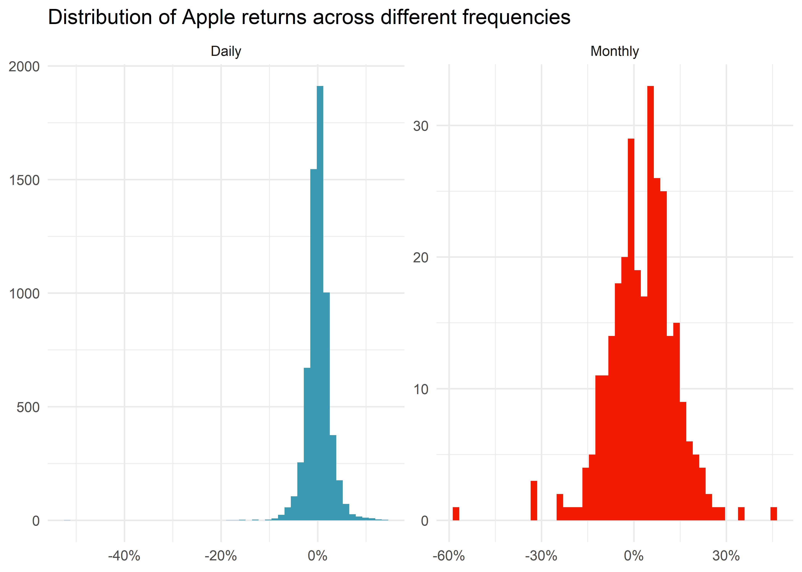
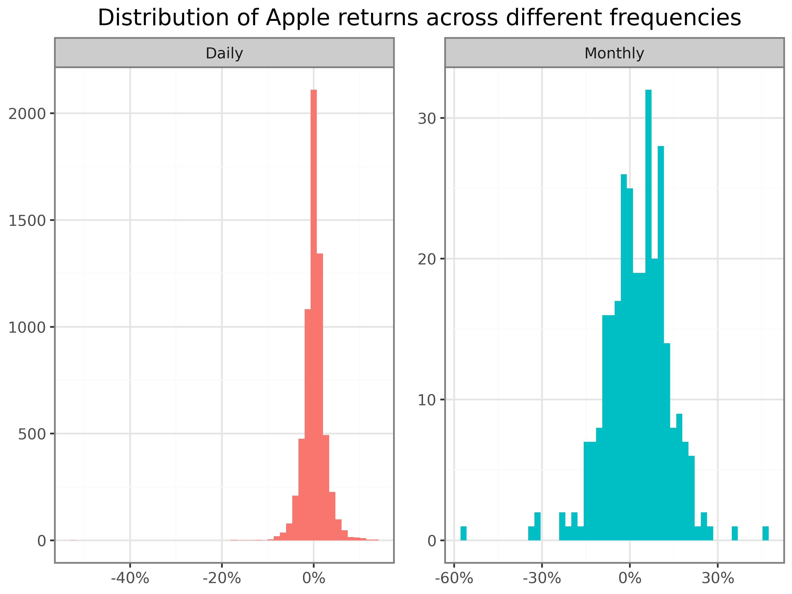
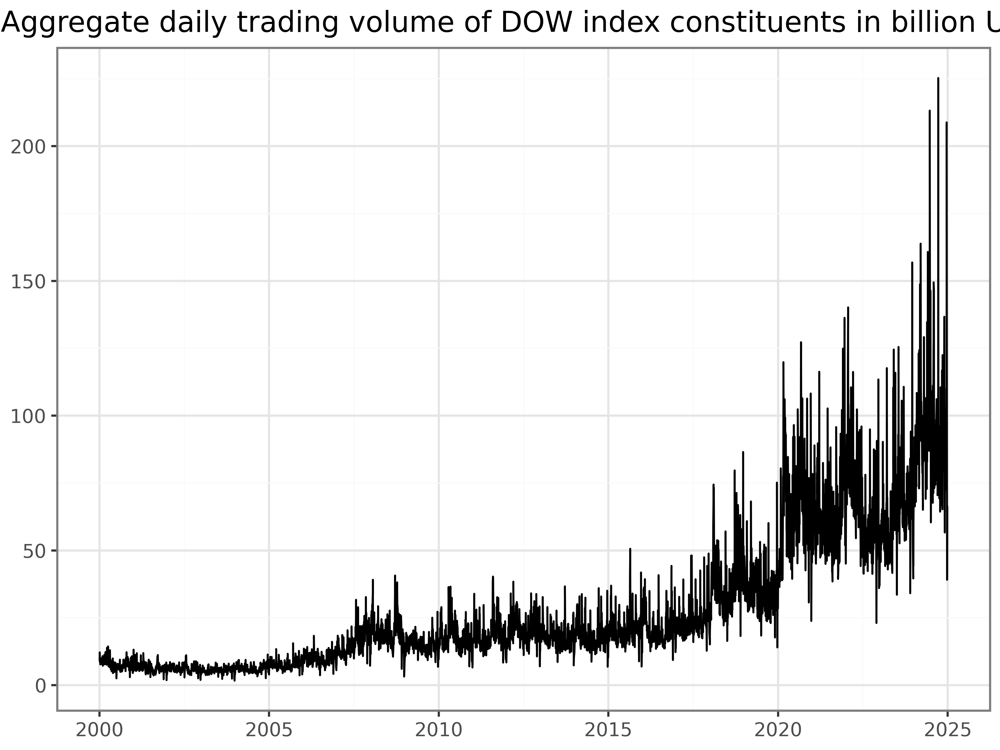
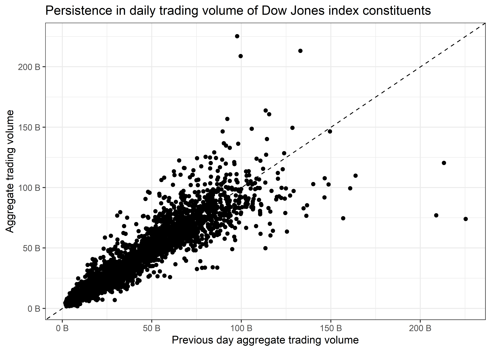
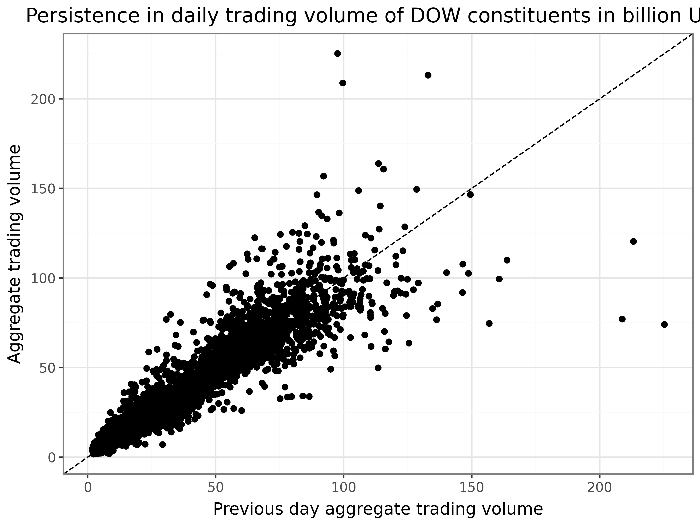

# Working with Stock Returns

The main aim of this chapter is to familiarize yourself with the core packages for working with stock market data. We focus on downloading and visualizing stock data from data provider Yahoo Finance.

At the start of each session, we load the required packages. Throughout the entire book, we use a core data frame library to handle our data. In this chapter, we also load the `tidyfinance` package to download stock price data. This package provides a convenient wrapper for various quantitative functions compatible with our core packages and our book.

We use the following packages throughout this chapter:

## R

Throughout the entire book, we always use the `tidyverse` ([Wickham et al. 2019](#ref-Wickham2019)) package. We also load the `tidyfinance` package to download stock price data and the `scales` ([Wickham and Seidel 2022](#ref-scales)) package, which provides nice formatting for axis labels in visualizations.

You typically have to install a package once before you can load it into your active R session. In case you have not done this yet, call, for instance, `install.packages("tidyfinance")`.

``` r
library(tidyverse)
library(tidyfinance)
library(scales)
```

## Python

Throughout the entire book, we use the `polars` package ([Vink and Polars contributors 2024](#ref-polars)) as our core data frame library. `polars` is a modern, high-performance alternative to `pandas` with an expressive, expression-based API and excellent handling of large datasets. We also load the `tidyfinance` package to download stock price data.

You typically have to install a package once before you can load it into your active Python session. In case you have not done this yet, call, for instance, `pip install polars tidyfinance` in your terminal.

``` python
import polars as pl
import tidyfinance as tf
```

Note that `import polars as pl` implies that we can call all polars functions later with a simple `pl.function()`. Instead, utilizing `from polars import *` is generally discouraged, as it leads to namespace pollution. This statement imports all functions and classes from `polars` into your current namespace, potentially causing conflicts with functions you define or those from other imported libraries. Using the `pl` abbreviation is a very convenient way to prevent this.

## Downloading Data

We first download daily prices for one stock symbol, e.g., the Apple stock (*AAPL*), directly from the data provider Yahoo Finance. To download the data, you can use the function `download_data`.

In the following code, we request daily data from the beginning of 2000 to the end of the last year, which is a period of more than 20 years.

## R

In case this is the first time you use the package `tidyfinance`, you may be asked once to install some additional packages in the process of downloading the data. If you do not know how to use it, make sure you read the help file by calling `?download_data`. We especially recommend taking a look at the examples section of the documentation.

``` r
prices <- download_data(
  domain = "stock_prices",
  symbols = "AAPL",
  start_date = "2000-01-01",
  end_date = "2024-12-31"
)
prices
```

    # A tibble: 6,288 × 8
      symbol date          volume  open   low  high close adjusted_close
      <chr>  <date>         <dbl> <dbl> <dbl> <dbl> <dbl>          <dbl>
    1 AAPL   2000-01-03 535796800 0.936 0.908 1.00  0.999          0.838
    2 AAPL   2000-01-04 512377600 0.967 0.903 0.988 0.915          0.767
    3 AAPL   2000-01-05 778321600 0.926 0.920 0.987 0.929          0.778
    4 AAPL   2000-01-06 767972800 0.948 0.848 0.955 0.848          0.711
    5 AAPL   2000-01-07 460734400 0.862 0.853 0.902 0.888          0.745
    # ℹ 6,283 more rows

## Python

Because `tf.download_data()` returns a `pandas` data frame, we wrap the call in `pl.from_pandas()` to obtain a `polars` data frame that we work with for the rest of the chapter. Since `pandas` represents dates as timestamps, we also cast the `date` column to the `polars` `Date` type — daily prices are calendar-dated, and we use this convention throughout the book.

``` python
prices = pl.from_pandas(
    tf.download_data(
        domain="stock_prices",
        symbols="AAPL",
        start_date="2000-01-01",
        end_date="2024-12-31"
    )
).with_columns(pl.col("date").cast(pl.Date))
prices.head()
```

shape: (5, 8)

| symbol | date       | volume    | open     | low      | high     | close    | adjusted_close |
|--------|------------|-----------|----------|----------|----------|----------|----------------|
| str    | date       | i64       | f64      | f64      | f64      | f64      | f64            |
| "AAPL" | 2000-01-03 | 535796800 | 0.936384 | 0.907924 | 1.004464 | 0.999442 | 0.837724       |
| "AAPL" | 2000-01-04 | 512377600 | 0.966518 | 0.90346  | 0.987723 | 0.915179 | 0.767096       |
| "AAPL" | 2000-01-05 | 778321600 | 0.926339 | 0.919643 | 0.987165 | 0.928571 | 0.778321       |
| "AAPL" | 2000-01-06 | 767972800 | 0.947545 | 0.848214 | 0.955357 | 0.848214 | 0.710966       |
| "AAPL" | 2000-01-07 | 460734400 | 0.861607 | 0.852679 | 0.901786 | 0.888393 | 0.744644       |

`download_data(domain = "stock_prices")` downloads stock market data from Yahoo Finance. The function returns a data frame with eight self-explanatory columns: `symbol`, `date`, the daily `volume` (in the number of traded shares), the market prices at the `open`, `low`, `high`, `close`, and the `adjusted_close` price in USD. The adjusted prices are corrected for anything that might affect the stock price after the market closes, e.g., stock splits and dividends. These actions affect the quoted prices, but they have no direct impact on the investors who hold the stock. Therefore, we often rely on adjusted prices when it comes to analyzing the returns an investor would have earned by holding the stock continuously.

We visualize the time series of adjusted prices in [Figure 1](#fig-100) based on the principles of the grammar of graphics ([Wilkinson 2012](#ref-Wilkinson2012)).

## R

We use the `ggplot2` package ([Wickham 2016](#ref-ggplot2)) to visualize the time series.

``` r
prices |>
  ggplot(aes(x = date, y = adjusted_close)) +
  geom_line() +
  labs(
    x = NULL,
    y = NULL,
    title = "Apple stock prices between beginning of 2000 and end of 2024"
  )
```

[](working-with-stock-returns_files/figure-html/fig-100-1.png "Figure 1: Prices are in USD, adjusted for dividend payments and stock splits.")

Figure 1: Prices are in USD, adjusted for dividend payments and stock splits.

## Python

We use the `plotnine` package ([Kibirige 2023](#ref-plotnine)) to visualize the time series. Note that generally, we do not recommend using the `*` import style. However, we use it here only for the plotting functions, which are distinct to `plotnine` and have very plotting-related names. So, the risk of misuse through a polluted namespace is marginal.

``` python
from plotnine import *
```

Creating figures becomes very intuitive with the Grammar of Graphics, as the following code chunk demonstrates.

``` python
apple_prices_figure = (
    ggplot(prices, aes(y="adjusted_close", x="date"))
    + geom_line()
    + labs(x="", y="", title="Apple stock prices from 2000 to 2024")
)
apple_prices_figure.show()
```

[](working-with-stock-returns_files/figure-html/wsr-fig-100-py-1.png "Prices are in USD, adjusted for dividend payments and stock splits.")

Prices are in USD, adjusted for dividend payments and stock splits.

## Computing Returns

Instead of analyzing prices, we compute daily returns defined as \\r_t = p_t / p\_{t-1} - 1\\, where \\p_t\\ is the adjusted price at the end of day \\t\\. In that context, computing the previous value (the lag) is helpful.

## R

The function `lag()` returns the previous value.

``` r
returns <- prices |>
  arrange(date) |>
  mutate(ret = adjusted_close / lag(adjusted_close) - 1) |>
  select(symbol, date, ret)
returns
```

    # A tibble: 6,288 × 3
      symbol date           ret
      <chr>  <date>       <dbl>
    1 AAPL   2000-01-03 NA     
    2 AAPL   2000-01-04 -0.0843
    3 AAPL   2000-01-05  0.0146
    4 AAPL   2000-01-06 -0.0865
    5 AAPL   2000-01-07  0.0474
    # ℹ 6,283 more rows

## Python

``` python
returns = (prices
    .sort("date")
    .with_columns(ret=pl.col("adjusted_close").pct_change())
    .select(["symbol", "date", "ret"])
)
returns
```

shape: (6_288, 3)

| symbol | date       | ret       |
|--------|------------|-----------|
| str    | date       | f64       |
| "AAPL" | 2000-01-03 | null      |
| "AAPL" | 2000-01-04 | -0.08431  |
| "AAPL" | 2000-01-05 | 0.014633  |
| "AAPL" | 2000-01-06 | -0.086538 |
| "AAPL" | 2000-01-07 | 0.047369  |
| …      | …          | …         |
| "AAPL" | 2024-12-23 | 0.003065  |
| "AAPL" | 2024-12-24 | 0.011478  |
| "AAPL" | 2024-12-26 | 0.003176  |
| "AAPL" | 2024-12-27 | -0.013242 |
| "AAPL" | 2024-12-30 | -0.013263 |

The resulting data frame has three columns, the last of which contains the daily returns (`ret`). Note that the first entry naturally contains a missing value because there is no previous price.

## R

Obviously, the use of `lag()` would be meaningless if the time series is not ordered by ascending dates. The command `arrange()` provides a convenient way to order observations in the correct way for our application. If you want to order observations by descending values, you could, for instance, use `arrange(desc(ret))`. Always check that your data has the desired structure before calling `lag()` or similar functions.

## Python

Obviously, the use of `pct_change()` would be meaningless if the time series is not ordered by ascending dates. The method `sort()` provides a convenient way to order observations in the correct way for our application. In case you want to order observations by descending dates, you can use the parameter `descending=True`.

For the upcoming examples, we remove missing values as these would require separate treatment for many applications. For example, missing values can affect sums and averages by reducing the number of valid data points if not properly accounted for. In general, always ensure you understand why missing values occur and carefully examine if you can simply get rid of these observations.

## R

``` r
returns <- returns |>
  drop_na(ret)
```

## Python

``` python
returns = returns.drop_nulls("ret")
```

Next, we visualize the distribution of daily returns in a histogram in [Figure 2](#fig-101). Additionally, we draw a dashed line that indicates the historical five percent quantile of the daily returns to the histogram, which is a crude proxy for the worst possible return of the stock with a probability of at most five percent. This quantile is closely connected to the (historical) value-at-risk, a risk measure commonly monitored by regulators. We refer to Tsay ([2010](#ref-Tsay2010)) for a more thorough introduction to the stylized facts of financial returns.

## R

``` r
quantile_05 <- quantile(returns$ret, probs = 0.05)
returns |>
  ggplot(aes(x = ret)) +
  geom_histogram(bins = 100) +
  geom_vline(aes(xintercept = quantile_05),
    linetype = "dashed"
  ) +
  labs(
    x = NULL,
    y = NULL,
    title = "Distribution of daily Apple stock returns"
  ) +
  scale_x_continuous(labels = percent)
```

[](working-with-stock-returns_files/figure-html/fig-101-1.png "Figure 2: The dotted vertical line indicates the historical five percent quantile.")

Figure 2: The dotted vertical line indicates the historical five percent quantile.

## Python

``` python
from mizani.formatters import percent_format

quantile_05 = returns["ret"].quantile(0.05)

apple_returns_figure = (
    ggplot(returns, aes(x="ret"))
    + geom_histogram(bins=100)
    + geom_vline(aes(xintercept=quantile_05), linetype="dashed")
    + labs(x="", y="", title="Distribution of daily Apple stock returns")
    + scale_x_continuous(labels=percent_format())
)
apple_returns_figure.show()
```

[](working-with-stock-returns_files/figure-html/wsr-fig-101-py-1.png "The dotted vertical line indicates the historical five percent quantile.")

The dotted vertical line indicates the historical five percent quantile.

Here, `bins = 100` determines the number of bins used in the illustration and, hence, implicitly sets the width of the bins. Before proceeding, make sure you understand how to use the geom `geom_vline()` to add a dashed line that indicates the historical five percent quantile of the daily returns. Before proceeding with *any* data, a typical task is to compute and analyze the summary statistics for the main variables of interest.

## R

``` r
returns |>
  summarize(across(
    ret,
    list(
      daily_mean = mean,
      daily_sd = sd,
      daily_min = min,
      daily_max = max
    )
  ))
```

    # A tibble: 1 × 4
      ret_daily_mean ret_daily_sd ret_daily_min ret_daily_max
               <dbl>        <dbl>         <dbl>         <dbl>
    1        0.00122       0.0244        -0.519         0.139

## Python

``` python
returns.select("ret").describe()
```

shape: (9, 2)

| statistic    | ret       |
|--------------|-----------|
| str          | f64       |
| "count"      | 6287.0    |
| "null_count" | 0.0       |
| "mean"       | 0.001217  |
| "std"        | 0.024404  |
| "min"        | -0.518692 |
| "25%"        | -0.009818 |
| "50%"        | 0.000947  |
| "75%"        | 0.012684  |
| "max"        | 0.139049  |

We see that the maximum *daily* return was 13.905 percent. Perhaps not surprisingly, the average daily return is close to but slightly above 0. In line with the illustration above, the large losses on the day with the minimum returns indicate a strong asymmetry in the distribution of returns.

You can also compute these summary statistics for each year individually by grouping the data by year. More specifically, the few lines of code below compute the summary statistics from above for individual groups of data defined by the values of the column year. The summary statistics, therefore, allow an eyeball analysis of the time-series dynamics of the daily return distribution.

## R

We impose `group_by(year = year(date))`, where the call `year(date)` returns the year.

``` r
returns |>
  group_by(year = year(date)) |>
  summarize(across(
    ret,
    list(
      daily_mean = mean,
      daily_sd = sd,
      daily_min = min,
      daily_max = max
    ),
    .names = "{.fn}"
  )) |>
  print(n = Inf)
```

    # A tibble: 25 × 5
        year daily_mean daily_sd daily_min daily_max
       <dbl>      <dbl>    <dbl>     <dbl>     <dbl>
     1  2000 -0.00346     0.0549   -0.519     0.137 
     2  2001  0.00233     0.0393   -0.172     0.129 
     3  2002 -0.00121     0.0305   -0.150     0.0846
     4  2003  0.00186     0.0234   -0.0814    0.113 
     5  2004  0.00470     0.0255   -0.0558    0.132 
     6  2005  0.00349     0.0245   -0.0921    0.0912
     7  2006  0.000949    0.0243   -0.0633    0.118 
     8  2007  0.00366     0.0238   -0.0702    0.105 
     9  2008 -0.00265     0.0367   -0.179     0.139 
    10  2009  0.00382     0.0214   -0.0502    0.0676
    11  2010  0.00183     0.0169   -0.0496    0.0769
    12  2011  0.00104     0.0165   -0.0559    0.0589
    13  2012  0.00130     0.0186   -0.0644    0.0887
    14  2013  0.000472    0.0180   -0.124     0.0514
    15  2014  0.00145     0.0136   -0.0799    0.0820
    16  2015  0.0000199   0.0168   -0.0612    0.0574
    17  2016  0.000575    0.0147   -0.0657    0.0650
    18  2017  0.00164     0.0111   -0.0388    0.0610
    19  2018 -0.0000573   0.0181   -0.0663    0.0704
    20  2019  0.00266     0.0165   -0.0996    0.0683
    21  2020  0.00281     0.0294   -0.129     0.120 
    22  2021  0.00131     0.0158   -0.0417    0.0539
    23  2022 -0.000970    0.0225   -0.0587    0.0890
    24  2023  0.00168     0.0128   -0.0480    0.0469
    25  2024  0.00120     0.0143   -0.0482    0.0726

In case you wonder, the additional argument `.names = "{.fn}"` in `across()` determines how to name the output columns. It acts as a placeholder that gets replaced by the name of the function being applied (e.g., mean, sd, min, max) when creating new column names. The specification is rather flexible and allows almost arbitrary column names, which can be useful for reporting. The `print()` function controls the R console’s output options.

## Python

We group with `group_by(pl.col("date").dt.year())`, where the call `dt.year()` extracts the year. Unlike `pandas`, `polars` has no single `describe()` per group, so we list the desired statistics explicitly inside `agg()`.

``` python
(returns
    .group_by(pl.col("date").dt.year().alias("year"))
    .agg(
        count=pl.len(),
        mean=pl.col("ret").mean(),
        std=pl.col("ret").std(),
        min=pl.col("ret").min(),
        q25=pl.col("ret").quantile(0.25),
        median=pl.col("ret").median(),
        q75=pl.col("ret").quantile(0.75),
        max=pl.col("ret").max(),
    )
    .sort("year")
    .with_columns(pl.col(pl.Float64).round(3))
)
```

shape: (25, 9)

| year | count | mean   | std   | min    | q25    | median | q75   | max   |
|------|-------|--------|-------|--------|--------|--------|-------|-------|
| i32  | u32   | f64    | f64   | f64    | f64    | f64    | f64   | f64   |
| 2000 | 251   | -0.003 | 0.055 | -0.519 | -0.034 | -0.002 | 0.028 | 0.137 |
| 2001 | 248   | 0.002  | 0.039 | -0.172 | -0.023 | -0.001 | 0.027 | 0.129 |
| 2002 | 252   | -0.001 | 0.031 | -0.15  | -0.019 | -0.003 | 0.018 | 0.085 |
| 2003 | 252   | 0.002  | 0.023 | -0.081 | -0.012 | 0.002  | 0.014 | 0.113 |
| 2004 | 252   | 0.005  | 0.025 | -0.056 | -0.009 | 0.003  | 0.015 | 0.132 |
| …    | …     | …      | …     | …      | …      | …      | …     | …     |
| 2020 | 253   | 0.003  | 0.029 | -0.129 | -0.01  | 0.002  | 0.017 | 0.12  |
| 2021 | 252   | 0.001  | 0.016 | -0.042 | -0.008 | 0.001  | 0.012 | 0.054 |
| 2022 | 251   | -0.001 | 0.022 | -0.059 | -0.016 | -0.001 | 0.014 | 0.089 |
| 2023 | 250   | 0.002  | 0.013 | -0.048 | -0.006 | 0.002  | 0.009 | 0.047 |
| 2024 | 251   | 0.001  | 0.014 | -0.048 | -0.007 | 0.002  | 0.009 | 0.073 |

## Scaling Up the Analysis

As a next step, we generalize the previous code so that all computations can handle an arbitrary number of symbols (e.g., all constituents of an index). Following tidy principles, it is quite easy to download the data, plot the price time series, and tabulate the summary statistics for an arbitrary number of assets.

This is where the `tidyverse` magic starts: Tidy data makes it extremely easy to generalize the computations from before to as many assets or groups as you like. The following code takes any number of symbols and automates the download as well as the plot of the price time series. In the end, we create the table of summary statistics for all assets at once. For this example, we analyze data from all current constituents of the [Dow Jones Industrial Average index.](https://en.wikipedia.org/wiki/Dow_Jones_Industrial_Average)

We first download a table with Dow Jones constituents again using `download_data()`, but this time with `domain = "constituents"`.

## R

``` r
symbols <- download_data(
  domain = "constituents",
  index = "Dow Jones Industrial Average"
)
symbols
```

    # A tibble: 30 × 5
      symbol name                    location           exchange currency
      <chr>  <chr>                   <chr>              <chr>    <chr>   
    1 GS     GOLDMAN SACHS GROUP INC Vereinigte Staaten New Yor… USD     
    2 CAT    CATERPILLAR INC         Vereinigte Staaten New Yor… USD     
    3 UNH    UNITEDHEALTH GROUP INC  Vereinigte Staaten New Yor… USD     
    4 MSFT   MICROSOFT CORP          Vereinigte Staaten NASDAQ   USD     
    5 AMGN   AMGEN INC               Vereinigte Staaten NASDAQ   USD     
    # ℹ 25 more rows

## Python

``` python
symbols = pl.from_pandas(
    tf.download_data(
        domain="constituents",
        index="Dow Jones Industrial Average"
    )
)
```

Conveniently, `tidyfinance` provides the functionality to get all stock prices from an index for a specific point in time with a single call.

## R

``` r
prices_daily <- download_data(
  domain = "stock_prices",
  symbols = symbols$symbol,
  start_date = "2000-01-01",
  end_date = "2024-12-31"
)
```

## Python

``` python
prices_daily = pl.from_pandas(
    tf.download_data(
        domain="stock_prices",
        symbols=symbols["symbol"].to_list(),
        start_date="2000-01-01",
        end_date="2024-12-31"
    )
).with_columns(pl.col("date").cast(pl.Date))
```

The resulting data frame contains 185455 daily observations for GS, CAT, UNH, MSFT, AMGN, AXP, JPM, V, HD, SHW, TRV, AAPL, MCD, IBM, AMZN, JNJ, HON, BA, NVDA, CVX, MMM, CRM, PG, WMT, CSCO, MRK, DIS, KO, VZ, NKE different stocks. [Figure 3](#fig-102) illustrates the time series of the downloaded *adjusted* prices for each of the constituents of the Dow index. Make sure you understand every single line of code! What are the arguments of `aes()`? Which alternative `geoms` could you use to visualize the time series? Hint: if you do not know the answers try to change the code to see what difference your intervention causes.

## R

``` r
prices_daily |>
  ggplot(aes(
    x = date,
    y = adjusted_close,
    color = symbol
  )) +
  geom_line() +
  labs(
    x = NULL,
    y = NULL,
    color = NULL,
    title = "Stock prices of Dow Jones index constituents"
  ) +
  theme(legend.position = "none")
```

[](working-with-stock-returns_files/figure-html/fig-102-1.png "Figure 3: Prices in USD, adjusted for dividend payments and stock splits.")

Figure 3: Prices in USD, adjusted for dividend payments and stock splits.

## Python

``` python
prices_figure = (
    ggplot(prices_daily, aes(y="adjusted_close", x="date", color="symbol"))
    + geom_line()
    + scale_x_date(date_breaks="5 years", date_labels="%Y")
    + labs(x="", y="", color="", title="Stock prices of DOW index constituents")
    + theme(legend_position="none")
)
prices_figure.show()
```

[](working-with-stock-returns_files/figure-html/wsr-fig-102-py-1.png "Prices in USD, adjusted for dividend payments and stock splits.")

Prices in USD, adjusted for dividend payments and stock splits.

Do you notice the small differences relative to the code we used before? All we needed to do to illustrate all stock symbols simultaneously is to include `color = symbol` in the `ggplot` aesthetics. In this way, we generate a separate line for each symbol. Of course, there are simply too many lines on this graph to identify the individual stocks properly, but it illustrates our point of how to generalize a specific analysis to an arbitrary number of subjects quite well.

The same holds for stock returns. The same logic also applies to the computation of summary statistics: grouping by `symbol` is the key to aggregating the time series into symbol-specific variables of interest.

## R

Before computing the returns, we use `group_by(symbol)` such that the `mutate()` command is performed for each symbol individually.

``` r
returns_daily <- prices_daily |>
  group_by(symbol) |>
  mutate(ret = adjusted_close / lag(adjusted_close) - 1) |>
  select(symbol, date, ret) |>
  drop_na(ret)

returns_daily |>
  group_by(symbol) |>
  summarize(across(
    ret,
    list(
      daily_mean = mean,
      daily_sd = sd,
      daily_min = min,
      daily_max = max
    ),
    .names = "{.fn}"
  )) |>
  print(n = Inf)
```

    # A tibble: 30 × 5
       symbol daily_mean daily_sd daily_min daily_max
       <chr>       <dbl>    <dbl>     <dbl>     <dbl>
     1 AAPL     0.00122    0.0244    -0.519     0.139
     2 AMGN     0.000467   0.0193    -0.134     0.151
     3 AMZN     0.00110    0.0311    -0.248     0.345
     4 AXP      0.000602   0.0225    -0.176     0.219
     5 BA       0.000551   0.0222    -0.238     0.243
     6 CAT      0.000736   0.0202    -0.145     0.147
     7 CRM      0.00119    0.0264    -0.271     0.260
     8 CSCO     0.000342   0.0230    -0.162     0.244
     9 CVX      0.000493   0.0173    -0.221     0.227
    10 DIS      0.000436   0.0193    -0.184     0.160
    11 GS       0.000607   0.0226    -0.190     0.265
    12 HD       0.000548   0.0189    -0.287     0.141
    13 HON      0.000495   0.0189    -0.174     0.282
    14 IBM      0.000342   0.0163    -0.155     0.120
    15 JNJ      0.000356   0.0120    -0.158     0.122
    16 JPM      0.000644   0.0236    -0.207     0.251
    17 KO       0.000320   0.0129    -0.101     0.139
    18 MCD      0.000517   0.0144    -0.159     0.181
    19 MMM      0.000418   0.0154    -0.129     0.230
    20 MRK      0.000348   0.0165    -0.268     0.130
    21 MSFT     0.000574   0.0190    -0.156     0.196
    22 NKE      0.000632   0.0193    -0.200     0.155
    23 NVDA     0.00186    0.0374    -0.352     0.424
    24 PG       0.000374   0.0131    -0.302     0.120
    25 SHW      0.000844   0.0178    -0.208     0.153
    26 TRV      0.000577   0.0180    -0.208     0.256
    27 UNH      0.000913   0.0195    -0.186     0.348
    28 V        0.000928   0.0182    -0.136     0.150
    29 VZ       0.000250   0.0150    -0.118     0.146
    30 WMT      0.000401   0.0147    -0.114     0.117

## Python

Before computing the returns, we sort by symbol and date and add `.over("symbol")` to the `pct_change()` expression, so that returns are computed within each symbol individually without bleeding across symbol boundaries.

``` python
returns_daily = (prices_daily
    .sort("symbol", "date")
    .with_columns(ret=pl.col("adjusted_close").pct_change().over("symbol"))
    .select(["symbol", "date", "ret"])
    .drop_nulls("ret")
)

(returns_daily
    .group_by("symbol")
    .agg(
        count=pl.len(),
        mean=pl.col("ret").mean(),
        std=pl.col("ret").std(),
        min=pl.col("ret").min(),
        q25=pl.col("ret").quantile(0.25),
        median=pl.col("ret").median(),
        q75=pl.col("ret").quantile(0.75),
        max=pl.col("ret").max(),
    )
    .sort("symbol")
    .with_columns(pl.col(pl.Float64).round(3))
)
```

shape: (30, 9)

| symbol | count | mean  | std   | min    | q25    | median | q75   | max   |
|--------|-------|-------|-------|--------|--------|--------|-------|-------|
| str    | u32   | f64   | f64   | f64    | f64    | f64    | f64   | f64   |
| "AAPL" | 6287  | 0.001 | 0.024 | -0.519 | -0.01  | 0.001  | 0.013 | 0.139 |
| "AMGN" | 6287  | 0.0   | 0.019 | -0.134 | -0.009 | 0.0    | 0.009 | 0.151 |
| "AMZN" | 6287  | 0.001 | 0.031 | -0.248 | -0.012 | 0.0    | 0.014 | 0.345 |
| "AXP"  | 6287  | 0.001 | 0.022 | -0.176 | -0.008 | 0.0    | 0.01  | 0.219 |
| "BA"   | 6287  | 0.001 | 0.022 | -0.238 | -0.01  | 0.001  | 0.011 | 0.243 |
| …      | …     | …     | …     | …      | …      | …      | …     | …     |
| "TRV"  | 6287  | 0.001 | 0.018 | -0.208 | -0.007 | 0.001  | 0.008 | 0.256 |
| "UNH"  | 6287  | 0.001 | 0.019 | -0.186 | -0.008 | 0.001  | 0.01  | 0.348 |
| "V"    | 4224  | 0.001 | 0.018 | -0.136 | -0.007 | 0.001  | 0.009 | 0.15  |
| "VZ"   | 6287  | 0.0   | 0.015 | -0.118 | -0.007 | 0.0    | 0.007 | 0.146 |
| "WMT"  | 6287  | 0.0   | 0.015 | -0.114 | -0.006 | 0.0    | 0.007 | 0.117 |

Note that you are now also equipped with all tools to download price data for *each* symbol listed in the S&P 500 index with the same number of lines of code. Just download the constituents with `domain = "constituents", index = "S&P 500"`, which provides you with a data frame that contains each symbol that is (currently) part of the S&P 500. However, don’t try this if you are not prepared to wait for a couple of minutes because this is quite some data to download!

## Different Frequencies

Financial data often exists at different frequencies due to varying reporting schedules, trading calendars, and economic data releases. For example, stock prices are typically recorded daily, while macroeconomic indicators such as GDP or inflation are reported monthly or quarterly. Additionally, some datasets are recorded only when transactions occur, resulting in irregular timestamps. To compare data meaningfully, we have to align different frequencies appropriately. For example, to compare returns across different frequencies, we use annualization techniques.

So far, we have worked with daily returns, but we can easily convert our data to other frequencies. Let’s create monthly returns from our daily data:

## R

``` r
returns_monthly <- returns_daily |>
  mutate(date = floor_date(date, "month")) |>
  group_by(symbol, date) |>
  summarize(
    ret = prod(1 + ret) - 1,
    .groups = "drop"
  )
```

## Python

``` python
returns_monthly = (returns_daily
    .with_columns(date=pl.col("date").dt.truncate("1mo"))
    .group_by(["symbol", "date"])
    .agg(ret=(pl.col("ret") + 1).product() - 1)
    .sort(["symbol", "date"])
)
```

In this code, we first group the data by symbol and month and then compute monthly returns by compounding the daily returns: \\(1+r_1)(1+r_2)\ldots(1+r_n)-1\\. To visualize how return characteristics change across different frequencies, we can compare histograms as in [Figure 4](#fig-103):

## R

``` r
apple_returns <- bind_rows(
  returns_daily |>
    filter(symbol == "AAPL") |>
    mutate(frequency = "Daily"),
  returns_monthly |>
    filter(symbol == "AAPL") |>
    mutate(frequency = "Monthly")
)

apple_returns |>
  ggplot(aes(x = ret, fill = frequency)) +
  geom_histogram(position = "identity", bins = 50) +
  labs(
    x = NULL,
    y = NULL,
    fill = "Frequency",
    title = "Distribution of Apple returns across different frequencies"
  ) +
  scale_x_continuous(labels = percent) +
  theme_minimal() +
  facet_wrap(~ frequency, scales = "free") +
  theme(legend.position = "none")
```

[](working-with-stock-returns_files/figure-html/fig-103-1.png "Figure 4: Returns are based on prices adjusted for dividend payments and stock splits.")

Figure 4: Returns are based on prices adjusted for dividend payments and stock splits.

## Python

``` python
apple_daily = (returns_daily
    .filter(pl.col("symbol") == "AAPL")
    .with_columns(frequency=pl.lit("Daily"))
)

apple_monthly = (returns_monthly
    .filter(pl.col("symbol") == "AAPL")
    .with_columns(frequency=pl.lit("Monthly"))
)

apple_returns = pl.concat([apple_daily, apple_monthly])

apple_returns_figure = (
    ggplot(apple_returns, aes(x="ret", fill="frequency"))
    + geom_histogram(position="identity", bins=50)
    + labs(
        x="", y="", fill="Frequency",
        title="Distribution of Apple returns across different frequencies"
    )
    + scale_x_continuous(labels=percent_format())
    + facet_wrap("frequency", scales="free")
    + theme(legend_position="none")
)
apple_returns_figure.show()
```

[](working-with-stock-returns_files/figure-html/wsr-fig-103-py-1.png "Returns are based on prices adjusted for dividend payments and stock splits.")

Returns are based on prices adjusted for dividend payments and stock splits.

## Other Forms of Data Aggregation

Of course, aggregation across variables other than `symbol` or `date` can also make sense. For instance, suppose you are interested in answering questions like: Are days with high aggregate trading volume likely followed by days with high aggregate trading volume? To provide some initial analysis on this question, we take the downloaded data and compute aggregate daily trading volume for all Dow index constituents in USD. Recall that the column `volume` is denoted in the number of traded shares. Thus, we multiply the trading volume with the daily adjusted closing price to get a proxy for the aggregate trading volume in USD. Scaling by `1e-9` denotes daily trading volume in billion USD.

## R

``` r
trading_volume <- prices_daily |>
  group_by(date) |>
  summarize(trading_volume = sum(volume * adjusted_close))

trading_volume |>
  ggplot(aes(x = date, y = trading_volume)) +
  geom_line() +
  labs(
    x = NULL, y = NULL,
    title = "Aggregate daily trading volume of Dow Jones index constitutens"
  ) +
  scale_y_continuous(labels = unit_format(unit = "B", scale = 1e-9))
```

[](working-with-stock-returns_files/figure-html/fig-104-3.png "Figure 5: Total daily trading volume in billion USD.")

Figure 5: Total daily trading volume in billion USD.

## Python

``` python
trading_volume = (prices_daily
    .with_columns(trading_volume=(pl.col("volume") * pl.col("adjusted_close")) / 1e9)
    .group_by("date")
    .agg(pl.col("trading_volume").sum())
    .sort("date")
    .with_columns(trading_volume_lag=pl.col("trading_volume").shift(1))
)

trading_volume_figure = (
    ggplot(trading_volume, aes(x="date", y="trading_volume"))
    + geom_line()
    + scale_x_date(date_breaks="5 years", date_labels="%Y")
    + labs(
        x="", y="",
        title="Aggregate daily trading volume of DOW index constituents in billion USD"
        )
)
trading_volume_figure.show()
```

[](working-with-stock-returns_files/figure-html/wsr-fig-104-py-1.png "Total daily trading volume in billion USD.")

Total daily trading volume in billion USD.

[Figure 5](#fig-104) indicates a clear upward trend in aggregated daily trading volume. In particular, since the outbreak of the COVID-19 pandemic, markets have processed substantial trading volumes, as analyzed, for instance, by Goldstein et al. ([2021](#ref-Goldstein2021)). One way to illustrate the persistence of trading volume would be to plot volume on day \\t\\ against volume on day \\t-1\\ as in the example below. In [Figure 6](#fig-105), we add a dotted 45°-line to indicate a hypothetical one-to-one relation by `geom_abline()`, addressing potential differences in the axes’ scales.

## R

``` r
trading_volume |>
  ggplot(aes(x = lag(trading_volume), y = trading_volume)) +
  geom_point() +
  geom_abline(aes(intercept = 0, slope = 1),
    linetype = "dashed"
  ) +
  labs(
    x = "Previous day aggregate trading volume",
    y = "Aggregate trading volume",
    title = "Persistence in daily trading volume of Dow Jones index constituents"
  ) +
  scale_x_continuous(labels = unit_format(unit = "B", scale = 1e-9)) +
  scale_y_continuous(labels = unit_format(unit = "B", scale = 1e-9))
```

    Warning: Removed 1 row containing missing values or values outside the scale
    range (`geom_point()`).

[](working-with-stock-returns_files/figure-html/fig-105-3.png "Figure 6: Total daily trading volume in billion USD.")

Figure 6: Total daily trading volume in billion USD.

Do you understand where the warning `## Warning: Removed 1 rows containing missing values (geom_point).` comes from and what it means?

## Python

``` python
persistence_figure = (
    ggplot(trading_volume, aes(x="trading_volume_lag", y="trading_volume"))
    + geom_point()
    + geom_abline(aes(intercept=0, slope=1), linetype="dashed")
    + labs(
        x="Previous day aggregate trading volume",
        y="Aggregate trading volume",
        title="Persistence in daily trading volume of DOW constituents in billion USD"
        )
)
persistence_figure.show()
```

[](working-with-stock-returns_files/figure-html/wsr-fig-105-py-1.png "Total daily trading volume in billion USD.")

Total daily trading volume in billion USD.

Purely eye-balling reveals that days with high trading volume are often followed by similarly high trading volume days.

## Key Takeaways

- You can use the `tidyverse` (R) or `polars` (Python) to efficiently analyze stock market data using consistent and scalable workflows.
- The `tidyfinance` package allows seamless downloading of historical stock prices and index data directly from Yahoo Finance.
- Tidy data principles enable efficient analysis of financial data.
- Adjusted stock prices provide a more accurate reflection of investor returns by accounting for dividends and stock splits.
- Summary statistics such as mean, standard deviation, and quantiles offer insights into stock return behavior over time.
- Visualizations created with `ggplot2` (R) or `plotnine` (Python) help identify trends, volatility, and return distributions in financial time series.
- Tidy data principles make it easy to scale financial analyses from a single stock to entire indices like the Dow Jones or S&P 500.
- Consistent workflows form the foundation for advanced financial analysis.

## Exercises

1.  Download daily prices for another stock market symbol of your choice from Yahoo Finance using `download_data()` from the `tidyfinance` package. Plot two time series of the symbol’s un-adjusted and adjusted closing prices. Explain any visible differences.
2.  Compute daily net returns for an asset of your choice and visualize the distribution of daily returns in a histogram using 100 bins. Also, use `geom_vline()` to add a dashed red vertical line that indicates the 5 percent quantile of the daily returns. Compute summary statistics (mean, standard deviation, minimum, and maximum) for the daily returns.
3.  Take your code from the previous exercises and generalize it such that you can perform all the computations for an arbitrary number of symbols (e.g., `symbol <- c("AAPL", "MMM", "BA")`). Automate the download, the plot of the price time series, and create a table of return summary statistics for this arbitrary number of assets.
4.  To facilitate the computation of the annualization factor, write a function that takes a vector of return dates as input and determines the frequency before returning the appropriate annualization factor.
5.  Are days with high aggregate trading volume often also days with large absolute returns? Find an appropriate visualization to analyze the question using the symbol `AAPL`.

## References

Goldstein, Itay, Ralph S J Koijen, and Holger M. Mueller. 2021. “COVID-19 and its impact on financial markets and the real economy.” *Review of Financial Studies* 34 (11): 5135–48. <https://doi.org/10.1093/rfs/hhab085>.

Kibirige, Hassan. 2023. *Plotnine: An Implementation of the Grammar of Graphics in Python*. [Https://pypi.org/project/plotnine/](https://pypi.org/project/plotnine/).

Tsay, Ruey S. 2010. *Analysis of financial time series*. John Wiley & Sons.

Vink, Ritchie, and Polars contributors. 2024. *Polars: Blazingly Fast DataFrames in Rust, Python, Node.js, r, and SQL*. [Https://pypi.org/project/polars/](https://pypi.org/project/polars/).

Wickham, Hadley. 2016. *ggplot2: Elegant graphics for data analysis*. Springer-Verlag New York. <https://ggplot2.tidyverse.org>.

Wickham, Hadley, Mara Averick, Jennifer Bryan, et al. 2019. “Welcome to the Tidyverse.” *Journal of Open Source Software* 4 (43): 1686. <https://doi.org/10.21105/joss.01686>.

Wickham, Hadley, and Dana Seidel. 2022. *scales: Scale functions for visualization*. <https://CRAN.R-project.org/package=scales>.

Wilkinson, Leland. 2012. *The grammar of graphics*. Springer.
