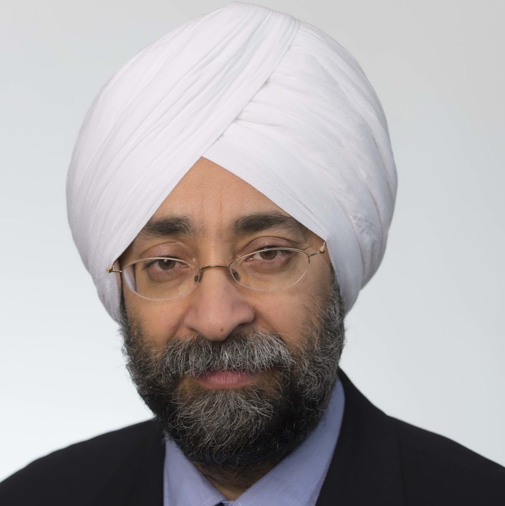

# Welcome to Tidy Finance

Tidy Finance is an opinionated approach to empirical research in financial economics - a fully transparent, open-source code base in multiple programming languages.

## Join Tidy Finance

- Learn about empirical applications based on a fully transparent code base
- Teach students the importance of reproducible research using tidy principles
- Start your next finance research project one step ahead with a Tidy Finance basis
- [Support](support.llms.md) the maintenance of our open-source project
- [Contribute](contribute.llms.md) to mission of reproducible finance via our blog
- Reach out with ideas, suggestions, and feedback via <contact@tidy-finance.org>

## Choose your language

R

Python

## What experts say about Tidy Finance

*A clean coding environment is a prerequisite for building a relevant investment platform and conducting meaningful factor research. Tidy Finance is the name of the game, giving aspiring academics and finance practitioners just what they need to perform clean and reproducible research. Highly recommended.*

**Harald Lohre**

Executive Director at Robeco

Honorary Researcher at Lancaster University Management School

*From our crowd-sourced paper on non-standard errors, I learned how important clean coding is. Tidy Finance is a rich resource for empirical finance researchers, offering clean coding techniques that benefit both beginners and experts.*

**Albert J. Menkveld**

Professor of Finance at Vrije Universiteit Amsterdam

Fellow at Tinbergen Institute

*A fantastic book bringing together financial theory, sound econometrics, thorough data processing and powerful programming techniques using R. An absolute must for every student and scholar in empirical finance.*

**Nikolaus Hautsch**

Professor of Finance & Statistics at University of Vienna

*Tidy Finance is a fantastic resource that lowers the threshold for entry into empirical finance, all in the spirit of open and reproducible science.*

**Björn Hagströmer**

Professor of Finance at Stockholm Business School

*To have a deep understanding of empirical asset pricing, one needs to write code using actual data. To learn how to do this, there is no better starting point than Tidy Finance. \[...\] I strongly recommend Tidy Finance to both beginners and experts.*

**Raman Uppal**

Professor of Finance at EDHEC Business School

*Students and professionals alike are led step by step until they suddenly find themselves coding on their own. A brilliant and required resource!*

**Mark Salmon**

Professor of Economics at University of Cambridge

## Who maintains this website

### Christoph Scheuch

Independent Expert in Finance & Data

LinkedIn →

### Stefan Voigt

Assistant Professor of Finance at University of Copenhagen

Website →

### Patrick Weiss

Assistant Professor of Finance at Reykjavik University

Website →

### Christoph Frey

Quantitative Researcher

Website →

© Christoph Frey, Christoph Scheuch, Stefan Voigt & Patrick Weiss

[Disclaimer](disclaimer.llms.md) [Cookie Preferences](#)

🎓 **Applications open: Summer School "Foundations for Reproducible Research" — closes June 22.** [Apply now →](https://bse.eu/summer-school/data-science-finance/tidy-finance-reproducible-research-in-data-science)

×
