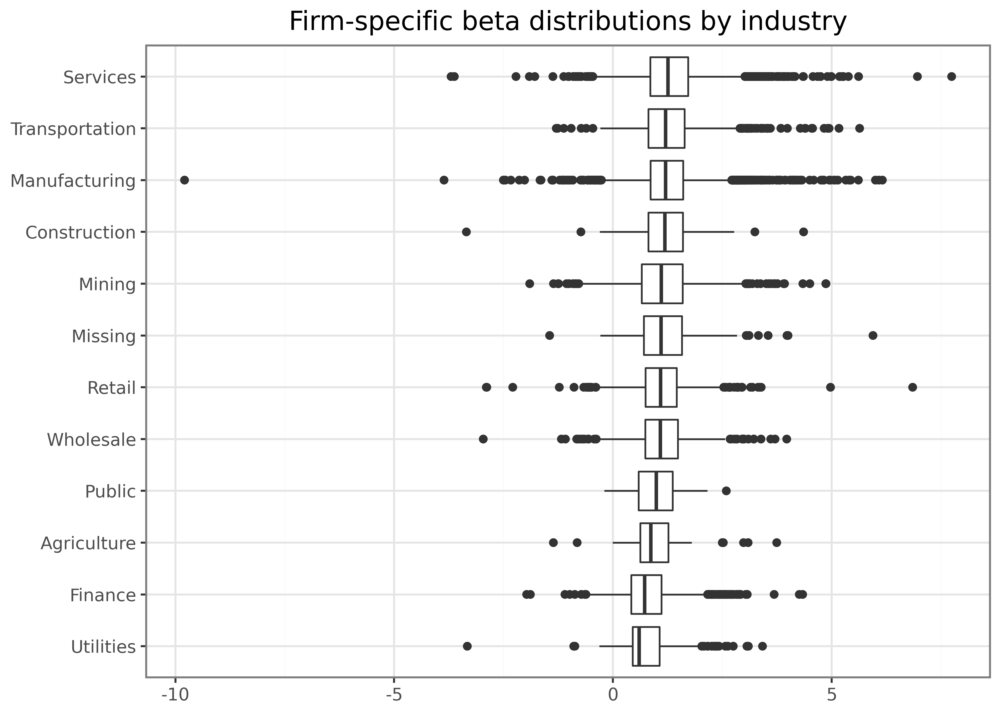

# Beta Estimation

> **NOTE:**
>
> You are reading **Tidy Finance with Python**. You can find the equivalent chapter for the sibling **Tidy Finance with R** [here](../r/beta-estimation.llms.md).

In this chapter, we introduce an important concept in financial economics: The exposure of an individual stock to changes in the market portfolio. According to the Capital Asset Pricing Model (CAPM) of Sharpe ([1964](#ref-Sharpe1964)), Lintner ([1965](#ref-Lintner1965)), and Mossin ([1966](#ref-Mossin1966)), cross-sectional variation in expected asset returns should be a function of the covariance between the excess return of the asset and the excess return on the market portfolio. The regression coefficient of excess market returns on excess stock returns is usually called the market beta. We show an estimation procedure for the market betas. We do not go into details about the foundations of market beta but simply refer to any treatment of the [CAPM](https://en.wikipedia.org/wiki/Capital_asset_pricing_model) for further information. Instead, we provide details about all the functions that we use to compute the results. In particular, we leverage useful computational concepts: Rolling-window estimation and parallelization.

We use the following Python packages throughout this chapter:

``` python
import polars as pl
import numpy as np
import statsmodels.formula.api as smf
import pyarrow.dataset as ds
import os

from plotnine import *
from mizani.formatters import percent_format
from joblib import Parallel, delayed, cpu_count
from itertools import product
from dateutil.relativedelta import relativedelta
```

Compared to previous chapters, we introduce `statsmodels` ([Seabold and Perktold 2010](#ref-seabold2010statsmodels)) for regression analysis and for sliding-window regressions and `joblib` ([Team 2023](#ref-joblib)) for parallelization.

## Estimating Beta Using Monthly Returns

The estimation procedure is based on a rolling-window estimation, where we may use either monthly or daily returns and different window lengths. First, let us start with loading the monthly CRSP data from our Parquet files introduced in [Accessing and Managing Financial Data](../python/accessing-and-managing-financial-data.llms.md) and [WRDS, CRSP, and Compustat](../python/wrds-crsp-and-compustat.llms.md).

``` python
crsp_monthly = (pl.read_parquet("data-python/crsp_monthly.parquet")
    .select(["permno", "date", "industry", "ret_excess"])
    .drop_nulls()
)

factors_ff3_monthly = (pl.read_parquet("data-python/factors_ff3_monthly.parquet")
    .select(["date", "mkt_excess"])
)

crsp_monthly = (crsp_monthly
    .join(factors_ff3_monthly, how="left", on="date")
)
```

To estimate the CAPM regression coefficients

\\ r\_{i, t} - r\_{f, t} = \alpha_i + \beta_i(r\_{m, t}-r\_{f,t})+\varepsilon\_{i, t}, \tag{1}\\

we regress stock excess returns `ret_excess` on excess returns of the market portfolio `mkt_excess`.

Python provides a simple solution to estimate (linear) models with the function `smf.ols()`. The function requires a formula as input that is specified in a compact symbolic form. An expression of the form `y ~ model` is interpreted as a specification that the response `y` is modeled by a linear predictor specified symbolically by `model`. Such a model consists of a series of terms separated by `+` operators. In addition to standard linear models, `smf.ols()` provides a lot of flexibility. You should check out the documentation for more information. To start, we restrict the data only to the time series of observations in CRSP that correspond to Apple’s stock (i.e., to `permno` 14593 for Apple) and compute \\\hat\alpha_i\\ as well as \\\hat\beta_i\\.

``` python
model_fit = smf.ols(
    formula="ret_excess ~ mkt_excess",
    data=crsp_monthly.filter(pl.col("permno") == 14593).to_pandas()
).fit()
coefficients = model_fit.summary2().tables[1]
coefficients
```

|            | Coef.    | Std.Err. | t         | P\>\|t\|     | \[0.025  | 0.975\]  |
|------------|----------|----------|-----------|--------------|----------|----------|
| Intercept  | 0.009919 | 0.004884 | 2.031102  | 4.274695e-02 | 0.000325 | 0.019513 |
| mkt_excess | 1.375598 | 0.107606 | 12.783617 | 8.893401e-33 | 1.164207 | 1.586989 |

`smf.ols()` returns an object of class `RegressionModel`, which contains all the information we usually care about with linear models. `summary2()` returns information about the estimated parameters. The output above indicates that Apple moves excessively with the market as the estimated \\\hat\beta_i\\ is above one (\\\hat\beta_i \approx 1.4\\).

## Rolling-Window Estimation

After we estimated the regression coefficients on an example, we scale the estimation of \\\beta_i\\ to a whole different level and perform rolling-window estimations for the entire CRSP sample. The following function implements the CAPM regression for a data frame (or a part thereof) containing at least `min_obs` observations to avoid huge fluctuations if the time series is too short. The function conveniently returns the regression results as a data frame, which ensures that our approach is scalable. If the `min_obs`-condition is violated, that is, the time series is too short, the function returns an empty data frame for consistency.

``` python
def estimate_capm(data, min_obs=1):
    if data.shape[0] < min_obs:
        capm = pl.DataFrame()
    else:
        fit = smf.ols(
            formula="ret_excess ~ mkt_excess", data=data.to_pandas()
        ).fit()
        coefficients = fit.summary2().tables[1]

        capm = pl.DataFrame(
            {
                "coefficient": coefficients.index.tolist(),
                "estimate": coefficients["Coef."].to_numpy(),
                "t_statistic": coefficients["t"].to_numpy(),
            }
        ).with_columns(
            coefficient=pl.when(pl.col("coefficient") == "Intercept")
            .then(pl.lit("alpha"))
            .otherwise(pl.col("coefficient"))
        )

    return capm
```

Next, we define a function that does the rolling estimation. We use a simple for-loop to implement the sliding window estimation in a straightforward manner. The following function takes input data and slides across the `date` vector, considering only a total of `look_back` months. The function essentially performs three steps: (i) arrange all rows, (ii) compute betas by sliding across months, and (iii) return a tibble with dates and corresponding parameter estimates. As we demonstrate further below, we can also apply the same function to daily return data.

``` python
def roll_capm_estimation(data, look_back=60, min_obs=48):
    results = []
    dates = data["date"].unique().sort()

    for i in range(len(dates)):
        end_date = dates[i]
        start_date = end_date - relativedelta(months=look_back - 1)

        window_data = data.filter(
            (pl.col("date") >= start_date) & (pl.col("date") <= end_date)
        )

        result = estimate_capm(window_data, min_obs=min_obs)
        if result.height > 0:
            result = result.with_columns(date=pl.lit(window_data["date"].max()))
            results.append(result)

    if results:
        rolling_capm_estimation = pl.concat(results)
    else:
        rolling_capm_estimation = pl.DataFrame(
            schema={
                "coefficient": pl.String,
                "estimate": pl.Float64,
                "t_statistic": pl.Float64,
                "date": data["date"].dtype,
            }
        )

    return rolling_capm_estimation
```

Before we approach the whole CRSP sample, let us focus on a couple of examples for well-known firms.

``` python
examples = pl.DataFrame({
    "permno": [14593, 10107, 93436, 17778],
    "company": ["Apple", "Microsoft", "Tesla", "Berkshire Hathaway"]
}).with_columns(permno=pl.col("permno").cast(pl.Float64))
```

The main idea is to apply the function to each stock individually and then combine the results into a single data frame. First, we restrict the sample to the example stocks and split it by `permno`. Splitting the data means we now have a list of frames, one per `permno`, each holding the corresponding time series data. We get one block of output for each unique value of `permno`.

``` python
capm_examples_nested = (crsp_monthly
    .filter(pl.col("permno").is_in(examples["permno"]))
    .partition_by("permno")
)
capm_examples_nested
```

    [shape: (465, 5)
     ┌─────────┬────────────┬──────────┬────────────┬────────────┐
     │ permno  ┆ date       ┆ industry ┆ ret_excess ┆ mkt_excess │
     │ ---     ┆ ---        ┆ ---      ┆ ---        ┆ ---        │
     │ f64     ┆ date       ┆ str      ┆ f64        ┆ f64        │
     ╞═════════╪════════════╪══════════╪════════════╪════════════╡
     │ 10107.0 ┆ 1986-04-01 ┆ Services ┆ 0.167527   ┆ -0.0128    │
     │ 10107.0 ┆ 1986-05-01 ┆ Services ┆ 0.072619   ┆ 0.0462     │
     │ 10107.0 ┆ 1986-06-01 ┆ Services ┆ -0.120308  ┆ 0.0106     │
     │ 10107.0 ┆ 1986-07-01 ┆ Services ┆ -0.078371  ┆ -0.0643    │
     │ 10107.0 ┆ 1986-08-01 ┆ Services ┆ -0.0046    ┆ 0.0607     │
     │ …       ┆ …          ┆ …        ┆ …          ┆ …          │
     │ 10107.0 ┆ 2024-08-01 ┆ Services ┆ -0.005916  ┆ 0.016      │
     │ 10107.0 ┆ 2024-09-01 ┆ Services ┆ 0.027548   ┆ 0.0172     │
     │ 10107.0 ┆ 2024-10-01 ┆ Services ┆ -0.059559  ┆ -0.01      │
     │ 10107.0 ┆ 2024-11-01 ┆ Services ┆ 0.040202   ┆ 0.0649     │
     │ 10107.0 ┆ 2024-12-01 ┆ Services ┆ -0.008329  ┆ -0.0317    │
     └─────────┴────────────┴──────────┴────────────┴────────────┘,
     shape: (528, 5)
     ┌─────────┬────────────┬───────────────┬────────────┬────────────┐
     │ permno  ┆ date       ┆ industry      ┆ ret_excess ┆ mkt_excess │
     │ ---     ┆ ---        ┆ ---           ┆ ---        ┆ ---        │
     │ f64     ┆ date       ┆ str           ┆ f64        ┆ f64        │
     ╞═════════╪════════════╪═══════════════╪════════════╪════════════╡
     │ 14593.0 ┆ 1981-01-01 ┆ Manufacturing ┆ -0.180418  ┆ -0.0506    │
     │ 14593.0 ┆ 1981-02-01 ┆ Manufacturing ┆ -0.072374  ┆ 0.0061     │
     │ 14593.0 ┆ 1981-03-01 ┆ Manufacturing ┆ -0.087217  ┆ 0.0367     │
     │ 14593.0 ┆ 1981-04-01 ┆ Manufacturing ┆ 0.14656    ┆ -0.0216    │
     │ 14593.0 ┆ 1981-05-01 ┆ Manufacturing ┆ 0.152974   ┆ 0.0013     │
     │ …       ┆ …          ┆ …             ┆ …          ┆ …          │
     │ 14593.0 ┆ 2024-08-01 ┆ Manufacturing ┆ 0.027545   ┆ 0.016      │
     │ 14593.0 ┆ 2024-09-01 ┆ Manufacturing ┆ 0.013467   ┆ 0.0172     │
     │ 14593.0 ┆ 2024-10-01 ┆ Manufacturing ┆ -0.034329  ┆ -0.01      │
     │ 14593.0 ┆ 2024-11-01 ┆ Manufacturing ┆ 0.047708   ┆ 0.0649     │
     │ 14593.0 ┆ 2024-12-01 ┆ Manufacturing ┆ 0.051455   ┆ -0.0317    │
     └─────────┴────────────┴───────────────┴────────────┴────────────┘,
     shape: (578, 5)
     ┌─────────┬────────────┬──────────┬────────────┬────────────┐
     │ permno  ┆ date       ┆ industry ┆ ret_excess ┆ mkt_excess │
     │ ---     ┆ ---        ┆ ---      ┆ ---        ┆ ---        │
     │ f64     ┆ date       ┆ str      ┆ f64        ┆ f64        │
     ╞═════════╪════════════╪══════════╪════════════╪════════════╡
     │ 17778.0 ┆ 1976-11-01 ┆ Finance  ┆ 0.150412   ┆ 0.0036     │
     │ 17778.0 ┆ 1976-12-01 ┆ Finance  ┆ 0.142497   ┆ 0.0565     │
     │ 17778.0 ┆ 1977-01-01 ┆ Finance  ┆ 0.040844   ┆ -0.0403    │
     │ 17778.0 ┆ 1977-02-01 ┆ Finance  ┆ -0.046053  ┆ -0.0194    │
     │ 17778.0 ┆ 1977-03-01 ┆ Finance  ┆ 0.073978   ┆ -0.0135    │
     │ …       ┆ …          ┆ …        ┆ …          ┆ …          │
     │ 17778.0 ┆ 2024-08-01 ┆ Finance  ┆ 0.080285   ┆ 0.016      │
     │ 17778.0 ┆ 2024-09-01 ┆ Finance  ┆ -0.03772   ┆ 0.0172     │
     │ 17778.0 ┆ 2024-10-01 ┆ Finance  ┆ -0.024474  ┆ -0.01      │
     │ 17778.0 ┆ 2024-11-01 ┆ Finance  ┆ 0.065547   ┆ 0.0649     │
     │ 17778.0 ┆ 2024-12-01 ┆ Finance  ┆ -0.063255  ┆ -0.0317    │
     └─────────┴────────────┴──────────┴────────────┴────────────┘,
     shape: (174, 5)
     ┌─────────┬────────────┬───────────────┬────────────┬────────────┐
     │ permno  ┆ date       ┆ industry      ┆ ret_excess ┆ mkt_excess │
     │ ---     ┆ ---        ┆ ---           ┆ ---        ┆ ---        │
     │ f64     ┆ date       ┆ str           ┆ f64        ┆ f64        │
     ╞═════════╪════════════╪═══════════════╪════════════╪════════════╡
     │ 93436.0 ┆ 2010-07-01 ┆ Manufacturing ┆ -0.16334   ┆ 0.0692     │
     │ 93436.0 ┆ 2010-08-01 ┆ Manufacturing ┆ -0.023169  ┆ -0.0478    │
     │ 93436.0 ┆ 2010-09-01 ┆ Manufacturing ┆ 0.047385   ┆ 0.0955     │
     │ 93436.0 ┆ 2010-10-01 ┆ Manufacturing ┆ 0.070226   ┆ 0.0387     │
     │ 93436.0 ┆ 2010-11-01 ┆ Manufacturing ┆ 0.617574   ┆ 0.0059     │
     │ …       ┆ …          ┆ …             ┆ …          ┆ …          │
     │ 93436.0 ┆ 2024-08-01 ┆ Manufacturing ┆ -0.08219   ┆ 0.016      │
     │ 93436.0 ┆ 2024-09-01 ┆ Manufacturing ┆ 0.217942   ┆ 0.0172     │
     │ 93436.0 ┆ 2024-10-01 ┆ Manufacturing ┆ -0.048925  ┆ -0.01      │
     │ 93436.0 ┆ 2024-11-01 ┆ Manufacturing ┆ 0.377469   ┆ 0.0649     │
     │ 93436.0 ┆ 2024-12-01 ┆ Manufacturing ┆ 0.166308   ┆ -0.0317    │
     └─────────┴────────────┴───────────────┴────────────┴────────────┘]

Next, we want to apply the `roll_capm_estimation()` function to each stock. We iterate over the list of per-stock frames, call the function on each, attach the corresponding `permno`, and concatenate the results into a single tidy data frame with a time series of beta estimates for each stock.

``` python
capm_examples = (pl.concat([
        roll_capm_estimation(group).with_columns(permno=group["permno"][0])
        for group in capm_examples_nested
    ])
    .select(["permno", "date", "coefficient", "estimate", "t_statistic"])
)
capm_examples
```

shape: (3_114, 5)

| permno  | date       | coefficient  | estimate | t_statistic |
|---------|------------|--------------|----------|-------------|
| f64     | date       | str          | f64      | f64         |
| 10107.0 | 1990-03-01 | "alpha"      | 0.041709 | 2.309559    |
| 10107.0 | 1990-03-01 | "mkt_excess" | 1.397341 | 4.173565    |
| 10107.0 | 1990-04-01 | "alpha"      | 0.042693 | 2.413745    |
| 10107.0 | 1990-04-01 | "mkt_excess" | 1.385035 | 4.197367    |
| 10107.0 | 1990-05-01 | "alpha"      | 0.044259 | 2.533768    |
| …       | …          | …            | …        | …           |
| 93436.0 | 2024-10-01 | "mkt_excess" | 2.380626 | 5.488947    |
| 93436.0 | 2024-11-01 | "alpha"      | 0.038041 | 1.593754    |
| 93436.0 | 2024-11-01 | "mkt_excess" | 2.451092 | 5.645404    |
| 93436.0 | 2024-12-01 | "alpha"      | 0.039498 | 1.654254    |
| 93436.0 | 2024-12-01 | "mkt_excess" | 2.385498 | 5.496126    |

[Figure 1](#fig-601) displays the resulting beta estimates, focusing exclusively on the coefficient for `"mkt_excess"`.

``` python
beta_examples_sub = (capm_examples
    .join(examples, how="left", on="permno")
    .filter(pl.col("coefficient") == "mkt_excess")
)

beta_figure = (
    ggplot(
        beta_examples_sub,
        aes(x="date", y="estimate", color="company", linetype="company"),
    )
    + geom_line()
    + labs(
        x="",
        y="",
        color="",
        linetype="",
        title="Monthly beta estimates for example stocks using 5 years of data",
    )
    + scale_x_date(date_breaks="5 year", date_labels="%Y")
)
beta_figure.show()
```

[](beta-estimation_files/figure-html/fig-601-output-1.png "Figure 1: The figure shows monthly beta estimates for example stocks using five years of data. The CAPM betas are estimated with monthly data and a rolling window of length five years based on adjusted excess returns from CRSP. We use market excess returns from Kenneth French data library.")

Figure 1: The figure shows monthly beta estimates for example stocks using five years of data. The CAPM betas are estimated with monthly data and a rolling window of length five years based on adjusted excess returns from CRSP. We use market excess returns from Kenneth French data library.

## Parallelized Rolling-Window Estimation

> **TIP:**
>
> For a single-regressor model such as the CAPM, the rolling regressions can also be computed in closed form from precomputed cumulants, which avoids fitting millions of individual models. Our blog post [Fast, Vectorized Beta Estimation](../blog/fast-beta-estimation/index.llms.md) shows how to reproduce the results of this chapter in seconds, without parallelization.

Even though we could now just apply the function to each group on the whole CRSP sample, we advise against doing it as it is computationally quite expensive. Remember that we have to perform rolling-window estimations across all stocks and time periods. However, this estimation problem is an ideal scenario to employ the power of parallelization. Parallelization means that we split the tasks which perform rolling-window estimations across different workers (or cores on your local machine).

If you have a Windows or Mac machine, it makes most sense to use the default parallelization backend of `joblib`, which means that separate Python processes are running in the background on the same machine to perform the individual jobs. If you check out the documentation of `joblib.parallel_config()`, you can also see other ways to resolve the parallelization in different environments. Note that we use `cpu_count()` to determine the number of cores available for parallelization, but keep one core free for other tasks. Some machines might freeze if all cores are busy with Python jobs.

``` python
n_cores = cpu_count() - 1
```

Using eight cores, the estimation for our sample of around 25k stocks takes around 20 minutes. Of course, you can speed up things considerably by having more cores available to share the workload or by having more powerful cores. Instead of looping over groups, we use `Parallel()` to execute multiple tasks concurrently and `delayed()` to wrap each function call, allowing the calls to be queued and distributed to worker processes rather than executed immediately.

``` python
crsp_monthly_nested = crsp_monthly.partition_by("permno")

capm_monthly = pl.concat(
    Parallel(n_jobs=n_cores)(
        delayed(
            lambda group: roll_capm_estimation(group).with_columns(
                permno=group["permno"][0]
            )
        )(group)
        for group in crsp_monthly_nested
    )
).select(["permno", "date", "coefficient", "estimate", "t_statistic"])
capm_monthly
```

## Estimating Beta Using Daily Returns

Before we provide some descriptive statistics of our beta estimates, we implement the estimation for the daily CRSP sample as well. Depending on the application, you might either use longer horizon beta estimates based on monthly data or shorter horizon estimates based on daily returns. As loading the full daily CRSP data requires relatively large amounts of memory, we split the beta estimation into smaller chunks. The logic follows the approach that we use to download the daily CRSP data (see [WRDS, CRSP, and Compustat](../python/wrds-crsp-and-compustat.llms.md)).

First, we load the daily Fama-French market excess returns and extract the vector of dates.

``` python
factors_ff3_daily = (pl.read_parquet("data-python/factors_ff3_daily.parquet")
    .select(["date", "mkt_excess"])
)
```

We then create a connection to the daily CRSP data, but we don’t load the whole table into our memory. We only extract all distinct `permno` because we loop the beta estimation over batches of stocks with size 500. To estimate the CAPM over a consistent lookback window while accommodating different return frequencies, we adjust the minimum required number of observations accordingly. Specifically, we require at least 1,000 daily returns over a five‑year period for a valid estimation. This threshold is consistent with the monthly requirement of 48 observations out of 60 months, given that there are roughly 252 trading days in a year.

``` python
crsp_daily_db = ds.dataset(
    "data-python/crsp_daily", format="parquet", partitioning="hive"
)

permnos = [
    int(folder.split("=")[1])
    for folder in os.listdir("data-python/crsp_daily")
    if folder.startswith("permno=")
]

batch_size = 500
batches = np.ceil(len(permnos) / batch_size).astype(int)
min_obs = 1_000
```

We then proceed to perform the same steps as with the monthly CRSP data, just in batches: Load in daily returns, nest the data by stock, and parallelize the beta estimation across stocks. Note that we also convert the daily date to the beginning of the month so that we can still look back over 60 months and get one beta estimate per month, even though we are using daily data.

``` python
capm_daily = []

for j in range(1, batches + 1):
    permno_batch = permnos[((j - 1) * batch_size) : (min(j * batch_size, len(permnos)))]

    crsp_daily_sub = pl.from_pandas(crsp_daily_db
        .scanner(
            columns=["permno", "date", "ret_excess"],
            filter=ds.field("permno").isin(permno_batch),
        )
        .to_table()
        .to_pandas()
    ).with_columns(
        # hive partition keys are read as integers; align with crsp_monthly
        permno=pl.col("permno").cast(pl.Float64)
    )

    crsp_daily_sub_nested = (crsp_daily_sub
        .join(factors_ff3_daily, how="inner", on="date")
        .with_columns(date=pl.col("date").dt.truncate("1mo"))
        .partition_by("permno")
    )

    results = Parallel(n_jobs=n_cores)(
        delayed(
            lambda group: roll_capm_estimation(
                group, min_obs=min_obs
            ).with_columns(permno=group["permno"][0])
        )(group)
        for group in crsp_daily_sub_nested
    )

    if results:
        capm_daily_sub = pl.concat(results).select(
            ["permno", "date", "coefficient", "estimate", "t_statistic"]
        )
        capm_daily.append(capm_daily_sub)
    else:
        print(f"Warning: Batch {j} produced no results (insufficient data)")

    print(f"Batch {j} out of {batches} done ({(j / batches) * 100:.2f}%)\n")

capm_daily = pl.concat(capm_daily)
```

## Comparing Beta Estimates

What is a typical value for stock betas? First, let us extract the relevant estimates from our CAPM results based on monthly returns.

``` python
beta_monthly = (capm_monthly
    .filter(pl.col("coefficient") == "mkt_excess")
    .select(["permno", "date", "estimate"])
    .rename({"estimate": "beta"})
    .with_columns(return_type=pl.lit("monthly"))
)
```

To get some feeling, we illustrate the dispersion of the estimated \\\hat\beta_i\\ across different industries and across time below. [Figure 2](#fig-602) shows that typical business models across industries imply different exposure to the general market economy. However, there are barely any firms that exhibit a negative exposure to the market factor.

``` python
beta_industries = (beta_monthly
    .join(crsp_monthly, how="inner", on=["permno", "date"])
    .drop_nulls("beta")
    .group_by(["industry", "permno"])
    .agg(beta=pl.col("beta").mean())
)

industry_order = (beta_industries
    .group_by("industry")
    .agg(beta=pl.col("beta").median())
    .sort("beta")
    ["industry"].to_list()
)

beta_industries_figure = (
    ggplot(
        beta_industries, 
        aes(x="industry", y="beta")
    )
    + geom_boxplot()
    + coord_flip()
    + labs(
        x="",
        y="", 
        title="Firm-specific beta distributions by industry"
        )
    + scale_x_discrete(limits=industry_order)
)
beta_industries_figure.show()
```

[](beta-estimation_files/figure-html/fig-602-output-1.png "Figure 2: The box plots show the average firm-specific beta estimates by industry.")

Figure 2: The box plots show the average firm-specific beta estimates by industry.

Next, we illustrate the time-variation in the cross-section of estimated betas. [Figure 3](#fig-603) shows the monthly deciles of estimated betas (based on monthly data) and indicates an interesting pattern: First, betas seem to vary over time in the sense that during some periods, there is a clear trend across all deciles. Second, the sample exhibits periods where the dispersion across stocks increases in the sense that the lower decile decreases and the upper decile increases, which indicates that for some stocks the correlation with the market increases while for others it decreases. Note also here: stocks with negative betas are a rare exception.

``` python
quantiles = np.arange(0.1, 1.0, 0.1)

beta_quantiles = (
    beta_monthly
    .group_by("date")
    .agg([
        pl.col("beta").quantile(q).alias(str(int(round(q * 100))))
        for q in quantiles
    ])
    .unpivot(index="date", variable_name="quantile", value_name="beta")
    .with_columns(pl.col("quantile").cast(pl.Int64))
    .drop_nulls()
)

linetypes = ["-", "--", "-.", ":"]
n_quantiles = beta_quantiles["quantile"].n_unique()

beta_quantiles_figure = (
    ggplot(
        beta_quantiles,
        aes(x="date", y="beta", color="factor(quantile)", linetype="factor(quantile)"),
    )
    + geom_line()
    + labs(
        x="", y="", color="", linetype="", title="Monthly deciles of estimated betas"
    )
    + scale_x_date(date_breaks="5 year", date_labels="%Y")
    + scale_linetype_manual(
        values=[linetypes[l % len(linetypes)] for l in range(n_quantiles)]
    )
)
beta_quantiles_figure.show()
```

[](beta-estimation_files/figure-html/fig-603-output-1.png "Figure 3: The figure shows monthly deciles of estimated betas. Each line corresponds to the monthly cross-sectional quantile of the estimated CAPM beta.")

Figure 3: The figure shows monthly deciles of estimated betas. Each line corresponds to the monthly cross-sectional quantile of the estimated CAPM beta.

To compare the difference between daily and monthly data, we combine beta estimates to a single table.

``` python
beta_daily = (capm_daily
    .filter(pl.col("coefficient") == "mkt_excess")
    .select(["permno", "date", "estimate"])
    .rename({"estimate": "beta"})
    .with_columns(return_type=pl.lit("daily"))
)

beta = pl.concat([beta_monthly, beta_daily])
```

Then, we use the table to plot a comparison of beta estimates for our example stocks in [Figure 4](#fig-604).

``` python
beta_comparison = beta.join(examples, how="inner", on="permno")

beta_comparison_figure = (
    ggplot(
        beta_comparison,
        aes(x="date", y="beta", color="return_type", linetype="return_type"),
    )
    + geom_line()
    + facet_wrap("~company", ncol=1)
    + labs(
        x="",
        y="",
        color="",
        linetype="",
        title="Comparison of beta estimates using monthly and daily data",
    )
    + scale_x_date(date_breaks="10 years", date_labels="%Y")
    + theme(figure_size=(6.4, 6.4))
)
beta_comparison_figure.show()
```

[](beta-estimation_files/figure-html/fig-604-output-1.png "Figure 4: The figure shows the comparison of beta estimates using monthly and daily data. CAPM betas are computed using five years of monthly or three months of daily data. The two lines show the monthly estimates based on a rolling window for few exemplary stocks.")

Figure 4: The figure shows the comparison of beta estimates using monthly and daily data. CAPM betas are computed using five years of monthly or three months of daily data. The two lines show the monthly estimates based on a rolling window for few exemplary stocks.

The estimates in [Figure 4](#fig-604) look as expected. As you can see, it really depends on the data frequency how your beta estimates turn out because the estimates based on daily data are much smoother due to the higher number of observations in each regression.

Finally, we write the estimates to our local folder so that we can use them in later chapters.

``` python
beta.write_parquet("data-python/beta.parquet")
```

Whenever you perform some kind of estimation, it also makes sense to do rough plausibility tests. A possible check is to plot the share of stocks with beta estimates over time. This descriptive helps us discover potential errors in our data preparation or estimation procedure. For instance, suppose there was a gap in our output where we do not have any betas. In this case, we would have to go back and check all previous steps to find out what went wrong.

``` python
return_types = pl.DataFrame({"return_type": ["monthly", "daily"]})

beta_coverage = (
    crsp_monthly.join(return_types, how="cross")
    .join(beta, on=["permno", "date", "return_type"], how="left")
    .group_by(["date", "return_type"])
    .agg(share=pl.col("beta").is_not_null().mean())
)

beta_coverage_figure = (
    ggplot(
        beta_coverage,
        aes(x="date", y="share", color="return_type", linetype="return_type"),
    )
    + geom_line()
    + labs(
        x="",
        y="",
        color="",
        linetype="",
        title="End-of-month share of securities with beta estimates",
    )
    + scale_y_continuous(labels=percent_format())
    + scale_x_date(date_breaks="10 year", date_labels="%Y")
)
beta_coverage_figure.show()
```

[](beta-estimation_files/figure-html/fig-605-output-1.png "Figure 5: The figure shows end-of-month share of securities with beta estimates. The two lines show the share of securities with beta estimates using five years of monthly or three months of daily data.")

Figure 5: The figure shows end-of-month share of securities with beta estimates. The two lines show the share of securities with beta estimates using five years of monthly or three months of daily data.

[Figure 5](#fig-605) shows no issues, as the two coverage lines track each other closely, so we can proceed to the next check.

We also encourage everyone to always look at the distributional summary statistics of variables. You can easily spot outliers or weird distributions when looking at such tables.

``` python
(beta
    .group_by("return_type")
    .agg(
        count=pl.len(),
        mean=pl.col("beta").mean(),
        std=pl.col("beta").std(),
        min=pl.col("beta").min(),
        q25=pl.col("beta").quantile(0.25),
        median=pl.col("beta").median(),
        q75=pl.col("beta").quantile(0.75),
        max=pl.col("beta").max(),
    )
    .sort("return_type")
    .with_columns(pl.col(pl.Float64).round(2))
)
```

shape: (2, 9)

| return_type | count   | mean | std  | min    | q25  | median | q75  | max   |
|-------------|---------|------|------|--------|------|--------|------|-------|
| str         | u32     | f64  | f64  | f64    | f64  | f64    | f64  | f64   |
| "daily"     | 2354575 | 0.79 | 0.49 | -3.67  | 0.41 | 0.75   | 1.12 | 4.97  |
| "monthly"   | 2332769 | 1.11 | 0.71 | -13.05 | 0.64 | 1.04   | 1.48 | 11.72 |

The summary statistics also look plausible for the two estimation procedures.

Finally, since we have two different estimators for the same theoretical object, we expect the estimators to be at least positively correlated (although not perfectly as the estimators are based on different sample periods and frequencies).

``` python
(beta
    .pivot(index=["permno", "date"], on="return_type", values="beta")
    .select(["monthly", "daily"])
    .to_pandas()
    .corr()
    .round(2)
)
```

|         | monthly | daily |
|---------|---------|-------|
| monthly | 1.00    | 0.62  |
| daily   | 0.62    | 1.00  |

Indeed, we find a positive correlation between our beta estimates. In the subsequent chapters, we mainly use the estimates based on monthly data, as most readers should be able to replicate them due to potential memory limitations that might arise with the daily data.

## Key Takeaways

- CAPM betas can be estimated using rolling-window estimation and processed in parallel via `joblib`.
- Both monthly and daily return data can be used to estimate betas with different frequencies and window lengths, depending on the application.
- Summary statistics, visualization, and plausibility checks help to validate beta estimates across time and industries.

## Exercises

1.  Compute beta estimates based on monthly data using one, three, and five years of data and impose a minimum number of observations of 10, 28, and 48 months with return data, respectively. How strongly correlated are the estimated betas?
2.  Compute beta estimates based on monthly data using five years of data and impose different numbers of minimum observations. How does the share of `permno`-`date` observations with successful beta estimates vary across the different requirements? Do you find a high correlation across the estimated betas?
3.  Instead of using `joblib`, perform the beta estimation in a loop (using either monthly or daily data) for a subset of 100 permnos of your choice. Verify that you get the same results as with the parallelized code from above.
4.  Filter out the stocks with negative betas. Do these stocks frequently exhibit negative betas, or do they resemble estimation errors?
5.  Compute beta estimates for multi-factor models such as the Fama-French three-factor model by extending the `estimate_capm()` function with a `model` parameter. In particular, your regression should support the model \\ r\_{i, t} - r\_{f, t} = \alpha_i + \sum\limits\_{j=1}^k\beta\_{i,k}(r\_{j, t}-r\_{f,t})+\varepsilon\_{i, t} \tag{2}\\ where \\r\_{i, t}\\ are the \\k\\ factor returns. Thus, you estimate four parameters (\\\alpha_i\\ and the slope coefficients). Provide some summary statistics of the cross-section of firms and their exposure to the different factors.

## References

Lintner, John. 1965. “Security prices, risk, and maximal gains from diversification.” *The Journal of Finance* 20 (4): 587–615. <https://doi.org/10.1111/j.1540-6261.1965.tb02930.x>.

Mossin, Jan. 1966. “Equilibrium in a capital asset market.” *Econometrica* 34 (4): 768–83. <https://doi.org/10.2307/1910098>.

Seabold, Skipper, and Josef Perktold. 2010. “Statsmodels: Econometric and Statistical Modeling with Python.” *9th Python in Science Conference*.

Sharpe, William F. 1964. “Capital asset prices: A theory of market equilibrium under conditions of risk .” *The Journal of Finance* 19 (3): 425–42. <https://doi.org/10.1111/j.1540-6261.1964.tb02865.x>.

Team, Joblib Development. 2023. *Joblib: Running Python Functions as Pipeline Jobs*. [Https://joblib.readthedocs.io/](https://joblib.readthedocs.io/).
