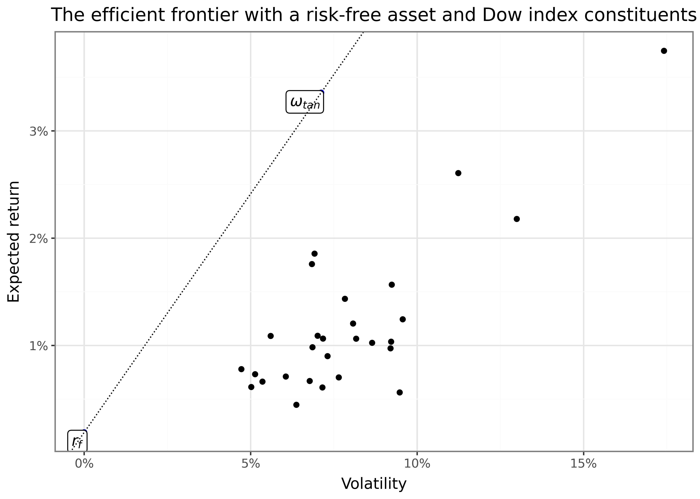
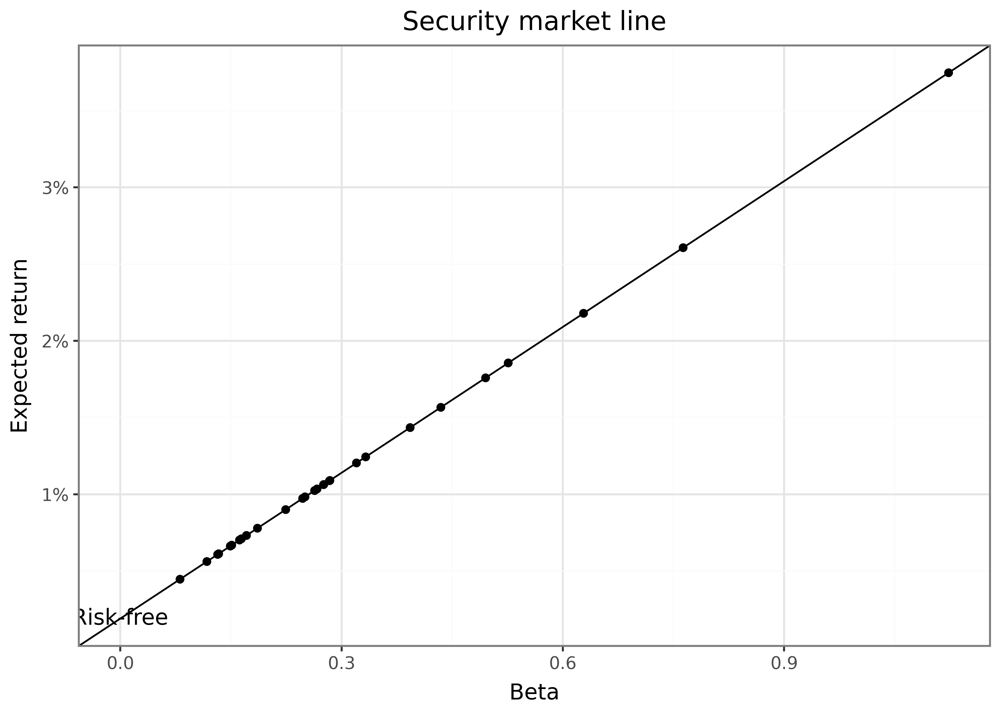
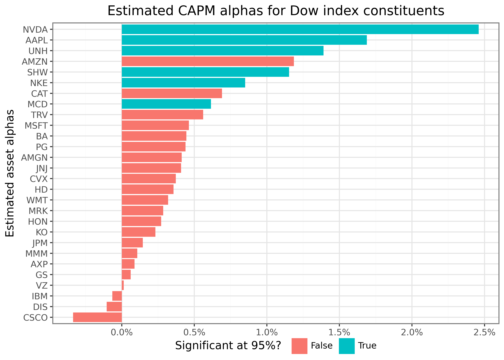

# The Capital Asset Pricing Model

> **NOTE:**
>
> You are reading **Tidy Finance with Python**. You can find the equivalent chapter for the sibling **Tidy Finance with R** [here](../r/capital-asset-pricing-model.llms.md).

The Capital Asset Pricing Model (CAPM) is one of the most influential theories in finance and builds on the foundation laid by [Modern Portfolio Theory](../python/modern-portfolio-theory.llms.md) (MPT). It was simultaneously developed by Sharpe ([1964](#ref-Sharpe1964)), Lintner ([1965](#ref-Lintner1965)), and Mossin ([1966](#ref-Mossin1966)). While MPT shows how to construct efficient portfolios, the CAPM extends this framework to explain how assets should be priced in equilibrium when all investors follow MPT principles. The CAPM is the simplest model that aims to explain equilibrium asset prices and hence the cornerstone for a myriad of extensions. In this chapter, we derive the CAPM, illustrate the theoretical underpinnings and show how to estimate the coefficients of the CAPM. For this final purpose, we download stock market data, estimate betas using regression analysis, and evaluate asset performance.

We use the following packages throughout this chapter:

``` python
import pandas as pd
import numpy as np
import tidyfinance as tf

from plotnine import *
from mizani.formatters import percent_format
from adjustText import adjust_text
```

## Asset Returns & Volatilities

Building on our analysis from the previous chapter on [Modern Portfolio Theory](../python/modern-portfolio-theory.llms.md), we again examine the Dow Jones Industrial Average constituents as an exemplary asset universe. We download and prepare our monthly return data:

``` python
symbols = tf.download_data(
    domain="constituents", 
    index="Dow Jones Industrial Average"
)

prices_daily = tf.download_data(
    domain="stock_prices", 
    symbols=symbols["symbol"].tolist(),
    start_date="2000-01-01", 
    end_date="2023-12-31"
)

prices_daily = (prices_daily
    .groupby("symbol")
    .apply(lambda x: x.assign(counts=x["adjusted_close"].dropna().count()))
    .reset_index(drop=True)
    .query("counts == counts.max()")
)

returns_monthly = (prices_daily
    .assign(
        date=prices_daily["date"].dt.to_period("M").dt.to_timestamp()
    )
    .groupby(["symbol", "date"], as_index=False)
    .agg(adjusted_close=("adjusted_close", "last"))
    .assign(
        ret=lambda x: x.groupby("symbol")["adjusted_close"].pct_change()
    )
)
```

The relationship between risk and return is central to the CAPM. Intuitively, one may expect that assets with higher volatility should also deliver higher expected returns. Instead, the CAPM’s key insight states that not all risks are rewarded in equilibrium. Only so-called systematic risk of an asset will determine the assets expected return. To understand this, we need to distinguish between systematic and idiosyncratic risk.

Company-specific events might affect individual stock prices, e.g., CEO resignations, product launches, and earnings reports. These idiosyncratic events don’t necessarily impact the overall market and this asset-specific risk can be eliminated through diversification. Therefore, we call this risk idiosyncratic. Systematic risk, on the other hand, affects all assets in the market at the same time and investors really dislike it because it cannot be diversified away.

## Portfolio Return & Variance

While we covered efficient portfolio choice in detail in the previous chapter, CAPM relies on the introduction of a crucial new element: a risk-free asset. This additional asset fundamentally changes the investment opportunity set and leads to powerful conclusions about efficient portfolio choice.

To recap, we considered a portfolio weight vector \\\omega\in\mathbb{R}^N\\ which denotes investments into the available \\N\\ risky assets. So far we assumed \\\sum_i^N \omega_i=1\\, indicating that all available wealth is invested across the asset universe without any outside option. Now, we relax this assumption and instead assume that all the remaining wealth, \\1-\iota'\omega\\, is invested in a risk-free asset which pays a constant interest \\r_f\\. The expected portfolio return for the portfolio of risky assets \\\omega\\ is then

\\\mu\_\omega = \omega^{\prime}\mu + (1-\iota^{\prime}\omega)r_f = r_f + \omega^{\prime}\underbrace{(\mu-r_f)}\_{\tilde\mu}.\\

where \\\mu\\ is the the vector of expected return of assets and \\r_f\\ is the risk-free rate. In what follows, we refer to \\\tilde\mu\\ as the vector of expected *excess* returns.

By assumption, the risk-free asset has zero volatility. Therefore, the volatility of the portfolio is given by

\\\sigma\_\omega = \sqrt{\omega^{\prime}\Sigma\omega}\\

where \\\Sigma\\ is the variance-covariance matrix of the returns. Restating the optimal decision problem of an investor who wants to earn a desired level of expected portfolio (excess) returns (\\\bar\mu-r_f\\) with the lowest possible variance leads to the optimization problem

\\\min\_\omega Z(\omega) = \min\_\omega \omega^{\prime}\Sigma\omega - \lambda \left(\omega^{\prime}\tilde\mu-\bar\mu\right).\\

The first-order conditions for this optimization problem yield:

\\\frac{\partial Z}{\partial \omega} = 2\Sigma\omega - \lambda \tilde\mu = 0 \\\Leftrightarrow \omega^\* = \frac{\lambda}{2}\Sigma^{-1}\tilde\mu\\

The constraint \\\omega^{\prime}\tilde\mu\_\omega\geq \bar\mu\\ delivers

\\ \bar\mu = \tilde\mu^{\prime}\omega^\* = \frac{\lambda}{2}\tilde\mu^{\prime}\Sigma^{-1}\tilde\mu \\ \Rightarrow \lambda = \frac{2\bar\mu}{\tilde\mu^{\prime}\Sigma^{-1}\tilde\mu}. \\

Thus, the optimal portfolio weights are given by \\ \omega^\* = \frac{\bar\mu}{\tilde\mu^{\prime}\Sigma^{-1}\tilde\mu}\Sigma^{-1}\tilde\mu. \\

Note that \\\omega^\*\\ does not necessarily sum up to one as, mechanically, the remainder \\1-\iota^{\prime}\omega^\*\\ is invested in the risk-free asset. However, scaling \\\omega^\*\\ delivers the portfolio of risky assets \\\omega\_\text{tan}\\ such that

\\ \omega\_\text{tan} := \frac{\omega^\*}{\iota'\omega^\*}= \frac{\Sigma^{-1}(\mu-r_f)}{\iota^{\prime}\Sigma^{-1}(\mu-r_f)}. \\

Importantly, \\\omega\_\text{tan}\\ is independent from \\\bar\mu\\! Thus, irrespective of the desired level of expected returns (or the investors’ risk aversion), everybody chooses the same portfolio of risky assets. The only variation arises from the amount of wealth invested into the risk-free asset. Some investors may even choose to lever their risky position by borrowing at the risk-free rate and investing more than their actual wealth into the portfolio \\\omega\_\text{tan}\\.

The portfolio

\\ \omega\_{tan}=\frac{\Sigma^{-1}\tilde\mu}{\iota^{\prime}\Sigma^{-1}\tilde\mu} \\

is central to the CAPM and is typically called the efficient tangency portfolio.

For illustrative purposes, we compute the efficient tangency portfolio for our hypothetical asset universe. As a realistic proxy for the risk-free rate, we use the average13-week T-bill rate (traded with the symbol ^IRX). Since the prices are quoted in annualized percentage yields, we have to divide them by 100 and convert them to monthly rates.

``` python
risk_free_monthly = (
  tf.download_data("stock_prices", symbols="^IRX", start_date="2019-10-01", end_date="2024-09-30")
  .assign(
    risk_free=lambda x: (1 + x["adjusted_close"] / 100)**(1/12) - 1
  )
  .dropna()
)

rf = risk_free_monthly["risk_free"].mean()
```

Next, we define the core parameters governing the distribution of asset returns, \\\Sigma\\ and \\\tilde\mu\\.

``` python
assets = (returns_monthly
    .groupby("symbol", as_index=False)
    .agg(
        mu=("ret", "mean"),
        sigma=("ret", "std")
    )
)

sigma = (returns_monthly
    .pivot(index="date", columns="symbol", values="ret")
    .cov()
)

mu = (returns_monthly
    .groupby("symbol")["ret"]
    .mean()
    .values
)
```

We are ready to illustrate the resulting efficient frontier. Every investor chooses to allocate a fraction of her wealth in the efficient tangency portfolio \\\omega\_\text{tan}\\ and the remainder in the risk-free asset. The optimal allocation depends on the investor’s risk aversion. As the risk-free asset, by definition, has a zero volatility, the efficient frontier is a straight line connecting the risk-free asset with the tangency portfolio. The slope of the line connecting the risk-free asset and the tangency portfolio is

\\\frac{\omega^{\prime}\_\text{tan}\mu-r_f}{\omega\_\text{tan}^{\prime}\Sigma\omega\_\text{tan}^{\prime}}.\\

Typically, the excess return of an asset scaled by its volatility, \\\frac{\tilde\mu_i}{\sigma_i}\\, is called the Sharpe ratio of the asset. Thus, the slope of the efficient frontier corresponds to the Sharpe ratio of the tangency portfolio returns. By construction, the tangency portfolio is the maximum Sharpe ratio portfolio.[^1]

``` python
w_tan = np.linalg.solve(sigma, mu - rf)
w_tan = w_tan / np.sum(w_tan)

mu_w = w_tan.T @ mu
sigma_w = np.sqrt(w_tan.T @ sigma @ w_tan)

efficient_portfolios = pd.DataFrame(
    [
        {"symbol": "\omega_{tan}", "mu": mu_w, "sigma": sigma_w},
        {"symbol": "r_f", "mu": rf, "sigma": 0},
    ]
)

sharpe_ratio = (mu_w - rf) / sigma_w
```

[Figure 1](#fig-300) shows the resulting efficient frontiert with the efficient portfolio and a risk-free asset.

``` python
efficient_portfolios_figure = (
    ggplot(efficient_portfolios, aes(x="sigma", y="mu"))
    + geom_point(data=assets)
    + geom_point(data=efficient_portfolios, color="blue")
    + geom_label(
        aes(label="symbol"),
        parse=True,
        adjust_text={"arrowprops": {"arrowstyle": "-"}},
    )
    + scale_x_continuous(labels=percent_format())
    + scale_y_continuous(labels=percent_format())
    + labs(
        x="Volatility",
        y="Expected return",
        title="The efficient frontier with a risk-free asset and Dow index constituents",
    )
    + geom_abline(aes(intercept=rf, slope=sharpe_ratio), linetype="dotted")
)
efficient_portfolios_figure.show()
```

[](capital-asset-pricing-model_files/figure-html/fig-300-output-1.png "Figure 1: Expected returns and volatilities based on monthly returns adjusted for dividend payments and stock splits.")

Figure 1: Expected returns and volatilities based on monthly returns adjusted for dividend payments and stock splits.

## The Capital Market Line

Taking another look at the efficient tangency portfolio \\\omega\_\text{tan}\\ reveals that expected asset excess returns \\\tilde\mu\\ cannot be arbitrarily large or small. From the first order condition of the optimization problem above we get, via simple rearranging,

\\ \frac{\partial Z}{\partial \omega} = 2\Sigma\omega - \lambda \tilde\mu =0 \\\Leftrightarrow \tilde\mu = \frac{2}{\lambda}\Sigma\omega^\* = \frac{2}{\lambda}\underbrace{\iota'\omega^\*}\_{=\frac{\lambda}{2}\iota^{\prime}\Sigma^{-1}\tilde\mu}\Sigma\omega\_\text{tan} \\ = \iota^{\prime}\Sigma^{-1}\tilde\mu\Sigma\omega\_\text{tan} \\

Now, note the following three simple derivations:

1.  The expected excess return of the efficient tangency portfolio, \\\tilde\mu\_\text{tan}\\ is given by \\E(\omega\_\text{tan}^{\prime} r - r_f) = \omega\_\text{tan} \tilde\mu = \frac{\tilde\mu^{\prime}\Sigma^{-1}\tilde\mu}{\iota^{\prime}\Sigma^{-1}\tilde\mu}\\.
2.  The variance of the returns of the efficient tangency portfolio \\\sigma\_\text{tan}^2\\ is given by \\\text{Var}(\omega\_\text{tan}^{\prime} r) = \omega\_\text{tan}^{\prime} \Sigma \omega\_\text{tan}^{\prime} = \frac{\tilde\mu^{\prime}\Sigma^{-1}\tilde\mu}{(\iota^{\prime}\Sigma^{-1}\tilde\mu)^2}\\. It follows that \\\frac{\tilde\mu\_\text{tan}}{\sigma\_\text{tan}^2} = \iota^{\prime}\Sigma^{-1}\tilde\mu\\
3.  The \\i\\-th element of the vector \\\Sigma\omega\_\text{tan}\\ is \\\sum\limits\_{j=1}^N \sigma\_{ij}\omega\_{j,\text{tan}}= \text{Cov}\left(r_i, \sum\limits\_{j=1}^N r_i'\omega\_{j,\text{tan}}\right) = \text{Cov}\left(r_i, r\_\text{tan}\right)\\, which is the covariance of assets \\i\\ returns with the returns of the efficient tangency portfolio.

Putting everything together yields for the expected excess return of asset \\i\\:

\\ \tilde{\mu}\_i = \frac{E(\omega\_\text{tan}^{\prime}r - r_f)}{\sigma\_{\text{tan}}^2} \text{Cov}\left(r_i,r\_\text{tan}\right) = \beta_i \tilde{\mu}\_\text{tan}. \\

The equation above is the famous CAPM equation and central to asset pricing. It states that an assets expected excess return is proportional to the assets return covariance with the efficient portfolio excess returns. The price of risk is the excess return of the efficient tangency portfolio. An asset with 0 beta has the same expected return as the risk-free rate. An asset with a beta of 1 has the same expected return as the efficient tangency portfolio. An asset with a negative beta has expected returns lower than the risk-free asset - the very definition of an insurance. Therefore, the CAPM equation explains why some assets may have the same volatility but different returns: Because their systematic risk (\\\beta_i\\) is different.

We derived the CAPM equation as a consequence of efficient wealth allocation. Suppose an asset delivers high expected returns. The investor will increase her holdings of the assets in order to benefit from the high promised returns. As a consequence, the covariance of the asset with the efficient tangency portfolio will increase (mechanically, as the asset gradually becomes a larger part of the efficient tangency portfolio). At some point, the weight of the asset is so high that gain of \\\tilde\mu_i\\ of marginally increasing the holding does not offset the implied increase in systematic risk. The investor will stop increasing her holdings and the asset’s expected return will be proportional to its systematic risk.

We can illustrate the relationship between systematic risk and expected returns in the so-called security market line.

``` python
betas = (sigma @ w_tan) / (w_tan.T @ sigma @ w_tan)
assets["beta"] = betas.values

price_of_risk = float(w_tan.T @ mu - rf)

assets_figure = (
    ggplot(assets, aes(x="beta", y="mu"))
    + geom_point()
    + geom_abline(intercept=rf, slope=price_of_risk)
    + scale_y_continuous(labels=percent_format())
    + labs(x="Beta", y="Expected return", title="Security market line")
    + annotate("text", x=0, y=rf, label="Risk-free")
)
assets_figure.show()
```

[](capital-asset-pricing-model_files/figure-html/cell-10-output-1.png)

The security market line shows the relationship between systematic risk (\\\beta_i\\) and the expected return of an asset. The slope of the line is the price of risk, which is the expected return of the efficient tangency portfolio. The risk-free asset is represented by the intercept with the vertical axis. The CAPM equation states that an asset’s expected return is proportional to its beta, with the efficient tangency portfolio’s expected return as the price of risk.

## Asset Pricing and the Market Portfolio

So far, we focused on the optimal decision problem of an individual investor. The capital asset pricing model goes an important step further and considers the equilibrium in which all investors in the market choose to hold efficient portfolios.

Based on the previous derivations, it should be clear that

1.  All rational investors prefer efficient portfolios to individual assets or any other portfolios.
2.  The tangency portfolio \\\omega\_\text{tan}\\ serves as the optimal risky portfolio for all investors.

This leads to a powerful conclusion: In equilibrium, all investors hold some combination of the risk-free asset and the tangency portfolio, regardless of their risk preferences. Their only choice is how much to allocate to each of the two funds. Aggregating all capital allocated to risky assets yields the total market capitalization of all risky assets. Given that everybody holds the same portfolio of risky assets, the market capitalization of each asset is proportional to its weight in the efficient tangency portfolio. The market portfolio is the sum of all risky assets weighted by their market capitalization. For practical purposes the insight that the market portfolio is the efficient tangency portfolio, has substantial value: Instead of having to derive the vector of expected asset returns and the variance-covariance matrix, we can use the market portfolio as a proxy for the efficient tangency portfolio. Market capitalization is readily observable and the market portfolio is easy to replicate.[^2]

Empirically, the CAPM-equation boils down to a linear regression:

\\r\_{t,i}-r_f = \beta_i (r\_{m,t} - r_f) + \varepsilon\_{i,t}.\\

Thus, a naive, but straightforward way of ‘estimating’ the CAPM is to run a linear regression of asset excess returns on market excess returns. The slope of the regression line is then the asset’s beta.

The potential intercept is the asset’s alpha, which measures the asset’s risk-adjusted performance. If the CAPM holds, the alpha should be statistically indistinguishable from zero for all assets. Alpha provides a risk-adjusted performance measure. A positive alpha indicates that the asset outperformed its risk-adjusted benchmark, while a negative alpha suggests underperformance.

In practice, we hence estimate both alpha and beta using regression analysis. The empirical model is:

\\r\_{i,t} - r\_{f,t} = \alpha_i + \beta_i \cdot (r\_{m,t} - r\_{f,t} ) + \varepsilon\_{i,t}, \\ where \\r\_{i,t}\\ and \\r\_{m,t}\\ are the realized returns of the asset and market portfolio on day \\t\\, respectively. The error term \\\varepsilon\_{i,t}\\ captures the asset’s idiosyncratic risk.

Let’s turn to estimating CAPM parameters using real market data. Instead of using our previously constructed tangency portfolio, we employ the Fama-French market excess returns, which provide a widely accepted proxy for the market portfolio. These returns are already adjusted to represent excess returns over the risk-free rate, simplifying our analysis.

``` python
import tidyfinance as tf

factors = tf.download_data(
    domain="famafrench",
    dataset="F-F_Research_Data_5_Factors_2x3",
    start_date="2000-01-01",
    end_date="2024-09-30",
)
```

For our regression analysis, we first prepare the data by calculating excess returns for each stock. We join our monthly returns with the Fama-French factors and subtract the risk-free rate to obtain excess returns. The `estimate_capm()` function then implements the regression equation we previously discussed. We leverage nested dataframes to efficiently run these regressions for all assets simultaneously. The `map()` function applies our regression to each nested dataset and extracts the coefficients, giving us a clean data frame of assets and their corresponding betas.

``` python
import statsmodels.formula.api as smf

returns_excess_monthly = (returns_monthly
    .merge(factors, on="date", how="left")
    .assign(ret_excess=lambda x: x["ret"] - x["risk_free"])
)

def estimate_capm(data):
    model = smf.ols("ret_excess ~ mkt_excess", data=data).fit()
    result = pd.DataFrame({
        "coefficient": ["alpha", "beta"],
        "estimate": model.params.values,
        "t_statistic": model.tvalues.values
    })
    return result

capm_results = (returns_excess_monthly
    .groupby("symbol", group_keys=True)
    .apply(estimate_capm)
    .reset_index()
)
```

The results are particularly interesting when we visualize the alphas across our sample of Dow Jones constituents. [Figure 2](#fig-305) reveals the cross-sectional distribution of risk-adjusted performance, with positive values indicating outperformance and negative values indicating underperformance relative to what CAPM would predict. Statistical significance is indicated through color coding, showing which alphas are statistically different from zero at the 95% confidence level.

``` python
alphas = (capm_results
    .query("coefficient=='alpha'")
    .assign(is_significant=lambda x: np.abs(x["t_statistic"]) >= 1.96)
)

alphas["symbol"] = pd.Categorical(
    alphas["symbol"],
    categories=alphas.sort_values("estimate")["symbol"],
    ordered=True
)

alphas_figure = (
    ggplot(
        alphas, 
        aes(y="estimate", x="symbol", fill="is_significant")
    )
    + geom_col()
    + scale_y_continuous(labels=percent_format())
    + coord_flip()
    + labs(
        x="Estimated asset alphas", y="", fill="Significant at 95%?",
        title="Estimated CAPM alphas for Dow index constituents"
        )
)
alphas_figure.show()
```

[](capital-asset-pricing-model_files/figure-html/fig-305-output-1.png "Figure 2: Estimates are based on returns adjusted for dividend payments and stock splits and using the Fama-French market excess returns as a measure for the market.")

Figure 2: Estimates are based on returns adjusted for dividend payments and stock splits and using the Fama-French market excess returns as a measure for the market.

Most notably, our analysis shows that only very few assets exhibit a statistically significant positive alpha during our sample period. This finding aligns with the exceptional performance of technology stocks, particularly those involved in AI and chip manufacturing, but suggests that most Dow components’ returns can be explained by their market exposure alone.

## Shortcomings & Extensions

While the CAPM’s elegance and simplicity have made it a cornerstone of modern finance, the model faces several important challenges in practice. A fundamental challenge lies in the identification of the market portfolio. The CAPM theory requires a truly universal market portfolio that includes all investable assets – not just stocks, but also real estate, private businesses, human capital, and even intangible assets. In practice, we must rely on proxies like the S&P 500, DAX, or TOPIX. The choice of market proxy can significantly impact our estimates and may need to be tailored to specific contexts. For instance, a U.S.-focused investor might use the S&P 500, while a Japanese investor might prefer the TOPIX.

Another crucial limitation concerns the stability of beta over time. The model assumes that an asset’s systematic risk remains constant, but this rarely holds in practice. Companies undergo significant changes that can affect their market sensitivity: they may alter their capital structure, enter new markets, face new competitors, or transform their business models. Consider how tech companies’ betas might change as they mature from growth startups to established enterprises, or how a retailer’s beta might shift as it expands its online presence.

Perhaps most importantly, empirical evidence suggests that systematic risk alone cannot fully explain asset returns. Numerous studies have documented patterns in stock returns that CAPM cannot explain. Small-cap stocks tend to outperform large-cap stocks, and value stocks (those with high book-to-market ratios) tend to outperform growth stocks, even after adjusting for market risk. These “anomalies” suggest that investors may care about multiple dimensions of risk beyond market sensitivity.

These limitations have spawned a rich literature of alternative and extended models. The Fama-French three-factor model (@ [Fama and French 1992](#ref-Fama1992)) represents a seminal extension, adding two factors to capture the size and value effects:

- The SMB (Small Minus Big) factor captures the tendency of small stocks to outperform large stocks, as we discuss in our chapter [Size Sorts and P-Hacking](../python/size-sorts-and-p-hacking.llms.md).
- The HML (High Minus Low) factor captures the tendency of value stocks to outperform growth stocks, as we show in [Value and Bivariate Sorts](../python/value-and-bivariate-sorts.llms.md).

Building on this framework, the Fama-French five-factor model ([Fama and French 2015](#ref-FamaFrench2015)) adds two more dimensions, which we later discuss in [Replicating Fama-French Factors](../python/replicating-fama-and-french-factors.llms.md):

- The RMW (Robust Minus Weak) factor captures the outperformance of companies with strong operating profitability
- The CMA (Conservative Minus Aggressive) factor reflects the tendency of companies with conservative investment policies to outperform those with aggressive investment policies

The field continues to evolve with various theoretical and empirical innovations. The Consumption CAPM links asset prices to macroeconomic risks through aggregate consumption. The Conditional CAPM ([Jagannathan and Wang 1996](#ref-Jagannathan1996)) allows risk premiums and betas to vary with the business cycle. The Carhart four-factor model ([Carhart 1997](#ref-Carhart1997)) adds momentum to the three-factor framework, while the Q-factor model and investment CAPM ([Hou et al. 2014](#ref-Hou2015)) provide alternative theoretical foundations rooted in corporate finance.

Despite its limitations, the CAPM remains valuable as a conceptual framework and practical tool. Its core insight – that only systematic risk should be priced in equilibrium – continues to influence how we think about risk and return. Understanding both its strengths and weaknesses helps us apply it more effectively and appreciate the contributions of newer models that build upon its foundation.

## Key Takeaways

- The CAPM explains asset prices in equilibrium based on systematic risk and investor preferences under ideal market conditions.
- In equilibrium, all investors invest in a mix of the market portfolio and a risk-free asset, with individual risk tolerance determining the allocation between the two.
- Expected returns are linearly related to systematic risk, meaning assets with higher beta values should offer higher expected returns to compensate for undiversifiable risk.
- Beta is a measure of an asset’s sensitivity to overall market movements and is estimated using regression analysis of excess asset returns on excess market returns.
- Despite its simplifying assumptions, the CAPM remains foundational in finance and highlights the critical distinction between systematic and idiosyncratic risk.
- Empirical limitations of the CAPM, such as instability of beta and unexplained return anomalies, have led to the development of multifactor models like the Fama-French and Carhart models.

## Exercises

1.  Download daily returns for a German stock of your choice and the S&P 500 index for the past five years. Calculate the stock’s beta and interpret its meaning. How does your estimate change if you use daily instead of monthly returns?
2.  Compare the betas of stocks estimated using different market proxies (e.g., S&P 500, Russell 3000, MSCI World). How do the differences in market definition affect your conclusions about systematic risk?
3.  Select a mutual fund and estimate its alpha and beta relative to its benchmark index. Is the fund’s performance statistically significant after accounting for market risk? How do your conclusions change if you use a different benchmark?
4.  Compare betas of multinational companies using both local and global market indices. How do the estimates differ? What might explain these differences?

## References

Carhart, Mark M. 1997. “On persistence in mutual fund performance.” *The Journal of Finance* 52 (1): 57–82. <https://doi.org/10.1111/j.1540-6261.1997.tb03808.x>.

Fama, Eugene F., and Kenneth R. French. 1992. “The cross-section of expected stock returns.” *The Journal of Finance* 47 (2): 427–65. <https://doi.org/2329112>.

Fama, Eugene F., and Kenneth R. French. 2015. “A Five-Factor Asset Pricing Model.” *Journal of Financial Economics* 116 (1): 1–22. <https://doi.org/10.1016/j.jfineco.2014.10.010>.

Hou, Kewei, Chen Xue, and Lu Zhang. 2014. “Digesting anomalies: An investment approach.” *Review of Financial Studies* 28 (3): 650–705. <https://doi.org/10.1093/rfs/hhu068>.

Jagannathan, Ravi, and Zhenyu Wang. 1996. “The conditional CAPM and the cross-section of expected returns.” *The Journal of Finance* 51 (1): 3–53. <https://doi.org/10.2307/2329301>.

Lintner, John. 1965. “Security prices, risk, and maximal gains from diversification.” *The Journal of Finance* 20 (4): 587–615. <https://doi.org/10.1111/j.1540-6261.1965.tb02930.x>.

Mossin, Jan. 1966. “Equilibrium in a capital asset market.” *Econometrica* 34 (4): 768–83. <https://doi.org/10.2307/1910098>.

Sharpe, William F. 1964. “Capital asset prices: A theory of market equilibrium under conditions of risk .” *The Journal of Finance* 19 (3): 425–42. <https://doi.org/10.1111/j.1540-6261.1964.tb02865.x>.

## Footnotes

[^1]: We proof in the Appendix [Proofs](../python/proofs.llms.md) that the efficient tangency portfolio \\\omega\_\text{tan}\\ can also be derived as a solution to the optimization problem \\\max\_{\omega} \frac{\omega^{\prime}\tilde\mu}{\sqrt{\omega^{\prime}\Sigma\omega}} \text{ s.t. } \omega^{\prime}\iota=1.\\

[^2]: Obviously, the market portfolio is the efficient tangency portfolio *only* if the strict assumptions of the CAPM hold: The model describes equilibrium in a single-period economy, markets are frictionless, with no transaction costs or taxes, all investors can borrow and lend at the risk-free rate, investors share the same expectations about returns and risks, investors are rational, seeking to maximize returns for a given level of risk.
