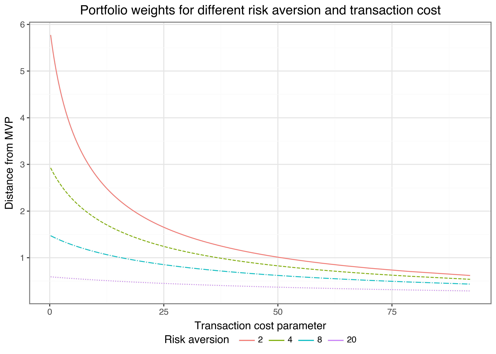
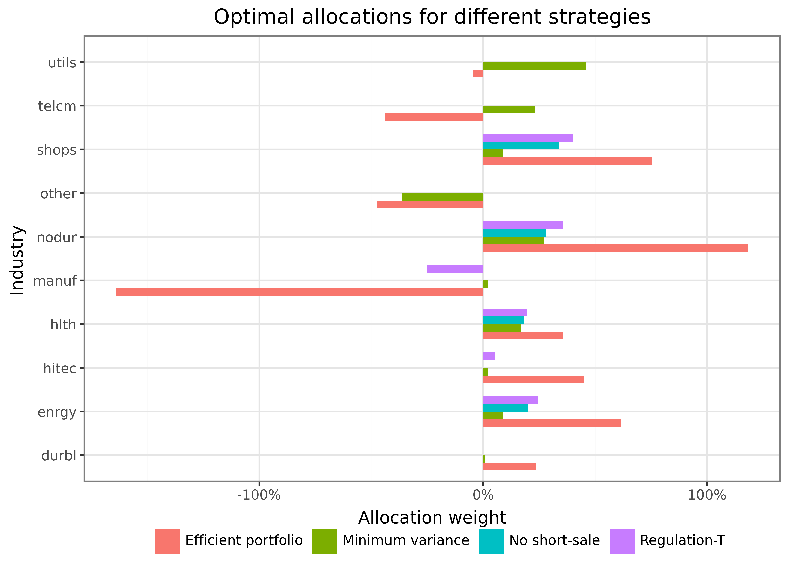

# Constrained Optimization and Backtesting

> **NOTE:**
>
> You are reading **Tidy Finance with Python**. You can find the equivalent chapter for the sibling **Tidy Finance with R**[here](../r/constrained-optimization-and-backtesting.llms.md).

In this chapter, we conduct portfolio backtesting in a realistic setting by including transaction costs and investment constraints such as no-short-selling rules. We start with standard mean-variance efficient portfolios and introduce constraints in a step-by-step manner. To do so, we rely on numerical optimization procedures in Python. We conclude the chapter by providing an out-of-sample backtesting procedure for the different strategies that we introduce in this chapter.

Throughout this chapter, we use the following Python packages:

``` python
import pandas as pd
import numpy as np

from plotnine import *
from mizani.formatters import percent_format
from itertools import product
from scipy.stats import expon
from scipy.optimize import minimize
```

Compared to previous chapters, we introduce `expon` from `scipy.stats` to calculate exponential continuous random variables.

## Data Preparation

We start by loading the required data from our Parquet files introduced in [Accessing and Managing Financial Data](../python/accessing-and-managing-financial-data.llms.md) and [WRDS, CRSP, and Compustat](../python/wrds-crsp-and-compustat.llms.md). For simplicity, we restrict our investment universe to the monthly Fama-French industry portfolio returns in the following application.

``` python
industry_returns = (
    pd.read_parquet("data-python/industries_ff_monthly.parquet")
    .drop(columns=["date"])
    .dropna()
)
```

## Recap of Portfolio Choice

A common objective for portfolio optimization is to find mean-variance efficient portfolio weights, i.e., the allocation that delivers the lowest possible return variance for a given minimum level of expected returns. In the most extreme case, where the investor is only concerned about portfolio variance, they may choose to implement the minimum variance portfolio (MVP) weights which are given by the solution to

\\ \omega\_\text{mvp} = \arg\min \omega'\Sigma \omega \text{ s.t. } \omega'\iota = 1 \tag{1}\\

where \\\Sigma\\ is the \\(N \times N)\\ covariance matrix of the returns. The optimal weights \\\omega\_\text{mvp}\\ can be found analytically and are \\\omega\_\text{mvp} = \frac{\Sigma^{-1}\iota}{\iota'\Sigma^{-1}\iota}\\. In terms of code, the math is equivalent to the following chunk.

``` python
n_industries = industry_returns.shape[1]

mu = np.array(industry_returns.mean()).T
sigma = np.array(industry_returns.cov())
w_mvp = np.linalg.inv(sigma) @ np.ones(n_industries)
w_mvp = w_mvp/w_mvp.sum()

weights_mvp = pd.DataFrame({
    "Industry": industry_returns.columns.tolist(),
    "Minimum variance": w_mvp
})
weights_mvp.round(3)
```

|     | Industry | Minimum variance |
|-----|----------|------------------|
| 0   | nodur    | 0.274            |
| 1   | durbl    | 0.010            |
| 2   | manuf    | 0.023            |
| 3   | enrgy    | 0.087            |
| 4   | hitec    | 0.021            |
| 5   | telcm    | 0.231            |
| 6   | shops    | 0.087            |
| 7   | hlth     | 0.170            |
| 8   | utils    | 0.460            |
| 9   | other    | -0.364           |

Next, consider an investor who aims to achieve minimum variance *given a required expected portfolio return* \\\bar{\mu}\\ such that she chooses

\\ \omega\_\text{eff}({\bar{\mu}}) =\arg\min \omega'\Sigma \omega \text{ s.t. } \omega'\iota = 1 \text{ and } \omega'\mu \geq \bar{\mu}. \tag{2}\\

We leave it as an exercise below to show that the portfolio choice problem can equivalently be formulated for an investor with mean-variance preferences and risk aversion factor \\\gamma\\. That means the investor aims to choose portfolio weights as the solution to \\ \omega^\*\_\gamma = \arg\max \omega' \mu - \frac{\gamma}{2}\omega'\Sigma \omega\quad \text{ s.t. } \omega'\iota = 1. \tag{3}\\

The solution to the optimal portfolio choice problem is:

\\ \omega^\*\_{\gamma} = \frac{1}{\gamma}\left(\Sigma^{-1} - \frac{1}{\iota' \Sigma^{-1}\iota }\Sigma^{-1}\iota\iota' \Sigma^{-1} \right) \mu + \frac{1}{\iota' \Sigma^{-1} \iota }\Sigma^{-1} \iota. \tag{4}\\

To proof this statement, we refer to the derivations in [Proofs](../python/proofs.llms.md). Empirically, this classical solution imposes many problems. In particular, the estimates of \\\mu\\ are noisy over short horizons, the (\\N \times N\\) matrix \\\Sigma\\ contains \\N(N-1)/2\\ distinct elements and thus, estimation error is huge. Seminal papers on the effect of ignoring estimation uncertainty, among others, are Brown ([1976](#ref-Brown1976)), Jobson and Korkie ([1980](#ref-Jobson1980)), Jorion ([1986](#ref-Jorion1986)), and Chopra and Ziemba ([1993](#ref-Chopra1993)).

Even worse, if the asset universe contains more assets than available time periods \\(N \> T)\\, the sample covariance matrix is no longer positive definite such that the inverse \\\Sigma^{-1}\\ does not exist anymore. To address estimation issues for vast-dimensional covariance matrices, regularization techniques (see, e.g., [Ledoit and Wolf 2003](#ref-Ledoit2003), [2004](#ref-Ledoit2004), [2012](#ref-Ledoit2012); [Fan et al. 2008](#ref-Fan2008)) and the parametric approach from the previous chapter are popular tools.

While the uncertainty associated with estimated parameters is challenging, the data-generating process is also unknown to the investor. In other words, model uncertainty reflects that it is ex-ante not even clear which parameters require estimation (for instance, if returns are driven by a factor model, selecting the universe of relevant factors imposes model uncertainty). Wang ([2005](#ref-Wang2005)) and Garlappi et al. ([2007](#ref-Garlappi2007)) provide theoretical analysis on optimal portfolio choice under model *and* estimation uncertainty. In the most extreme case, Pflug et al. ([2012](#ref-Pflug2012)) shows that the naive portfolio, which allocates equal wealth to all assets, is the optimal choice for an investor averse to model uncertainty.

On top of the estimation uncertainty, *transaction costs* are a major concern. Rebalancing portfolios is costly, and, therefore, the optimal choice should depend on the investor’s current holdings. In the presence of transaction costs, the benefits of reallocating wealth may be smaller than the costs associated with turnover. This aspect has been investigated theoretically, among others, for one risky asset by Magill and Constantinides ([1976](#ref-Magill1976)) and Davis and Norman ([1990](#ref-Davis1990)). Subsequent extensions to the case with multiple assets have been proposed by Balduzzi and Lynch ([1999](#ref-Balduzzi1999)) and Balduzzi and Lynch ([2000](#ref-Balduzzi2000)). More recent papers on empirical approaches that explicitly account for transaction costs include Gârleanu and Pedersen ([2013](#ref-Garleanu2013)), DeMiguel et al. ([2014](#ref-DeMiguel2014)), and DeMiguel et al. ([2015](#ref-DeMiguel2015)).

## Estimation Uncertainty and Transaction Costs

The empirical evidence regarding the performance of a mean-variance optimization procedure in which you simply plug in some sample estimates \\\hat \mu\\ and \\\hat \Sigma\\ can be summarized rather briefly: mean-variance optimization performs poorly! The literature discusses many proposals to overcome these empirical issues. For instance, one may impose some form of regularization of \\\Sigma\\, rely on Bayesian priors inspired by theoretical asset pricing models ([Kan and Zhou 2007](#ref-Kan2007)), or use high-frequency data to improve forecasting ([Hautsch et al. 2015](#ref-Hautsch2015)). One unifying framework that works easily, effectively (even for large dimensions), and is purely inspired by economic arguments is an ex-ante adjustment for transaction costs ([Hautsch and Voigt 2019](#ref-Hautsch2019)).

Assume that returns are from a multivariate normal distribution with mean \\\mu\\ and variance-covariance matrix \\\Sigma\\, \\N(\mu,\Sigma)\\. Additionally, we assume quadratic transaction costs which penalize rebalancing such that

\\ \begin{aligned} \nu\left(\omega\_{t+1},\omega\_{t^+}, \beta\right) = \frac{\beta}{2} \left(\omega\_{t+1} - \omega\_{t^+}\right)'\left(\omega\_{t+1}- \omega\_{t^+}\right),\end{aligned} \tag{5}\\

with cost parameter \\\beta\>0\\ and \\\omega\_{t^+} = {\omega_t \circ (1 +r\_{t})}/{\iota' (\omega_t \circ (1 + r\_{t}))}\\, where \\\circ\\ is the element-wise Hadamard product. \\\omega\_{t^+}\\ denotes the portfolio weights just before rebalancing. Note that \\\omega\_{t^+}\\ differs mechanically from \\\omega_t\\ due to the returns in the past period. Intuitively, transaction costs penalize portfolio performance when the portfolio is shifted from the current holdings \\\omega\_{t^+}\\ to a new allocation \\\omega\_{t+1}\\. In this setup, transaction costs do not increase linearly. Instead, larger rebalancing is penalized more heavily than small adjustments. Then, the optimal portfolio choice for an investor with mean variance preferences is

\\ \begin{aligned}\omega\_{t+1} ^\* &= \arg\max \omega'\mu - \nu_t (\omega,\omega\_{t^+}, \beta) - \frac{\gamma}{2}\omega'\Sigma\omega \text{ s.t. } \iota'\omega = 1\\ &=\arg\max \omega'\mu^\* - \frac{\gamma}{2}\omega'\Sigma^\* \omega \text{ s.t.} \iota'\omega=1,\end{aligned} \tag{6}\\

where

\\ \mu^\*=\mu+\beta \omega\_{t^+} \quad \text{and} \quad \Sigma^\*=\Sigma + \frac{\beta}{\gamma} I_N. \tag{7}\\

As a result, adjusting for transaction costs implies a standard mean-variance optimal portfolio choice with adjusted return parameters \\\Sigma^\*\\ and \\\mu^\*\\: \\\omega^\*\_{t+1} = \frac{1}{\gamma}\left(\Sigma^{\*-1} - \frac{1}{\iota' \Sigma^{\*-1}\iota }\Sigma^{\*-1}\iota\iota' \Sigma^{\*-1} \right) \mu^\* + \frac{1}{\iota' \Sigma^{\*-1} \iota }\Sigma^{\*-1} \iota. \tag{8}\\

An alternative formulation of the optimal portfolio can be derived as follows:

\\\omega\_{t+1} ^\*=\arg\max \omega'\left(\mu+\beta\left(\omega\_{t^+} - \frac{1}{N}\iota\right)\right) - \frac{\gamma}{2}\omega'\Sigma^\* \omega \text{ s.t. } \iota'\omega=1. \tag{9}\\

The optimal weights correspond to a mean-variance portfolio, where the vector of expected returns is such that assets that currently exhibit a higher weight are considered as delivering a higher expected return.

## Optimal Portfolio Choice

The function below implements the efficient portfolio weights in its general form, allowing for transaction costs (conditional on the holdings *before* reallocation). For \\\beta=0\\, the computation resembles the standard mean-variance efficient framework. `gamma` denotes the coefficient of risk aversion \\\gamma\\, `beta` is the transaction cost parameter \\\beta\\ and `w_prev` are the weights before rebalancing \\\omega\_{t^+}\\.

``` python
def compute_efficient_weight(
    sigma, mu, gamma=2, beta=0, w_prev=np.ones(sigma.shape[1]) / sigma.shape[1]
):
    """Compute efficient portfolio weights."""

    n = sigma.shape[1]
    iota = np.ones(n)
    sigma_processed = sigma + (beta / gamma) * np.eye(n)
    mu_processed = mu + beta * w_prev

    sigma_inverse = np.linalg.inv(sigma_processed)

    w_mvp = sigma_inverse @ iota
    w_mvp = w_mvp / np.sum(w_mvp)
    w_opt = (
        w_mvp
        + (1 / gamma)
        * (sigma_inverse - np.outer(w_mvp, iota) @ sigma_inverse)
        @ mu_processed
    )

    return w_opt


w_efficient = compute_efficient_weight(sigma, mu)

weights_efficient = pd.DataFrame(
    {
        "Industry": industry_returns.columns.tolist(),
        "Efficient portfolio": w_efficient,
    }
)
weights_efficient.round(3)
```

|     | Industry | Efficient portfolio |
|-----|----------|---------------------|
| 0   | nodur    | 1.192               |
| 1   | durbl    | 0.239               |
| 2   | manuf    | -1.664              |
| 3   | enrgy    | 0.616               |
| 4   | hitec    | 0.453               |
| 5   | telcm    | -0.438              |
| 6   | shops    | 0.755               |
| 7   | hlth     | 0.359               |
| 8   | utils    | -0.047              |
| 9   | other    | -0.465              |

The portfolio weights above indicate the efficient portfolio for an investor with risk aversion coefficient \\\gamma=2\\ in the absence of transaction costs. Some of the positions are negative, which implies short-selling, and most of the positions are rather extreme. For instance, a position of \\-1\\ implies that the investor takes a short position worth their entire wealth to lever long positions in other assets. What is the effect of transaction costs or different levels of risk aversion on the optimal portfolio choice? The following few lines of code analyze the distance between the minimum variance portfolio and the portfolio implemented by the investor for different values of the transaction cost parameter \\\beta\\ and risk aversion \\\gamma\\.

``` python
gammas = [2, 4, 8, 20]
betas = 20*expon.ppf(np.arange(1, 100)/100, scale=1)

transaction_costs = (pd.DataFrame(
        list(product(gammas, betas)), 
        columns=["gamma", "beta"]
    )
    .assign(
        weights=lambda x: x.apply(lambda y:
        compute_efficient_weight(
            sigma, mu, gamma=y["gamma"], beta=y["beta"]/10000, w_prev=w_mvp), 
        axis=1
        ),
        concentration=lambda x: x["weights"].apply(
        lambda x: np.sum(np.abs(x-w_mvp))
        )
    )
)
```

The code chunk above computes the optimal weight in the presence of transaction cost for different values of \\\beta\\ and \\\gamma\\ but with the same initial allocation, the theoretical optimal minimum variance portfolio. Starting from the initial allocation, the investor chooses their optimal allocation along the efficient frontier to reflect their own risk preferences. If transaction costs were absent, the investor would simply implement the mean-variance efficient allocation. If transaction costs make it costly to rebalance, their optimal portfolio choice reflects a shift toward the efficient portfolio, whereas their current portfolio anchors their investment.

``` python
rebalancing_figure = (
    ggplot(
        transaction_costs,
        aes(
            x="beta",
            y="concentration",
            color="factor(gamma)",
            linetype="factor(gamma)",
        ),
    )
    + geom_line()
    + guides(linetype=None)
    + labs(
        x="Transaction cost parameter",
        y="Distance from MVP",
        color="Risk aversion",
        title="Portfolio weights for different risk aversion and transaction cost",
    )
)
rebalancing_figure.show()
```

[](constrained-optimization-and-backtesting_files/figure-html/fig-1701-output-1.png "Figure 1: The figure shows portfolio weights for different risk aversion and transaction cost. The horizontal axis indicates the distance from the empirical minimum variance portfolio weight, measured by the sum of the absolute deviations of the chosen portfolio from the benchmark.")

Figure 1: The figure shows portfolio weights for different risk aversion and transaction cost. The horizontal axis indicates the distance from the empirical minimum variance portfolio weight, measured by the sum of the absolute deviations of the chosen portfolio from the benchmark.

[Figure 1](#fig-1701) shows rebalancing from the initial portfolio (which we always set to the minimum variance portfolio weights in this example). The higher the transaction costs parameter \\\beta\\, the smaller is the rebalancing from the initial portfolio. In addition, if risk aversion \\\gamma\\ increases, the efficient portfolio is closer to the minimum variance portfolio weights such that the investor desires less rebalancing from the initial holdings.

## Constrained Optimization

Next, we introduce constraints to the above optimization procedure. Very often, typical constraints such as short-selling restrictions prevent analytical solutions for optimal portfolio weights (short-selling restrictions simply imply that negative weights are not allowed such that we require that \\w_i \geq 0\\\forall i\\). However, numerical optimization allows computing the solutions to such constrained problems.

We rely on the powerful `scipy.optimize` package, which provides a common interface to a number of different optimization routines. In particular, we employ the Sequential Least-Squares Quadratic Programming (SLSQP) algorithm of Kraft ([1994](#ref-Kraft1994)) because it is able to handle multiple equality and inequality constraints at the same time and is typically used for problems where the objective function and the constraints are twice continuously differentiable. We have to provide the algorithm with the objective function and its gradient, as well as the constraints and their Jacobian.

We illustrate the use of `minimize()` by replicating the analytical solutions for the minimum variance and efficient portfolio weights from above. Note that the equality constraint for both solutions is given by the requirement that the weights must sum up to one. In addition, we supply a vector of equal weights as an initial value for the algorithm in all applications. We verify that the output is equal to the above solution. Note that `np.allclose()` is a safe way to compare two vectors for pairwise equality. The alternative `==` is sensitive to small differences that may occur due to the representation of floating points on a computer, while `np.allclose()` has a built-in tolerance. It returns `True` if both are equal, which is the case in both applications below.

``` python
w_initial = np.ones(n_industries) / n_industries


def objective_mvp(w):
    return 0.5 * w.T @ sigma @ w


def gradient_mvp(w):
    return sigma @ w


def equality_constraint(w):
    return np.sum(w) - 1


def jacobian_equality(w):
    return np.ones_like(w)


constraints = {
    "type": "eq",
    "fun": equality_constraint,
    "jac": jacobian_equality,
}

options = {"tol": 1e-20, "maxiter": 10000, "method": "SLSQP"}

w_mvp_numerical = minimize(
    x0=w_initial,
    fun=objective_mvp,
    jac=gradient_mvp,
    constraints=constraints,
    tol=options["tol"],
    options={"maxiter": options["maxiter"]},
    method=options["method"],
)

np.allclose(w_mvp, w_mvp_numerical.x, atol=1e-3)


def objective_efficient(w):
    return 2 * 0.5 * w.T @ sigma @ w - (1 + mu) @ w


def gradient_efficient(w):
    return 2 * sigma @ w - (1 + mu)


w_efficient_numerical = minimize(
    x0=w_initial,
    fun=objective_efficient,
    jac=gradient_efficient,
    constraints=constraints,
    tol=options["tol"],
    options={"maxiter": options["maxiter"]},
    method=options["method"],
)

np.allclose(w_efficient, w_efficient_numerical.x, atol=1e-3)
```

The result above shows that the numerical procedure indeed recovered the optimal weights for a scenario where we already know the analytic solution.

Next, we approach problems where no analytical solutions exist. First, we additionally impose short-sale constraints, which implies \\N\\ inequality constraints of the form \\\omega_i \>=0\\. We can implement the short-sale constraints by imposing a vector of lower bounds `lb = rep(0, n_industries)`.

``` python
w_no_short_sale = minimize(
    x0=w_initial,
    fun=objective_efficient,
    jac=gradient_efficient,
    constraints=constraints,
    bounds=((0, None),) * n_industries,
    tol=options["tol"],
    options={"maxiter": options["maxiter"]},
    method=options["method"],
)

weights_no_short_sale = pd.DataFrame(
    {
        "Industry": industry_returns.columns.tolist(),
        "No short-sale": w_no_short_sale.x,
    }
)
weights_no_short_sale.round(3)
```

|     | Industry | No short-sale |
|-----|----------|---------------|
| 0   | nodur    | 0.280         |
| 1   | durbl    | 0.000         |
| 2   | manuf    | 0.000         |
| 3   | enrgy    | 0.198         |
| 4   | hitec    | 0.000         |
| 5   | telcm    | 0.000         |
| 6   | shops    | 0.339         |
| 7   | hlth     | 0.182         |
| 8   | utils    | 0.000         |
| 9   | other    | 0.000         |

As expected, the resulting portfolio weights are all positive (up to numerical precision). Typically, the holdings in the presence of short-sale constraints are concentrated among way fewer assets than in the unrestricted case. You can verify that `np.sum(w_no_short_sale.x)` returns 1. In other words, `minimize()` provides the numerical solution to a portfolio choice problem for a mean-variance investor with risk aversion `gamma = 2`, where negative holdings are forbidden.

`minimize()` can also handle more complex problems. As an example, we show how to compute optimal weights, subject to the so-called [Regulation-T constraint,](https://en.wikipedia.org/wiki/Regulation_T) which requires that the sum of all absolute portfolio weights is smaller than 1.5, that is \\\sum\_{i=1}^N \|\omega_i\| \leq 1.5\\. The constraint enforces that a maximum of 50 percent of the allocated wealth can be allocated to short positions, thus implying an initial margin requirement of 50 percent. Imposing such a margin requirement reduces portfolio risks because extreme portfolio weights are not attainable anymore. The implementation of Regulation-T rules is numerically interesting because the margin constraints imply a non-linear constraint on the portfolio weights.

``` python
reg_t = 1.5


def inequality_constraint(w):
    return reg_t - np.sum(np.abs(w))


def jacobian_inequality(w):
    return -np.sign(w)


def objective_reg_t(w):
    return -w @ (1 + mu) + 2 * 0.5 * w.T @ sigma @ w


def gradient_reg_t(w):
    return -(1 + mu) + 2 * np.dot(sigma, w)


constraints = (
    {"type": "eq", "fun": equality_constraint, "jac": jacobian_equality},
    {"type": "ineq", "fun": inequality_constraint, "jac": jacobian_inequality},
)

w_reg_t = minimize(
    x0=w_initial,
    fun=objective_reg_t,
    jac=gradient_reg_t,
    constraints=constraints,
    tol=options["tol"],
    options={"maxiter": options["maxiter"]},
    method=options["method"],
)

weights_reg_t = pd.DataFrame(
    {"Industry": industry_returns.columns.tolist(), "Regulation-T": w_reg_t.x}
)
weights_reg_t.round(3)
```

|     | Industry | Regulation-T |
|-----|----------|--------------|
| 0   | nodur    | 0.358        |
| 1   | durbl    | 0.000        |
| 2   | manuf    | -0.250       |
| 3   | enrgy    | 0.245        |
| 4   | hitec    | 0.051        |
| 5   | telcm    | -0.000       |
| 6   | shops    | 0.401        |
| 7   | hlth     | 0.195        |
| 8   | utils    | 0.000        |
| 9   | other    | -0.000       |

[Figure 2](#fig-1702) shows the optimal allocation weights across all `python len(industry_returns.columns)` industries for the four different strategies considered so far: minimum variance, efficient portfolio with \\\gamma\\ = 2, efficient portfolio with short-sale constraints, and the Regulation-T constrained portfolio.

``` python
weights = (weights_mvp
    .merge(weights_efficient)
    .merge(weights_no_short_sale)
    .merge(weights_reg_t)
    .melt(id_vars="Industry", var_name="Strategy", value_name="weights")
)

weights_figure = (
    ggplot(
        weights, 
        aes(x="Industry", y="weights", fill="Strategy")
    )
    + geom_bar(stat="identity", position="dodge", width=0.7)
    + coord_flip()
    + labs(
        y="Allocation weight", fill="",
        title="Optimal allocations for different strategies"
        )
    + scale_y_continuous(labels=percent_format())
)
weights_figure.show()
```

[](constrained-optimization-and-backtesting_files/figure-html/fig-1702-output-1.png "Figure 2: The figure shows optimal allocation weights for the ten industry portfolios and the four different allocation strategies.")

Figure 2: The figure shows optimal allocation weights for the ten industry portfolios and the four different allocation strategies.

The results clearly indicate the effect of imposing additional constraints: the extreme holdings the investor implements if they follow the (theoretically optimal) efficient portfolio vanish under, e.g., the Regulation-T constraint. You may wonder why an investor would deviate from what is theoretically the optimal portfolio by imposing potentially arbitrary constraints. The short answer is: the *efficient portfolio* is only efficient if the true parameters of the data-generating process correspond to the estimated parameters \\\hat\Sigma\\ and \\\hat\mu\\. Estimation uncertainty may thus lead to inefficient allocations. By imposing restrictions, we implicitly shrink the set of possible weights and prevent extreme allocations, which could result from *error-maximization* due to estimation uncertainty ([Jagannathan and Ma 2003](#ref-Jagannathan2003)).

Before we move on, we want to propose a final allocation strategy, which reflects a somewhat more realistic structure of transaction costs instead of the quadratic specification used above. The function below computes efficient portfolio weights while adjusting for transaction costs of the form \\\beta\sum\_{i=1}^N \|(\omega\_{i, t+1} - \omega\_{i, t^+})\|\\. No closed-form solution exists, and we rely on non-linear optimization procedures.

``` python
def compute_efficient_weight_L1_TC(mu, sigma, gamma, beta, initial_weights):
    """Compute efficient portfolio weights with L1 constraint."""

    def objective(w):
        return (
            gamma * 0.5 * w.T @ sigma @ w
            - (1 + mu) @ w
            + (beta / 10000) / 2 * np.sum(np.abs(w - initial_weights))
        )

    def gradient(w):
        return (
            -mu
            + gamma * sigma @ w
            + (beta / 10000) * 0.5 * np.sign(w - initial_weights)
        )

    constraints = {
        "type": "eq",
        "fun": equality_constraint,
        "jac": jacobian_equality,
    }

    result = minimize(
        x0=initial_weights,
        fun=objective,
        jac=gradient,
        constraints=constraints,
        tol=options["tol"],
        options={"maxiter": options["maxiter"]},
        method=options["method"],
    )

    return result.x
```

## Out-of-Sample Backtesting

For the sake of simplicity, we committed one fundamental error in computing portfolio weights above: we used the full sample of the data to determine the optimal allocation ([Arnott et al. 2019](#ref-Harvey2019)). To implement this strategy at the beginning of the 2000s, you will need to know how the returns will evolve until 2021. While interesting from a methodological point of view, we cannot evaluate the performance of the portfolios in a reasonable out-of-sample fashion. We do so next in a backtesting application for three strategies. For the backtest, we recompute optimal weights just based on past available data.

The few lines below define the general setup. We consider 120 periods from the past to update the parameter estimates before recomputing portfolio weights. Then, we update portfolio weights, which is costly and affects the performance. The portfolio weights determine the portfolio return. A period later, the current portfolio weights have changed and form the foundation for transaction costs incurred in the next period. We consider three different competing strategies: the mean-variance efficient portfolio, the mean-variance efficient portfolio with ex-ante adjustment for transaction costs, and the naive portfolio, which allocates wealth equally across the different assets.

``` python
window_length = 120
periods = industry_returns.shape[0] - window_length

beta = 50
gamma = 2

performance_values = np.empty((periods, 3))
performance_values[:] = np.nan
performance_values = {
    "MV (TC)": performance_values.copy(),
    "Naive": performance_values.copy(),
    "MV": performance_values.copy(),
}

n_industries = industry_returns.shape[1]
w_prev_1 = w_prev_2 = w_prev_3 = np.ones(n_industries) / n_industries
```

We also define two helper functions: One to adjust the weights due to returns and one for performance evaluation, where we compute realized returns net of transaction costs.

``` python
def adjust_weights(w, next_return):
    w_prev = 1 + w * next_return
    return np.array(w_prev / np.sum(np.array(w_prev)))


def evaluate_performance(w, w_previous, next_return, beta=50):
    """Calculate portfolio evaluation measures."""

    raw_return = np.dot(next_return, w)
    turnover = np.sum(np.abs(w - w_previous))
    net_return = raw_return - beta / 10000 * turnover

    return np.array([raw_return, turnover, net_return])
```

The following code chunk performs a rolling-window estimation, which we implement in a loop. In each period, the estimation window contains the returns available up to the current period. Note that we use the sample variance-covariance matrix and ignore the estimation of \\\hat\mu\\ entirely, but you might use more advanced estimators in practice.

``` python
for p in range(periods):
    returns_window = industry_returns.iloc[p : (p + window_length - 1), :]
    next_return = industry_returns.iloc[p + window_length, :]

    sigma_window = np.array(returns_window.cov())
    mu = 0 * np.array(returns_window.mean())

    # Transaction-cost adjusted portfolio
    w_1 = compute_efficient_weight_L1_TC(
        mu=mu,
        sigma=sigma_window,
        beta=beta,
        gamma=gamma,
        initial_weights=w_prev_1,
    )

    performance_values["MV (TC)"][p, :] = evaluate_performance(
        w_1, w_prev_1, next_return, beta=beta
    )
    w_prev_1 = adjust_weights(w_1, next_return)

    # Naive portfolio
    w_2 = np.ones(n_industries) / n_industries
    performance_values["Naive"][p, :] = evaluate_performance(
        w_2, w_prev_2, next_return
    )
    w_prev_2 = adjust_weights(w_2, next_return)

    # Mean-variance efficient portfolio (w/o transaction costs)
    w_3 = compute_efficient_weight(sigma=sigma_window, mu=mu, gamma=gamma)
    performance_values["MV"][p, :] = evaluate_performance(
        w_3, w_prev_3, next_return
    )
    w_prev_3 = adjust_weights(w_3, next_return)
```

Finally, we get to the evaluation of the portfolio strategies *net-of-transaction costs*. Note that we compute annualized returns and standard deviations.

``` python
performance = pd.DataFrame()
for i in enumerate(performance_values.keys()):
    tmp_data = pd.DataFrame(
        performance_values[i[1]],
        columns=["raw_return", "turnover", "net_return"],
    )
    tmp_data["strategy"] = i[1]
    performance = pd.concat([performance, tmp_data], axis=0)

length_year = 12

performance_table = (performance
    .groupby("strategy")
    .aggregate(
        mean=("net_return", lambda x: length_year * 100 * x.mean()),
        sd=("net_return", lambda x: np.sqrt(length_year) * 100 * x.std()),
        sharpe_ratio=(
            "net_return",
            lambda x: (
                (length_year * 100 * x.mean())
                / (np.sqrt(length_year) * 100 * x.std())
                if x.mean() > 0
                else np.nan
            ),
        ),
        turnover=("turnover", lambda x: 100 * x.mean()),
    )
    .reset_index()
)
performance_table.round(3)
```

|     | strategy | mean   | sd     | sharpe_ratio | turnover |
|-----|----------|--------|--------|--------------|----------|
| 0   | MV       | -1.041 | 12.556 | NaN          | 210.015  |
| 1   | MV (TC)  | 12.068 | 15.129 | 0.798        | 0.019    |
| 2   | Naive    | 12.052 | 15.132 | 0.796        | 0.236    |

The results clearly speak against mean-variance optimization. Turnover is huge when the investor only considers their portfolio’s expected return and variance. Effectively, the mean-variance portfolio generates a *negative* annualized return after adjusting for transaction costs. At the same time, the naive portfolio turns out to perform very well. In fact, the performance gains of the transaction-cost adjusted mean-variance portfolio are small. The out-of-sample Sharpe ratio is slightly higher than for the naive portfolio. Note the extreme effect of turnover penalization on turnover: *MV (TC)* effectively resembles a buy-and-hold strategy which only updates the portfolio once the estimated parameters \\\hat\mu_t\\ and \\\hat\Sigma_t\\ indicate that the current allocation is too far away from the optimal theoretical portfolio.

## Key Takeaways

- The `scipy` Python package can be used to solve constrained portfolio optimization problems that cannot be addressed analytically, including margin and regulatory constraints.
- Transaction costs can be modeled in both quadratic and absolute terms, showing how rebalancing penalties influence portfolio allocations and reduce excessive turnover.
- An out-of-sample backtesting framework demonstrates that naive portfolios often outperform classical mean-variance strategies once transaction costs are considered.
- The findings highlight the practical trade-offs between theoretical optimality and robust, implementable investment strategies under uncertainty.

## Exercises

1.  Consider the portfolio choice problem for transaction-cost adjusted certainty equivalent maximization with risk aversion parameter \\\gamma\\ \\\omega\_{t+1} ^\* = \arg\max\_{\omega \in \mathbb{R}^N, \iota'\omega = 1} \omega'\mu - \nu_t (\omega, \beta) - \frac{\gamma}{2}\omega'\Sigma\omega \tag{10}\\ where \\\Sigma\\ and \\\mu\\ are (estimators of) the variance-covariance matrix of the returns and the vector of expected returns. Assume for now that transaction costs are quadratic in rebalancing *and* proportional to stock illiquidity such that \\\nu_t\left(\omega, B\right) = \frac{\beta}{2} \left(\omega - \omega\_{t^+}\right)'B\left(\omega - \omega\_{t^+}\right) \tag{11}\\ where \\B = \text{diag}(ill_1, \ldots, ill_N)\\ is a diagonal matrix, where \\ill_1, \ldots, ill_N\\. Derive a closed-form solution for the mean-variance efficient portfolio \\\omega\_{t+1} ^\*\\ based on the transaction cost specification above. Discuss the effect of illiquidity \\ill_i\\ on the individual portfolio weights relative to an investor that myopically ignores transaction costs in their decision.
2.  Use the solution from the previous exercise to update the function `compute_efficient_weight()` such that you can compute optimal weights conditional on a matrix \\B\\ with illiquidity measures.
3.  Illustrate the evolution of the *optimal* weights from the naive portfolio to the efficient portfolio in the mean-standard deviation diagram.
4.  Is it always optimal to choose the same \\\beta\\ in the optimization problem than the value used in evaluating the portfolio performance? In other words, can it be optimal to choose theoretically sub-optimal portfolios based on transaction cost considerations that do not reflect the actual incurred costs? Evaluate the out-of-sample Sharpe ratio after transaction costs for a range of different values of imposed \\\beta\\ values.

## References

Arnott, Rob, Campbell R. Harvey, and Harry Markowitz. 2019. “A backtesting protocol in the era of machine learning.” *The Journal of Financial Data Science* 1 (1): 64–74. <https://doi.org/10.3905/jfds.2019.1.064>.

Balduzzi, Pierluigi, and Anthony W Lynch. 1999. “Transaction costs and predictability: Some utility cost calculations.” *Journal of Financial Economics* 52 (1): 47–78. <https://doi.org/10.1016/S0304-405X(99)00004-5>.

Balduzzi, Pierluigi, and Anthony W Lynch. 2000. “Predictability and transaction costs: The impact on rebalancing rules and behavior.” *The Journal of Finance* 55 (5): 2285–309. <https://www.jstor.org/stable/222490>.

Brown, Stephen J. 1976. “Optimal portfolio choice under uncertainty: A Bayesian approach.” PhD Thesis, University of Chicago.

Chopra, Vijay Kumar, and William T. Ziemba. 1993. “The effect of errors in means, variances, and covariances on optimal portfolio choice.” *Journal of Portfolio Management* 19 (2): 6–11. <https://doi.org/10.3905/jpm.1993.409440>.

Davis, Mark H. A., and Andrew R. Norman. 1990. “Portfolio selection with transaction costs.” *Mathematics of Operations Research* 15 (4): 676–713. <https://doi.org/10.1287/moor.15.4.676>.

DeMiguel, Victor, Alberto Martín-Utrera, and Francisco J. Nogales. 2015. “Parameter uncertainty in multiperiod portfolio optimization with transaction costs.” *Journal of Financial and Quantitative Analysis* 50 (6): 1443–71. <https://doi.org/10.1017/S002210901500054X>.

DeMiguel, Victor, Francisco J. Nogales, and Raman Uppal. 2014. “Stock return serial dependence and out-of-sample portfolio performance.” *Review of Financial Studies* 27 (4): 1031–73. <https://doi.org/10.1093/rfs/hhu002>.

Fan, Jianqing, Yingying Fan, and Jinchi Lv. 2008. “High dimensional covariance matrix estimation using a factor model.” *Journal of Econometrics* 147 (1): 186–97. <https://doi.org/10.1016/j.jeconom.2008.09.017>.

Garlappi, Lorenzo, Raman Uppal, and Tan Wang. 2007. “Portfolio selection with parameter and model uncertainty: A multi-prior approach.” *Review of Financial Studies* 20 (1): 41–81. <https://doi.org/10.1093/rfs/hhl003>.

Gârleanu, Nicolae, and Lasse Heje Pedersen. 2013. “Dynamic trading with predictable returns and transaction costs.” *The Journal of Finance* 68 (6): 2309–40. <https://doi.org/10.1111/jofi.12080>.

Hautsch, Nikolaus, Lada M. Kyj, and Peter Malec. 2015. “Do high-frequency data improve high-dimensional portfolio allocations?” *Journal of Applied Econometrics* 30 (2): 263–90. <https://doi.org/10.1002/jae.2361>.

Hautsch, Nikolaus, and Stefan Voigt. 2019. “Large-scale portfolio allocation under transaction costs and model uncertainty.” *Journal of Econometrics* 212 (1): 221–40. <https://doi.org/10.1016/j.jeconom.2019.04.028>.

Jagannathan, Ravi, and Tongshu Ma. 2003. “Risk reduction in large portfolios: Why imposing the wrong constraints helps.” *The Journal of Finance* 58 (4): 1651–84. <https://doi.org/10.1111/1540-6261.00580>.

Jobson, David J., and Bob Korkie. 1980. “Estimation for Markowitz efficient portfolios.” *Journal of the American Statistical Association* 75 (371): 544–54. <https://doi.org/10.1080/01621459.1980.10477507>.

Jorion, Philippe. 1986. “Bayes-Stein estimation for portfolio analysis.” *Journal of Financial and Quantitative Analysis* 21 (03): 279–92. <https://doi.org/10.2307/2331042>.

Kan, Raymond, and Guofu Zhou. 2007. “Optimal portfolio choice with parameter uncertainty.” *Journal of Financial and Quantitative Analysis* 42 (3): 621–56. <https://doi.org/10.1017/s0022109000004129>.

Kraft, Dieter. 1994. “Algorithm 733: TOMP–Fortran Modules for Optimal Control Calculations.” *ACM Trans. Math. Softw.* 20 (3): 262–81. <https://doi.org/10.1145/192115.192124>.

Ledoit, Olivier, and Michael Wolf. 2003. “Improved estimation of the covariance matrix of stock returns with an application to portfolio selection.” *Journal of Empirical Finance* 10 (5): 603–21. <https://doi.org/10.1016/S0927-5398(03)00007-0>.

Ledoit, Olivier, and Michael Wolf. 2004. “Honey, I shrunk the sample covariance matrix.” *The Journal of Portfolio Management* 30 (4): 110–19. <https://doi.org/10.3905/jpm.2004.110>.

Ledoit, Olivier, and Michael Wolf. 2012. “Nonlinear shrinkage estimation of large-dimensional covariance matrices.” *The Annals of Statistics* 40 (2): 1024–60. <https://doi.org/10.1214/12-AOS989>.

Magill, Michael J P, and George M. Constantinides. 1976. “Portfolio selection with transactions costs.” *Journal of Economic Theory* 13 (2): 245–63. <https://doi.org/10.1016/0022-0531(76)90018-1>.

Pflug, Georg, Alois Pichler, and David Wozabal. 2012. “The 1/N investment strategy is optimal under high model ambiguity.” *Journal of Banking & Finance* 36 (2): 410–17. <https://doi.org/10.1016/j.jbankfin.2011.07.018>.

Wang, Zhenyu. 2005. “A shrinkage approach to model uncertainty and asset allocation.” *Review of Financial Studies* 18 (2): 673–705. <https://www.jstor.org/stable/3598049>.
