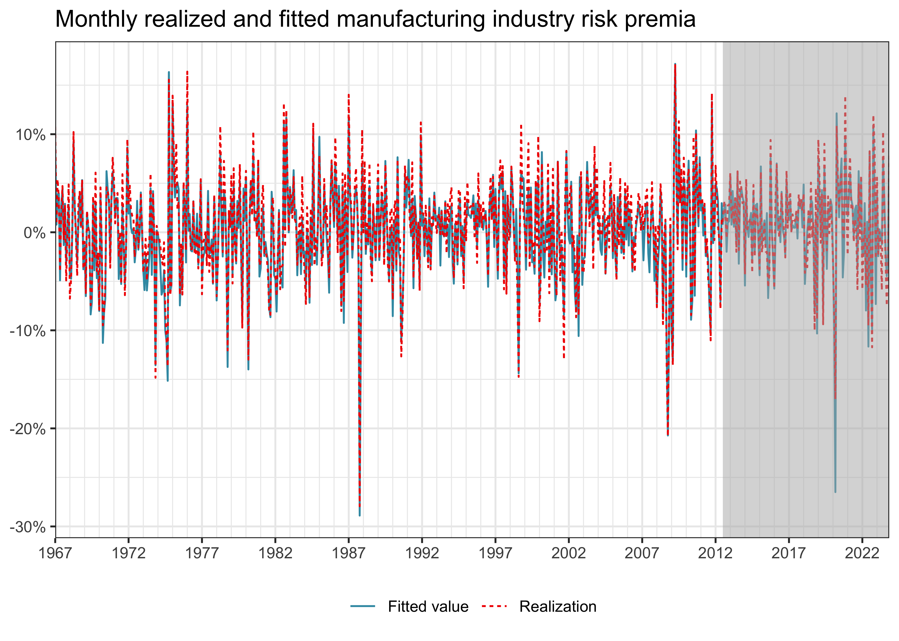
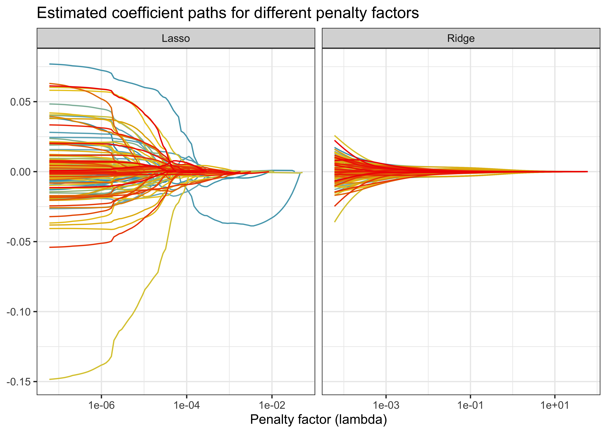

# Factor Selection via Machine Learning

> **NOTE:**
>
> You are reading **Tidy Finance with R**. You can find the equivalent chapter for the sibling **Tidy Finance with Python** [here](../python/factor-selection-via-machine-learning.llms.md).

The aim of this chapter is twofold. From a data science perspective, we introduce `tidymodels`, a collection of packages for modeling and machine learning (ML) using `tidyverse` principles. `tidymodels` comes with a handy workflow for all sorts of typical prediction tasks. From a finance perspective, we address the notion of *factor zoo* ([Cochrane 2011](#ref-Cochrane2011)) using ML methods. We introduce Lasso and Ridge regression as a special case of penalized regression models. Then, we explain the concept of cross-validation for model *tuning* with Elastic Net regularization as a popular example. We implement and showcase the entire cycle from model specification, training, and forecast evaluation within the `tidymodels` universe. While the tools can generally be applied to an abundance of interesting asset pricing problems, we apply penalized regressions for identifying macroeconomic variables and asset pricing factors that help explain a cross-section of industry portfolios.

In previous chapters, we illustrate that stock characteristics such as size provide valuable pricing information in addition to the market beta. Such findings question the usefulness of the Capital Asset Pricing Model. In fact, during the last decades, financial economists discovered a plethora of additional factors which may be correlated with the marginal utility of consumption (and would thus deserve a prominent role in pricing applications). The search for factors that explain the cross-section of expected stock returns has produced hundreds of potential candidates, as noted more recently by Harvey et al. ([2016](#ref-Harvey2016)), Mclean and Pontiff ([2016](#ref-Mclean2016)), and Hou et al. ([2020](#ref-Hou2020)). Therefore, given the multitude of proposed risk factors, the challenge these days rather is: *do we believe in the relevance of 300+ risk factors?* During recent years, promising methods from the field of ML got applied to common finance applications. We refer to Mullainathan and Spiess ([2017](#ref-Mullainathan2017)) for a treatment of ML from the perspective of an econometrician, Nagel ([2021](#ref-Nagel2021)) for an excellent review of ML practices in asset pricing, Easley et al. ([2020](#ref-Easley2021)) for ML applications in (high-frequency) market microstructure, and Dixon et al. ([2020](#ref-Dixon2020)) for a detailed treatment of all methodological aspects.

## Brief Theoretical Background

This is a book about *doing* empirical work in a tidy manner, and we refer to any of the many excellent textbook treatments of ML methods and especially penalized regressions for some deeper discussion. Excellent material is provided, for instance, by Hastie et al. ([2009](#ref-Hastie2009)), Gareth et al. ([2013](#ref-Hastie2013)), and De Prado ([2018](#ref-DePrado2018)). Instead, we briefly summarize the idea of Lasso and Ridge regressions as well as the more general Elastic Net. Then, we turn to the fascinating question on *how* to implement, tune, and use such models with the `tidymodels` workflow.

To set the stage, we start with the definition of a linear model: suppose we have data \\(y_t, x_t), t = 1,\ldots, T\\, where \\x_t\\ is a \\(K \times 1)\\ vector of regressors and \\y_t\\ is the response for observation \\t\\. The linear model takes the form \\y_t = \beta' x_t + \varepsilon_t\\ with some error term \\\varepsilon_t\\ and has been studied in abundance. The well-known ordinary-least square (OLS) estimator for the \\(K \times 1)\\ vector \\\beta\\ minimizes the sum of squared residuals and is then \\\hat{\beta}^\text{ols} = \left(\sum\limits\_{t=1}^T x_t'x_t\right)^{-1} \sum\limits\_{t=1}^T x_t'y_t.\\

While we are often interested in the estimated coefficient vector \\\hat\beta^\text{ols}\\, ML is about the predictive performance most of the time. For a new observation \\\tilde{x}\_t\\, the linear model generates predictions such that \\\hat y_t = E\left(y\|x_t = \tilde x_t\right) = \hat\beta^\text{ols}{}' \tilde x_t.\\ Is this the best we can do? Not really: instead of minimizing the sum of squared residuals, penalized linear models can improve predictive performance by choosing other estimators \\\hat{\beta}\\ with lower variance than the estimator \\\hat\beta^\text{ols}\\. At the same time, it seems appealing to restrict the set of regressors to a few meaningful ones, if possible. In other words, if \\K\\ is large (such as for the number of proposed factors in the asset pricing literature), it may be a desirable feature to *select* reasonable factors and set \\\hat\beta^{\text{ols}}\_k = 0\\ for some redundant factors.

It should be clear that the promised benefits of penalized regressions, i.e., reducing the mean squared error (MSE), come at a cost. In most cases, reducing the variance of the estimator introduces a bias such that \\E\left(\hat\beta\right) \neq \beta\\. What is the effect of such a bias-variance trade-off? To understand the implications, assume the following data-generating process for \\y\\: \\y = f(x) + \varepsilon, \quad \varepsilon \sim (0, \sigma\_\varepsilon^2)\\ We want to recover \\f(x)\\, which denotes some unknown functional which maps the relationship between \\x\\ and \\y\\. While the properties of \\\hat\beta^\text{ols}\\ as an unbiased estimator may be desirable under some circumstances, they are certainly not if we consider predictive accuracy. Alternative predictors \\\hat{f}(x)\\ could be more desirable: For instance, the MSE depends on our model choice as follows:

\\\begin{aligned} MSE &=E((y-\hat{f}(x))^2)=E((f(x)+\epsilon-\hat{f}(x))^2)\\ &= \underbrace{E((f(x)-\hat{f}(x))^2)}\_{\text{total quadratic error}}+\underbrace{E(\epsilon^2)}\_{\text{irreducible error}} \\ &= E\left(\hat{f}(x)^2\right)+E\left(f(x)^2\right)-2E\left(f(x)\hat{f}(x)\right)+\sigma\_\varepsilon^2\\ &=E\left(\hat{f}(x)^2\right)+f(x)^2-2f(x)E\left(\hat{f}(x)\right)+\sigma\_\varepsilon^2\\ &=\underbrace{\text{Var}\left(\hat{f}(x)\right)}\_{\text{variance of model}}+ \underbrace{\left(E(f(x)-\hat{f}(x))\right)^2}\_{\text{squared bias}} +\sigma\_\varepsilon^2. \end{aligned} \\

While no model can reduce \\\sigma\_\varepsilon^2\\, a biased estimator with small variance may have a lower MSE than an unbiased estimator.

### Ridge regression

One biased estimator is known as Ridge regression. Hoerl and Kennard ([1970](#ref-Hoerl1970)) propose to minimize the sum of squared errors *while simultaneously imposing a penalty on the \\L_2\\ norm of the parameters* \\\hat\beta\\. Formally, this means that for a penalty factor \\\lambda\geq 0\\, the minimization problem takes the form \\\min\_\beta \left(y - X\beta\right)'\left(y - X\beta\right)\text{ s.t. } \beta'\beta \leq c\\. Here \\c\geq 0\\ is a constant that depends on the choice of \\\lambda\\. The larger \\\lambda\\, the smaller \\c\\ (technically speaking, there is a one-to-one relationship between \\\lambda\\, which corresponds to the Lagrangian of the minimization problem above and \\c\\). Here, \\X = \left(x_1 \ldots x_T\right)'\\ and \\y = \left(y_1, \ldots, y_T\right)'\\. A closed-form solution for the resulting regression coefficient vector \\\beta^\text{ridge}\\ exists: \\\hat{\beta}^\text{ridge} = \left(X'X + \lambda I\right)^{-1}X'y.\\ A couple of observations are worth noting: \\\hat\beta^\text{ridge} = \hat\beta^\text{ols}\\ for \\\lambda = 0\\ and \\\hat\beta^\text{ridge} \rightarrow 0\\ for \\\lambda\rightarrow \infty\\. Also for \\\lambda \> 0\\, \\\left(X'X + \lambda I\right)\\ is non-singular even if \\X'X\\ is not, which means that \\\hat\beta^\text{ridge}\\ exists even if \\\hat\beta\\ is not defined. However, note also that the Ridge estimator requires careful choice of the hyperparameter \\\lambda\\ which controls the *amount of regularization*: a larger value of \\\lambda\\ implies *shrinkage* of the regression coefficient toward 0, a smaller value of \\\lambda\\ reduces the bias of the resulting estimator.

Note that \\X\\ usually contains an intercept column with ones. As a general rule, the associated intercept coefficient is not penalized. In practice, this often implies that \\y\\ is simply demeaned before computing \\\hat\beta^\text{ridge}\\.

What about the statistical properties of the Ridge estimator? First, the bad news is that \\\hat\beta^\text{ridge}\\ is a biased estimator of \\\beta\\. However, the good news is that (under homoscedastic error terms) the variance of the Ridge estimator is guaranteed to be *smaller* than the variance of the OLS estimator. We encourage you to verify these two statements in the Exercises. As a result, we face a trade-off: The Ridge regression sacrifices some unbiasedness to achieve a smaller variance than the OLS estimator.

### Lasso

An alternative to Ridge regression is the Lasso (*l*east *a*bsolute *s*hrinkage and *s*election *o*perator). Similar to Ridge regression, the Lasso ([Tibshirani 1996](#ref-Tibshirani1996)) is a penalized and biased estimator. The main difference to Ridge regression is that Lasso does not only *shrink* coefficients but effectively selects variables by setting coefficients for *irrelevant* variables to zero. Lasso implements a \\L_1\\ penalization on the parameters such that: \\\hat\beta^\text{Lasso} = \arg\min\_\beta \left(Y - X\beta\right)'\left(Y - X\beta\right)\text{ s.t. } \sum\limits\_{k=1}^K\|\beta_k\| \< c(\lambda).\\ There is no closed-form solution for \\\hat\beta^\text{Lasso}\\ in the above maximization problem, but efficient algorithms exist (e.g., the R package `glmnet`). Like for Ridge regression, the hyperparameter \\\lambda\\ has to be specified beforehand.

### Elastic Net

The Elastic Net ([Zou and Hastie 2005](#ref-Zou2005)) combines \\L_1\\ with \\L_2\\ penalization and encourages a grouping effect, where strongly correlated predictors tend to be in or out of the model together. This more general framework considers the following optimization problem: \\\hat\beta^\text{EN} = \arg\min\_\beta \left(Y - X\beta\right)'\left(Y - X\beta\right) + \lambda(1-\rho)\sum\limits\_{k=1}^K\|\beta_k\| +\frac{1}{2}\lambda\rho\sum\limits\_{k=1}^K\beta_k^2\\ Now, we have to choose two hyperparameters: the *shrinkage* factor \\\lambda\\ and the *weighting parameter* \\\rho\\. The Elastic Net resembles Lasso for \\\rho = 0\\ and Ridge regression for \\\rho = 1\\. While the R package `glmnet` provides efficient algorithms to compute the coefficients of penalized regressions, it is a good exercise to implement Ridge and Lasso estimation on your own before you use the `glmnet` package or the `tidymodels` back-end.

## Data Preparation

To get started, we load the required R packages and data. The main focus is on the workflow behind the `tidymodels` package collection ([Kuhn and Wickham 2020](#ref-tidymodels)). Kuhn and Silge ([2018](#ref-Kuhn2022)) provide a thorough introduction into all `tidymodels` components. `glmnet` ([Simon et al. 2011](#ref-glmnet)) was developed and released in sync with Tibshirani ([1996](#ref-Tibshirani1996)) and provides an R implementation of Elastic Net estimation. The package `timetk` ([Dancho and Vaughan 2022](#ref-timetk)) provides useful tools for time series data wrangling.

``` r
library(arrow)
library(tidyverse)
library(tidymodels)
library(scales)
library(furrr)
library(glmnet)
library(timetk)
```

In this analysis, we use four different data sources that we load from our Parquet files introduced in [Accessing and Managing Financial Data](../r/accessing-and-managing-financial-data.llms.md) and [WRDS, CRSP, and Compustat](../r/wrds-crsp-and-compustat.llms.md). We start with two different sets of factor portfolio returns which have been suggested as representing practical risk factor exposure and thus should be relevant when it comes to asset pricing applications.

- The standard workhorse: monthly Fama-French 3 factor returns (market, small-minus-big, and high-minus-low book-to-market valuation sorts) defined in Fama and French ([1992](#ref-Fama1992)) and Fama and French ([1993](#ref-Fama1993))
- Monthly q-factor returns from Hou et al. ([2014](#ref-Hou2015)). The factors contain the size factor, the investment factor, the return-on-equity factor, and the expected growth factor

Next, we include macroeconomic predictors which may predict the general stock market economy. Macroeconomic variables effectively serve as conditioning information such that their inclusion hints at the relevance of conditional models instead of unconditional asset pricing. We refer the interested reader to Cochrane ([2009](#ref-Cochrane2009)) on the role of conditioning information.

- Our set of macroeconomic predictors comes from Welch and Goyal ([2008](#ref-Goyal2008)). The data has been updated by the authors until 2021 and contains monthly variables that have been suggested as good predictors for the equity premium. Some of the variables are the dividend price ratio, earnings price ratio, stock variance, net equity expansion, treasury bill rate, and inflation

Finally, we need a set of *test assets*. The aim is to understand which of the plenty factors and macroeconomic variable combinations prove helpful in explaining our test assets’ cross-section of returns. In line with many existing papers, we use monthly portfolio returns from 10 different industries according to the definition from [Kenneth French’s homepage](https://mba.tuck.dartmouth.edu/pages/faculty/ken.french/Data_Library/det_10_ind_port.html) as test assets.

``` r
factors_ff3_monthly <- read_parquet("data-r/factors_ff3_monthly.parquet") |>
  rename_with(~ str_c("factor_ff_", .), -date)

factors_q_monthly <- read_parquet("data-r/factors_q_monthly.parquet") |>
  rename_with(~ str_c("factor_q_", .), -date)

macro_predictors <- read_parquet("data-r/macro_predictors.parquet") |>
  rename_with(~ str_c("macro_", .), -date) |>
  select(-macro_rp_div)

industries_ff_monthly <- read_parquet("data-r/industries_ff_monthly.parquet") |>
  pivot_longer(-date, names_to = "industry", values_to = "ret") |>
  arrange(desc(industry)) |>
  mutate(industry = as_factor(industry))
```

We combine all the monthly observations into one dataframe.

``` r
data <- industries_ff_monthly |>
  left_join(factors_ff3_monthly, join_by(date)) |>
  left_join(factors_q_monthly, join_by(date)) |>
  left_join(macro_predictors, join_by(date)) |>
  mutate(
    ret = ret - factor_ff_risk_free
  ) |>
  select(date, industry, ret_excess = ret, everything()) |>
  drop_na()
```

Our data contains 24 columns of regressors with the 13 macro-variables and 10 factor returns for each month. [Figure 1](#fig-1401) provides summary statistics for the 10 monthly industry excess returns in percent.

``` r
data |>
  group_by(industry) |>
  ggplot(aes(x = industry, y = ret_excess)) +
  geom_boxplot() +
  coord_flip() +
  labs(
    x = NULL,
    y = NULL,
    title = "Excess return distributions by industry in percent"
  ) +
  scale_y_continuous(
    labels = percent
  )
```

[](factor-selection-via-machine-learning_files/figure-html/fig-1401-1.png "Figure 1: The box plots show the monthly dispersion of returns for 10 different industries.")

Figure 1: The box plots show the monthly dispersion of returns for 10 different industries.

## The tidymodels Workflow

To illustrate penalized linear regressions, we employ the `tidymodels` collection of packages for modeling and ML using `tidyverse` principles. You can simply use `install.packages("tidymodels")` to get access to all the related packages. We recommend checking out the work of Kuhn and Silge ([2018](#ref-Kuhn2022)): They continuously write on their great book [‘Tidy Modeling with R’](https://www.tmwr.org/) using tidy principles.

The `tidymodels` workflow encompasses the main stages of the modeling process: pre-processing of data, model fitting, and post-processing of results. As we demonstrate below, `tidymodels` provides efficient workflows that you can update with low effort.

Using the ideas of Ridge and Lasso regressions, the following example guides you through (i) pre-processing the data (data split and variable mutation), (ii) building models, (iii) fitting models, and (iv) tuning models to create the “best” possible predictions.

To start, we restrict our analysis to just one industry: Manufacturing. We first split the sample into a *training* and a *test* set. For that purpose, `tidymodels` provides the function `initial_time_split()` from the `rsample` package ([Silge et al. 2022](#ref-rsample)). The split takes the last 20% of the data as a test set, which is not used for any model tuning. We use this test set to evaluate the predictive accuracy in an out-of-sample scenario.

``` r
split <- initial_time_split(
  data |>
    filter(industry == "manuf") |>
    select(-industry),
  prop = 4 / 5
)
split
```

    <Training/Testing/Total>
    <546/137/683>

The object `split` simply keeps track of the observations of the training and the test set. We can call the training set with `training(split)`, while we can extract the test set with `testing(split)`.

### Pre-process data

Recipes help you pre-process your data before training your model. Recipes are a series of pre-processing steps such as variable selection, transformation, or conversion of qualitative predictors to indicator variables. Each recipe starts with a `formula` that defines the general structure of the dataset and the role of each variable (regressor or dependent variable). For our dataset, our recipe contains the following steps before we fit any model:

- Our formula defines that we want to explain excess returns with all available predictors. The regression equation thus takes the form

\\r\_{t} = \alpha_0 + \left(\tilde f_t \otimes \tilde z_t\right)B + \varepsilon_t \\

where \\r_t\\ is the vector of industry excess returns at time \\t\\ and \\\tilde f_t\\ and \\\tilde z_t\\ are the (standardized) vectors of factor portfolio returns and macroeconomic variables - We exclude the column *month* from the analysis - We include all interaction terms between factors and macroeconomic predictors - We demean and scale each regressor such that the standard deviation is one

``` r
rec <- recipe(ret_excess ~ ., data = training(split)) |>
  step_rm(date) |>
  step_interact(terms = ~ contains("factor"):contains("macro")) |>
  step_normalize(all_predictors())
```

A table of all available recipe steps can be found [in the `tidymodels` documentation.](https://www.tidymodels.org/find/recipes/) As of 2026, more than 150 different processing steps are available! One important point: The definition of a recipe does not trigger any calculations yet but rather provides a *description* of the tasks to be applied. As a result, it is very easy to *reuse* recipes for different models and thus make sure that the outcomes are comparable as they are based on the same input. In the example above, it does not make a difference whether you use the input `data = training(split)` or `data = testing(split)`. All that matters at this early stage are the column names and types.

We can apply the recipe to any data with a suitable structure. The code below combines two different functions: `prep()` estimates the required parameters from a training set that can be applied to other datasets later. `bake()` applies the processed computations to new data.

``` r
data_prep <- prep(rec, training(split))
```

The object `data_prep` contains information related to the different preprocessing steps applied to the training data: E.g., it is necessary to compute sample means and standard deviations to center and scale the variables.

``` r
data_bake <- bake(data_prep, new_data = testing(split))
data_bake
```

    # A tibble: 137 × 154
      factor_ff_mkt_excess factor_ff_smb factor_ff_hml
                     <dbl>         <dbl>         <dbl>
    1               0.0709       -0.940         -0.150
    2               0.448         0.0896         0.296
    3               0.489         0.0738         0.430
    4              -0.478        -0.412          1.09 
    5               0.0688        0.121         -0.426
    # ℹ 132 more rows
    # ℹ 151 more variables: factor_ff_risk_free <dbl>,
    #   factor_q_risk_free <dbl>, factor_q_mkt_excess <dbl>,
    #   factor_q_me <dbl>, factor_q_ia <dbl>, factor_q_roe <dbl>,
    #   factor_q_eg <dbl>, macro_dp <dbl>, macro_dy <dbl>,
    #   macro_ep <dbl>, macro_de <dbl>, macro_svar <dbl>,
    #   macro_bm <dbl>, macro_ntis <dbl>, macro_tbl <dbl>, …

Note that the resulting data contains the 132 observations from the test set and 126 columns. Why so many? Recall that the recipe states to compute every possible interaction term between the factors and predictors, which increases the dimension of the data matrix substantially.

You may ask at this stage: why should I use a recipe instead of simply using the data wrangling commands such as `mutate()` or `select()`? `tidymodels` beauty is that a lot is happening under the hood. Recall, that for the simple scaling step, you actually have to compute the standard deviation of each column, then *store* this value, and apply the identical transformation to a different dataset, e.g., `testing(split)`. A prepped `recipe` stores these values and hands them on once you `bake()` a novel dataset. Easy as pie with `tidymodels`, isn’t it?

### Build a model

Next, we can build an actual model based on our pre-processed data. In line with the definition above, we estimate regression coefficients of a Lasso regression such that we get

\\\begin{aligned}\hat\beta\_\lambda^\text{Lasso} = \arg\min\_\beta \left(Y - X\beta\right)'\left(Y - X\beta\right) + \lambda\sum\limits\_{k=1}^K\|\beta_k\|.\end{aligned} \\

We want to emphasize that the `tidymodels` workflow for *any* model is very similar, irrespective of the specific model. As you will see further below, it is straightforward to fit Ridge regression coefficients and, later, Neural networks or Random forests with basically the same code. The structure is always as follows: create a so-called `workflow()` and use the `fit()` function. A table with all available model APIs is available [here.](https://www.tidymodels.org/find/parsnip/) For now, we start with the linear regression model with a given value for the penalty factor \\\lambda\\. In the setup below, `mixture` denotes the value of \\\rho\\, hence setting `mixture = 1` implies the Lasso.

``` r
lm_model <- linear_reg(
  penalty = 0.0001,
  mixture = 1
) |>
  set_engine("glmnet", intercept = FALSE)
```

That’s it - we are done! The object `lm_model` contains the definition of our model with all required information. Note that `set_engine("glmnet")` indicates the API character of the `tidymodels` workflow: Under the hood, the package `glmnet` is doing the heavy lifting, while `linear_reg()` provides a unified framework to collect the inputs. The `workflow` ends with combining everything necessary for the serious data science workflow, namely, a recipe and a model.

``` r
lm_fit <- workflow() |>
  add_recipe(rec) |>
  add_model(lm_model)
lm_fit
```

    ══ Workflow ═════════════════════════════════════════════════════════
    Preprocessor: Recipe
    Model: linear_reg()

    ── Preprocessor ─────────────────────────────────────────────────────
    3 Recipe Steps

    • step_rm()
    • step_interact()
    • step_normalize()

    ── Model ────────────────────────────────────────────────────────────
    Linear Regression Model Specification (regression)

    Main Arguments:
      penalty = 1e-04
      mixture = 1

    Engine-Specific Arguments:
      intercept = FALSE

    Computational engine: glmnet 

### Fit a model

With the `workflow` from above, we are ready to use `fit()`. Typically, we use training data to fit the model. The training data is pre-processed according to our recipe steps, and the Lasso regression coefficients are computed. First, we focus on the predicted values \\\hat{y}\_t = x_t\hat\beta^\text{Lasso}.\\ [Figure 2](#fig-1402) illustrates the projections for the *entire* time series of the manufacturing industry portfolio returns. The grey area indicates the out-of-sample period, which we did not use to fit the model.

``` r
predicted_values <- lm_fit |>
  fit(data = training(split)) |>
  augment(data |> filter(industry == "manuf")) |>
  select(date, "Fitted value" = .pred, "Realization" = ret_excess) |>
  pivot_longer(-date, names_to = "Variable")
```

``` r
predicted_values |>
  ggplot(aes(
    x = date,
    y = value,
    color = Variable,
    linetype = Variable
  )) +
  geom_line() +
  labs(
    x = NULL,
    y = NULL,
    color = NULL,
    linetype = NULL,
    title = "Monthly realized and fitted manufacturing industry risk premia"
  ) +
  scale_x_date(
    breaks = function(x) {
      seq.Date(
        from = min(x),
        to = max(x),
        by = "5 years"
      )
    },
    minor_breaks = function(x) {
      seq.Date(
        from = min(x),
        to = max(x),
        by = "1 years"
      )
    },
    expand = c(0, 0),
    labels = date_format("%Y")
  ) +
  scale_y_continuous(
    labels = percent
  ) +
  annotate(
    "rect",
    xmin = testing(split) |> pull(date) |> min(),
    xmax = testing(split) |> pull(date) |> max(),
    ymin = -Inf,
    ymax = Inf,
    alpha = 0.5,
    fill = "grey70"
  )
```

[](factor-selection-via-machine-learning_files/figure-html/fig-1402-1.png "Figure 2: The grey area corresponds to the out of sample period.")

Figure 2: The grey area corresponds to the out of sample period.

What do the estimated coefficients look like? To analyze these values and to illustrate the difference between the `tidymodels` workflow and the underlying `glmnet` package, it is worth computing the coefficients \\\hat\beta^\text{Lasso}\\ directly. The code below estimates the coefficients for the Lasso and Ridge regression for the processed training data sample. Note that `glmnet` actually takes a vector `y` and the matrix of regressors \\X\\ as input. Moreover, `glmnet` requires choosing the penalty parameter \\\alpha\\, which corresponds to \\\rho\\ in the notation above. When using the `tidymodels` model API, such details do not need consideration.

``` r
x <- data_bake |>
  select(-ret_excess) |>
  as.matrix()
y <- data_bake |> pull(ret_excess)

fit_lasso <- glmnet(
  x = x,
  y = y,
  alpha = 1,
  intercept = FALSE,
  standardize = FALSE,
  lambda.min.ratio = 0
)

fit_ridge <- glmnet(
  x = x,
  y = y,
  alpha = 0,
  intercept = FALSE,
  standardize = FALSE,
  lambda.min.ratio = 0
)
```

The objects `fit_lasso` and `fit_ridge` contain an entire sequence of estimated coefficients for multiple values of the penalty factor \\\lambda\\. [Figure 3](#fig-1403) illustrates the trajectories of the regression coefficients as a function of the penalty factor. Both Lasso and Ridge coefficients converge to zero as the penalty factor increases.

``` r
bind_rows(
  tidy(fit_lasso) |> mutate(Model = "Lasso"),
  tidy(fit_ridge) |> mutate(Model = "Ridge")
) |>
  rename("Variable" = term) |>
  ggplot(aes(x = lambda, y = estimate, color = Variable)) +
  geom_line() +
  scale_x_log10() +
  facet_wrap(~Model, scales = "free_x") +
  labs(
    x = "Penalty factor (lambda)",
    y = NULL,
    title = "Estimated coefficient paths for different penalty factors"
  ) +
  theme(legend.position = "none")
```

[](factor-selection-via-machine-learning_files/figure-html/fig-1403-1.png "Figure 3: The penalty parameters are chosen iteratively to resemble the path from no penalization to a model that excludes all variables.")

Figure 3: The penalty parameters are chosen iteratively to resemble the path from no penalization to a model that excludes all variables.

One word of caution: The package `glmnet` computes estimates of the coefficients \\\hat\beta\\ based on numerical optimization procedures. As a result, the estimated coefficients for the [special case](https://parsnip.tidymodels.org/reference/glmnet-details.html) with no regularization (\\\lambda = 0\\) can deviate from the standard OLS estimates.

### Tune a model

To compute \\\hat\beta\_\lambda^\text{Lasso}\\ , we simply imposed a value for the penalty hyperparameter \\\lambda\\. Model tuning is the process of optimally selecting such hyperparameters. `tidymodels` provides extensive tuning options based on so-called *cross-validation*. Again, we refer to any treatment of cross-validation to get a more detailed discussion of the statistical underpinnings. Here we focus on the general idea and the implementation with `tidymodels`.

The goal for choosing \\\lambda\\ (or any other hyperparameter, e.g., \\\rho\\ for the Elastic Net) is to find a way to produce predictors \\\hat{Y}\\ for an outcome \\Y\\ that minimizes the mean squared prediction error \\\text{MSPE} = E\left( \frac{1}{T}\sum\_{t=1}^T (\hat{y}\_t - y_t)^2 \right)\\. Unfortunately, the MSPE is not directly observable. We can only compute an estimate because our data is random and because we do not observe the entire population.

Obviously, if we train an algorithm on the same data that we use to compute the error, our estimate \\\text{MSPE}\\ would indicate way better predictive accuracy than what we can expect in real out-of-sample data. The result is called overfitting.

Cross-validation is a technique that allows us to alleviate this problem. We approximate the true MSPE as the average of many MSPE obtained by creating predictions for \\K\\ new random samples of the data, none of them used to train the algorithm \\\frac{1}{K} \sum\_{k=1}^K \frac{1}{T}\sum\_{t=1}^T \left(\hat{y}\_t^k - y_t^k\right)^2\\. In practice, this is done by carving out a piece of our data and pretending it is an independent sample. We again divide the data into a training set and a test set. The MSPE on the test set is our measure for actual predictive ability, while we use the training set to fit models with the aim to find the *optimal* hyperparameter values. To do so, we further divide our training sample into (several) subsets, fit our model for a grid of potential hyperparameter values (e.g., \\\lambda\\), and evaluate the predictive accuracy on an *independent* sample. This works as follows:

1.  Specify a grid of hyperparameters

2.  Obtain predictors \\\hat{y}\_i(\lambda)\\ to denote the predictors for the used parameters \\\lambda\\

3.  Compute \\ \text{MSPE}(\lambda) = \frac{1}{K} \sum\_{k=1}^K \frac{1}{T}\sum\_{t=1}^T \left(\hat{y}\_t^k(\lambda) - y_t^k\right)^2 \\

    With K-fold cross-validation, we do this computation \\K\\ times. Simply pick a validation set with \\M=T/K\\ observations at random and think of these as random samples \\y_1^k, \dots, y\_{\tilde{T}}^k\\, with \\k=1\\

How should you pick \\K\\? Large values of \\K\\ are preferable because the training data better imitates the original data. However, larger values of \\K\\ will have much higher computation time. `tidymodels` provides all required tools to conduct \\K\\-fold cross-validation. We just have to update our model specification and let `tidymodels` know which parameters to tune. In our case, we specify the penalty factor \\\lambda\\ as well as the mixing factor \\\rho\\ as *free* parameters. Note that it is simple to change an existing `workflow` with `update_model()`.

``` r
lm_model <- linear_reg(
  penalty = tune(),
  mixture = tune()
) |>
  set_engine("glmnet")

lm_fit <- lm_fit |>
  update_model(lm_model)
```

For our sample, we consider a time-series cross-validation sample. This means that we tune our models with 20 samples of length five years with a validation period of four years. For a grid of possible hyperparameters, we then fit the model for each fold and evaluate \\\hat{\text{MSPE}}\\ in the corresponding validation set. Finally, we select the model specification with the lowest MSPE in the validation set. First, we define the cross-validation folds based on our training data only.

``` r
data_folds <- time_series_cv(
  data = training(split),
  date_var = date,
  initial = "5 years",
  assess = "48 months",
  cumulative = FALSE,
  slice_limit = 20
)
data_folds
```

    # Time Series Cross Validation Plan 
    # A tibble: 20 × 2
      splits          id     
      <list>          <chr>  
    1 <split [60/48]> Slice01
    2 <split [60/48]> Slice02
    3 <split [60/48]> Slice03
    4 <split [60/48]> Slice04
    5 <split [60/48]> Slice05
    # ℹ 15 more rows

Then, we evaluate the performance for a grid of different penalty values. `tidymodels` provides functionalities to construct a suitable grid of hyperparameters with `grid_regular`. The code chunk below creates a \\10 \times 3\\ hyperparameters grid. Then, the function `tune_grid()` evaluates all the models for each fold.

``` r
lm_tune <- lm_fit |>
  tune_grid(
    resample = data_folds,
    grid = grid_regular(penalty(), mixture(), levels = c(20, 3)),
    metrics = metric_set(rmse)
  )
```

After the tuning process, we collect the evaluation metrics (the root mean-squared error in our example) to identify the *optimal* model. [Figure 4](#fig-1404) illustrates the average validation set’s root mean-squared error for each value of \\\lambda\\ and \\\rho\\.

``` r
autoplot(lm_tune) +
  aes(linetype = `Proportion of Lasso Penalty`) +
  guides(linetype = "none") +
  labs(
    x = "Penalty factor (lambda)",
    y = "Root MSPE",
    title = "Root MSPE for different penalty factors"
  ) +
  scale_x_log10()
```

    Scale for x is already present.
    Adding another scale for x, which will replace the existing scale.

[](factor-selection-via-machine-learning_files/figure-html/fig-1404-1.png "Figure 4: Evaluation of manufacturing excess returns for different penalty factors (lambda) and proportions of Lasso penalty (rho). 1.0 indicates Lasso, 0.5 indicates Elastic Net, and 0.0 indicates Ridge.")

Figure 4: Evaluation of manufacturing excess returns for different penalty factors (lambda) and proportions of Lasso penalty (rho). 1.0 indicates Lasso, 0.5 indicates Elastic Net, and 0.0 indicates Ridge.

[Figure 4](#fig-1404) shows that the cross-validated MSPE drops for Lasso and Elastic Net and spikes afterward. For Ridge regression, the MSPE increases above a certain threshold. Recall that the larger the regularization, the more restricted the model becomes. Thus, we would choose the model with the lowest MSPE.

### Parallelized workflow

Our starting point was the question: Which factors determine industry returns? While Avramov et al. ([2023](#ref-Avramov2022b)) provide a Bayesian analysis related to the research question above, we choose a simplified approach: To illustrate the entire workflow, we now run the penalized regressions for all ten industries. We want to identify relevant variables by fitting Lasso models for each industry returns time series. More specifically, we perform cross-validation for each industry to identify the optimal penalty factor \\\lambda\\. Then, we use the set of `finalize_*()`-functions that take a list or tibble of tuning parameter values and update objects with those values. After determining the best model, we compute the final fit on the entire training set and analyze the estimated coefficients.

First, we define the Lasso model with one tuning parameter.

``` r
lasso_model <- linear_reg(
  penalty = tune(),
  mixture = 1
) |>
  set_engine("glmnet")

lm_fit <- lm_fit |>
  update_model(lasso_model)
```

The following task can be easily parallelized to reduce computing time substantially. We use the parallelization capabilities of `furrr`. Note that we can also just recycle all the steps from above and collect them in a function.

``` r
select_variables <- function(input) {
  # Split into training and testing data
  split <- initial_time_split(input, prop = 4 / 5)

  # Data folds for cross-validation
  data_folds <- time_series_cv(
    data = training(split),
    date_var = date,
    initial = "5 years",
    assess = "48 months",
    cumulative = FALSE,
    slice_limit = 20
  )

  # Model tuning with the Lasso model
  lm_tune <- lm_fit |>
    tune_grid(
      resamples = data_folds,
      grid = grid_regular(penalty(), levels = c(10)),
      metrics = metric_set(rmse)
    )

  # Identify the best model and fit with the training data
  lasso_lowest_rmse <- lm_tune |> select_best(metric = "rmse")
  lasso_final <- finalize_workflow(lm_fit, lasso_lowest_rmse)
  lasso_final_fit <- last_fit(lasso_final, split, metrics = metric_set(rmse))

  # Extract the estimated coefficients
  lasso_final_fit |>
    extract_fit_parsnip() |>
    tidy() |>
    mutate(
      term = str_remove_all(term, "factor_|macro_|industry_")
    )
}

# Parallelization
plan(multisession, workers = availableCores() - 1)

# Computation by industry
selected_factors <- data |>
  nest(data = -industry) |>
  mutate(
    selected_variables = future_map(
      data,
      select_variables,
      .options = furrr_options(
        seed = TRUE,
        packages = c("tidymodels", "timetk", "glmnet", "stringr")
      )
    )
  )
```

What has just happened? In principle, exactly the same as before but instead of computing the Lasso coefficients for one industry, we did it for ten in parallel. The final option `seed = TRUE` is required to make the cross-validation process reproducible. Now, we just have to do some housekeeping and keep only variables that Lasso does *not* set to zero. We illustrate the results in a heat map in [Figure 5](#fig-1405).

``` r
selected_factors |>
  unnest(selected_variables) |>
  filter(
    term != "(Intercept)",
    estimate != 0
  ) |>
  add_count(term) |>
  mutate(
    term = str_remove_all(term, "NA|ff_|q_"),
    term = str_replace_all(term, "_x_", " "),
    term = fct_reorder(as_factor(term), n),
    term = fct_lump_min(term, min = 2),
    selected = 1
  ) |>
  filter(term != "Other") |>
  mutate(term = fct_drop(term)) |>
  complete(industry, term, fill = list(selected = 0)) |>
  ggplot(aes(industry, term, fill = as_factor(selected))) +
  geom_tile() +
  scale_x_discrete(guide = guide_axis(angle = 70)) +
  scale_fill_manual(values = c("white", "grey30")) +
  theme(legend.position = "None") +
  labs(
    x = NULL,
    y = NULL,
    title = "Selected variables for different industries"
  )
```

[](factor-selection-via-machine-learning_files/figure-html/fig-1405-1.png "Figure 5: The figure shows selected variables for different industries. Dark areas indicate that the estimated Lasso regression coefficient is not set to zero. White fields show which variables get assigned a value of exactly zero.")

Figure 5: The figure shows selected variables for different industries. Dark areas indicate that the estimated Lasso regression coefficient is not set to zero. White fields show which variables get assigned a value of exactly zero.

The heat map in [Figure 5](#fig-1405) conveys two main insights. First, we see a lot of white, which means that many factors, macroeconomic variables, and interaction terms are not relevant for explaining the cross-section of returns across the industry portfolios. In fact, only the market factor and the return-on-equity factor play a role for several industries. Second, there seems to be quite some heterogeneity across different industries. While barely any variable is selected by Lasso for Utilities, many factors are selected for, e.g., High-Tech and Durable, but they do not coincide at all. In other words, there seems to be a clear picture that we do not need many factors, but Lasso does not provide a factor that consistently provides pricing abilities across industries.

## Key Takeaways

- The `tidymodels` framework in R enables a clean, modular workflow for pre-processing financial data, fitting models, and tuning hyperparameters through cross-validation.
- Lasso regression is especially useful in high-dimensional settings, as it performs automatic variable selection by setting irrelevant coefficients to zero, offering insights into which factors truly matter.
- Applying these methods to real-world data shows that only a few factors consistently explain industry portfolio returns, and the relevant predictors vary across industries.
- The analysis demonstrates practical tools to handle overfitting, model complexity, and interpretability in empirical asset pricing.

## Exercises

1.  Write a function that requires three inputs, namely, `y` (a \\T\\ vector), `X` (a \\(T \times K)\\ matrix), and `lambda` and then returns the Ridge estimator (a \\K\\ vector) for a given penalization parameter \\\lambda\\. Recall that the intercept should not be penalized. Therefore, your function should indicate whether \\X\\ contains a vector of ones as the first column, which should be exempt from the \\L_2\\ penalty.
2.  Compute the \\L_2\\ norm (\\\beta'\beta\\) for the regression coefficients based on the predictive regression from the previous exercise for a range of \\\lambda\\’s and illustrate the effect of penalization in a suitable figure.
3.  Now, write a function that requires three inputs, namely, `y` (a \\T\\ vector), `X` (a \\(T \times K)\\ matrix), and `lambda` and then returns the Lasso estimator (a \\K\\ vector) for a given penalization parameter \\\lambda\\. Recall that the intercept should not be penalized. Therefore, your function should indicate whether \\X\\ contains a vector of ones as the first column, which should be exempt from the \\L_1\\ penalty.
4.  After you understand what Ridge and Lasso regressions are doing, familiarize yourself with the `glmnet()` package’s documentation. It is a thoroughly tested and well-established package that provides efficient code to compute the penalized regression coefficients for Ridge and Lasso and for combinations, commonly called *Elastic Nets*.

## References

Avramov, Doron, Si Cheng, Lior Metzker, and Stefan Voigt. 2023. “Integrating factor models.” *The Journal of Finance* 78 (3): 1593–646. <https://doi.org/10.1111/jofi.13226>.

Cochrane, John H. 2009. *Asset pricing (revised edition)*. Princeton University Press.

Cochrane, John H. 2011. “Presidential address: Discount rates.” *The Journal of Finance* 66 (4): 1047–108. <https://doi.org/10.1111/j.1540-6261.2011.01671.x>.

Dancho, Matt, and Davis Vaughan. 2022. *timetk: A tool kit for working with time series in R*. <https://CRAN.R-project.org/package=timetk>.

De Prado, Marcos Lopez. 2018. *Advances in financial machine learning*. John Wiley & Sons. <https://doi.org/10.5555/3217448>.

Dixon, Matthew F., Igor Halperin, and Paul Bilokon. 2020. *Machine learning in finance*. Springer.

Easley, David, Marcos de Prado, Maureen O’Hara, and Zhibai Zhang. 2020. “Microstructure in the machine age.” *Review of Financial Studies* 34 (7): 3316–63. <https://doi.org/10.1093/rfs/hhaa078>.

Fama, Eugene F., and Kenneth R. French. 1992. “The cross-section of expected stock returns.” *The Journal of Finance* 47 (2): 427–65. <https://doi.org/2329112>.

Fama, Eugene F., and Kenneth R. French. 1993. “Common risk factors in the returns on stocks and bonds.” *Journal of Financial Economics* 33 (1): 3–56. <https://doi.org/10.1016/0304-405X(93)90023-5>.

Gareth, James, Witten Daniela, Hastie Trevor, and Tibshirani Robert. 2013. *An introduction to statistical learning: With applications in R*. Springer.

Harvey, Campbell R., Yan Liu, and Heqing Zhu. 2016. “\\\ldots\\ and the cross-section of expected returns.” *Review of Financial Studies* 29 (1): 5–68. <https://doi.org/10.1093/rfs/hhv059>.

Hastie, Trevor, Robert Tibshirani, and Jerome Friedman. 2009. *The elements of statistical learning: Data mining, inference and prediction*. 2nd ed. Springer. <https://hastie.su.domains/ElemStatLearn/>.

Hoerl, Arthur E., and Robert W. Kennard. 1970. “Ridge regression: Applications to nonorthogonal problems.” *Technometrics* 12 (1): 69–82. <https://doi.org/1267352>.

Hou, Kewei, Chen Xue, and Lu Zhang. 2014. “Digesting anomalies: An investment approach.” *Review of Financial Studies* 28 (3): 650–705. <https://doi.org/10.1093/rfs/hhu068>.

Hou, Kewei, Chen Xue, and Lu Zhang. 2020. “Replicating anomalies.” *Review of Financial Studies* 33 (5): 2019–133. <https://doi.org/10.1093/rfs/hhy131>.

Kuhn, Max, and Julia Silge. 2018. *Tidy modeling with R*. John Wiley & Sons. <https://www.tmwr.org/>.

Kuhn, Max, and Hadley Wickham. 2020. *Tidymodels: a collection of packages for modeling and machine learning using tidyverse principles.* <https://www.tidymodels.org>.

Mclean, R. David, and Jeffrey Pontiff. 2016. “Does academic research destroy stock return predictability?” *The Journal of Finance* 71 (1): 5–32. <https://doi.org/10.1111/jofi.12365>.

Mullainathan, Sendhil, and Jann Spiess. 2017. “Machine learning: An applied econometric approach.” *Journal of Economic Perspectives* 31 (2): 87–106. <https://doi.org/10.1257/jep.31.2.87>.

Nagel, Stefan. 2021. *Machine learning in asset pricing*. Princeton University Press.

Silge, Julia, Fanny Chow, Max Kuhn, and Hadley Wickham. 2022. *rsample: General resampling infrastructure*. <https://CRAN.R-project.org/package=rsample>.

Simon, Noah, Jerome Friedman, Trevor Hastie, and Rob Tibshirani. 2011. “Regularization paths for Cox’s proportional hazards model via coordinate descent.” *Journal of Statistical Software* 39 (5): 1–13. <https://www.jstatsoft.org/v39/i05/>.

Tibshirani, Robert. 1996. “Regression shrinkage and selection via the LASSO.” *Journal of the Royal Statistical Society. Series B (Methodological)* 58 (1): 267–88. <http://www.jstor.org/stable/2346178>.

Welch, Ivo, and Amit Goyal. 2008. “A comprehensive look at the empirical performance of equity premium prediction.” *Review of Financial Studies* 21 (4): 1455–508. <https://doi.org/10.1093/rfs/hhm014>.

Zou, Hui, and Trevor Hastie. 2005. “Regularization and variable selection via the elastic net.” *Journal of the Royal Statistical Society. Series B (Statistical Methodology)* 67 (2): 301–20. <https://www.jstor.org/stable/3647580>.
