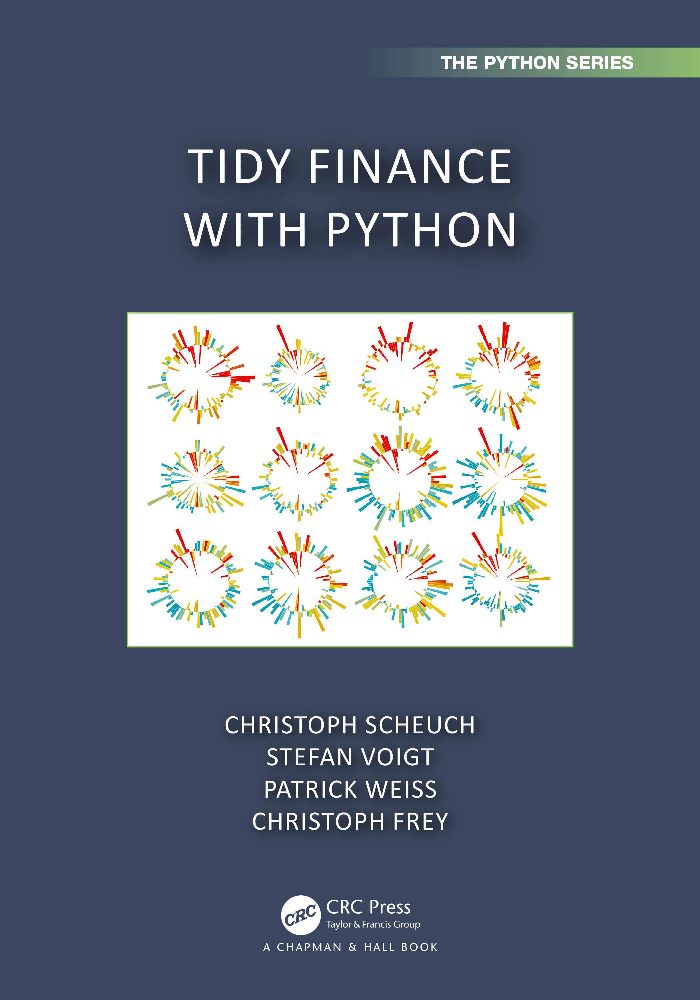

# Support Tidy Finance

Tidy Finance is and will remain an open-source project, and we are grateful for every bit of support. None of it is required, and most options come at no cost to you. Here are a few ways to give back.

## Contribute to the blog

The [Tidy Finance Blog](https://blog.tidy-finance.org) is where the community shares stand-alone applications in financial economics - paper replications, dataset preparation, or novel empirical work in R or Python. It is open to everybody in the finance community, and we apply an editorial-like review to keep quality and relevance high.

Contributing takes three steps:

1.  Send a short proposal to <contact@tidy-finance.org> so your effort is well-directed. We treat every proposal confidentially but cannot promise acceptance.
2.  Once we agree, write your post as a Quarto document and send us the rendered HTML for feedback.
3.  Work with us on revisions, and we publish it under your name.

You retain sole authorship under our [open-source license](index.llms.md#license), and we acknowledge external contributions in future editions of the books. Tidy Finance is built on R and the tidyverse, but well-motivated contributions in other languages are welcome too.

## Get your copy of the books

You can read Tidy Finance for free online, but physical copies come with their own perks - and look good on a shelf. If you buy one, please consider our affiliate links from Routledge for [Tidy Finance with R](https://www.jdoqocy.com/click-100765519-14339043?url=https%3A%2F%2Fwww.routledge.com%2FTidy-Finance-with-R%2FVoigt-Weiss-Scheuch%2Fp%2Fbook%2F9781032389349) and [Tidy Finance with Python](https://www.kqzyfj.com/click-101217142-14339043?url=https%3A%2F%2Fwww.routledge.com%2FTidy-Finance-with-Python%2FScheuch-Voigt-Weiss-Frey%2Fp%2Fbook%2F9781032676418) - no extra cost to you. The books are also available on Amazon and other retailers. We only use the vendors’ official paths, though some affiliate links may be flagged as suspicious by your browser.

 

## Spread the word

Tidy Finance grows with the attention it receives from the community, so telling others is a great way to help. You could:

- Cite [Tidy Finance with R](chapters/index.llms.md) or [Tidy Finance with Python](chapters/index.llms.md) in your work
- Use Tidy Finance as a teaching resource and let us know
- Connect with us and share posts about Tidy Finance on social media

## Buy us a coffee

Tidy Finance runs on coffee, and caffeine levels correlate positively with new content. If you appreciate the project, let us have a cup - every small contribution helps.
